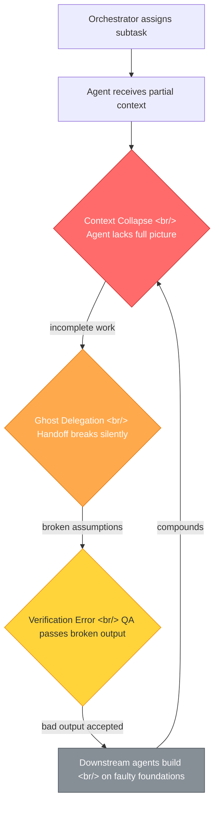
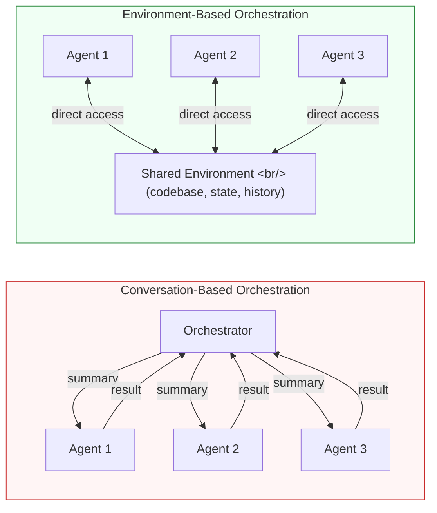

Multi-agent orchestration sounds like the natural next step for AI-powered development: break a complex task into subtasks, assign each to a specialized agent, and let them collaborate. In practice, however, the approach falls apart in predictable and structural ways. After burning through $5,000 worth of tokens testing systems like Claude Code agent teams, Gastown (city-style orchestration for web app development), and Paperclip (company-style orchestration), shalomeir identified three fundamental bottlenecks that plague every multi-agent system tested.

This post examines those bottlenecks and explores why the answer may already exist in single-agent tools rather than elaborate orchestration frameworks.

<!--more-->

## The Three Structural Bottlenecks

Multi-agent systems fail not because individual agents are weak, but because the connections between them introduce compounding failures. The three bottlenecks — Context Collapse, Ghost Delegation, and Verification Error — are not independent problems. They cascade into each other, creating a failure mode that is worse than the sum of its parts.

Each bottleneck deserves close examination, because understanding the mechanism is key to understanding why simply adding more agents or better prompts does not fix the problem.

## Bottleneck 1: Context Collapse

When an orchestrator delegates a subtask to an agent, it must decide what context to pass along. This is where the first failure occurs. The orchestrator cannot pass the entire project context — token limits, cost, and latency all prevent it. So it summarizes, truncates, or selectively forwards information. Every time it does this, critical details are lost.

Consider a web application with a frontend component that depends on a specific backend API contract. The orchestrator assigns the frontend work to Agent A and the backend work to Agent B. Agent A receives a summary of the API spec, but not the nuanced discussion about error handling edge cases that shaped the spec. Agent A then makes reasonable assumptions that happen to be wrong, and the resulting code compiles but fails at integration.

This is not a prompting problem. It is a fundamental information-theoretic constraint. The orchestrator is acting as a lossy compression layer between agents and the full project state. No amount of prompt engineering eliminates the information loss — it only shifts which details get dropped. A single agent working in one long context window does not face this problem because it can reference any prior decision or constraint directly.

The irony is that the more complex a project becomes (and thus the more you want to parallelize), the more critical full context becomes, and the harder it is to distribute that context across agents without loss.

## Bottleneck 2: Ghost Delegation

Ghost delegation occurs when a handoff between agents appears to succeed but actually fails silently. Agent A completes its subtask and passes the result to the orchestrator, which passes it to Agent B. But the handoff loses nuance: Agent A's implicit assumptions, the reasoning behind certain choices, and the constraints it discovered during execution.

In the Gastown and Paperclip experiments, this manifested as agents confidently building on foundations that were subtly wrong. A database schema agent would produce a schema, a backend agent would build an API on it, and a frontend agent would build UI components — each step technically completing successfully, but with accumulated drift from the original intent.

The core issue is that inter-agent communication is restricted to explicit artifacts — code files, JSON specs, text summaries. But software development involves enormous amounts of tacit knowledge: why a particular approach was chosen over alternatives, what trade-offs were considered, which edge cases are known but deferred. This tacit knowledge evaporates at every handoff boundary.

Real-world software teams solve this through shared environments — the same codebase, the same issue tracker, the same Slack channel where context accumulates organically. Multi-agent systems that share conversations instead of environments lose this ambient context entirely.

## Bottleneck 3: Verification Error

The final bottleneck is the most insidious. When Agent B completes its work based on Agent A's output, something needs to verify that the result is correct. In most multi-agent frameworks, this verification is done by another agent — or by the orchestrator itself. But verification requires the same full context that was lost in the first bottleneck.

A verifier agent that only sees the output and a specification cannot catch errors that stem from context that was never communicated. It can check syntax, run tests if they exist, and verify surface-level correctness. But it cannot detect that the architectural approach contradicts a constraint discussed three handoffs ago that never made it into the spec.

In practice, this means multi-agent systems converge on outputs that pass automated checks but fail in integration or under real-world conditions. The verification step provides a false sense of confidence: the system reports success, the orchestrator moves on, and the error compounds through subsequent stages.

This is where the cascade becomes truly destructive. A verification error feeds back into context collapse — downstream agents now have an expanded context that includes incorrect assumptions validated by the verifier. The error has been laundered into accepted truth.

## The Orchestrator Design Problem

The experiments reveal a counterintuitive insight: the bottleneck is not agent quality or count, but orchestrator design. Adding more agents to a poorly designed orchestration makes things worse, not better, because each additional agent adds another handoff where context can collapse and delegation can ghost.

The key distinction is between conversation-based and environment-based orchestration. In conversation-based systems, agents communicate through the orchestrator, which becomes the bottleneck. In environment-based systems, agents share a common workspace — the filesystem, the git history, the running application — and context is preserved in the environment itself rather than in message passing.

This is why tools like Claude Code already work better than most multi-agent frameworks for real development tasks. A single agent with direct access to the full codebase, the ability to run commands, and persistent context within a session avoids all three bottlenecks by design. There is no handoff to lose context at, no delegation to ghost, and no separate verifier that lacks context.

## Deep Within Domains, Loose Across Boundaries

The practical takeaway is captured in one phrase: "deep within domains, loose across boundaries." An AI agent should go deep on a well-scoped domain — understanding the full context of a particular module, service, or feature. But the boundaries between domains should be handled loosely: through well-defined interfaces, shared environments, and human oversight rather than tight agent-to-agent coupling.

This maps well to how effective human teams work. A senior engineer goes deep on their component and communicates with other teams through APIs, design docs, and code review — not by having a manager relay summarized instructions. The manager (orchestrator) sets direction and resolves conflicts but does not serve as the communication channel for technical details.

Five evaluation criteria emerge for deciding how much to delegate to agents: task scope clarity, context self-containment, verification tractability, rollback cost, and domain expertise depth. Tasks that score high on all five — clear scope, self-contained context, easy to verify, cheap to undo, deep domain match — are excellent candidates for agent delegation. Tasks that score low on any dimension are better handled by a human or a single agent with full context.

## The Metaphor Itself May Be Wrong

Perhaps the most provocative insight is that the employee metaphor for AI agents is fundamentally misleading. We talk about "hiring" agents, "delegating" tasks, building "teams" and "companies" of agents. But agents are not employees. They do not accumulate institutional knowledge across sessions. They do not build relationships with other agents that improve collaboration over time. They do not have the ambient awareness that comes from sitting in the same office.

Agents are more like pure functions with expensive invocations: they take an input context, produce an output, and forget everything. Orchestrating them like employees — with org charts, reporting structures, and delegation hierarchies — applies a metaphor that actively misleads system designers into architectures that maximize the three bottlenecks.

A better metaphor might be a single expert with excellent tools. One skilled developer with a powerful IDE, good documentation, and access to the full codebase will outperform a "team" of ten agents with fragmented context every time. The future of AI-assisted development is not about building bigger agent teams. It is about making individual agents deeper, giving them richer environment access, and being thoughtful about when and where to introduce boundaries.

The $5,000 in burned tokens was not wasted — it was the cost of learning that the answer was already in front of us.

---

*Based on [shalomeir's analysis](https://shalomeir.substack.com/p/multi-agent-orchestration-problems) of multi-agent orchestration failures across Claude Code agent teams, Gastown, and Paperclip.*
