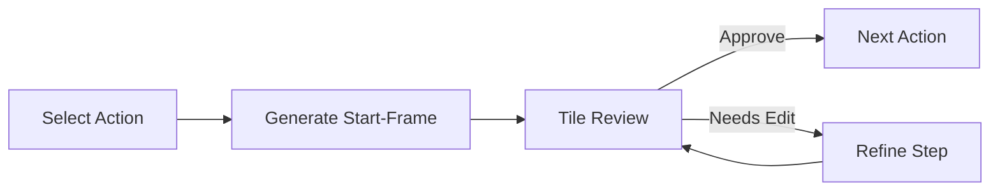

## Overview

Added an archive page to browse past jobs and resume from any pipeline step. Introduced a per-action start-frame review flow so each action's results can be inspected before moving to refine. Discovered that BiRefNet matting was stripping VFX elements like motion lines and sparks along with backgrounds, and implemented a `rescue_vfx_elements()` post-processing step to recover them.

Previous post: [popcon Dev Log #7 — RunPod GPU Worker, BiRefNet Matting, and Parallel Frame Inference](/posts/2026-04-15-popcon-dev7/)

<!--more-->

## Archive Page — Browse Past Jobs and Resume

As the pipeline grew longer, revisiting intermediate results or re-running from a specific step became a frequent need. A new archive page solves this.

- `/archive` route displays past jobs as cards
- Each card shows current status (which step was last completed)
- Selecting a step resumes the pipeline from that point

The layout was updated to include an Archive link in the navigation for easy access.

## Per-Action Start-Frame Review Flow

Previously, start-frames for all actions were generated in bulk and reviewed together. This release switches to a per-action flow where each action's start-frame is reviewed individually, with the option to jump straight into refine if corrections are needed.

### Key Changes

- `backend/pipeline/start_frame_gen.py` — split start-frame generation to run per action
- `frontend/components/StartFrameReview.tsx` — redesigned tile layout with inline per-emoji video preview
- `frontend/components/ActionSelector.tsx` — integrated action selection UI into the review flow
- `backend/models.py` — extended models for per-action state tracking

Refine resume logic was also improved so that an interrupted refine session can pick up from the last saved state.

## BiRefNet VFX Recovery Problem

BiRefNet produces much cleaner background removal than rembg, but it has a blind spot: it classifies VFX elements (motion lines, sparks, speed lines) as background and removes them.

### Problem Analysis

VFX element characteristics:
- Small non-white blobs
- Scattered around the main character
- From BiRefNet's salient object detection perspective, these are "background noise"

### rescue_vfx_elements() Implementation

A post-processing function was added to recover VFX elements dropped by BiRefNet matting.

1. Detect non-white pixel regions in the original image
2. Identify blobs below a size threshold that were removed by the BiRefNet mask
3. Re-add blobs likely to be VFX elements back into the mask

Comparative testing of rembg vs. BiRefNet confirmed that BiRefNet + VFX recovery produces the best results.

## Start-Frame Tile Redesign

`StartFrameReview.tsx` was fully redesigned.

- Grid tile layout for at-a-glance comparison of each emoji's start-frame
- Inline video preview per tile to immediately check animation results
- Per-tile approve/regenerate buttons

## Commit Log

| Message | Changes |
|---------|---------|
| feat(archive): browse past jobs and resume any step | 2 files |
| feat(pipeline): per-action start-frame review + refine resume | 12 files |
| feat(gpu-worker): replace rembg with BiRefNet matting | 7 files |
| feat(review): redesign start-frame tiles and inline per-emoji video | 1 file |

## Insights

- **BiRefNet's limitations can be patched with post-processing.** Salient object detection models focus on the primary subject, so small VFX elements get lost. A blob-recovery pass is a reusable pattern for any matting pipeline.
- **Resume capability becomes essential as pipelines grow.** Without the archive page, every iteration meant starting from scratch. Persisting intermediate state and allowing re-entry at any step dramatically speeds up development.
- **Smaller review units make for faster feedback loops.** Reviewing all actions at once made it hard to spot issues. Switching to per-action review tightened the iteration cycle.
