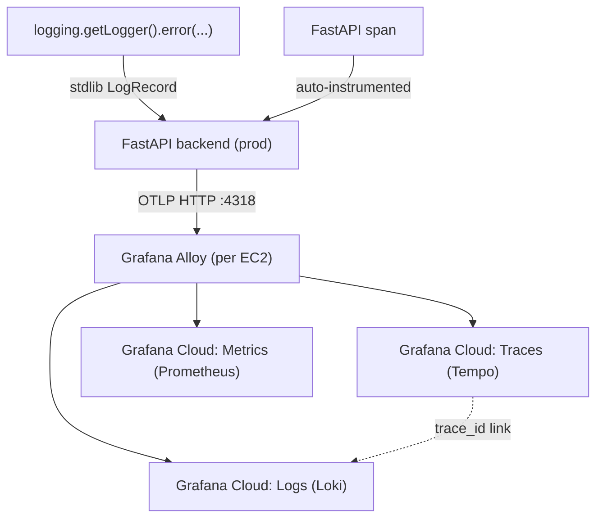
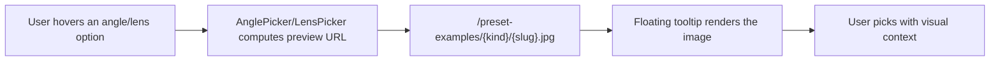
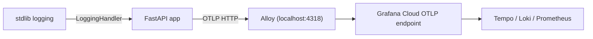

## Overview

Three commits, three themes. Lens presets expanded to 5 general options plus a beauty-specific Briese lighting preset. AnglePicker and LensPicker gained 31 hover-preview thumbnails so users can see what each preset actually produces before clicking. The headline work was wiring the production FastAPI backend's traces, metrics, and logs to a local Grafana Alloy agent over OTLP, which forwards to Grafana Cloud. The same interval saw the telemetry's first real use — debugging a user's missing auto-fill tone image by following a trace through Loki. Two sessions, three commits, 5h 54m total.

[Previous post: hybrid-image-search-demo Dev Log #15](/posts/2026-04-16-hybrid-search-dev15/)

<!--more-->

## Lens Presets — 5 General + 1 Beauty

`c4fb076 feat(gen): expand lens presets to 5 general + beauty w/ Briese lighting` touched `backend/src/generation/lens_presets.py`. The previous three lens options weren't enough to cover the generation scenarios our users wanted. This change did two things:

1. **Expand to 5 general focal lengths** — 24mm (wide), 35mm (street/environmental), 50mm (natural), 85mm (portrait), 135mm (tight). A standard photography focal-length ladder.
2. **Add a beauty-specific preset — Briese lighting**. Briese is the large reflector rig used heavily in advertising and beauty photography. This is the first time we've injected a *lighting* directive alongside focal length. `prompt.py`'s `build_generation_prompt` now combines the lens text with the lighting directive when the category is beauty.

Test coverage: one new unit test in `backend/tests/test_lens_presets.py` asserts each preset produces the expected string through the prompt builder.

Frontend `LensPicker.tsx` grew its radio options to five and grouped the beauty preset separately. `GeneratedImageDetail.tsx` surfaces the selected lens text in the info panel.

## 31 Hover-Preview Thumbnails

`4b886a9 feat(ui): hover-preview examples for angle/lens pickers` is a 31-file commit. Most of those files are the actual example images under `frontend/public/preset-examples/angles/*.jpg` and `lens/*.jpg` — bird's-eye-view, close-up-cu, dutch-angle, extreme-close-up-ecu, extreme-long-shot-els, eye-level, high-angle, insert-shot, long-shot-ls, low-angle, master-shot, medium-close-up-mcu, and so on.

A generator script at `backend/scripts/generate_preset_examples.py` batch-produced these thumbnails, calling the same generation pipeline from previous posts on a fixed reference character and dumping outputs into `frontend/public/preset-examples/`. `.gitignore` was updated to exclude the raw source materials.

`AnglePicker.tsx` and `LensPicker.tsx` share a floating tooltip pattern on hover. The UX call here is to stop making users pick by jargon alone — "extreme-long-shot (ELS)" is opaque if you've never shot cinema, but a thumbnail communicates it instantly.

## Grafana OTLP Telemetry

The weight of the interval is `7a55e9b feat(telemetry): ship prod logs to Alloy/Grafana Cloud via OTLP`. Only four files changed, but it's a significant operational shift.

### The Brief

User brief was precise: "I'm on the free Grafana tier. I'd like at least the API logs, or at minimum any API-level error logs. Confirm it's possible under the free tier." Collect prod only, manage the packages globally through `pyproject.toml`, enable prod-only via an `.env` variable.

### Architecture

The FastAPI app emits to a local Alloy agent over OTLP HTTP on port 4318. Alloy forwards to Grafana Cloud's OTLP endpoint. This puts Grafana Cloud credentials in Alloy's config instead of the app's environment — rotating prod images doesn't expose the Grafana token.

### Implementation

- **`backend/src/telemetry.py`** — initialization behind a `_telemetry_enabled` flag gated on `DEPLOYMENT_ENV == "prod"`. Traces via `OTLPSpanExporter`, metrics via `OTLPMetricExporter`, logs via `OTLPLogExporter`. Auto-instrumentation through `FastAPIInstrumentor`, `SQLAlchemyInstrumentor`, and `LoggingInstrumentor`.
- **stdlib logging → OTLP bridge.** The critical detail. A root-level `LoggingHandler` attaches to the stdlib root logger so every `logging.getLogger(...)` call (uvicorn access logs, SQLAlchemy chatter, app `logger.error`s) ships as an OTLP log. The handler reads the active span context on emit and attaches `trace_id` to each LogRecord — so clicking a log line in Grafana jumps to the trace that produced it.
- **Global `pyproject.toml` additions.** `opentelemetry-instrumentation-fastapi`, `-sqlalchemy`, `-logging`, `-exporter-otlp-proto-http`, `-exporter-otlp-proto-grpc`, all pinned to `>=0.54b0` / `>=1.33.0`.
- **`infra/alloy/config.alloy`** — Alloy config. OTLP receiver opens grpc on 4317 and http on 4318, passes through a batch processor, forwards to Grafana Cloud. Short and boring, which is the right shape for infra config.
- **`infra/alloy/SETUP.md`** — per-EC2 manual install: `sudo apt install grafana-alloy`, drop the config, enable via systemd.

### Deploy and a PM2 Gotcha

Deployed dev → prod through the `/deploy-diff` workflow. Verified traces arriving in Grafana Cloud's Explore view. One trap documented but not yet fixed:

`ecosystem.config.js` sets `DEPLOYMENT_ENV: process.env.DEPLOYMENT_ENV || ""` — which depends on the PM2 daemon's shell environment. If prod EC2 reboots or `pm2 kill` + resurrect runs outside a login shell, `DEPLOYMENT_ENV` comes back empty, `_telemetry_enabled` flips to false, and telemetry silently dies in prod. Fix is to set `Environment=DEPLOYMENT_ENV=prod` in the systemd unit that launches PM2. Recorded for the next interval.

## First Live Use — Debugging a User Issue

Session 4 was telemetry's first real workout. A user (khk@diffs.studio) generated an image with the prompt "우주의 신비로운 모습" around 4/16 13:20, and the auto-fill tone image didn't render in the detail view. Normally this would start with an SSH into the prod box and `grep` through files. This time the first query was in Grafana Loki: `{service_name="hybrid-image-search"} |= "khk@diffs.studio"` — which pulled the relevant generation logs immediately.

The chase turned up three intertwined issues:
- A `blob:http://...` URL throwing an "insecure connection" warning — the EC2 host hadn't moved to HTTPS yet.
- A 502 Bad Gateway on a different request — likely to resolve together once the HTTPS + nginx upstream config lands.
- A 401 on a third server from an expired session token that wasn't being refreshed.

The workflow pattern was clean. Follow the trace link in Grafana → see the FastAPI span → jump to the connected log record and read the error. What used to be "SSH to prod and tail logs" became "click the trace in Grafana." Fixes deferred to the next interval; the forensics part of this interval was the point.

## Commit Log

| Message | Changes |
|---|---|
| feat(gen): expand lens presets to 5 general + beauty w/ Briese lighting | 5 files |
| feat(ui): hover-preview examples for angle/lens pickers | 31 files (mostly images) |
| feat(telemetry): ship prod logs to Alloy/Grafana Cloud via OTLP | 4 files |

## Insights

The best signal of this interval was that the telemetry work and the telemetry's first real use overlapped in the same interval. "Set this up because it'll be useful eventually" usually takes weeks to pay off, but the OTLP + Alloy stack got drafted into a real user debug on deployment day. Two effects. First, the shape of what Grafana captures and what it misses is now concrete — trace_id linking between logs and traces works; browser-side errors are not captured (OTLP covers server-side only). Second, the query "who ran what prompt when, with what error" now has a one-liner in Loki that takes an email and returns ordered log records — the next support ticket answers itself in 2 seconds. Being able to use a tool on the day it arrives is a signal that the tool landed on a real problem, not on a hypothetical one. This interval landed right.
