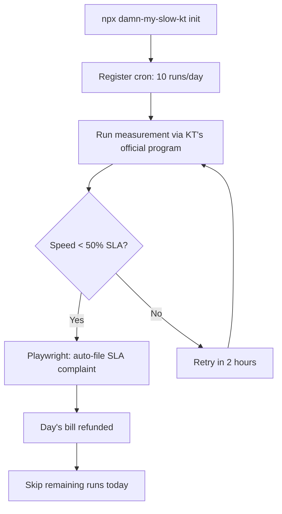
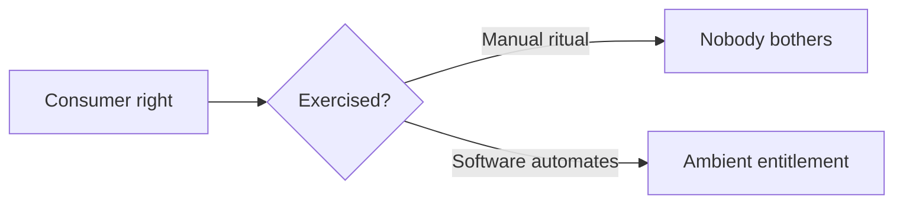

## Overview

[kargnas/damn-my-slow-kt](https://github.com/kargnas/damn-my-slow-kt) turns a rarely-exercised clause in KT's internet contract — a mandatory daily refund when measured speeds fall below 50% of the contracted rate — into a single `npx` command. The tool schedules up to 10 measurements per day through KT's official speed program, auto-files the refund request when a measurement qualifies, and skips the rest of the day once one succeeds. 445 stars on GitHub, TypeScript + Playwright + Commander + SQLite. More than a fun project — it is a concrete example of turning regulated entitlements into ambient software.

<!--more-->

## The Contract Clause Most Users Never Invoke

KT's residential internet terms include a **Minimum Guaranteed Speed Program (SLA)**. If measured speed falls below the minimum (contractually 50% of the advertised rate) on **30 consecutive minutes, 5 measurements, 3 of which qualify**, KT must refund that day's usage fee. The key catch:

> One measurement = one day's refund. 30 bad days = full monthly refund.

The refund is **daily, not monthly**. To zero out a monthly bill you need 30 qualifying days, and to qualify each day you have to sit through the 25-minute official measurement, then file a complaint through a clunky web form. Nobody does this. The regulation exists as a formality.

The product insight behind `damn-my-slow-kt` is that the barrier is not legal — it's ergonomic. The tool turns the 25-minute manual ritual into a background cron job.

## How It Actually Works

The README lists a refreshingly boring but thorough stack:

- **Language**: TypeScript with ES2020, strict CommonJS
- **CLI framework**: Commander + Inquirer + Chalk v4 (classic Node.js CLI trio)
- **Browser automation**: Playwright driving headless Chromium to file the complaint
- **Storage**: `node:sqlite` on Node 22+, with JSON fallback for older runtimes
- **Config**: YAML at `~/.damn-my-slow-isp/config-kt.yaml`
- **Test**: Vitest; CI across Node 20 and 22 matrices

The scheduler installs a platform-native cron (launchd on macOS, Task Scheduler on Windows) that runs up to 10 times per day at 2-hour intervals. Once a day succeeds, subsequent runs log "already refunded" and exit immediately. Optional Discord / Telegram webhooks notify the user when a refund goes through.

The **KT official measurement program is a hard dependency**. The program exists only for macOS and Windows — Linux is unsupported by KT itself. That killed the project's original Docker/Synology NAS deployment path, and the README politely strikes through that section. If KT ever ships a Linux binary, the Playwright ecosystem is ready.

## Why the Design Is Instructive

Three small decisions stand out:

**1. Graceful degradation on storage.** The tool prefers Node 22's built-in SQLite but falls back to JSON files. The project wants to run on any consumer machine, not just dev laptops. That's the correct call for a consumer-facing tool — compatibility beats elegance.

**2. Honest hardware disclaimers.** macOS is marked ✅ native; Windows is ⚠️ untested; Linux is flatly impossible. GitHub Actions CI runs only the web-page-load tests (since the measurement binary can't be installed), verifying login flow but not speed measurement. The status table is calibrated to reality instead of aspiration.

**3. Daily run cap with early exit.** 10 attempts at 2-hour intervals is a thoughtful frequency. Most SLA misses cluster during peak hours (evenings, weekends), so spreading 10 measurements across 20 hours catches them without hammering KT's server. The early exit on first success means the median day costs one measurement, not ten.

## The Legal Anchor

The README is painstakingly sourced from KT's own 2025.03 terms of service, including Annex 2 clauses:

> Section 13 ⑦5 — If KT fails to meet the minimum speed guarantee, the customer may terminate the contract without an early-termination fee.
>
> Section 19 ⑤ — KT shall refund usage fees when the measured speed falls below the minimum, subject to Annex 2.

And Annex 2 Section D defines the exact measurement protocol (30 minutes, 5 samples, 60% threshold). The tool is not exploiting a loophole — it's automating a process KT's own contract obligates them to honor. That's also why they chose KT's official measurement program as the measurement source. Using a third-party speed test would give KT a trivial grounds to reject the complaint.

## Where It Fits in a Bigger Pattern

Consumer regulations around internet quality, delivery guarantees, flight compensation, and subscription cancellation all share the same structural failure mode: the entitlement exists, but the ergonomic cost of exercising it exceeds the payout. `damn-my-slow-kt` is part of a small-but-growing software category that closes that gap — tools like AirHelp for flight delays, DoNotPay for parking tickets, and Truebill for subscription audits. The interesting question for developers is: which other SLA-style clauses are currently unexercised because nobody builds the Playwright script for them?

## Quick Links

- [kargnas/damn-my-slow-kt GitHub](https://github.com/kargnas/damn-my-slow-kt) — 445 stars, TypeScript, MIT-style
- [KT Minimum Speed Guarantee FAQ](https://ermsweb.kt.com/search/faq/faqAnswerM.do?kbId=KNOW0002301063) — official regulation
- [speed.kt.com](https://speed.kt.com) — KT's SLA measurement portal

## Insights

The reason this project resonates isn't the specific refund — it's the template. A 300-line TypeScript CLI converts a dormant consumer right into a background service. The work is not primarily legal research (KT's terms are public). The work is scheduling, Playwright scripting, error handling, storage migration, and install ergonomics. Those are normal engineering tasks, and they're the bottleneck keeping thousands of similar clauses (from telecom SLAs to banking fee-disclosure rules) unexercised. The implication: software that automates entitlement becomes a consumer-defense layer. If a future LLM or agent framework can generate these automators on demand — "scan my contracts, file any refund I'm owed" — an entirely new product surface opens up that sits between legal tech and personal finance. Until then, tools like `damn-my-slow-kt` are prototypes of what that looks like, one SLA at a time.
