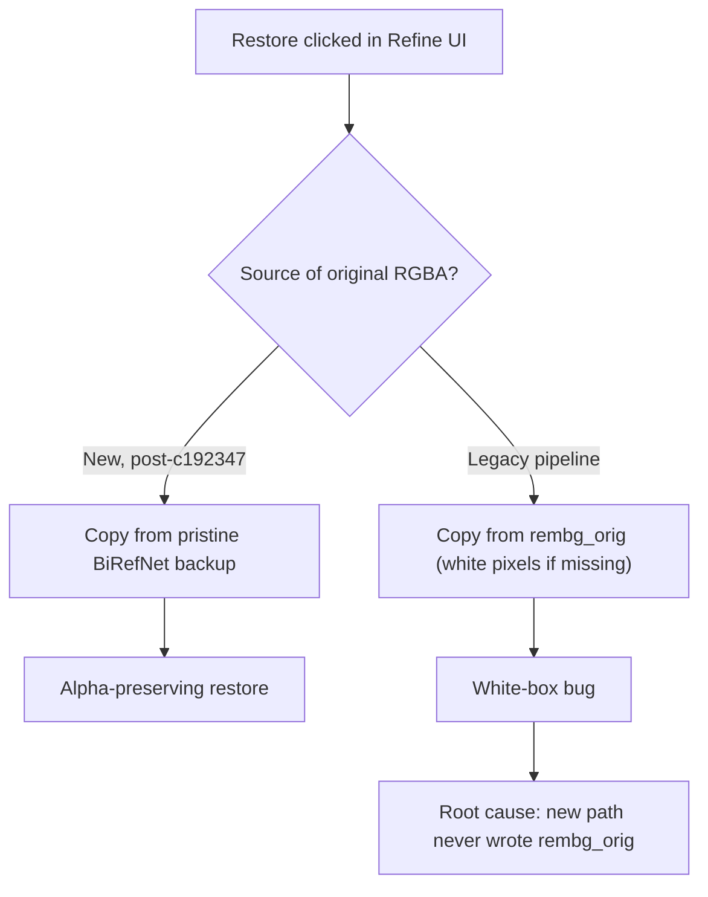

## Overview

The main work was fixing the refine flow. When users erased a region with SAM2 and clicked restore, the restored area came back as a white box instead of the pre-erase RGBA. Root cause: `rembg_orig` was not being populated under the new pipeline. After fixing the root cause I ran a repo-wide rename from `rembg` to `matte` to clean up the vocabulary. In parallel I debugged a RunPod Docker image pull-denied failure and locked down the Google-login + SQLite audit-log architecture spec. Three sessions, five commits, 3h 54m total.

[Previous post: popcon Dev Log #8](/posts/2026-04-16-popcon-dev8/)

<!--more-->



## Why SAM2 Restore Left White Boxes

The opening observation in session 0 was: "before this, only the white background got removed and all effects/elements were preserved, now the effects disappear." Clicking restore in Refine after SAM2 erase produced a visible white box even when the mask was clearly correct.

Following the backend code, `backend/main.py:211` had this restore path:

```python
# Restore logic (before fix)
for path in mask_paths:
    src = rembg_orig_dir / path.name   # original RGBA should live here
    if not src.exists():
        # fallback: copy pixels from the white-background image
        src = rembg_dir / path.name
    shutil.copy(src, restore_dst)
```

The problem was that the `rembg_orig/` directory was empty for a lot of jobs. Two paths led there:

- **Legacy jobs.** The code that populated `rembg_orig` was still uncommitted (`git status` showed `M backend/main.py`). Every job currently sitting in `/tmp/popcon/jobs/` had been processed without it.
- **New-pipeline jobs.** The GPU worker swapped rembg for BiRefNet in commit `5af85f2`, but the backend kept writing into a directory still named `rembg/`, and the restore logic kept reading `rembg_orig/`.

So the contract "`rembg_orig` is where we back up the original RGBA" was being honored **only on some paths**. The restore depended on that contract, and when the contract was broken, the fallback grabbed the white-background image and copied its pixels — the symptom.

## The Fix — Pristine BiRefNet Backup

`c192347 fix(refine): hybrid SAM restore + pristine BiRefNet backup` made two changes:

1. **Change the restore source from `rembg_orig` to the pristine BiRefNet output.** The RGBA that BiRefNet produces already has the correct alpha, so it's always a valid "pre-erase" source for a frame.
2. **Move the save step to right after the BiRefNet call.** Instead of copying the original in front of SAM2's erase, the BiRefNet stage writes both the working file and the backup. The restore path reads the backup.

Frontend `frontend/app/refine/page.tsx`, `frontend/components/RembgRefineCanvas.tsx`, the GPU worker's `birefnet_service.py` and `sam_service.py` moved together. The Refine canvas now restores to the saved pristine state, and SAM2 no longer needs to stash the pre-erase frame in a separate directory.

## rembg → matte Rename

After the restore fix, the user made the right catch: "wait, didn't we already swap from rembg to BiRefNet for background removal?" Yes — commit `5af85f2` did that inside the GPU worker, but the backend kept `rembg` as the name everywhere:

- Directory: `frames/{emoji}/rembg/` — contained BiRefNet output but was named rembg.
- Endpoint: `POST /api/emoji/{id}/rembg-apply` — function and route both said rembg.
- Frontend component: `RembgRefineCanvas`.
- API client: `rembgApply()`, `rembgFrames`.
- Types: `RembgRefineCanvasProps`.

A vocabulary mismatch costs two things. First, a new contributor reads "rembg" and thinks of the `rembg` Python package, building a wrong mental model. Second, when the backend wants to swap models again (to ToonOut for anime, say), the name has to move again.

`9e8d27c refactor: rename rembg to matte across the background-removal pipeline` renamed 10 files at once — backend, GPU worker, frontend. `matte` is a model-independent term — the VFX-industry standard word for the alpha mask produced by background removal. Swap BiRefNet for ToonOut or u2net later, and this name doesn't change. The frontend gained `MatteRefineCanvas` and deleted `RembgRefineCanvas` in the same commit. `backend/scripts/migrate_rembg_to_matte.py` handles the one-time on-disk layout migration for existing jobs.

## RunPod Docker Image Pull Denied

Session 1 was a separate chase. A RunPod worker was stuck on "image pull: wildboar7693/popcon-gpu-worker" forever. The real error in the logs was:

```
error pulling image: Error response from daemon: pull access denied for
wildboar7693/popcon-gpu-worker, repository does not exist or may require
'docker login': denied: requested access to the resource is denied
```

RunPod had no Docker Hub credentials registered, and the image was private. The Docker daemon kept retrying the auth-denied pull — from the RunPod UI this looked like "pending" but internally it was a failing loop. Immediate fix: flip the image to public and kill the stuck workers. Longer term: wrote a short markdown guide on how to keep the image private using RunPod's Docker Registry Credential feature.

A supply issue was tangled in — the banner "Supply of your primary GPU choice is currently low" was also up, with 12 jobs queued. The two are unrelated. Added extra regions to fix supply; flipping the image to public fixed the auth issue.

## Action-Specific Start Frame Prompts + 24-Emoji Cap

The third theme was a lighter feature. `41aea71 feat: action-specific start frame prompts + cap emoji sets at 24` did:

- **Split the start-frame prompt per action.** Until now start-frame generation used one generalized prompt for every action. Per-action presets in `backend/presets.py` now steer an "angry" frame into angry-specific face/pose directives.
- **Cap emoji sets at 24.** The action-selector UI previously accepted any count, and large sets would time out deep in the pipeline. Hard cap applied on both frontend and backend.

`frontend/components/ActionSelector.tsx` and `CharacterUpload.tsx` visualize the cap; `backend/pipeline/start_frame_gen.py` consumes the preset dictionary.

## Google Login + User Logs Design Spec

The last theme is documentation, not code. `0aaae34 docs(spec): Google login + user logs design` landed `docs/superpowers/specs/2026-04-17-google-login-user-logs-design.md`, nailing down the architecture. Four decisions:

1. **Auth = Firebase Auth.** At this stage we only need Google sign-in, and standing up a dedicated auth server is over-scoped. Firebase has the Google provider built-in and covers Korea KYC.
2. **User + job DB = SQLite for stage 1.** Small user base; SQLite handles it. Schema starts with three tables: `users`, `jobs`, `events`.
3. **Full audit trail.** No billing yet, but the events table records user actions; billing fields can be added later. `users` and `jobs` are the referenced entities; `events` is append-only.
4. **Anonymous jobs written with user_id = NULL.** Logged-out jobs persist, but don't get claimed on login. Deferring the job-claim logic (stage 2+).

The spec is not yet implemented — it's scaffolding for the next interval.

## Commit Log

| Message | Changes |
|---|---|
| update the docker file | 1 file (Dockerfile) |
| feat: action-specific start frame prompts + cap emoji sets at 24 | 5 files |
| docs(spec): Google login + user logs design | 1 file |
| fix(refine): hybrid SAM restore + pristine BiRefNet backup | 5 files |
| refactor: rename rembg to matte across the background-removal pipeline | 10 files |

## Insights

The central lesson this interval was that **decoupling "name swap" from "behavior swap" compounds its own cost**. When `5af85f2` swapped rembg for BiRefNet inside the GPU worker but left backend directories, frontend components, and type names as `rembg`, the restore path ended up depending on a contract (`rembg_orig` backup) that no longer existed. The symptom — a white box in a refine UI — was ambiguous enough to waste a session debugging. When refactoring, remember that names are the shell of a contract. Either change the name when you change the internals, or if you keep the name, preserve the externally-observable contract too. This interval we chose to change the name (to `matte`), and now swapping to ToonOut or u2net tomorrow is a weights-only change. The SQLite-first decision follows the same pattern — setting up Firebase + Postgres now looks like "investing in the future," but until the user count makes that real, it only costs and doesn't pay. Start with a small contract at a small stage; upgrade only when the contract starts breaking.
