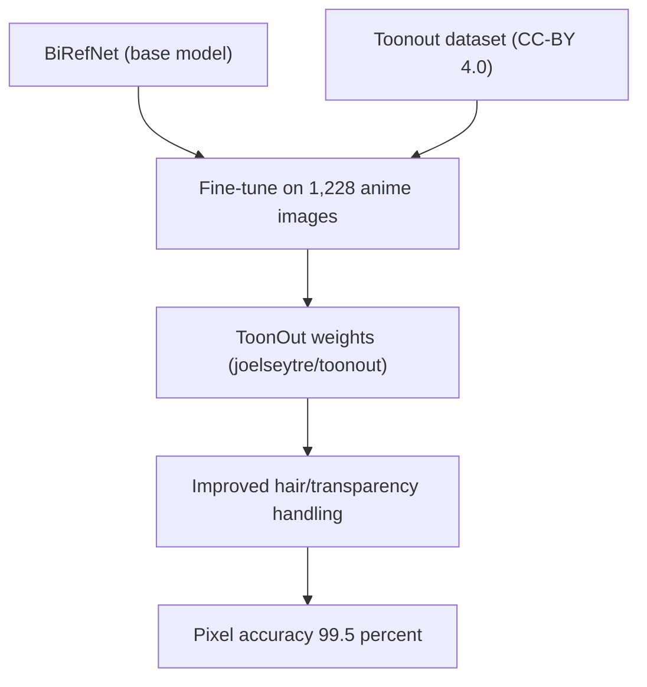
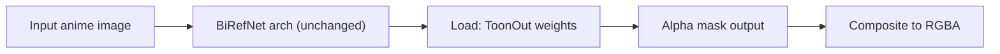

## Overview

[MatteoKartoon/BiRefNet](https://github.com/MatteoKartoon/BiRefNet) — branded **ToonOut** — is a fork of the popular [BiRefNet](https://github.com/ZhengPeng7/BiRefNet) high-resolution segmentation model, fine-tuned specifically for anime-style characters. It ships with the weights, the 1,228-image training dataset, a paper on [arXiv:2509.06839](https://arxiv.org/abs/2509.06839), and a small but organized codebase. Stars 92, MIT for code and weights, CC-BY 4.0 for the dataset. The numbers they publish are striking: pixel accuracy jumps from **95.3% to 99.5%** on their test set after domain fine-tuning.

<!--more-->

## Why a Fork Instead of a Plug-in

General-purpose background removers — U²-Net, rembg, even vanilla BiRefNet — are trained on photographic imagery. Anime characters break three assumptions those models quietly make:

1. **Hair has hard edges.** Photographs have wispy, low-contrast strands. Anime hair is a solid silhouette with occasional internal holes. Photo-trained models tend to either bleed the background into hair gaps or erase sharp spikes.
2. **Transparency is stylistic, not optical.** Semi-transparent magic effects, glass ornaments, and veils are drawn as 50% alpha without the soft light falloff you'd see in a photo. Models trained on photographic transparency hallucinate gradients that aren't there.
3. **Line work is part of the subject.** Thin black outlines framing a character are signal, not noise. Photo-trained segmenters sometimes trim them as "edge artifacts."

ToonOut addresses all three by fine-tuning with a dataset that explicitly annotates these cases. The paper reports the model "shows marked improvements in background removal accuracy for anime-style images" — and the 4.2 percentage point jump in pixel accuracy on their held-out test set is the measurable part of that claim.

## The Engineering Polish Matters

Reading the repo structure, this is not a drive-by research release. It's clearly been rebuilt for reuse:

- **`train_finetuning.sh`** — adjusted settings, explicitly switching the data type to **bfloat16** to avoid NaN gradient explosions during fine-tuning. Anyone who has tried to fine-tune BiRefNet at fp16 knows exactly what pain this avoids.
- **`evaluations.py`** — a clean rewrite of the original `eval_existingOnes.py` with corrected settings. The original BiRefNet eval script is notoriously fiddly; having a trustworthy evaluator is half the battle.
- **Organized folder layout** — code is split into `birefnet/` (library), `scripts/` (Python entry points), and `bash_scripts/` (shell wrappers for each script). Five scripts cover the full lifecycle: split, train, test, evaluate, visualize. Three utilities handle baseline prediction, alpha mask extraction, and Photoroom API comparison.

The hardware disclaimer is refreshingly honest: "this repo was used on an environment with 2x GeForce RTX 4090 instances with 24GB VRAM." Translation: if you fine-tune on smaller cards, you will need to tune your batch sizes. The authors didn't bury this in a footnote.

## Dataset Transparency

1,228 anime images split into `train` / `val` / `test`, each split further organized by generation folder (suggesting the dataset was built iteratively — emotions, outfits, actions across multiple annotation rounds). Each image exists in three views:

- `im/` — raw RGB
- `gt/` — ground-truth alpha mask
- `an/` — RGBA with transparency composited in

The CC-BY 4.0 license means you can use the dataset commercially as long as you credit the authors. That's rare for anime-related datasets, which often end up in legally ambiguous territory — either non-commercial, or "please don't sue us" silent about provenance.

## Where This Fits in the Pipeline

For anyone running a production background removal stack (as I am on [popcon](/posts/2026-04-15-popcon-dev7/) and [hybrid-image-search-demo](/posts/2026-04-15-hybrid-search-dev14/)), ToonOut is a drop-in replacement for the BiRefNet model file:

The inference path doesn't change — same architecture, same input/output spec. You swap the checkpoint and get better hair/transparency on anime subjects. The catch: performance on photographic subjects will regress, because the fine-tune is domain-specialized. If your pipeline handles both realistic and stylized inputs, you'd need a classifier upstream or two separate model endpoints.

## Quick Links

- [MatteoKartoon/BiRefNet GitHub](https://github.com/MatteoKartoon/BiRefNet) — fork with weights, dataset, paper
- [arXiv:2509.06839](https://arxiv.org/abs/2509.06839) — the paper
- [joelseytre/toonout on Hugging Face](https://huggingface.co/joelseytre/toonout) — ready-to-use weights
- [Original BiRefNet](https://github.com/ZhengPeng7/BiRefNet) — for comparison

## Insights

ToonOut is a strong case study in domain fine-tuning economics. 1,228 images is a tiny dataset by modern standards — and yet the pixel accuracy gap it closes (4.2 points on what was already a 95%+ baseline) is exactly the kind of last-mile improvement that matters in production. The interesting pattern is that open-source segmentation models are now being specialized the way fashion or medical classifiers have been for years: take a strong general backbone, curate a domain-specific dataset, fine-tune, release both. When the cost of a good general model is low enough, the competitive surface moves to data curation and domain specialization. That's also why releasing the dataset alongside the weights matters more than releasing either alone — the next fork can add 500 more images, retrain, and move the numbers again.
