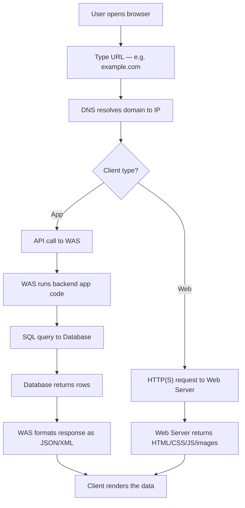
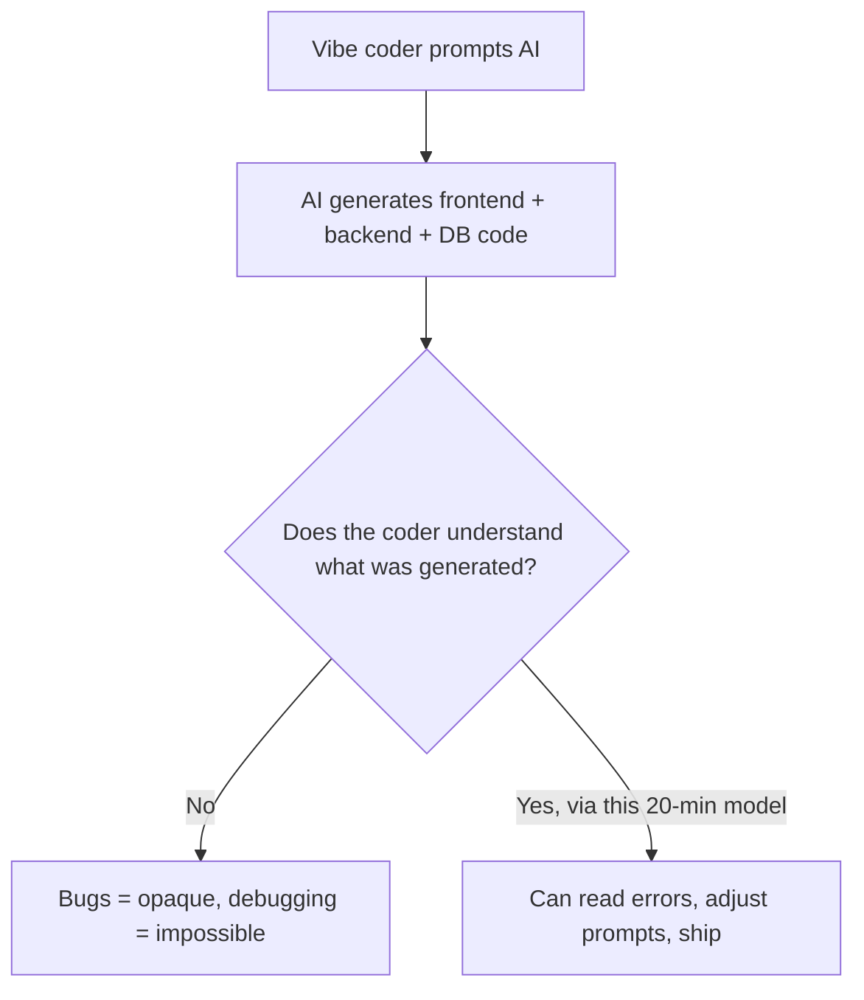

## Overview

A Korean YouTube talk by **GiSolute Alex** (기솔루트 알렉) titled "프론트엔드 백엔드 데이터베이스 전체를 20분만에 보이게 해드립니다" — "I'll make the whole frontend / backend / database visible to you in 20 minutes" — is a small masterclass in scope compression. In roughly 20 minutes he walks through the complete request path from a browser address bar down to a MySQL row, naming every protocol and component with just enough technical weight to stick. The video sits in a category I'd call **operational literacy for vibe coders**: it doesn't teach you to build, but it teaches you to read what you're building.

<!--more-->

## The Structural Claim

Alex opens with a structural claim that frames the entire talk: **most systems are frontend + backend, where backend is server + database, and communication between them happens over a network protocol**. From there he unrolls each layer.

The frontend does three things and three things only:

1. **Renders screens** — web pages in a browser, or native screens on a phone
2. **Handles events** — button clicks, form submissions, touches
3. **Sends and receives data** — over HTTP(S) to a server

That's it. He resists the temptation to dive into React vs Vue debates, frontend build systems, or design-system chatter. The point is the *role*, not the flavor.

## DNS and the Domain-to-IP Bridge

One detail I liked: he explicitly calls out that **you can't connect to a domain directly — you can only connect to an IP**. DNS is the translation layer. He names the protocol too: HTTP is "HyperText Transfer Protocol" and the S in HTTPS is security on top. For viewers building with vibe-coded AI assistants, this is genuinely useful — when Claude or Cursor generates an `.env` referencing `API_URL=https://...`, the viewer now has a mental model for what that string becomes at runtime.

## Web Server vs Application Server

This is the part of the talk I think lands hardest for beginners. Alex distinguishes:

- **Web server** (Apache, Nginx): serves **static** files. HTML, CSS, JavaScript, images. Fixed content, returned as-is.
- **Web Application Server — WAS**: serves **dynamic** content. Code runs, data is queried, a response is composed fresh per request.

The web server handles cases where the content is predetermined — a landing page, a marketing image, a JS bundle. The WAS is where your business logic lives — API endpoints, database queries, auth checks, everything that differs per user or per request.

Then he names the stack choices most viewers will actually see:

- **Java** → Spring / Spring Boot
- **Python** → Django / Flask
- **JavaScript** → Node.js + Express

The naming is intentional. A vibe coder reading `server.py` with `from flask import Flask` now knows "this is the WAS part of the stack." Vocabulary unlocks comprehension.

## CRUD and SQL — The Data Vocabulary

The database section introduces the acronym **CRUD** — Create, Read, Update, Delete — and maps it to the four HTTP methods most REST APIs use:

| HTTP method | CRUD operation | SQL keyword |
|---|---|---|
| POST | Create | INSERT |
| GET | Read | SELECT |
| PUT | Update | UPDATE |
| DELETE | Delete | DELETE |

He also introduces the **table / row / column** vocabulary using the familiar analogy of an Excel spreadsheet. Rows = records (one user, one product). Columns = fields (id, email, name). New user registration = one new row. This keeps the abstraction grounded. Anyone who has opened Excel can picture what a SELECT returns.

## What the Talk Deliberately Skips

The talk runs about 20 minutes, and what Alex *doesn't* cover is as instructive as what he does:

- **No mention of microservices, queues, or caches.** Too early — these are optimizations on top of the baseline.
- **No framework opinions.** He names stacks but doesn't prescribe.
- **No ORM vs raw SQL debate.** CRUD via SQL is the concept; Prisma or Hibernate is a detail.
- **No deployment or DevOps.** Making it work beats making it scale.

This restraint is the reason the talk stays useful at 20 minutes. Every minute spent on "cloud providers" or "container orchestration" would displace a minute of the core mental model.

## Why This Matters for AI-Coded Apps

The rise of AI-generated code shifts the developer's job from authoring to **auditing**. That job requires exactly the vocabulary Alex's talk installs — knowing what a WAS is, what CRUD is, what a JSON response is, what DNS does. Without that vocabulary, vibe-coded apps become black boxes where every error is a mystery. With it, the AI becomes a coworker you can actually review.

There's a reason this channel's previous "IT overview" video performed well, and Alex explicitly frames this follow-up as "taking that to the next level of technical depth." His audience is clearly people who are building with AI and need literacy fast — not CS undergrads on a four-year track.

## Quick Links

- [YouTube: 프론트엔드 백엔드 데이터베이스 전체를 20분만에 보이게 해드립니다](https://www.youtube.com/watch?v=l5z6UNa-ons) — the original video
- [HTTP MDN overview](https://developer.mozilla.org/en-US/docs/Web/HTTP) — a deeper dive on the protocol
- [PostgreSQL tutorial](https://www.postgresql.org/docs/current/tutorial.html) — a clean place to learn SQL hands-on

## Insights

The most valuable part of Alex's talk isn't any single fact — it's the **commitment to scope**. A complete mental model in 20 minutes is a design choice, and the choice is to trade depth for coverage. That trade is correct for the audience. A vibe coder who understands the shape of the stack can prompt an AI to fix a backend bug; a vibe coder who knows React in depth but has never heard the word "WAS" will ship broken APIs and not know why. The educational bet Alex is placing — that **operational literacy compounds faster than framework mastery in the AI era** — feels right. Framework knowledge decays as tooling changes; the HTTP-DNS-SQL triangle has been stable for 25 years and will outlive another 25 frameworks. Every vibe-coded app is ultimately standing on that triangle, whether the person prompting it knows it or not.
