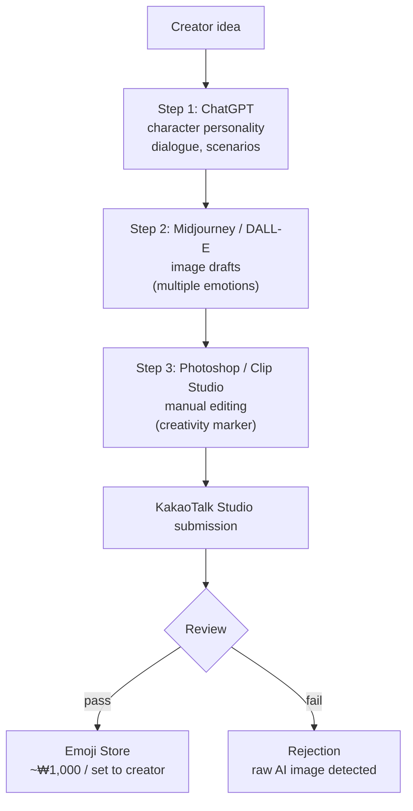

## Overview

The [YouTube video "ChatGPT로 만든 이모티콘, 진짜 카톡에 판매 가능할까?🤔"](https://www.youtube.com/watch?v=syJ0TPmJxJI) walks through something most AI-emoji threads gloss over: **KakaoTalk has restricted emoji submissions that use AI-generated images directly since September 2023.** Yet creators continue to ship AI-assisted emojis successfully. The reason is a specific workflow that uses AI for ideation and a manual editing step for the actual image — and that distinction is officially recognized as creative enough to pass review.

<!--more-->

## Why This Matters

Direct AI-to-emoji pipelines are intuitive. The AI writes dialogue, the AI draws the character, the creator uploads. The official KakaoTalk policy, as quoted by the Emoji Studio in the video: *"We are restricting entry for emojis using AI-generated content, after reviewing copyright and creativity questions about the images."* (카카오 이모티콘 스튜디오 공식 입장)

Two caveats make this workable:

1. **Review is private.** KakaoTalk declined to describe how they detect AI-generated content. *"We do not publicly disclose the review procedure."* (이모티콘 심사 절차 관련해서는 외부에 공개하지 않고 있다.)
2. **AI-as-tool is accepted.** Creators using AI for concept + manual editing for delivery are passing. The line is *creativity demonstrable in the final artifact.*

## The Three-Step Workflow

### Step 1: ChatGPT for Concept

ChatGPT isn't drawing; it's scripting. The video's example prompt:

> "말을 하는 귀여운 햄스터 캐릭터가 혼잣말처럼 말하는 열 가지 짧은 문장을 만들어 줘."
> *"Make 10 short monologue-style lines for a cute talking hamster character."*

The model returns lines like:
- "애구 또 간식 숨겨 놨는데 어디더라?"
- "햇살 좋다. 나 오늘 아무것도 안 할 거야."

These read as natural emoji dialogue. The more detail you front-load — character personality, world context, speech pattern — the better the lines scale. ChatGPT is doing what it's best at: producing narrative voice.

### Step 2: Image Model for Draft

With the concept locked, Midjourney / DALL-E / Bing Image Creator produce the draft images. The prompt pattern:

> *"A cute chubby brown hamster with an angry face, arms crossed, LINE emoji style."*

**Tip from the video:** don't produce one image. Plan a 24-emotion set first, then batch-prompt — angry, sad, happy, surprised, sleepy, hungry, curious, excited, bored, embarrassed, etc. Emoji sets sell on *emotional range*, not on individual image quality.

### Step 3: Manual Editing (The Creativity Step)

This is the step that matters for review. The video's direct advice: **"AI가 생성한 이미지 그대로는 쓸 수 없습니다."** AI-generated images cannot be used as-is.

The editing that establishes creativity:
- **Redraw or trace in Clip Studio Paint / Photoshop.** A hand-redrawn version of an AI reference is clearly creator work.
- **Harmonize style across 24 images.** AI outputs drift between images — unifying them into a visually consistent set is substantive creative work.
- **Adjust outlines, colors, proportions.** Match them to KakaoTalk's visibility guidelines (thick outlines, clear shapes at small sizes).

After editing, the submission goes through KakaoTalk Emoji Studio's standard review.

## The Revenue Math

KakaoTalk's revenue structure:

- **Sale price:** ₩2,500 per paid emoji set.
- **Creator share:** roughly 35–40%. Call it ₩1,000 per set sold.
- **1,000 sets sold = ~₩1M in creator revenue.**

The video notes that **hobby creators frequently earn ~₩50,000/mo** as supplemental income. The upside scales non-linearly — a hit set with SNS exposure hits the store's popularity ranking, which feeds more sales, which pushes the ranking higher. The distribution is a long tail with real prizes for the top 1%.

## What Review Actually Catches

The video lists KakaoTalk's review axes:
- **World coherence** (세상도 체크) — does the emoji fit a recognizable character world?
- **Speech bubble position and opacity** — technical compliance.
- **Text expression** — is the dialogue natural?
- **Copyright** — the big one. AI-generated images without creator modification fall here.

Rejection rates for "obvious AI output" have risen since 2023-09. The creators passing are, empirically, the ones putting the editing step in.

## The Policy Drift

A specific detail from the video worth flagging: **"from the second half of 2024, review criteria will include planning-centered standards regardless of AI use."** If a set has a clear concept, a character with a story, and expresses emotion well, it's more likely to pass even if AI was part of the workflow. The trajectory is from *"AI is a disqualifier"* toward *"AI is neutral; creativity is the bar."*

## Insights

The KakaoTalk situation is a concrete case of the broader AI-content policy evolution: **platforms that banned AI outputs in 2023 are moving toward "AI-as-tool is fine; undisguised AI output is not."** For a creator using ChatGPT + a drawing tool, the workflow is survivable and even profitable — but the manual editing step is not optional. It's the step that converts an AI draft into a legally and reviewably creator-owned work. The parallel for the emoji-generation tool space (PopCon, Amoji) is that **reaching KakaoTalk at scale requires the output to be more than a direct AI render** — either by adding a meaningful edit pass in-product or by positioning as an ideation tool rather than a finished-emoji tool. LINE, for now, is the friendlier first market; KakaoTalk follows once the post-processing story is mature.
