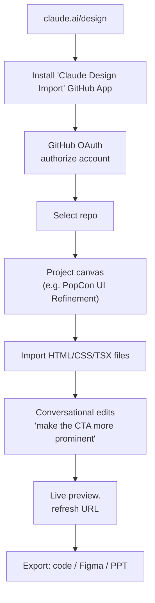

## Overview

Anthropic launched **Claude Design** at claude.ai/design — a conversational canvas that generates slides, websites, wireframes, and 3D graphics, and which also imports directly from a GitHub repository and exports to tools like PowerPoint, Canva, or code. I tried it on a live problem — refining the PopCon frontend — and this post is the first-pass assessment of what it is, what it integrates with, and where it falls short.

<!--more-->

## What Claude Design Actually Is

The short YouTube tutorial from the community put it this way: "you may not even need Canva, Figma, or Google Slides … you can literally talk to Claude design and tell it to build full slide decks, websites, wireframes, nearly anything." The two differentiating moves in the pitch are **brand-matching from a screenshot, code, or GitHub repo**, and **direct export to existing design tools**. The first is familiar if you've seen Claude Artifacts evolve; the second is the real shift — it's the part that turns Claude Design from a toy into a step in an existing design workflow.

The URL structure reveals the architecture:

- `claude.ai/design` — the landing/projects surface
- `claude.ai/design/p/{project-uuid}` — a project
- `claude.ai/design/p/{project-uuid}?file={FileName}.html` — a specific artifact inside a project
- `{project-uuid}.claudeusercontent.com/v1/design/projects/{project-uuid}/serve/{File}.html?_r={timestamp}` — live-preview subdomain per project

The preview is served from a per-project subdomain on `claudeusercontent.com`, which is the same pattern Anthropic uses for Artifacts. The `?_r=` query param is a cache-busting refresh token.

## The GitHub Import Flow

The part I wanted most — import a real repo — was also the longest to set up. The flow:

1. Click "Install Claude Design Import" from the Design home — this redirects to GitHub's App install page (`github.com/apps/claude-design-import`).
2. Choose the install target (user or org) and the repos to grant access to. The App is scoped: you pick which repos Claude Design can read.
3. GitHub bounces to `claude.ai/design/v1/design/github/callback?code=...&state=...` to complete OAuth.
4. A second round-trip `...github/callback?code=...&installation_id=...&setup_action=install` confirms the App installation.

From there, creating a project backed by a repo — in my case, **popcon-ui-refinement** — gives Claude direct access to the files. You can then open specific files into the canvas (I opened `PopCon UI Refinement.html`) and iterate on them conversationally while the live preview updates.

Two things worth flagging for anyone about to try this:

- **The App scope is per-user.** If your primary GitHub account is different from the one you use for Claude, you'll go through the OAuth two-step for each identity.
- **The preview subdomain is dynamic.** Bookmarking a preview URL works for the life of a project but the `?_r` refresh token expires — you'll see `/v1/design/preview/refresh` calls hit the backend regularly, which is the session keeping itself alive.

## What It's Good At (and Where It Isn't)

**Good:** quick visual iteration on a single file or artifact. The "brand match from a screenshot" claim is real — it pulls color and type from reference images reasonably well, and the generated layouts respect spacing conventions from the reference. For presentation decks and marketing pages it's the fastest zero-to-draft tool I've used.

**Mixed:** importing a *real* codebase. The GitHub App gives it access but it doesn't *understand* your frontend like Cursor or Claude Code does. It reads the files as design artifacts, not as a component graph. So "change this button in the actual React codebase" is still better served by Claude Code with the repo checked out locally.

**Not there yet:** round-trip editing. You can export code, but the export isn't a PR against the source — it's a new artifact. If the repo has a real component library (Button, Input, etc.), Claude Design doesn't modify those components; it produces a design that *looks* like it was built with them. That gap is exactly where a design tool becomes a development bottleneck instead of an accelerator.

## How It Slots Into a Real Workflow

For PopCon's case the value was narrow but real: **generate a design-handoff HTML** that the engineering side (Claude Code, in this case) then translates into React components. That's what the `docs/design_handoff/README.md` in the popcon repo ends up doing — a Claude Design artifact becomes the single source of visual truth, and Claude Code reads it to do the structural refactor. The loop is:

1. Claude Design: conversational design iteration, exports HTML.
2. Claude Code: reads HTML, implements in TSX with the real component library.
3. Browser preview + QA, back to Claude Design for the next round.

This is a two-tool pattern, not one-tool. Claude Design is the ideation and handoff surface; Claude Code is the implementation surface.

## Insights

Claude Design is genuinely useful for the **pre-implementation loop** — turning a vague "make it cleaner" intent into a concrete HTML artifact you can hand to an engineer (or an agent). What it is not, yet, is a tool that edits your production component library in place. The product's positioning against Figma and Canva is reasonable for greenfield decks and marketing; for product UI work on an existing codebase, the honest framing is "Claude Design produces a visual spec; Claude Code implements it." That's still a step change over "Figma mockup → engineer eyeballs it → writes TSX by hand," because the HTML is runnable and the behavioral details (hover states, focus rings, spacing) are already concrete. The missing primitive is **round-tripping through the real component library** — once that lands, the two-tool loop collapses to one.
