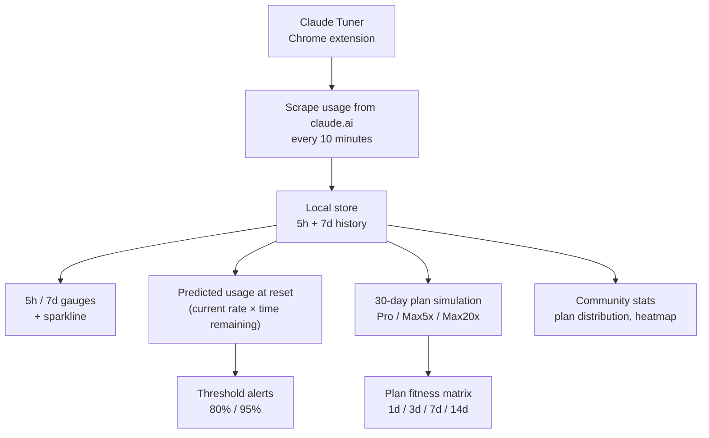

## Overview

[Claude Tuner](https://claudetuner.com/) is a Chrome extension that does one thing that Claude.ai itself refuses to: **show you, in real time, how close you are to your rate limit and how likely you are to blow past it before the next reset.** It also recommends a plan based on 30 days of your actual usage. I installed it this week because I was on Max 20x and had no idea whether I was using it, and the answer — like many heavy Claude users — was genuinely surprising.

<!--more-->

## Why This Exists

Anthropic publishes rate-limit numbers for each plan, but not a dashboard that tells you *where you are inside the limit right now*. That's a real product gap — users who pay $200/mo for Max 20x genuinely don't know if they're getting value out of it, and users on Pro repeatedly hit the wall mid-session without warning. Claude Tuner fills the gap by scraping usage from claude.ai directly and maintaining a local history.

The core screens:

- **Dual 5h / 7d gauge bars** with sparkline history and reset countdowns. Badge shows OK / Caution / Danger.
- **Predicted usage at reset.** Takes your current rate (e.g. +3.2%/h) and extrapolates. If you're at 85.2% with 1h 42m to reset at +3.2%/h, it tells you you'll land at ~92%.
- **Threshold alerts** at 80% and 95%. Both are useful — 80% gives you time to change behavior; 95% is "stop what you're doing."

## The Plan Fitness Matrix

This is the feature that changes how you think about the product. It takes 30 days of your actual usage and runs it against each plan's limits over four windows:

| Plan      | 1d | 3d | 7d | 14d | Cost   |
|-----------|----|----|----|-----|--------|
| Pro       | ×  | ✓  | ✓  | ✓   | $20    |
| Max 5x ★  | ✓  | ✓  | ↓  | ↓   | $100   |
| Max 20x   | ↓  | ↓  | ↓  | ↓   | $200   |

- **×** exceeded (would have hit the limit)
- **✓ Tight** fit right at the limit
- **✓ Fit** comfortable
- **↓ Overspend** (the plan is bigger than you need)

The tool recommends the smallest plan that still shows ✓ across all windows. In the example shown on the landing page, someone currently on Max 20x gets a "Switch to Max 5x, save $100/mo" recommendation because their 30-day history never came close to Max 5x's 7d cap.

## Community Stats — Unexpectedly Useful

Claude Tuner aggregates anonymized community data: plan distribution, average utilization per plan, a 24h × N-day activity heatmap, a token-usage leaderboard. This turns out to be the second-most useful feature after the personal gauge. Seeing that you're in the top 10% of Max 20x users' utilization is a very different signal from seeing that you're in the bottom 20% — the first justifies the plan, the second suggests a downgrade.

Of note:

- 2,300+ active users, 100+ organizations.
- Supports Pro, Max 5x, Max 20x, Team, plus the free tier.
- Auto-collects every 10 minutes.
- 30-day daily trend and hourly activity pattern are computed in your local timezone.

## Team Features — Without Team Plan

The team features are the clever wedge. Claude's Team plan is pricey, but many orgs just want *visibility* into who is hitting limits and whether collective seats are sized right. Claude Tuner offers **domain-based team aggregation** without requiring a Team plan — members install the extension, the backend aggregates by email domain, and admins see:

- KPI dashboard (team averages, breach counts)
- Per-member breach tracking + plan recommendations
- Monthly cost analysis + per-member optimization simulation
- Token usage leaderboard
- CSV / Excel / PDF export

It's a real alternative to paying for Team just to answer "are my seats sized correctly?"

## Concerns and Caveats

- **Scraping terms.** The extension reads usage from claude.ai. Anthropic's ToS doesn't explicitly block this, but it's a dependency on the page structure staying stable. A future Claude.ai redesign could break collection overnight.
- **Privacy.** The site says nothing about server-side token logging beyond anonymized aggregate stats. If you're using Claude for anything sensitive, read the privacy policy carefully before installing.
- **Prediction accuracy.** The predicted-at-reset uses a linear extrapolation of recent rate. It's correct when your workload is steady; it overshoots when you're about to finish a heavy session.

## Insights

The existence of Claude Tuner is a commentary on the product gap in Claude itself: **rate limits without a dashboard are a bug masquerading as a feature.** Users paying $100–200/mo shouldn't have to install a third-party tool to know whether they're getting their money's worth. But given the gap, Claude Tuner is a surprisingly thoughtful fill-in — the plan fitness matrix in particular turns a vague "am I overpaying?" feeling into a specific 30-day-backed answer. The fact that it works at the per-user level *and* at the org level without requiring a Team plan is the kind of wedge that makes "just a Chrome extension" become a real product. If you're spending more than $50/mo on Claude and you can't describe your usage shape in one sentence, install this and look at it for a week.
