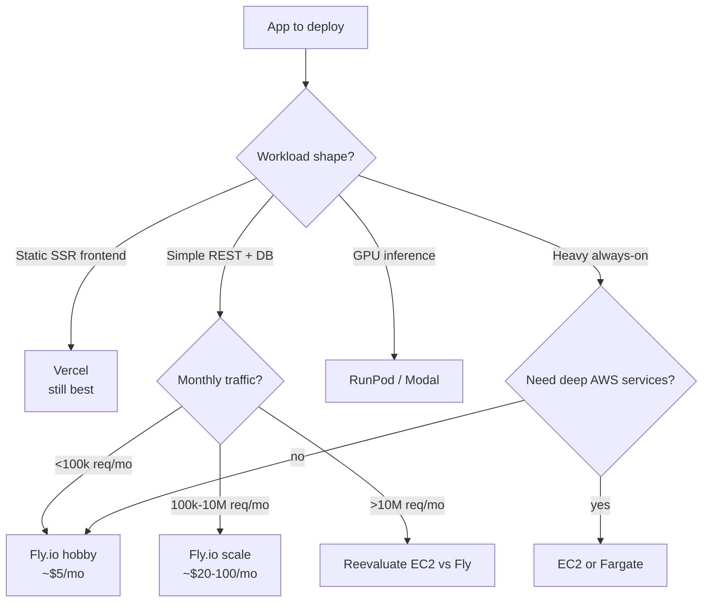

## Overview

Three sources — two GeekNews translations and one Korean developer deep-dive — all argue the same case this week: **Fly.io is cheaper, operationally simpler, and more capable than either a hand-rolled EC2 server or a paid-by-the-function PaaS for the small-to-medium production workload.** Read together, they converge on a decision framework worth writing down.

<!--more-->

## Case 1: Go Project, EC2 → Fly.io, $9/mo Saved

The benhoyt.com post ([GeekNews topic 8604](https://news.hada.io/topic?id=8604)) migrated two Go side-projects from EC2 to Fly.io. Numbers:

- **~500 lines of Ansible + config files deleted.**
- **$9/mo saved** (not huge in absolute terms, but 100% of the old bill).
- CDN for static assets replaced with `go:embed` + ETag caching.
- Cron replaced with a background goroutine.
- Config files replaced with env vars.

The architecture didn't change: Go `net/http` server + SQLite DB. What changed is the operational surface. The EC2 setup required Caddy for SSL and upgrades; Fly.io bundles TLS termination and HTTPS by default. **Three VMs are free; additional VMs are $2/month each** at 1 shared CPU / 256 MB RAM — enough for most Go servers.

The takeaway is specific: the saving is partly dollars and mostly *time*. 500 lines of Ansible represents weeks of accumulated ops toil. Fly's promise isn't "cheaper compute" per se; it's "no ops for the kinds of apps that don't need ops."

## Case 2: OpenStatus, Vercel → Fly.io

The openstatus.dev post ([GeekNews topic 12081](https://news.hada.io/topic?id=12081)) is the opposite direction — not EC2 refugees but Vercel escapees. Their reasoning:

- **Lightweight server needed.** Vercel's Next.js server is heavy for a monitoring API. They switched to **Hono + Bun** hosted on Fly. Startup time: 0.19 ms. Memory: 91 MB.
- **Multi-region monitoring needs predictable cost.** Vercel bills per CPU-time, which scales unpredictably with user count; Fly's per-VM pricing is cheaper for their shape.

Migration friction was honest:

- **Docker image 2GB → 700MB** after optimization.
- **Fly deploys often time out**, requiring increased timeout values.
- **No fast rollback to a previous version** — a real gap versus Vercel.
- **Bun runtime bugs** — request failures increased; `keepalive: false` was the workaround.

The conclusion is nuanced: *"We still love Vercel — it's optimal for Next.js apps. For hosting applications other than Next.js, it may not be the best choice."* This framing matters. Fly.io's wedge isn't "Vercel is bad"; it's "Vercel is specialized for one shape, and when your shape is different the economics flip."

## Case 3: David's Blog — Full A-to-Z

[blog.jangdaw.it](https://blog.jangdaw.it/posts/fly-io/)'s guide is the most complete walkthrough — Go + Gin + Docker, through `fly launch`, `fly.toml`, staged deploys, Grafana metrics (free, bundled), scale-in/out, env vars, Fly Postgres, Upstash Redis integration, and LiteFS for SQLite replication. A few non-obvious details:

- **3 free VMs, 160 GB outbound** — the inbound is unlimited.
- **Under $5/month is not billed.** Practically, a low-traffic side project costs zero.
- **Tokyo (nrt) is the closest region** to Korea — no Seoul region yet (as of the original post).
- **`fly.toml`'s `auto_stop_machines` / `auto_start_machines`** combo is the critical line: it scales your machines to zero when idle and spins them back up on the first request.

The LiteFS section is particularly interesting — SQLite replicated across regions means you can run a read-replica architecture on a file-based DB, which is a pattern that only becomes feasible once the platform can ship writes between machines.

## Reading These Together

Three distinct migrations, three different source points of comparison, but the same shape of argument:

1. **The interesting competitor is "no PaaS" (EC2) for ops-heavy setups, and "Next.js-specialized PaaS" (Vercel) for non-Next apps.** Fly.io wins both comparisons because it abstracts the right things (TLS, regions, secrets, Dockerfile-based deploy) without forcing a framework choice.
2. **Pricing is about the shape of your traffic, not the unit price.** Vercel's per-request pricing is great for static-heavy, cheap for small, and unpredictable for high-volume API workloads. Fly's per-machine pricing is the opposite.
3. **Migration cost is mostly Dockerfile and fly.toml correctness.** All three posts describe the actual compute migration as a few hours; the long tail is domains, secrets, env vars, and rollback tooling.

## When Fly.io Doesn't Win

Worth saying what these posts don't: **Fly.io is not a replacement for AWS at scale.** If you need DynamoDB, specific VPC peering, or IAM-federated services, you're back to AWS. GPU workloads are better on RunPod or Modal. And as OpenStatus flagged, **fast rollback** is genuinely harder on Fly than on Vercel — something to factor in if your team ships hotfixes frequently.

## Insights

The three-case pattern is: **a small team, a small project, and a strong opinion that infrastructure should not be a full-time job.** Fly.io's competitive moat is specifically this segment — developers who would otherwise reach for either too much (EC2 + Ansible) or too little (a function-per-request PaaS that breaks at higher traffic). The $9/mo savings in the Go case isn't the point; the **500 lines of Ansible deleted** is. The right way to frame Fly.io for your own team is not "how much cheaper" but "what operational complexity disappears." And once you're running GPU + API + frontend on the same platform — as we are with popcon — the economic gravity gets strong enough that alternatives have to clear a high bar.
