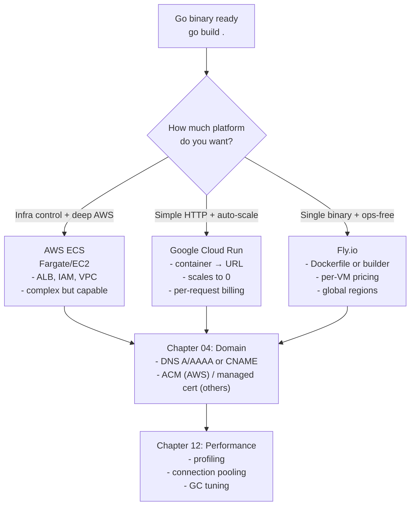

## Overview

The wikidocs.net Korean book **"소설처럼 읽는 Go 언어"** has a deployment section that walks through three paths for putting a Go binary on the public internet — **AWS ECS**, **Google Cloud Run**, and **Fly.io** — plus domain connection and performance optimization. The chapters themselves are short, but the pattern they reveal is worth a longer treatment. Here is the decision tree those five chapters encode, with the trade-offs each path actually makes.

<!--more-->



## Chapter 01: AWS ECS

ECS is the "you already live in AWS" answer. The workflow looks like:

1. Build the Go binary inside a multi-stage Docker image.
2. Push to ECR.
3. Define a Task Definition (CPU/RAM, container image, env, logging to CloudWatch).
4. Create a Service on a Cluster (Fargate if you want serverless containers; EC2 if you want to manage the host).
5. Put an ALB in front; set up target groups, health checks, and a Route 53 record.
6. Add IAM policies so the task can read from S3, Secrets Manager, etc.

What ECS gives you: **deep integration with the rest of AWS.** If your app needs to read from DynamoDB, publish to SNS, consume from SQS, assume a role to access another account's S3 bucket — ECS makes all of that clean because everything speaks IAM. What it costs you: a multi-hour first-time setup, a VPC + subnets + security groups you need to understand, and a pager that goes off when ALB health checks and the container start-up sequence disagree.

## Chapter 02: Google Cloud Run

Cloud Run is ECS's opposite number. You hand it a container image (or even just a source directory and a `Dockerfile`) and it returns a URL. The service:

- **Scales from 0 to many instances on demand.**
- **Bills per 100ms of request time** — if no requests, zero cost.
- **Automatic HTTPS** on the provided `run.app` URL.
- **No load balancer configuration** required.

The Go deployment shape on Cloud Run:

```dockerfile
FROM golang:1.21-alpine AS build
WORKDIR /app
COPY . .
RUN go build -o main .

FROM alpine:3.18
COPY --from=build /app/main /main
EXPOSE 8080
CMD ["/main"]
```

Then `gcloud run deploy --source .` and you're live.

Cloud Run's catch: **cold starts.** Scaling to 0 means the first request after idle pays a startup cost. For a Go binary this is usually under a second, which is fine for most workloads — but if you care about tail latency, set `min-instances: 1` and accept the bill.

## Chapter 03: Fly.io

Fly is the third path, and [covered in more depth separately](/posts/2026-04-22-fly-migration-economics/). The Go + Fly shape:

1. `fly launch` — generates `fly.toml` from your Dockerfile.
2. `fly deploy` — builds via Fly's remote builder and deploys to your chosen region.
3. `fly certs add yourdomain.com` — adds a custom domain with automatic Let's Encrypt.

Against ECS, Fly wins on setup simplicity. Against Cloud Run, Fly wins when you need **a small always-on footprint** (Cloud Run's scale-to-zero is great for bursty; Fly's $2/VM/month is great for steady low-volume).

## Chapter 04: Domain Connection

The generic pattern across all three:

- **A record** pointing to a stable IPv4 (ECS via ALB DNS; Fly via allocated IP; Cloud Run via Google-managed domain mapping).
- **AAAA record** for IPv6 where available.
- **TLS certificate** — ACM on AWS (automatic with ALB), Google-managed on Cloud Run, Let's Encrypt via Fly's `fly certs`.

The quiet advice: **do not run your domain through a single registrar + nameserver setup you can't replicate.** Use a DNS provider (Cloudflare, Route 53, Gandi) whose records you can export as a zone file. This is the kind of detail that only matters once, when you need to migrate away from a provider you've grown to dislike.

## Chapter 12: Performance Optimization

The wikidocs performance chapter collects the Go-specific optimizations worth caring about. The ones with the biggest return:

- **`GOGC` tuning.** The default 100 is fine for most workloads; set it higher (200, 400) if you have spare memory and want fewer GC pauses.
- **Connection pool limits** on `database/sql`. `SetMaxOpenConns` and `SetMaxIdleConns` are the two knobs that matter. Default of 0 (unlimited) bites under load.
- **`pprof` endpoint** exposed on a separate port, protected by auth. 90% of Go performance problems are diagnosed in `pprof/heap` and `pprof/goroutine`.
- **Structured logging via `slog`.** Faster than `log` + `fmt.Sprintf`, and the structured output plays better with CloudWatch / Cloud Logging / Grafana Loki.
- **`go:embed`** for static assets — no CDN required for small-to-medium sites, and one fewer external dependency.

## Decision Framework

The real utility of reading the five chapters together is the framework they suggest — a three-line decision tree:

1. **Do you need deep AWS service integration?** → ECS. Otherwise, no.
2. **Is your traffic bursty with zero baseline?** → Cloud Run.
3. **Otherwise — small team, steady-ish traffic, don't want to think about infra?** → Fly.io.

I have not seen a Go production workload in the last year where ECS was clearly the right answer unless the project was already embedded in an AWS account full of DynamoDB tables and Lambda functions.

## Insights

The trend is obvious once you see the three side by side: **the platforms have absorbed the ops work, and the only question left is how much platform you want.** ECS lets you customize everything and requires you to operate everything. Cloud Run gives you an HTTP URL in exchange for a container. Fly.io gives you a container + region + custom domain in exchange for a Dockerfile. A Go binary is small and boring in the best way — it plugs into all three. For most production Go workloads the honest recommendation is "Cloud Run for bursty, Fly for steady, ECS only if you already live there." The performance chapter's real message isn't which optimization to apply first; it's that Go is usually fast enough without any of them, and you should only start tuning after pprof points somewhere specific.
