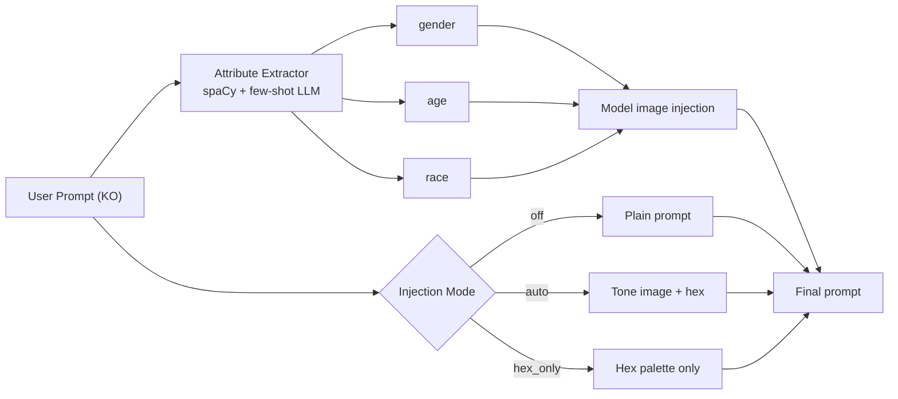

## Overview

Sixteen commits, three threads: a new **HEX-only injection mode** (the tone-image is dropped, only the hex palette is injected into the prompt), an **angle picker split into three categories** with an inline UI, and a **Korean-prompt attribute extractor** that stops the prod regression where "하늘을 달리는 남자" got a female model attached. A small OTLP tuning pass (batched spans, widened metric interval) wraps it up.

Previous post: [hybrid-image-search-demo Dev Log #16](/posts/2026-04-17-hybrid-search-dev16/)

<!--more-->

## HEX-Only Injection Mode

The tone-injection system has two axes: **the tone reference image** (3- or 5-image pack, extracted to hex colors) and **the prompt fragment** that frames the image inside the generation prompt. The existing default wired both — inject the image and the tone-direction text. The ask in this session was a third mode where only the hex palette goes into the prompt as color guidance, and the tone image path is skipped entirely.

The design (`44d5bff`, `08916cb`) unified this as a three-way `injection_mode` enum: `off` / `auto` / `hex_only`. Plumbing it through was the bulk of the work:

- `refactor(prompt)`: promote `hex_colors` to an explicit param and add a hex-only prompt block (`0a16f4f`).
- `feat(db)`: thread `injection_mode` through `log_generation` and hydration (`e53be41`) — necessary so the generation record can reconstruct the mode later for debugging.
- `feat(backend)`: wire `injection_mode` end-to-end off/auto/hex_only (`e6807e2`).
- Alembic migration `20260420_add_injection_mode.py` adds the column.
- `feat(ui)`: three-way toggle pill, with a11y tooltips explaining each mode (`5659fd3`, `3b2cf22`).

The UI polish (`51464e6`) took a few iterations. The initial design was neutral-gray for inactive states, but "off" didn't read as *disabled* — users kept thinking it was still active. The fix: inactive pills turn red, the active pill yellow. Stronger contrast, the state legible at a glance.

A `fix(ui)` commit (`988ea37`) covers the prompt-display helpers that were still showing the tone-direction text even in `hex_only` mode — a dangling copy path. And `chore(gen)` (`c419349`) polished the telemetry labels so the three modes show up clearly in Grafana spans.

## Angle Picker: Three Categories with Inline UI

Commit `61c5802` splits angle selection from a flat list into three categories with an inline UI (presumably "general / beauty / product" or similar, based on the prior Lens picker pattern in #16). The structural motivation is the same as the lens picker expansion two logs back: flat lists over ~5 items become noise; grouping restores scanability.

The subtle frontend concern was that the three-category split needed a deterministic display order — reflectiveness in the backend's `angle_registry` plus category metadata in the JSON schema. The component reads the schema once and renders sections; selection still emits a single `angle_id` to the backend, so the API surface is unchanged.

## Korean Prompt Attribute Extraction

The prod bug that kicked this off: a prompt "하늘을 달리는 남자" (a man running across the sky) produced a generation where the model-injected reference image was `Araya 05.png`, which is labeled female in `data/model_labels.json`. The LLM-driven attribute extractor was picking the wrong gender.

The fix (`61e6c85`) is a **few-shot prompt** that enforces gender/age/race extraction with examples. Tightening the prompt schema rather than running a classifier keeps the solution simple — the decision made in-session was that a minor guardrail was enough, since the input space of Korean prompts is broad and any real classifier would need a labeled corpus.

spaCy pinning (`9f2773b`) is related — `en_core_web_sm` was auto-upgrading in fresh venvs, and the prompt parser relies on specific token types. Pinning ensures reproducible parses.

## OTLP Telemetry Tuning

Two small but load-bearing changes (`02c0c6c`): **batch spans** instead of sending per-span (one of the OpenTelemetry defaults that absolutely needs overriding under any real traffic), and **widen the metric interval** so Grafana Cloud free-plan ingestion stays well under limits. The trial expired — the dashboards need to fit in free.

## Commit Log

| Message | Changes |
|---------|---------|
| docs(spec): HEX-only tone injection mode design | design |
| docs(plan): HEX-only tone injection implementation plan | plan |
| refactor(prompt): promote hex_colors to explicit param, add hex-only block | prompt builder |
| feat(angle): split angle selection into 3 categories with inline UI | angle picker |
| chore(deps): pin en_core_web_sm so venv rebuilds include spaCy model | reproducibility |
| feat(db): thread injection_mode through log_generation and hydration | DB + ORM |
| feat(backend): wire injection_mode end-to-end (off/auto/hex_only) | backend wiring |
| fix(deploy): restart backend and frontend via pm2 | deploy hotfix |
| feat(ui): 3-way injection mode toggle (off/auto/hex_only) | UI |
| chore(ui): polish injection mode pill a11y and tooltips | a11y |
| fix(ui): respect hex_only mode in prompt-display helpers | UI sync |
| style(ui): make all inactive injection pills red for stronger active signal | visual contrast |
| fix(generation): extract gender/age/race reliably from Korean prompts | parser fix |
| fix(telemetry): batch spans and widen metric interval | OTLP tuning |

## Insights

Two threads share the same lesson: **explicit modes beat implicit fallbacks.** The `injection_mode` enum is strictly better than the prior "the flag defaults affect two things simultaneously" design, because each code path is now legible at the call site — no need to trace through eight booleans. Similarly, the Korean prompt extractor used to rely on an LLM's default behavior, which worked *most* of the time until it didn't; a few-shot prompt is still LLM-based, but now the decision is visible in the prompt itself. Visual contrast follows the same principle: the moment an "off" toggle looks neutral, users stop reading it as off. Next session's likely focus: the auto-fill token expansion request from session 4, which needs a thoughtful UI for editing 3 or 5 tone refs at once instead of one-at-a-time.
