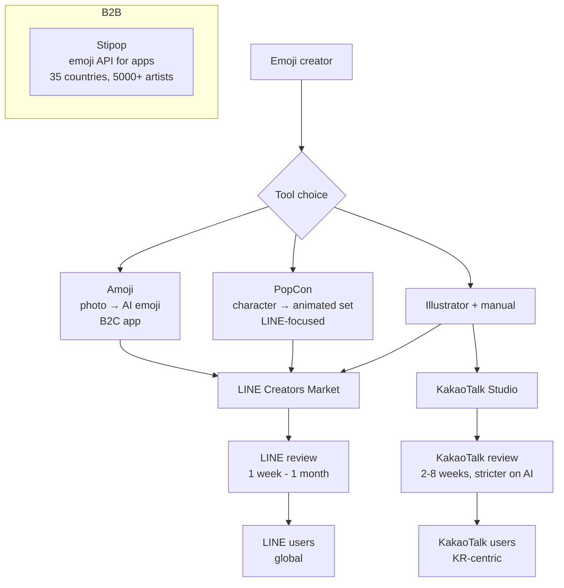

## Overview

Three vantage points on the same market this week: **Amoji** (consumer AI emoji generator), **Stipop** (B2B emoji API), and **LINE Creators Market** (the platform that gates emoji distribution for LINE users globally). Reading them together gives a clear picture of where an AI-generated animated emoji tool like PopCon actually fits, and where it doesn't.

<!--more-->

## Amoji — The Consumer Play

[Amoji](https://ddoaus.github.io/) (아모지) is built by **DevKit** (데브킷). The pitch: upload a photo, the app generates emoji / stickers / profile images automatically. The listed product axes:

- **Photo-based AI emoji generation**
- **Character-ization / avatar transformation**
- **Automatic style application and variation**
- **Multi-resolution output**
- **Download and share generated results**

Privacy language is direct and reassuring: photos are not shared externally; deletion on request; HTTPS end-to-end. Contact is a personal email, founder name given (오세준). This is a small team / solo-founder operation, positioned B2C.

Amoji is already **sold on LINE Creators** ([amoji – LINE 이모티콘](https://store.line.me/emojishop/product/5f09296cc77ced18b4f65e09/ko)). The existence of a LINE-published Amoji set is what makes the positioning interesting — a tool that generates the emoji *is itself shipping the end product of that emoji on the platform it targets.* That's a vertical integration a pure tool provider doesn't naturally have.

## Stipop — The Infrastructure Play

[Stipop](https://stipop.io/ko/about) is the other side of the market: a B2B emoji API used inside other apps. Their positioning numbers:

- **200M users** of apps using Stipop emojis globally.
- **5,000+ artists across 35 countries.**
- **Y Combinator-backed**, press coverage calling out 14% average weekly growth — Y Combinator's own standard is 7% weekly as healthy, 10% as exceptional.

Stipop's pitch is emoji-as-API for dating apps, social radios, fintech, live streaming, gift rewards, and design tools. The vertical they target is *product teams building chat surfaces* — they want the keyboard, the search, the analytics. Not creators.

What makes Stipop interesting as a benchmark: **they proved that emojis have enough commercial gravity to be a dedicated API company.** The implication for a creator-facing tool like PopCon is that the end-state distribution isn't just "submit to LINE and hope" — there's a parallel distribution channel through API partners that can bring aggregate reach without individual store submissions.

## LINE Creators Market — The Submission Pipeline

[LINE Creators Market's animation emoji guideline](https://creator.line.me/ko/guideline/animationemoji/) and [review guideline](https://creator.line.me/ko/review_guideline/) are the gate everyone has to pass. The technical requirements for an **animated emoji** set:

- **Main set:** 8–40 images (full Latin text / kana sets push the count to 100+).
- **Image size:** 180 × 180 px.
- **Format:** APNG.
- **File size:** 300 KB per image, 20 MB total zip.
- **Animation duration:** ≤ 4 seconds per emoji.
- **Animation loop:** 1–4 loops per emoji.
- **Frame count:** 5–20 PNG frames per APNG.
- **Background:** transparent; 72 dpi; RGB.
- **Tab image:** 1 image at 96 × 74 px.

The design tips in the guideline are worth knowing because they explain why many AI-generated emojis fail on LINE:

- **Bold, dark outlines** — thin/light outlines read poorly on varied chat backgrounds.
- **Design for sticker-like use** — a single emoji sent alone renders at a different size than one among text.
- **Visible at small size** — emojis appear tiny in conversation messages.
- **Minimal flourish** — the guideline explicitly deprecates sparkle effects and hearts that were common for stickers.

The **review guideline** (ethics + business gates) is equally load-bearing:
- Visibility (gradients, thin lines, 8-head-tall characters: all rejection reasons).
- No pure-logo or pure-text emojis.
- Ethics: no violence, substance use, political content, discrimination.
- No promotion of competing messengers or external services.
- No collecting personal data as a purchase requirement.

Critically, LINE has no explicit AI-generated-content ban, unlike KakaoTalk (which restricts raw AI-generated images since 2023-09). This is a real competitive dynamic — LINE-targeted AI emoji tools have a friendlier review environment than KakaoTalk-targeted ones.

## Where PopCon Fits

Reading across all three: PopCon's position is **a narrower wedge than Amoji** and **a more creator-facing wedge than Stipop.** Specifically:

- **Character → animated set**, not photo → static sticker. This matches LINE's animation emoji format almost exactly (8–40 images, each APNG ≤4s).
- **LINE-first.** The guidelines map cleanly onto PopCon's pipeline output — 180×180 APNG, transparent background, bold outline enforcement via the matting step.
- **Not a B2B API, not a photo transform.** PopCon targets the creator who wants to *ship* a set.

The product shape implications:

1. **The output format contract has to be LINE-compliant by default** — not as an export option but as the default pipeline output.
2. **The ethics filter matters.** LINE's review will reject political or promotional emojis; PopCon's prompt layer should probably pre-filter these to avoid wasted creator work.
3. **Stipop's B2B lane is an interesting second-order distribution channel** — once PopCon has a meaningful catalog, API partnerships become a path that avoids individual review queues.

## KakaoTalk as the Harder Market

The [YouTube video on KakaoTalk AI emoji sales](/posts/2026-04-22-chatgpt-kakao-emoji-viability/) covers the other half: KakaoTalk is **actively hostile** to raw AI-generated content as of 2023-09. Creators succeed there by using AI for ideation (character concepts, dialogue) and hand-drawing or heavily editing the final images. PopCon on LINE is a friendlier starting market; KakaoTalk is a later, harder wave.

## Insights

The Korean emoji market has three clean layers — **creator tools** (Amoji, PopCon), **B2B distribution** (Stipop), and **platform gates** (LINE Creators, KakaoTalk Studio). Most early-stage thinking in this space gets layer 1 right and ignores layers 2 and 3. The honest takeaway from reading all three sources together is that **the platform constraint defines the product.** LINE's 180×180 APNG with ≤4s animation and bold outlines is not a suggestion — it's the shape the pipeline must produce. For a tool that wants to ship volume on LINE, pipeline defaults that match the guideline are worth more than any UI polish. And the Stipop example shows that once you have a creator catalog, a second distribution layer exists; you don't have to win on LINE Store rankings alone.
