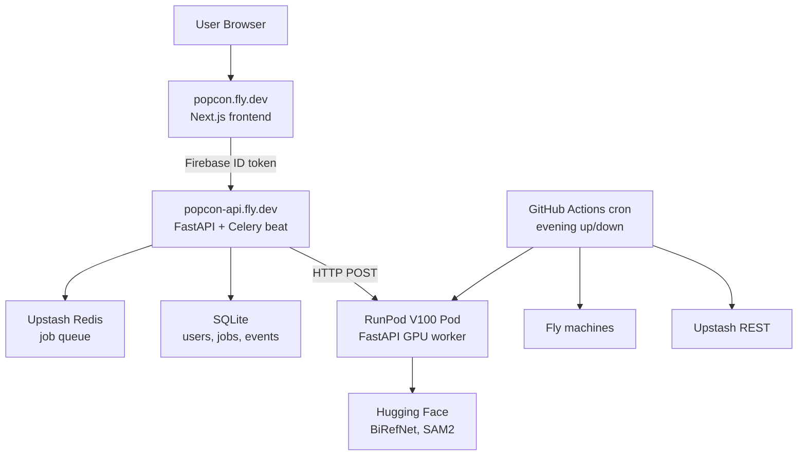
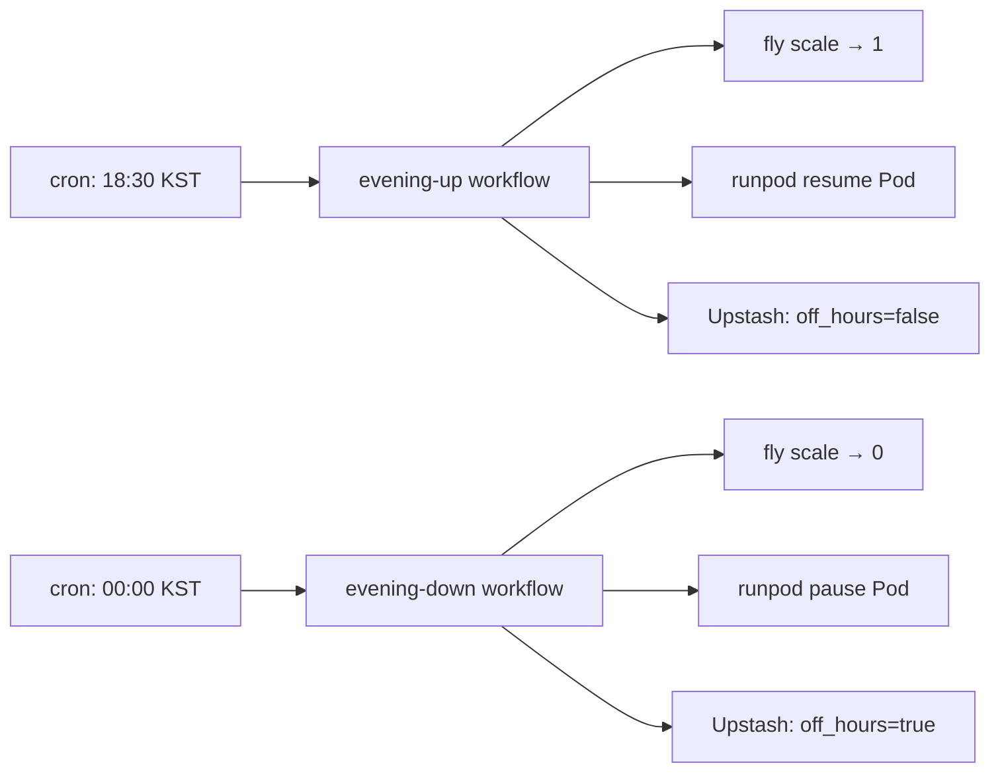

## Overview

Sixty-six commits in roughly thirty-three hours. This entry closes the gap between "local dev works" and "anyone on the internet can sign in and generate an animated emoji set." Three threads ran in parallel: **Firebase Google login + per-user SQLite audit trail**, **RunPod migration from Serverless to Pod** (to kill the cold start), and **Fly.io scheduled-availability deploy** controlled by a GitHub Actions cron. None of these are features in isolation — together they form a deployable production shape.

Previous post: [popcon Dev Log #9](/posts/2026-04-17-popcon-dev9/)

<!--more-->

## Google Login and Per-User Audit Trail

The anonymous flow had to go. Once you run a GPU-backed generator on the open internet, you need to know *whose* job is chewing through frames — for cost, abuse, and product reasons. The login migration happened in two swings.

**Backend (commits `1dde783` → `8735e3b`):** added `sqlalchemy`, `alembic`, and `firebase-admin`; wrote an engine module with WAL pragmas for concurrent writers (`2475e17`), ORM models for `users`, `jobs`, `emoji_results`, and `events` (`c3e9d69`), and an initial Alembic migration (`a1d5965`). A 300-event concurrency test (`83d4b48`) exercised the WAL path. The `current_user` FastAPI dependency verifies the Firebase ID token (`9dafed4`); `/api/jobs` became user-scoped (`6c79aaa`), and every pipeline stage now emits an event (`8735e3b`, `c8eaf5f`) — `job.created`, `job.stage_completed`, `job.completed`, `job.failed`. The audit table is the new source of truth for debugging production.

**Frontend (commits `6c53eeb` → `f06e5af`):** Firebase client init, an `AuthProvider`, a `useUser` hook, a Google sign-in button, and a pattern that injects the ID token on every API call. The editor and refine pages became login-gated (`7cdd747`), and the "Start Creating" button triggers login when signed out (`f4c930e`). Commit `39d285c` pulled env loading up to the repo root so the frontend and backend read the same `.env` — a small thing, but it eliminated the "works on my machine" divergence that pops up every time a Firebase project ID drifts.

A non-obvious migration detail: commit `873ccc8` adds a `0002` migration that makes `user_id` `NOT NULL`. Before that, the column existed but allowed `NULL` for the handful of jobs that were in flight during the cutover. The anonymous cleanup beat (`7a5ed5d`) was removed in `01b867e` the moment the flow became login-only.

## RunPod Serverless → Pod, Because of Cold Starts

PopCon's GPU worker was on RunPod Serverless in #7. Serverless is great when you can tolerate a ~30-second cold start; animated emojis can't — the user is staring at a spinner during generation already, and another 30 seconds kills the experience. So the worker moved to a Pod (V100, Tokyo) with a FastAPI HTTP wrapper (`d91df0b`). The client targets the Pod URL (`ec0e1e3`), and `config.runpod_pod_url` replaces the Serverless dispatcher (`00c2786`).

The trade is that a Pod is running 24/7 by default, which means a 24/7 bill. The fix is **scheduled availability** — run only during the hours you expect users, and shut everything off when you don't. That's the third thread.

## Scheduled Availability: Fly.io + RunPod + Upstash, Orchestrated by GitHub Actions

This is the interesting bit. The design (`73125b2`, `59fc9ac`) keeps cost flat outside business hours without making the app feel broken. A shared scheduler module (`b0b9e07`) knows how to start/stop Fly machines, resume/pause RunPod Pods, and flip Upstash flags. A GitHub Actions workflow (`57a01e9`) runs on cron to bring the stack up in the evening and down after.

Outside the window, the API returns `503` from `/api/generate-set` because the off-hours flag is set (`1c45386`, `c2ae323`), and the beat worker drains paused emojis (`08c6481`) on the next wake. A concrete bug that bit during integration: commit `30e1886` fixes the Upstash REST payload — their REST API expects an **array body**, not `{command: ...}`, which is a reasonable wart to discover the hard way. Another one: `c4350f5` sets `auto_start_machines = true` on the Fly config, because a mid-session user-triggered request would otherwise lock out when the worker had idled.

The manual workflow (`9388606`) uses an `env` variable + a whitelist instead of raw user input, closing the obvious command-injection vector on a `workflow_dispatch` handler.

## Fly.io Deploy Topology

A small design hiccup: the original spec (`73125b2`) had three apps (frontend, backend, worker). In practice, backend and worker need to share a volume for job files, and Fly pins volumes to physical hosts. Merging them into one app via **honcho** (`20a02d5`) was the cleaner move. That also killed `popcon-beat` (`224e94d`), since a single `worker_ready` signal is enough.

Firebase credentials are loaded from a **base64 secret at container boot** (`47ed4b3`), which is the standard way to carry a JSON service-account file through a single `fly secrets` value. `NEXT_PUBLIC_FIREBASE_*` have to be baked at build time via build args (`dc03275`) because Next.js inlines `NEXT_PUBLIC_*` into client bundles — a subtlety that bites everyone once.

A couple of production-only fixes followed: allow `popcon.fly.dev` in CORS (`a9bf1b2`); normalize `ssl_cert_reqs` between celery and redis-py (`671c664`), because Upstash's TLS URL and the library defaults disagreed; convert file paths to API URLs for prod — the dev shortcut of serving `/tmp` directly doesn't work once `/tmp` is per-container.

## Commit Log

| Message | Changes |
|---------|---------|
| feat(db): sqlalchemy engine with WAL pragmas | db layer setup |
| feat(auth): firebase-admin current_user dependencies | token verify |
| feat(audit): emit events from every pipeline stage | audit trail |
| feat(gpu-worker): FastAPI HTTP wrapper for Pod deployment | Pod migration |
| feat(deploy): fly.io machine configs (frontend, backend, worker, beat) | initial fly config |
| feat(scheduler): shared fly + RunPod + Upstash control module | orchestrator |
| feat(ci): scheduled workflows (evening up/down, in-window health, manual) | cron controller |
| fix(scheduler): Upstash REST expects array body, not {command: ...} | REST contract fix |
| simplify(deploy): drop popcon-beat, use worker_ready signal | architecture simplification |
| fix(deploy): merge backend+worker into one fly app (shared volume via honcho) | topology fix |
| fix(frontend): pass NEXT_PUBLIC_FIREBASE_* at build time via build args | Next.js gotcha |
| fix(redis): normalize ssl_cert_reqs between celery and redis-py | Upstash TLS compat |
| fix(fly): auto_start_machines=true so mid-session idle doesn't lock out | UX under autoscale |

## Insights

The single most useful mental shift this session was separating **"the app works"** from **"the app is available on a schedule."** Both cost-optimized indie projects and serious products converge on the same idea eventually: you don't need the GPU running at 4 AM when nobody is using it. The glue — GitHub Actions cron + Fly + RunPod + Upstash — is cheap to write once you treat "availability" as a first-class abstraction with a single module controlling all three. The `off_hours` flag in Upstash is what makes graceful degradation possible without hard-coding windows into the API. The whole migration forces a discipline: every external boundary (TLS, CORS, env injection, secret format) becomes explicit, documented, and reproducible from a fresh checkout. Next entry will likely be the first real-user incident report — those always come within a week.
