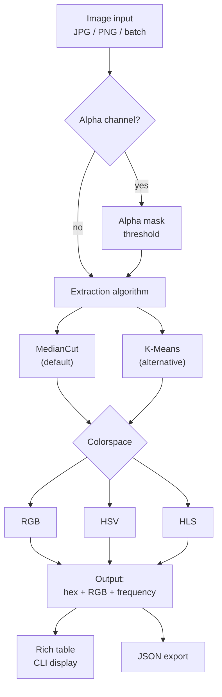

## Overview

[qTipTip/Pylette](https://github.com/qTipTip/Pylette) is a small Python library (**164 stars, 16 forks**) that extracts color palettes from images. That description undersells it — Pylette is one of those libraries that does **one thing** so completely that you don't think about it again after installing. It ships a CLI, a Python API, multiple extraction algorithms, three colorspaces, parallel batch processing, JSON export, and a progress display with color previews. The whole thing is Python + Pillow + a few numerical deps.

<!--more-->



## What Pylette Actually Does

The README example is the fastest way to understand it:

```bash
pip install Pylette
pylette sunset.jpg
```

Output:
```
✓ Extracted 5 colors from sunset.jpg
┏━━━━━━━━━━┳━━━━━━━━━━━━━━━━━┳━━━━━━━━━━┓
┃ Hex      ┃ RGB             ┃ Frequency ┃
┡━━━━━━━━━━╇━━━━━━━━━━━━━━━━━╇━━━━━━━━━━┩
│ #FF6B35  │ (255, 107, 53)  │    28.5% │
│ #F7931E  │ (247, 147, 30)  │    23.2% │
│ #FFD23F  │ (255, 210, 63)  │    18.7% │
│ #06FFA5  │ (6, 255, 165)   │    15.4% │
│ #4ECDC4  │ (78, 205, 196)  │    14.2% │
└──────────┴─────────────────┴──────────┘
```

Per-color **frequency** is the feature most comparable CLIs miss. It's what tells you whether `#FF6B35` is the sunset or a sign in the corner.

## Features Worth Knowing

Pulled from the README:

- **Multiple algorithms.** `--mode MedianCut` (default) and alternatives. MedianCut is the classic approach — recursively split the color space at the median of the dominant axis. K-Means is the other common choice, adjustable via Python API.
- **Multiple colorspaces.** `--colorspace {rgb,hsv,hls}`. HSV is often better for artistic palettes — grouping by hue instead of raw RGB similarity.
- **Alpha handling.** `--alpha-mask-threshold 128` excludes transparent pixels from the palette calculation. Essential for logos and stickers with transparent backgrounds.
- **Batch + parallel.** `pylette *.jpg --n 6 --num-threads 4` processes many images concurrently.
- **JSON export.** `--export-json --output results/` writes one file per image, or one combined file if the output is a single `.json`.
- **Suppress table output.** `--no-stdout` for pure programmatic use.

## The Python API

For pipelines, the library API is what matters:

```python
from Pylette import extract_colors

palette = extract_colors(
    image="sunset.jpg",
    palette_size=5,
    mode="MedianCut",
    colorspace="hsv",
    alpha_mask_threshold=128,
)

for color in palette:
    print(color.rgb, color.hex, color.frequency)

palette.to_json("out.json")
```

The `Palette` object is iterable, serializable, and carries metadata per color. This shape works well inside larger image-processing pipelines — you can pass it through a color-distance function, a harmony-scorer, or a prompt-builder.

## Where This Fits in an AI Image Stack

Color palette extraction shows up everywhere once you have an image pipeline:

- **Reference-image tone injection.** The [hybrid-image-search-demo](/posts/2026-04-22-hybrid-dev17/) project's "HEX-only injection" mode extracts hex colors from a reference image pack and injects them into the generation prompt. Pylette-shaped output is exactly the right input format.
- **Product color matching.** E-commerce image search often uses palette similarity; Pylette's frequency-weighted palette is more useful than a dumb dominant-color extraction.
- **Generated-emoji style harmonization.** Sets of emojis need to share a palette. Extract the palette from one reference emoji, enforce similarity on the rest.
- **Theme generation from artwork.** Pull a palette from a logo, use it to seed a full site theme.

## Package Hygiene

The maintenance signals are good for a small library:

- **Dependabot enabled** — recent commits are all auto-bumps of actions versions.
- **Material for MkDocs documentation** at [qtiptip.github.io/Pylette](https://qtiptip.github.io/Pylette/).
- **Published DOI via Zenodo** — the project has a citable reference, which matters for academic use.
- **PyPI + uv support** — both `pip install Pylette` and `uv add Pylette` work.

Dependency count is small and stable. No surprise transitive bloat.

## Algorithms Notes

The two extraction modes have meaningfully different behavior:

**MedianCut** (default):
- Deterministic for a given image.
- Fast.
- Tends to preserve spatial color variety — you'll get colors from different image regions.

**K-Means**:
- Stochastic by default (seed the randomizer for reproducibility).
- Slightly slower.
- Clusters by color similarity; can miss a small-but-distinct accent color that MedianCut catches.

For palette extraction in a pipeline that needs reproducibility — say, generating the same palette every time you process the same reference — MedianCut is the safer default.

## Insights

Pylette is the kind of library that deserves to be unsurprising. **Color palette extraction is a solved problem**, and the right API for it is "hand in an image, get back N colors with frequencies and a colorspace choice." Pylette does that with a well-maintained codebase, good docs, and a CLI that prints pretty tables. The ecosystem around AI image generation — reference image injection, style transfer, product match — makes libraries like Pylette quietly load-bearing. For any Python-side image work that touches palettes, install this and move on to the actual problem.
