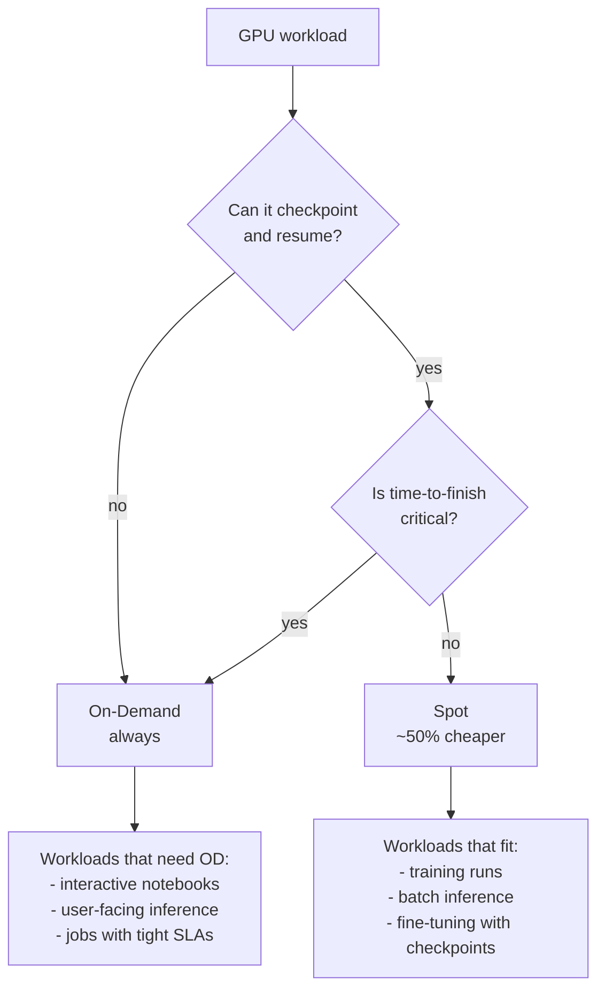

## Overview

[RunPod's blog post "Spot vs. On-Demand Instances"](https://www.runpod.io/blog/spot-vs-on-demand-instances-runpod) is short but it's exactly the right framing for a choice most people make badly. Spot instances cost about half what on-demand costs for the same GPU, but can be interrupted without notice. Whether that's a win or a disaster depends entirely on a single property of your workload: **can it checkpoint and resume?**

<!--more-->

## The Pricing Reality

RunPod's example from the post: an A6000 at **$0.232/gpu/hour on spot** versus **$0.491/gpu/hour on-demand**. The discount is consistent at roughly 50% across most SKUs — RTX 4090, A100, H100 — though the exact delta fluctuates with availability. The math is clean: a 24-hour training run at $0.491 costs $11.78 on-demand; on spot, $5.57. Over a month of heavy training, this is the difference between $353 and $167.

The pricing is attractive enough that the question isn't *whether* to use spot — it's *which* workloads can tolerate interruption.

## The Interruption Contract

The key line from the post: *"Spot instances can be interrupted without notice, while on-demand instances are non-interruptible."* Compared to AWS EC2 Spot, RunPod Spot is **harsher** — AWS gives you a 2-minute warning before termination; RunPod may not. In practice, this means:

- **You cannot rely on graceful shutdown handlers** to save state. The instance can disappear between two lines of code.
- **Persistent volume storage is the contract.** Whatever is in the pod's ephemeral disk at the moment of interruption is gone; whatever is on the attached volume survives.
- **Checkpoint frequency is a cost/reliability knob.** Checkpoint every minute and you waste compute writing checkpoints; checkpoint every hour and a preemption at minute 55 costs you 55 minutes.

## Workloads That Are a Good Fit

Per the post and augmented with production experience:

**Training runs with automatic checkpointing.** Anything that uses PyTorch Lightning's `ModelCheckpoint`, Hugging Face's `Trainer(save_steps=...)`, or a custom checkpoint-every-N-steps loop. If the training loop can resume from the last checkpoint without losing more than a minute or two, spot is almost always correct.

**Batch inference over a large dataset.** Checkpoint progress by persisting the list of completed items to the attached volume. On preemption, a new pod reads the list and picks up where the old one left off. The classic embarrassingly-parallel batch job.

**Fine-tuning with snapshotted optimizer state.** LoRA fine-tunes on a 7B model generally take hours and naturally produce intermediate checkpoints. Spot preempts → relaunch → resume from last checkpoint. The total wall time increases, but the cost drops in half.

## Workloads That Need On-Demand

**Interactive Jupyter notebooks.** Nobody wants to lose their mid-experiment state. The post captures this: *"No one wants to be interrupted in the middle of their flow if you're experimenting in a Jupyter notebook."*

**User-facing inference.** If a real user is waiting for a response, you can't preempt the worker mid-request. PopCon's GPU worker is exactly this shape — a user clicks "generate" and expects a response within seconds.

**Jobs with tight SLAs.** If missing a 4-hour deadline has a business cost, spot's unpredictable wall-clock time is a risk. The dollar savings don't cover the deadline risk.

## A Hidden Third Option: Serverless

The post doesn't cover it, but RunPod **Serverless** is a meaningful third category. Serverless handles the pool management for you — instances are warmed, kept idle until a request arrives, and paid-per-second of actual execution. It's neither spot nor on-demand in the traditional sense, but it solves the same problem spot solves (don't pay for idle GPU) with a different mechanism (managed pool + per-request billing).

When to choose which:

| Workload                     | Best fit       | Reason                                   |
|------------------------------|----------------|------------------------------------------|
| Interactive notebook         | On-demand Pod  | Can't tolerate interruption              |
| User-facing inference (low QPS) | Serverless  | Scale-to-zero, no cold start penalty for warm endpoints |
| User-facing inference (high QPS) | On-demand Pod | Consistent latency, predictable cost at scale |
| Training run (checkpointed)  | Spot           | ~50% cost savings, interruption is recoverable |
| Batch inference              | Spot           | Embarrassingly parallel, easy to checkpoint |
| Fine-tuning                  | Spot           | Checkpoints are natural in the workflow  |

## The Practical Rule

The post's framing in one sentence: *"use spot instances when things are well automated, or when the workload just isn't that important and you can take a gamble. Use on-demand instances if you need the guarantee that your work won't be stopped."*

This is correct but leaves out the practical engineering rule: **you get spot-grade savings only if you've already built checkpoint/resume.** If you haven't, the effective cost of spot is on-demand plus your time to rebuild the experiment when a preemption destroys it. Factor your own hourly rate into the savings calculation.

## Insights

The spot/on-demand/serverless triangle is the right way to think about GPU cloud costs today. Too many teams default to on-demand for everything and then complain about GPU bills. The failure mode on the other side — defaulting to spot without checkpointing — is equally bad. The decisive question is always: **what happens if this instance dies in the next 60 seconds?** If the answer is "we resume from last checkpoint," go spot. If the answer is "we lose an experiment / a user sees an error," go on-demand or Serverless. Build the checkpoint layer once — it pays for itself in the first training run where spot halves your bill.
