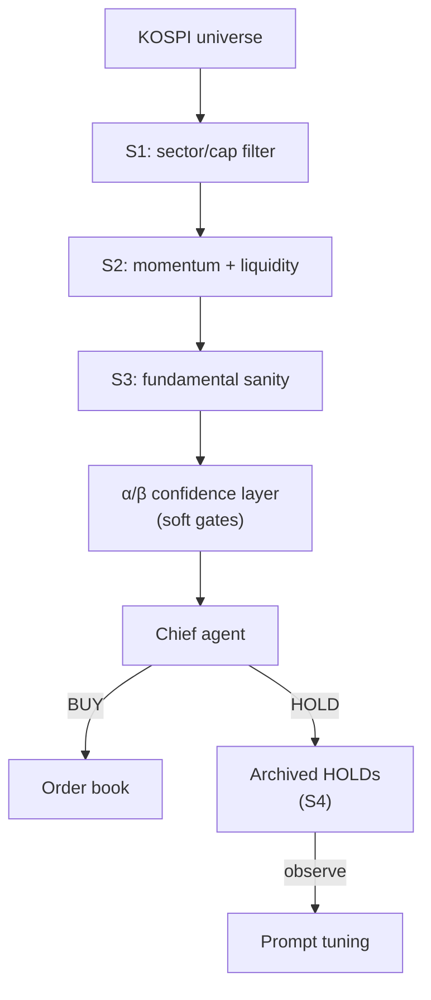

## Overview

A two-commit session, but the decision behind it is the interesting part. Since #13 the research agent has been running live, and the pattern in the logs was clear: the scanner's universe is too small, the hard filters too conservative, and so the Chief agent rarely gets enough candidates to reach a BUY decision. This entry widens the scope (S1–S3) and adds a softer confidence layer (α/β), then switches HOLD decisions from *silently discarded* to **archived**, so the Chief's reasoning patterns can be audited and tuned (S4).

Previous post: [trading-agent Dev Log #13](/posts/2026-04-16-trading-agent-dev13/)

<!--more-->

## The Problem: An Empty Funnel

Reading a week of logs, the pattern was uncomfortable. The scanner was producing almost no BUY signals, and not because the market was uninteresting — it was because the hard filters at stages S1–S3 were rejecting so many tickers before the Chief agent ever saw them. The narrow universe plus conservative gates produced a degenerate funnel: research volume was adequate, but the funnel bottom was starved. The user's framing in the session captured it precisely: "리서치하는 종목의 scope이 너무 작습니다 … 실 구매로 이어지는 것이 매우 어렵습니다."

Two options existed. The first was to keep the hard gates and just widen the universe at S1. That would produce more candidates but most would get filtered out by S2/S3 anyway — the funnel shape doesn't change. The second, and what was adopted, was to **loosen the gates** while adding a **softer confidence layer (α/β) downstream**. Hard filters reject by rule; soft layers score. A score lets the Chief agent see marginal candidates instead of never being asked.

## Commit 1: Expand Universe + Loosen S1–S3 + α/β

Commit `6cb3ec8` is `feat(scanner): expand research universe and loosen gates (S1-S3 + α/β)`. Three moves in one commit:

1. **Universe expansion.** The KOSPI universe feeding S1 was too narrow — cap/sector filters were pruning tickers that could have been interesting once. The new universe is broader; the rest of the pipeline will decide relevance.
2. **Loosening S1–S3.** Hard-rule thresholds were relaxed where the log data showed they were binding too often. The design explicitly avoids removing these stages — S1–S3 are still the cheap filters that cut the search space — but the thresholds now let more tickers through to richer analysis.
3. **α/β confidence layer.** Downstream of S3, a new soft-scoring layer applies α/β weighting to momentum + fundamental signals, producing a confidence score that the Chief agent can read. This turns "pass/fail" into a ranked shortlist.

## Commit 2: Archive HOLDs (S4)

Commit `08e4326` is `feat(scanner): archive HOLD decisions instead of silently discarding (S4)`. Before this, a HOLD decision from the Chief evaporated — the ticker was not bought, nothing was recorded beyond a log line. That's a terrible shape for tuning, because HOLD is where the Chief does most of its thinking. Now HOLD decisions are persisted with the full context (inputs, scores, reasoning summary) and queryable via `?status=archived`.

The operational follow-up is observational: watch which tickers the Chief holds repeatedly (Samsung Electro-Mechanics, SK Hynix were the two mentioned in session as recurring "fundamental-strong + technically-overbought" rejections), and whether the same tickers flip to BUY once the Stochastic K drops below 60. The archived table is how that hypothesis gets tested — without it, the hypothesis has no substrate.

## Rollout Shape

The session plan separated P0 (observation, no code change) from P1 (Chief prompt tuning, 1–2 hours). This commit set is P0's prerequisite: archived data + α/β scores give P1 the data it needs. No prompt changes yet.

## Commit Log

| Message | Changes |
|---------|---------|
| feat(scanner): expand research universe and loosen gates (S1-S3 + α/β) | universe, gates, confidence |
| feat(scanner): archive HOLD decisions instead of silently discarding (S4) | HOLD persistence |

## Insights

The core insight in this session is older than LLM agents: **if a decision layer has no audit trail, it cannot be tuned.** The Chief agent's HOLDs contained exactly the reasoning most worth studying — *why is this candidate interesting enough to research but not strong enough to buy* — and by default that reasoning was being thrown away. Archiving it costs nothing (it's a boolean status flip plus a table) and turns every HOLD into a future unit of supervised tuning data. The α/β layer serves the same shape: replace a hard filter with a soft score, and you preserve information for downstream inspection. Next session's likely focus: actually looking at the archive data and deciding whether the Chief prompt needs to reweight fundamental vs technical signals, or whether the issue is further upstream in S2's momentum heuristic.
