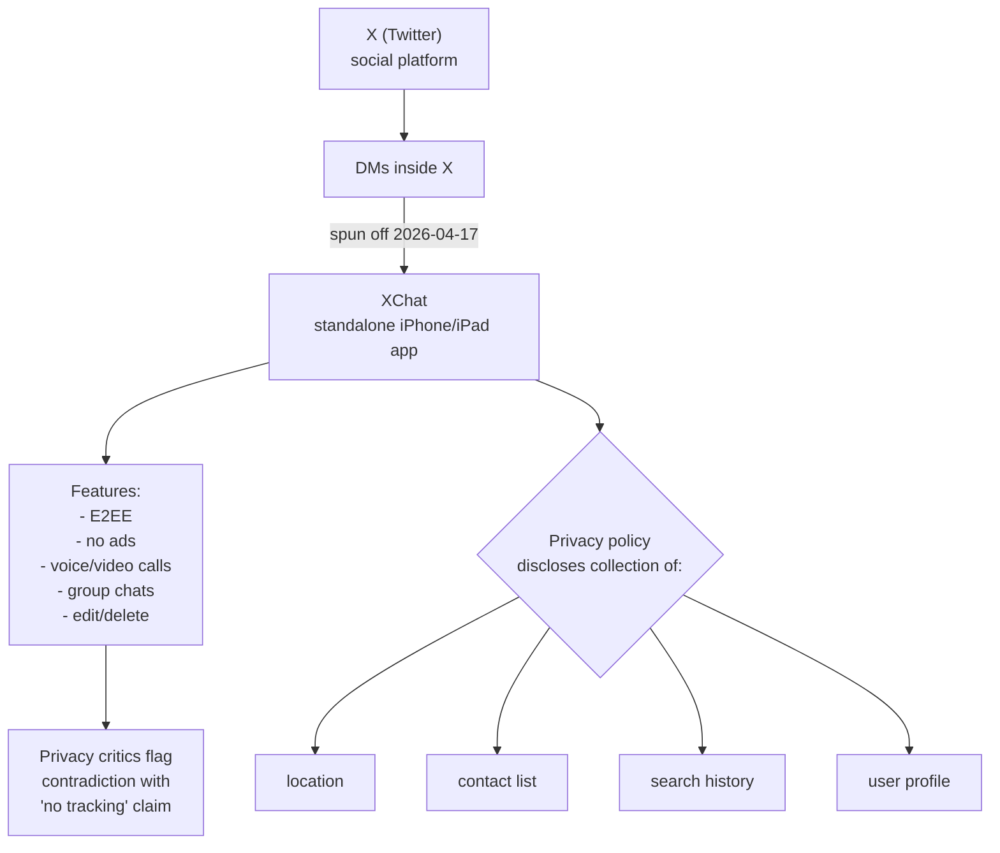

## Overview

On **April 17, 2026**, X (formerly Twitter) launched **XChat** — a standalone messenger app on iPhone and iPad. The pitch mirrors WhatsApp or Signal: **end-to-end encryption, no ads, no tracking.** It also ships with voice and video calls, group chats, document transfer, and edit/delete. But within days of the store listing going live, privacy experts flagged a contradiction between the marketing language and the app's actual data-collection disclosures.

<!--more-->

## What XChat Is

Per [design compass](https://designcompass.org/2026/04/13/x-independent-messenger-xchat-app-store-launch/) and [Clien News](https://www.clien.net/service/board/news/19176041), the launch shape:

- **Platform:** iOS (iPhone + iPad) first. App Store live 2026-04-17.
- **Price:** free. No ads disclosed.
- **Features:** end-to-end encryption, voice calls, video calls, document transfer, group chats, message edit and delete.
- **UI:** clean, conversation-centric — the app is designed to surface active chats prominently, not a contact list.

The product framing is about expansion beyond a social feed. *"X is showing intent to expand beyond being a social platform into being a communications infrastructure."* That positioning puts XChat directly against WhatsApp, Signal, Telegram, and — in Korea — KakaoTalk.

## The Privacy Contradiction

This is where things get uncomfortable. The app store listing discloses data collection including:

- **Location data**
- **Contact list**
- **Search history**
- **User profile information**

These are standard categories for a messenger app — WhatsApp also collects contacts, and that's how contact-based discovery works. The question isn't whether these categories are wrong, but whether the **"no tracking"** messaging is honest given that the data is collected, linked to identity, and presumably used for something beyond raw message delivery.

Design Compass captured the critique: *"Privacy protection is emphasized strongly, but the simultaneous broad user-data collection structure appears contradictory."*

This is a reasonable critique. End-to-end encryption protects the *message content*; it does nothing to protect the *metadata* — who you message, how often, when, from where. A messenger can be E2EE and still build a detailed social graph from metadata alone.

## The Musk–WhatsApp Context

A specific political dynamic makes this rollout extra-scrutinized. Elon Musk publicly criticized WhatsApp's privacy policy earlier this year; WhatsApp rebutted directly. XChat's launch is therefore immediately read as a Musk alternative to WhatsApp — and held to the same standards he used to criticize them.

Design Compass's framing: *"Simply adding encryption is not enough to earn trust; the actual scope of data collection and operating practices matter more."*

This is the right framing. The market for encrypted messengers is crowded (Signal, WhatsApp, Telegram with secret chats, iMessage). The differentiator in 2026 is trust — and trust is not produced by marketing copy; it's produced by the scope of what the app actually does. An app that collects location + contacts + search history + profile is difficult to sell as *less* invasive than WhatsApp regardless of the encryption story.

## What This Means for Competing Platforms

**WhatsApp:** defensive. XChat targets their exact value prop (E2EE messenger with calls and groups). The privacy critique cuts both ways — XChat emphasizes privacy, WhatsApp has better operational credibility, neither is beyond criticism.

**KakaoTalk:** indirect pressure. The Korean market is loyal to KakaoTalk, but a well-funded alternative with E2EE, no ads, and international reach could erode the power-user segment — the users already frustrated by KakaoTalk's ad placement inside chat rooms.

**Signal:** unchanged positioning. Signal's brand *is* privacy-by-construction; XChat is not a credible alternative for users who chose Signal on its own terms.

**Telegram:** slightly pressured. Telegram's non-E2EE-by-default choice has been a persistent criticism, and XChat's E2EE-first framing highlights that gap.

## The Emoji-and-Stickers Question

For the emoji and sticker ecosystem — relevant to the PopCon work — XChat is a new distribution surface. Major messengers are the distribution layer for animated emoji businesses:

- **WhatsApp:** stickers via third-party packs.
- **Telegram:** animated stickers as first-class content.
- **KakaoTalk:** a strong emoji economy with a $100M+/year store.
- **LINE:** Creators Market with global distribution.
- **XChat:** TBD. The store listing doesn't mention sticker support, but history suggests it'll land within 6–12 months of launch.

If XChat adds a sticker economy, it becomes a fifth distribution lane alongside the existing four. For tools that create LINE-format APNG sets, that's a net positive — the format travels.

## Insights

XChat is both a meaningful product launch and a familiar privacy standoff. The meaningful part is that X has the distribution to make a serious run at WhatsApp, the engineering to ship E2EE credibly, and the opinionated CEO to differentiate the brand. The familiar part is that **"privacy" as marketing copy is easy; privacy as architecture is hard**, and the gap between the two is exactly where every new messenger gets stuck. The question to watch over the next three months is whether XChat responds to the metadata-scope critique with real product changes — narrower data collection, clearer retention policies, published transparency reports — or whether it leans on brand and E2EE alone. Either outcome will teach something about what "privacy-first messenger" actually means in 2026.
