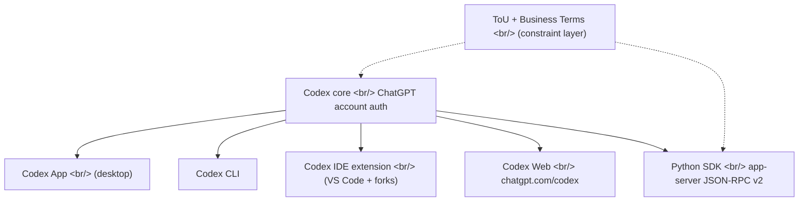
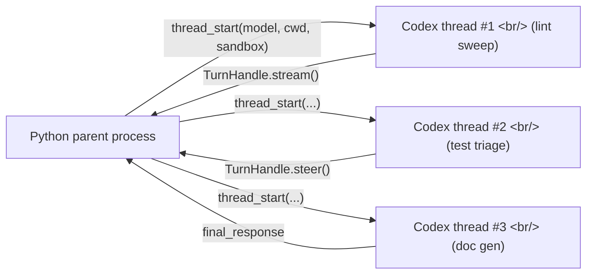

## Overview

OpenAI quietly updated the [official Codex help article](https://help.openai.com/en/articles/11369540-codex-in-chatgpt) to formally fold **Codex into ChatGPT plans**. The headline: Codex is included with ChatGPT Plus, Pro, Business, and Enterprise/Edu, plus a limited-time inclusion in Free and Go, and all other plans get 2x rate limits. At nearly the same moment, the [`openai/codex` repo](https://github.com/openai/codex) landed an experimental Python SDK under [`sdk/python`](https://github.com/openai/codex/tree/main/sdk/python) — a thin wrapper around `codex app-server` JSON-RPC v2. Read together, this is OpenAI realigning Codex from "a CLI tool" into a **unified coding agent with five surfaces (app, CLI, IDE extension, web, Python SDK) all authenticated through one ChatGPT account**.

<!--more-->



This post weaves three threads — **(1) Codex in ChatGPT as a product/GTM move**, **(2) what the Python SDK unlocks for headless automation and sub-agents**, **(3) what the terms of use and business terms allow vs leave ambiguous**. It ends with a recommendation matrix across [Claude Code](https://www.anthropic.com/claude-code), [Cursor](https://cursor.com/), Codex in ChatGPT, and [codex-r](https://github.com/thedalbee/codex-r).

## 1. Codex in ChatGPT — GTM realignment

The help article pins down the new shape:

- **Included plans**: ChatGPT Plus, Pro, Business, Enterprise/Edu
- **Limited-time inclusion**: Free and Go (with 2x rate limits on other plans)
- **Four clients + web**: [Codex app](https://developers.openai.com/codex/app), [Codex CLI](https://developers.openai.com/codex/cli), [Codex IDE extension](https://developers.openai.com/codex/ide), [Codex web](https://chatgpt.com/codex)
- **Auth**: ChatGPT account SSO everywhere; web also requires a GitHub connection
- **Terms**: the same [ChatGPT Terms of Use](https://openai.com/policies/terms-of-use/) + [Privacy Policy](https://openai.com/policies/privacy-policy/); business users fall under the [Online Services Agreement](https://openai.com/policies/services-agreement/)
- **Enterprise controls**: [RBAC](https://help.openai.com/en/articles/11750701-rbac), workspace App controls, and a unified [Compliance API](https://chatgpt.com/admin/api-reference#tag/Codex-Tasks) that logs CLI, IDE, web, and cloud usage together

### What this announcement actually means

GitHub Copilot lives in the IDE; [Cursor](https://cursor.com/) is an IDE-as-product; Anthropic's Claude Code recruits through the terminal and a VS Code extension. OpenAI is doing the inverse: **funnel its massive ChatGPT user base outward into IDEs and terminals**. A Plus subscriber already has a card on file — they install Codex CLI with no second billing relationship. The limited-time Free/Go inclusion accelerates that pipe.

Where this collides with competitors: the [Codex IDE extension](https://developers.openai.com/codex/ide) targets Cursor; the IDE extension + web (`chatgpt.com/codex`) target [GitHub Copilot](https://github.com/features/copilot); the [Codex CLI](https://developers.openai.com/codex/cli) targets Claude Code. The real moat isn't any single surface — it's that **billing and auth collapse to one ChatGPT account**.

For enterprise, the [Compliance API](https://chatgpt.com/admin/api-reference#tag/Codex-Tasks) is the underrated lever: CLI, IDE, web, and cloud Codex usage all funnel into one log surface. SOC/SOX flows get a single source of truth. Cursor exposes its own enterprise log; Claude Code logs to the [Anthropic Console](https://console.anthropic.com/). With Codex you only audit one place.

## 2. Python SDK — the door to headless automation just opened

The [`sdk/python`](https://github.com/openai/codex/tree/main/sdk/python) directory will publish as `openai-codex-app-server-sdk`. Core entry point is `codex_app_server.Codex`:

```python
from codex_app_server import Codex

with Codex() as codex:
    thread = codex.thread_start(model="gpt-5.4", config={"model_reasoning_effort": "high"})
    result = thread.run("Summarize Rust ownership in 2 bullets.")
    print(result.final_response)
```

### Shape

- **Transport**: the SDK spawns the `codex app-server` binary over stdio and talks **JSON-RPC v2**, then exposes Pydantic models on top.
- **Runtime packaging**: SDK builds pin an exact `openai-codex-cli-bin` runtime, shipped as platform wheels (macOS arm64/x86_64, musllinux aarch64/x86_64, win arm64/amd64).
- **API surface** — `Codex` / `AsyncCodex`, `thread_start` / `thread_resume` / `thread_fork` / `thread_archive`, `Thread.run(...)` / `Thread.turn(...)`, `TurnHandle.steer(...)` / `interrupt()` / `stream()`
- **Async parity**: `async with AsyncCodex()` mirrors the sync surface
- **Concurrency**: a single `Codex` instance can stream **multiple active turns concurrently, routed by turn ID**

### Why this matters

`thread.run("...")` is the one-shot convenience path. The interesting one is `thread.turn(...)`, which returns a `TurnHandle` exposing `steer()`, `interrupt()`, and `stream()`. **This is exactly the interface you need to build sub-agents and headless automations.**

- Sub-agent pattern: a parent Python process spawns child Codex threads via `thread_start(...)`, isolated by `cwd`, `sandbox`, `model`, and `approval_policy`. Each child can carry its own [MCP](https://modelcontextprotocol.io/) servers and plug-in scopes.
- Headless automation: CI jobs, scheduled crons, [GitHub Actions](https://docs.github.com/en/actions) workers can launch Codex to review PR diffs, dry-run migrations, or triage error logs and route results back into Python.
- Multi-turn thread management: `thread_resume(thread_id)` continues prior threads; `thread_fork(...)` branches from a shared context. The same evolutionary line as the external session import RPC analyzed in [the codex-r post](/posts/2026-05-07-codex-r-claude-code-bridge/).

Anthropic is moving the same direction with its [Agent SDK](https://docs.claude.com/en/api/agent-sdk-overview), but **OpenAI's pitch is "one ChatGPT account, one install, and you have headless agents"**. No separate API key, no separate billing, no separate rate-limit dashboard. Your ChatGPT plan is the automation quota.



## 3. Policy — what's allowed, what's gray

### Individual users ([Terms of Use](https://openai.com/policies/terms-of-use/), effective 2026-01-01)

Explicitly **prohibited**:

- "Automatically or programmatically extract data or Output." — Bulk scripted extraction is a violation.
- "Interfere with or disrupt our Services, including circumvent any rate limits or restrictions or bypass any protective measures or safety mitigations."
- "Use Output to develop models that compete with OpenAI."
- "Modify, copy, lease, sell or distribute any of our Services."

Explicitly **permitted**:

- "you ... (a) retain your ownership rights in Input and (b) own the Output. We hereby assign to you all our right, title, and interest, if any, in and to Output." — **You own Output.**
- "Our software may include open source software that is governed by its own licenses." — Codex SDK itself ships open source.

Gray area:

- **Sub-agents and scheduled automation**: ToU forbids "automatic extraction" but doesn't address scheduled coding tasks. The help page lists [Automations](https://developers.openai.com/codex/app/automations) as a first-class feature, so automation through OpenAI-provided surfaces is intended use. Driving Codex from external queues (Celery, Airflow) sits closer to the rate-limit-circumvention line — sustained heavy use risks being read that way.
- **Output redistribution**: you own your Output, but "Similarity of content" is explicit: other users' similar outputs aren't yours.

### Business users ([May 2025 Business Terms](https://openai.com/policies/may-2025-business-terms/))

Key differences:

- **§4.1**: Customer retains Input ownership and owns Output; OpenAI assigns its right, title, and interest.
- **§4.2**: "OpenAI will not use Customer Content to develop or improve the Services, unless Customer explicitly agrees to such use." — **No training by default for business users.** The help page reaffirms this.
- **§3.3 Restrictions**: (d) no Reverse Engineering, (e) no using Output to train competing models (except Permitted Exception), (f) no extraction outside Services-permitted paths, (g) no API-key resale, (h) no rate-limit circumvention.
- **§1.4 Affiliates**: affiliates may use the workspace; separate billing requires a separate Order Form.
- **§9.3 Feedback**: feedback can be used by OpenAI without restriction.

Business terms are dramatically more automation-friendly. **§2.2 explicitly grants the right to "integrate the Services into Customer Applications"** — embedding SDK-based headless agents in internal tooling is unambiguously allowed. But **§3.3(i) "violate or circumvent Usage Limits or otherwise configure the Services to avoid Usage Limits"** is a hard stop — round-robinning across multiple accounts to dodge a workspace quota is a violation.

### One-liner summary

- **Personal ChatGPT Plus + SDK automation** → fine within intended use. Bulk external data extraction / rate-limit circumvention / training competitors is forbidden.
- **Company workspace + Codex integrated into internal tools** → explicitly permitted by §2.2. No training on your content by default.
- **Redistributing Codex Output externally** → you own it, so yes; but no OpenAI branding misuse, no passing it off as human-written, no using it to train competing models.

## 4. Which workflow when

| Scenario | Recommended tool |
|---|---|
| Inline IDE completion + refactor + GitHub flow | [Cursor](https://cursor.com/) or [Codex IDE extension](https://developers.openai.com/codex/ide) |
| Terminal-centric agent flow, long multi-turn sessions | [Claude Code](https://www.anthropic.com/claude-code) or [Codex CLI](https://developers.openai.com/codex/cli) |
| Already on ChatGPT Plus/Pro, want single billing | Codex CLI + IDE — same ChatGPT account |
| Embedded in Anthropic ecosystem (Claude Code sessions) | Claude Code primary + [codex-r](https://github.com/thedalbee/codex-r) for migration |
| Python headless / CI / sub-agent orchestration | [Codex Python SDK](https://github.com/openai/codex/tree/main/sdk/python) or [Anthropic Agent SDK](https://docs.claude.com/en/api/agent-sdk-overview) |
| Enterprise compliance + unified usage logs | Codex (Compliance API + RBAC + workspace controls) |
| Free entry point | Codex Free/Go (limited time) or Claude Code free tier |

**Stacking tools is fine.** Cursor for inline edits, Codex CLI in a separate terminal for multi-file work, Codex SDK in a background cron reviewing PR diffs headlessly. **OpenAI's whole point in unifying four surfaces under one ChatGPT account is exactly this composition** — one bill, IDE + terminal + headless.

## Insight

The real story isn't a pricing-page change. It's that **OpenAI collapsed billing, auth, logs, and automation for coding agents into a single ChatGPT plane**. The "pay for CLI separately, IDE separately, web separately" era is over. Anthropic is consolidating the same way ([Claude.ai account = Claude Code account](https://www.anthropic.com/claude-code)), but OpenAI gets there first against a much larger installed base.

The Python SDK landing in the same week is not coincidental. The `thread_start` / `thread_fork` / `TurnHandle.steer` triad is structurally the same abstraction you find in the [Anthropic Agent SDK](https://docs.claude.com/en/api/agent-sdk-overview) and [LangChain's multi-agent patterns](https://python.langchain.com/docs/concepts/multi_agent/), but layered on ChatGPT auth. **"One ChatGPT plan, headless automation, sub-agent orchestration"** is a GTM weapon that routes around API-key issuance, separate billing, and separate rate-limit management.

On policy: business terms openly authorize automation, SDK use, and embedded tooling while defaulting to no-training. Individual ToU's "automatic extraction" clause creates ambiguity, but automation through OpenAI's own Automations / SDK / app-server surfaces is the intended path. **If you're embedding it in company tools, a workspace plan is the correct answer on every axis** — policy, logging, and rate limits.

The post-announcement axis of competition for coding agents shifts from **"which tool is smarter"** to **"which tool collapses my auth, billing, logs, and automation surfaces with the least friction"**. Codex's four-surface unification plus the Python SDK is OpenAI staking that ground first.

## References

**Official docs**
- [Using Codex with your ChatGPT plan](https://help.openai.com/en/articles/11369540-codex-in-chatgpt) — the help article folding Codex into ChatGPT plans
- [Codex developer portal](https://developers.openai.com/codex/) — clients and models
- [Codex Python SDK](https://github.com/openai/codex/tree/main/sdk/python) — the experimental `openai-codex-app-server-sdk`
- [Codex CLI](https://developers.openai.com/codex/cli) / [Codex App](https://developers.openai.com/codex/app) / [Codex IDE](https://developers.openai.com/codex/ide) / [Codex Web](https://chatgpt.com/codex)

**Policy pages**
- [OpenAI Terms of Use](https://openai.com/policies/terms-of-use/) — effective 2026-01-01, individual ChatGPT users
- [May 2025 Business Terms](https://openai.com/policies/may-2025-business-terms/) — API, Enterprise, Business
- [Usage Policies](https://openai.com/policies/usage-policies/) — prohibited-use catalog
- [Privacy Policy](https://openai.com/policies/privacy-policy/) — data handling

**Related blog posts**
- [CODEX-R analysis](/posts/2026-05-07-codex-r-claude-code-bridge/) — micro-skill that imports Claude Code sessions into Codex
- [OpenAI 2026-05-07 digest](/posts/2026-05-07-openai-2026-05-07-announcement-digest/) — five announcements landed the same week

**Competitors / related tools**
- [Anthropic Claude Code](https://www.anthropic.com/claude-code) + [Agent SDK](https://docs.claude.com/en/api/agent-sdk-overview)
- [Cursor](https://cursor.com/) — IDE-as-product coding agent
- [GitHub Copilot](https://github.com/features/copilot) — inline IDE assistant
- [Model Context Protocol](https://modelcontextprotocol.io/) — agent standard layer
