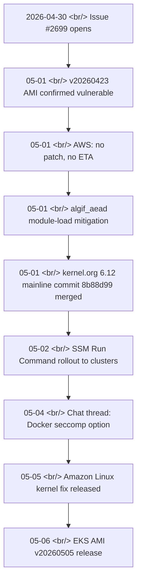

## Overview

On 2026-04-30, [awslabs/amazon-eks-ami issue #2699](https://github.com/awslabs/amazon-eks-ami/issues/2699) opened with a simple title — "🚨 Patch for: CVE-2026-31431." AWS support's answer was "no patch yet, no ETA," and meanwhile [a container-escape PoC went public](https://github.com/Percivalll/Copy-Fail-CVE-2026-31431-Kubernetes-PoC). It took six days for [EKS AMI v20260505](https://github.com/awslabs/amazon-eks-ami/releases/tag/v20260505) to ship — and during those six days, **the community's mitigation moved faster than the official patch.**

<!--more-->



## CVE-2026-31431 — Copy-Fail in a Nutshell

The vulnerability lives in the Linux kernel's [algif_aead](https://www.kernel.org/doc/html/latest/crypto/userspace-if.html) — the AEAD interface of the AF_ALG socket family. The community calls it "Copy-Fail." Three things matter.

- **Locally authenticated users** can trigger it. No remote unauthenticated path.
- **Container escape is feasible** in container workloads — direct impact on multi-tenant K8s clusters, CI runners, and sandbox environments.
- Public PoC: [Percivalll/Copy-Fail-CVE-2026-31431-Kubernetes-PoC](https://github.com/Percivalll/Copy-Fail-CVE-2026-31431-Kubernetes-PoC)
- GitHub advisory: [GHSA-2274-3hgr-wxv6](https://github.com/advisories/GHSA-2274-3hgr-wxv6)

"Local" is the weakest assumption you have in K8s. It means an unprivileged process inside an apparently fine container can reach into the host kernel.

## Timeline — Issue #2699

| Date | Event |
|---|---|
| 2026-04-30 | Issue #2699 opens. Title: "🚨 Patch for: CVE-2026-31431" |
| 05-01 | Community check: even the latest v20260423 AMI (kernel 6.12.79-101.147.amzn2023) is **still vulnerable** |
| 05-01 | AWS support reply: **"no patch, no ETA available"** |
| 05-01 | AWS official mitigation guide — block loading of the `algif_aead` module |
| 05-01 | The 6.12 mainline kernel had merged [commit 8b88d99](https://git.kernel.org/pub/scm/linux/kernel/git/stable/linux.git/commit/?id=8b88d99341f139e23bdeb1027a2a3ae10d341d82) about 10 hours earlier |
| 05-02 | A user rolls out the mitigation cluster-wide via [AWS SSM Run Command](https://docs.aws.amazon.com/systems-manager/latest/userguide/execute-remote-commands.html) |
| 05-04 | Community discussion: "for Docker users, you can also block this in seccomp" — proposes an additional mitigation surface |
| 05-05 | Amazon Linux kernel fix — see the [ALAS-2026 page](https://alas.aws.amazon.com/AL2023/) |
| 05-06 | **[EKS AMI v20260505 release](https://github.com/awslabs/amazon-eks-ami/releases/tag/v20260505)** — kernel 6.12.80-106.156 / 6.1.168-203.330. Issue scheduled to be locked. |

## AWS's Pre-Patch Mitigation

The idea is simple — block the vulnerable kernel module from loading at all.

```bash
echo "install algif_aead /bin/false" > /etc/modprobe.d/disable-algif.conf
rmmod algif_aead 2>/dev/null || true
```

`install algif_aead /bin/false` tells modprobe to run `/bin/false` instead of loading the module — meaning it never loads. `rmmod` removes the module if it is already loaded.

## Cluster-Wide Rollout — SSM Run Command

A pattern shared in the issue comments.

```bash
aws ssm send-command \
  --region eu-west-3 \
  --document-name "AWS-RunShellScript" \
  --targets "Key=tag:eks:cluster-name,Values={{CLUSTER_NAME}}" \
  --parameters 'commands=[
    "echo \"install algif_aead /bin/false\" > /etc/modprobe.d/disable-algif.conf",
    "rmmod algif_aead 2>/dev/null || true",
    "lsmod | grep algif && echo STILL_LOADED || echo MITIGATED"
  ]' \
  --comment "CVE-2026-31431 mitigation"
```

The last line is a verification check — if `lsmod | grep algif` is empty, the module is gone. Even with dozens of nodes per cluster, this is one command.

## Bake into Managed Node Group / Karpenter UserData

One user's playbook: bake the mitigation into the [Karpenter](https://karpenter.sh/) NodePool UserData so **every newly provisioned node boots already protected.** Existing nodes get a one-shot SSM application, new nodes are auto-handled by UserData — low impact, low effort.

The standard rollout discipline applies: verify the PoC is blocked, confirm sidecar and DaemonSet compatibility, then stage the rollout.

## Bottlerocket Is a Separate Track

A commenter reported: "[Bottlerocket](https://bottlerocket.dev/) AMI clusters can't apply this mitigation. This probably belongs in the other repo." Bottlerocket has a read-only filesystem and a different module-loading policy, so it has to be tracked over at [bottlerocket-os](https://github.com/bottlerocket-os/bottlerocket).

## The AWS Communication Critique

The single thread that runs through the whole issue: **"AWS communicated poorly."**

- Other managed-K8s vendors sent advance warning emails. AWS sent nothing.
- A specific ETA — "AMI within X days of upstream patch" — would have helped operators plan.
- While the community was tracking the PoC and the mainline commit themselves, AWS support's answer was still "no ETA."

That tension is exactly why the issue was set to be locked once v20260505 shipped.

## Insights

The real signal in this issue isn't the patch — it's the **shape of the timeline**. About six days passed between the mainline kernel merge and the EKS AMI release, and during those six days the PoC was already public, meaning container escape was demonstrably reachable in multi-tenant K8s, CI runners, and sandbox setups. So what operators actually needed wasn't "a patch is coming," but **"how do we survive six days before the patch."** The answer fits in two lines — apply the `algif_aead` module block to every node immediately via SSM, and bake it into Karpenter and Managed Node Group UserData so new nodes come up already protected. AWS's "no ETA" reply is a separate problem; while other managed hosting providers were sending advance warning emails, AWS stayed silent, which means operations teams need to monitor **information sources beyond official channels — issue trackers, community chat rooms, kernel.org** — as a baseline practice. The fact that a 2026-05-04 chat thread was already debating "block it via Docker seccomp instead" is the proof: the community recognized the threat faster than the official announcement. The same pattern will repeat with the next CVE, and **repo subscriptions + community channels + the ALAS feed** should be the standard ops posture.

## References

**Issue and AMI release**
- [awslabs/amazon-eks-ami issue #2699](https://github.com/awslabs/amazon-eks-ami/issues/2699) — 🚨 Patch for: CVE-2026-31431
- [EKS AMI v20260505 release](https://github.com/awslabs/amazon-eks-ami/releases/tag/v20260505) — kernel 6.12.80-106.156 / 6.1.168-203.330 (published 2026-05-06)

**CVE / advisories**
- [GHSA-2274-3hgr-wxv6](https://github.com/advisories/GHSA-2274-3hgr-wxv6) — GitHub advisory
- [Linux kernel commit 8b88d99](https://git.kernel.org/pub/scm/linux/kernel/git/stable/linux.git/commit/?id=8b88d99341f139e23bdeb1027a2a3ae10d341d82) — mainline fix
- [Percivalll/Copy-Fail-CVE-2026-31431-Kubernetes-PoC](https://github.com/Percivalll/Copy-Fail-CVE-2026-31431-Kubernetes-PoC) — container-escape PoC
- [Linux algif_aead userspace API docs](https://www.kernel.org/doc/html/latest/crypto/userspace-if.html)
- [Amazon Linux Security Center (ALAS)](https://alas.aws.amazon.com/AL2023/)

**Mitigation references**
- [AWS SSM Run Command](https://docs.aws.amazon.com/systems-manager/latest/userguide/execute-remote-commands.html)
- [Karpenter](https://karpenter.sh/) — for UserData baking
- [Bottlerocket](https://bottlerocket.dev/) · [bottlerocket-os GitHub](https://github.com/bottlerocket-os/bottlerocket) — separate track
