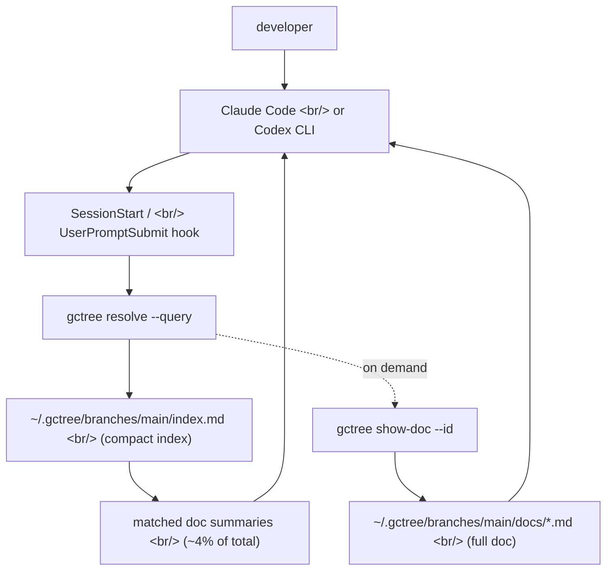

## Overview

[`@handsupmin/gc-tree`](https://www.npmjs.com/package/@handsupmin/gc-tree) is a [Node.js 20+](https://nodejs.org) CLI that stores **above-the-repo** global context for AI coding tools like [Claude Code](https://www.anthropic.com/claude-code) and the [OpenAI Codex CLI](https://github.com/openai/codex). The "gc" stands for **Global Context**, not garbage collection. The "tree" comes from managing context lanes like [Git branches](https://git-scm.com/book/en/v2/Git-Branching-Branches-in-a-Nutshell) — branch, switch, scope. If [CLAUDE.md](https://docs.claude.com/en/docs/claude-code/memory) and [AGENTS.md](https://agents.md/) work well inside one repo, [gc-tree](https://github.com/handsupmin/gc-tree) is built for the moment work crosses repo boundaries and you stop wanting to re-explain the same background every session.

<!--more-->



## 1. The problem

AI does not know you. It does not know your working style, your team's vocabulary, which repos belong together, or which routines you repeat without thinking. So every session repeats the same dance — reintroduce yourself, re-explain the domain language, paste the architecture doc in again.

[CLAUDE.md](https://docs.claude.com/en/docs/claude-code/memory) and [AGENTS.md](https://agents.md/) are great — for one repo. The pain starts the moment work crosses repos. In a non-[monorepo](https://monorepo.tools/) setup where backend, frontend, and platform live separately, where does the shared background go? Copy it into both? gc-tree exists to delete that repetition.

## 2. The model — like Git branches

The mental model is simple. If a Git branch is a **code lane**, a gc-branch is a **context lane**.

```bash
gctree checkout -b project-b
gctree onboard
```

That creates an independent context for `project-b`. Switching workstreams becomes `gctree checkout main` — the corresponding context activates wholesale. Because it borrows the [Git branching](https://git-scm.com/book/en/v2/Git-Branching-Basic-Branching-and-Merging) mental model verbatim, there is almost nothing new to learn.

Storage is just as direct:

```
~/.gctree/
  branches/
    main/
      index.md          ← compact index, loaded first
      docs/
        auth.md         ← full doc, read only when needed
        architecture.md
    project-b/
      index.md
      docs/
        ...
  branch-repo-map.json  ← which repos belong to which gc-branch
  settings.json
```

It lives outside your repos, so no [`.gitignore`](https://git-scm.com/docs/gitignore) rules, no accidental commits, and every project using the same gc-branch shares the same context.

## 3. Progressive disclosure — only ~4% of the token window

The core performance claim is that [`gctree resolve`](https://github.com/handsupmin/gc-tree/blob/main/docs/usage.md) operates as **progressive disclosure**:

- `gctree resolve --query "..."` → compact matches with stable IDs
- `gctree related --id <match-id>` → supporting docs around one match
- `gctree show-doc --id <match-id>` → full markdown for that doc

```bash
gctree resolve --query "auth token rotation policy"
```

```
[gc-tree] 1 matching doc  gc-branch="main"  repo="my-repo"
[Auth & Session Conventions] JWT rotation on every request, refresh tokens in httpOnly cookies, 15-min access token TTL
[Auth & Session Conventions] show full doc: gctree show-doc --id "auth" --branch "main"
```

The headline number — **~4% of total context is injected per query.** The other 96% stays on disk, outside the token window. That maps directly to [Anthropic's long-context best practices](https://docs.claude.com/en/docs/build-with-claude/prompt-engineering/long-context-tips): only what's needed, only when it's needed.

A subtle but important detail: when there's no match, or the repo is excluded from scope, gc-tree returns an **explicit status** instead of failing ambiguously. The AI tool can tell "no context exists" apart from "context exists but didn't match" — which prevents bad guesses.

## 4. Hook integration — SessionStart / UserPromptSubmit

[`gctree init`](https://github.com/handsupmin/gc-tree) does more than scaffold files. The real value is wiring gc-tree into Claude Code's [SessionStart hook](https://docs.claude.com/en/docs/claude-code/hooks) and [UserPromptSubmit hook](https://docs.claude.com/en/docs/claude-code/hooks) so the **check happens automatically before work starts**.

- SessionStart → verify the active gc-branch on session boot
- UserPromptSubmit → run `resolve --query` against the prompt and surface matches
- empty / no-match results cached for the session — no repeated disk reads
- matched summaries are injected directly, so the AI sees **actual patterns and commands**, not just titles

The Codex side mirrors this. `$gc-resolve-context`, `$gc-onboard`, `$gc-update-global-context` install as Codex skills and work the same way under `codex exec`.

```bash
gctree scaffold --host claude-code   # CLAUDE.md snippet + /gc-onboard et al
gctree scaffold --host codex         # AGENTS.md snippet + $gc-onboard et al
gctree scaffold --host both          # both at once
```

The key part — both providers share **the same backing store** (`~/.gctree`). Onboard once, use from either tool.

## 5. Validated performance — DEV/HOLDOUT split

Most OSS dev tools just say "it works." gc-tree publishes a quantified evaluation against [tests/eval/RUBRIC.md](https://github.com/handsupmin/gc-tree/blob/main/tests/eval/RUBRIC.md):

| Metric | DEV | HOLDOUT |
|---|---|---|
| recall@1 | **100.0%** | **85.7%** |
| recall@3 | **100.0%** | **92.9%** |
| MRR | **100.0%** | **89.3%** |
| Negative precision (irrelevant → empty) | **100.0%** | **100.0%** |
| Tokens injected per query vs. total | **~7%** | **~13%** |

What makes this table interesting is that **the HOLDOUT fixture is isolated from the tuning loop**. The autoresearch loop only fits to DEV; HOLDOUT exists solely for honest reporting. Generalization gap = 10.0 pts. 38 labeled cases across 8 categories (exact-keyword, paraphrase, glossary, mixed-language, same-domain distractor, same-domain negative, cross-branch negative). Reporting [recall@k](https://en.wikipedia.org/wiki/Evaluation_measures_(information_retrieval)) alongside [MRR](https://en.wikipedia.org/wiki/Mean_reciprocal_rank) is the standard playbook for information retrieval evaluation.

Reproducible via `npm run eval:ranked`. **This level of evaluation discipline is rare for a solo OSS dev tool.**

## 6. Compared to CLAUDE.md / AGENTS.md

| | CLAUDE.md / AGENTS.md | gc-tree |
|---|---|---|
| Scope | One repo | Multiple repos, one context |
| Persistence | Per-repo file | Outside repos, reused across sessions |
| Switching contexts | Manual file edits | `gctree checkout project-b` |
| Relevance filtering | Everything or nothing | Only injects matching docs (~4%) |
| Onboarding | Hand-written | Guided by your AI tool |
| Works with Codex | yes | yes |
| Works with Claude Code | yes | yes |

The most interesting row is **relevance filtering**. CLAUDE.md is fundamentally an **all-or-nothing** file — it enters the session or it doesn't. gc-tree does **query-driven partial injection**. As context grows, that difference compounds.

## 7. Common moves

**Repo scoping:**

```bash
gctree set-repo-scope --branch project-b --include   # include current repo
gctree set-repo-scope --branch project-b --exclude   # exclude current repo
```

Why this matters — if you touch both `monorepo-a` and `legacy-b` on the same machine, leaking `project-b` context into `legacy-b` makes the AI follow wrong conventions. `set-repo-scope` makes that boundary explicit.

**Context updates:**

```bash
gctree update-global-context   # aliases: gctree update-gc / gctree ugc
```

The AI tool asks "what changed?" and writes the answer back to the gc-branch. The hand-editing workflow on CLAUDE.md becomes a guided update.

**Updating gc-tree itself:**

```bash
gctree update
```

Pulls the latest from [npm](https://www.npmjs.com/), then re-scaffolds every previously installed provider. You don't have to migrate hook code by hand when integration snippets change.

## 8. A small tool filling a specific gap

[madge](https://github.com/pahen/madge) visualizes JS module dependencies. [depcheck](https://github.com/depcheck/depcheck) finds unused ones. [git's reflog/gc](https://git-scm.com/docs/git-gc) prunes unreachable objects. The name might sound adjacent, but **gc-tree is a different kind of tool entirely**. It picks one specific friction point in the AI coding workflow — "I keep re-explaining the same context across repos" — and isolates the fix to one layer: **above the repo, above the session, above the tool**.

This is the kind of tool that only becomes possible because [Anthropic opened up SessionStart hooks and skills](https://docs.claude.com/en/docs/claude-code/hooks), and because the [OpenAI Codex CLI](https://github.com/openai/codex) offers the same shape of extension point. If CLAUDE.md is your vim's `.vimrc`, gc-tree does for context what [`stow`](https://www.gnu.org/software/stow/) or [`chezmoi`](https://www.chezmoi.io/) did for dotfiles — pull the durable parts out of the repo and version them somewhere reusable.

## Insights

What makes gc-tree worth watching is less the feature set and more **the shape of context infrastructure for AI coding tools**. Phase one was **in-repo markdown** (CLAUDE.md, AGENTS.md). Phase two is **above-the-repo global context** (gc-tree). Phase three is probably **team-shared context, versioned context, context merge/rebase** — taking [what Git did for code](https://git-scm.com/book/en/v2) and porting it to context. gc-tree's naming already points that direction. The other thing worth noting is the evaluation discipline. **DEV/HOLDOUT split**, recall@k + MRR + negative precision, fixtures covering mixed-script queries — solo OSS dev tools rarely operate at this rigor, and treating context retrieval as a real information-retrieval problem is the right framing. The most immediate thing to try: `npm install -g @handsupmin/gc-tree && gctree init`, drop a domain glossary into `gctree onboard`, and check whether the AI tool actually pulls it on the next session start. Cutting the first 3-5 minutes of repeat-explaining out of every session is enough ROI on its own.

## References

**Source**
- [handsupmin/gc-tree (GitHub)](https://github.com/handsupmin/gc-tree)
- [@handsupmin/gc-tree (npm)](https://www.npmjs.com/package/@handsupmin/gc-tree)

**Docs**
- [Concept](https://github.com/handsupmin/gc-tree/blob/main/docs/concept.md)
- [Principles](https://github.com/handsupmin/gc-tree/blob/main/docs/principles.md)
- [Usage](https://github.com/handsupmin/gc-tree/blob/main/docs/usage.md)
- [Evaluation rubric](https://github.com/handsupmin/gc-tree/blob/main/tests/eval/RUBRIC.md)

**Host AI tools**
- [Claude Code](https://www.anthropic.com/claude-code) — [memory / CLAUDE.md docs](https://docs.claude.com/en/docs/claude-code/memory), [hooks](https://docs.claude.com/en/docs/claude-code/hooks)
- [OpenAI Codex CLI](https://github.com/openai/codex)
- [AGENTS.md spec](https://agents.md/)

**Comparisons and background**
- [madge — JS module dependency visualization](https://github.com/pahen/madge)
- [depcheck](https://github.com/depcheck/depcheck)
- [git gc reference](https://git-scm.com/docs/git-gc)
- [chezmoi](https://www.chezmoi.io/) / [GNU Stow](https://www.gnu.org/software/stow/) — dotfile management analogy
