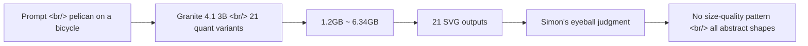

## Overview

[Simon Willison](https://simonwillison.net/) ran his signature prompt — *"Generate an SVG of a pelican riding a bicycle"* — through 21 quantized variants of [IBM Granite 4.1 3B](https://huggingface.co/ibm-granite/granite-4.1-3b-instruct), spanning 1.2GB to 6.34GB (51.3GB total). His verdict was one line: *"There's no distinguishable pattern relating quality to size — they're all pretty terrible!"*. This post takes that gallery as a starting point to ask what informal benchmarks catch that the leaderboards miss, and where to look first if you actually want to measure the quantization-vs-quality curve.

<!--more-->

## What's the SVG Pelican Thing

The [pelican-riding-a-bicycle series](https://simonwillison.net/tags/pelican-riding-a-bicycle/) is Simon's personal informal benchmark, run against every new LLM as it lands. The prompt is one line.

> "Generate an SVG of a pelican riding a bicycle."

SVG forces a text model to emit coordinates, paths, and a viewBox directly — visual reasoning, but expressed as tokens. More importantly, the result **renders into an image immediately**, so cross-model comparison is intuitive. Failure modes that don't surface in [LMArena](https://lmarena.ai/) anonymous pair-voting or [MMLU](https://paperswithcode.com/dataset/mmlu) multiple choice — proportion, line continuity, part placement — show up plainly in a single SVG.

## The Experiment

| Item | Detail |
|---|---|
| Target | [IBM Granite 4.1 3B Instruct](https://huggingface.co/ibm-granite/granite-4.1-3b-instruct) |
| Variants | 21 quantizations (1.2GB to 6.34GB, 51.3GB total) |
| Prompt | "Generate an SVG of a pelican riding a bicycle" |
| Output | 21 SVGs laid out in one gallery page |
| Judge | Simon Willison's eyes |

The [original gallery post](https://simonwillison.net/2026/May/4/granite-41-3b-svg-pelican-gallery) lays all 21 out on one page.

## The Result — Simon's Take

> *"There's no distinguishable pattern relating quality to size — they're all pretty terrible!"*

- **No distinguishable pattern relating size to quality.** 1.2GB and 6.34GB land effectively on the same line.
- All 21 are abstract collections of shapes — neither pelican nor bicycle is clearly identifiable.
- Curiously, **the smallest model produced the most recognizable bicycle**, and the largest produced the closest thing to a pelican — a hint that size-quality may not even be monotonic here.
- Simon wraps with: less interesting than expected; he'll retry on a model that can actually draw.

## What Got Measured (and What Didn't)

### 1. The quantization curve is bounded by the base model's capability ceiling

A 5x memory range (1.2GB to 6.34GB) and no meaningful difference in output quality. But the takeaway is **not** "quantization is harmless." The cleaner reading is: **this base model is just weak at SVG pelicans**.

To measure quantization impact cleanly, the base needs to be strong enough on the task. If the base sits near the floor, no scheme — [AutoRound](https://github.com/intel/auto-round), GGUF, AWQ, anything — will produce visible separation. **Verify the capability ceiling before designing the quant benchmark.**

### 2. Informal benchmarks complement the standard leaderboards

[LMArena](https://lmarena.ai/) pair-voting and [MMLU](https://paperswithcode.com/dataset/mmlu) measure token-level correctness or preference on text. Questions like "can this model lay out parts in 2D space" don't surface there. The SVG pelican fills exactly that gap — **not on any official leaderboard, but a sanity check everyone agrees on**.

### 3. What this implies for the Granite family

[IBM Granite](https://www.ibm.com/granite) and the [watsonx Granite lineup](https://www.ibm.com/products/watsonx-ai/foundation-models) are positioned for enterprise RAG, tool calling, and coding. On that map, an SVG pelican is an out-of-distribution task — being weak there is almost expected. But placed next to mobile-first small-model lines like Google's Gemma + LiteRT releases, it underlines the bigger pattern: **at the 3B class, practical usefulness depends heavily on which family put its capability where**. Same parameter count, very different shapes of competence.

## Insights

Informal benchmarks survive because they show, in a single image, the kind of failure a leaderboard score can't render. The SVG pelican complements [MMLU](https://paperswithcode.com/dataset/mmlu) and [LMArena](https://lmarena.ai/); it doesn't replace them — you need both to see a model's strengths and weaknesses together. Quantization-vs-quality curves are bounded by the base model's capability on the task, so before designing a quant benchmark, confirm the base sits well above the floor; otherwise [AutoRound](https://github.com/intel/auto-round) and friends just compress noise into smaller noise. The detail that the smallest variant drew the best bicycle is what's actually interesting — it questions the monotonic assumption itself, suggesting quant comparisons should be read as distributions, not point scores. [IBM Granite](https://www.ibm.com/granite) being weak at out-of-distribution visual reasoning is consistent with its enterprise targeting, which is why picking a 3B small open model is really a question of "which family put its capability where." External observers like Simon laying 21 variants on one page is doing a real service — it's a fast, shareable model card before any official benchmark numbers drop.

## References

**Original gallery post**
- [Simon Willison: Granite 4.1 3B SVG Pelican Gallery (2026-05-04)](https://simonwillison.net/2026/May/4/granite-41-3b-svg-pelican-gallery)
- [pelican-riding-a-bicycle series tag](https://simonwillison.net/tags/pelican-riding-a-bicycle/)
- [Simon Willison's Weblog](https://simonwillison.net/)

**IBM Granite**
- [IBM Granite 4.1 3B Instruct (Hugging Face)](https://huggingface.co/ibm-granite/granite-4.1-3b-instruct)
- [IBM Granite official page](https://www.ibm.com/granite)
- [watsonx foundation model lineup](https://www.ibm.com/products/watsonx-ai/foundation-models)

**Related benchmark refs**
- [LMArena (pairwise leaderboard)](https://lmarena.ai/)
- [MMLU (Papers with Code)](https://paperswithcode.com/dataset/mmlu)
- [Intel AutoRound (quantization library)](https://github.com/intel/auto-round)
