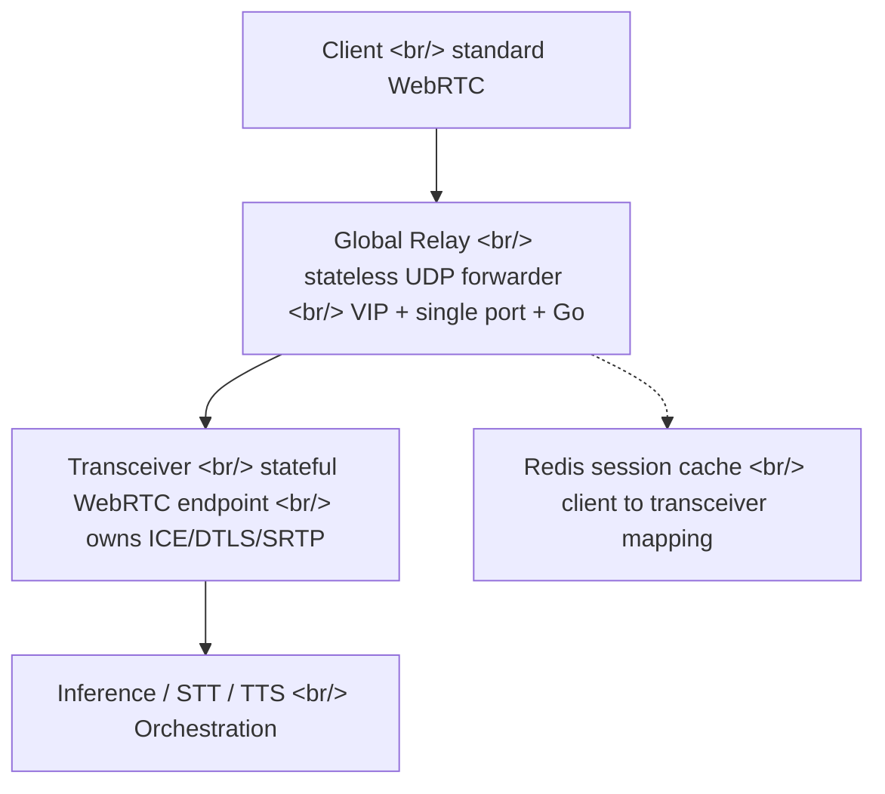
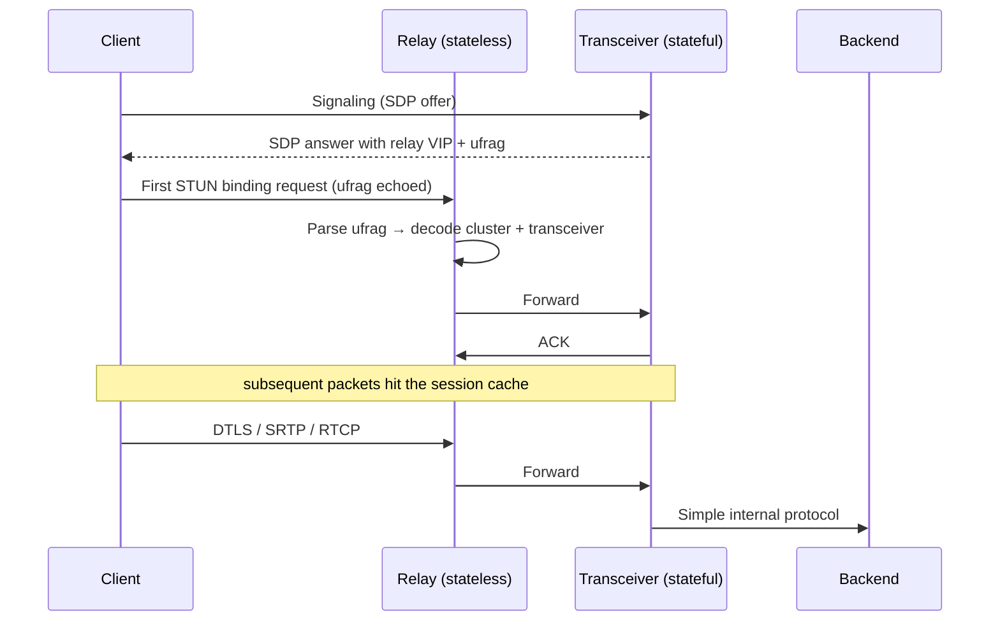

## Overview

OpenAI Engineering published [Delivering Low-Latency Voice AI at Scale](https://openai.com/index/delivering-low-latency-voice-ai-at-scale/), the network infrastructure write-up behind their Realtime voice models. The core idea: split [WebRTC](https://webrtc.org/) traffic into a stateless **Global Relay** and a stateful **Transceiver**, then encode routing metadata into the [ICE](https://webrtc.org/getting-started/peer-connections) ufrag so there is zero hot-path lookup. Read alongside the related MRC and Realtime API announcements, the contour of OpenAI's full infrastructure stack snaps into focus.

<!--more-->

## Why WebRTC

[WebRTC](https://webrtc.org/) is the cross-vendor standard for low-latency audio, video, and data between browsers, mobile clients, and servers. It bundles together the painful parts — NAT traversal via ICE, encryption via DTLS and SRTP, codec negotiation, RTCP quality control, echo cancellation, jitter buffers — all indexed under [webrtc.org standards](https://webrtc.org/getting-started/overview).

What matters for voice AI: **audio arrives as a continuous stream**. While the user is still speaking, the model can already begin transcribing, reasoning, calling tools, and synthesizing speech. That is what turns push-to-talk into actual conversation.

There is a talent signal hiding in this work too. [Justin Uberti](https://en.wikipedia.org/wiki/Justin_Uberti) (one of the original WebRTC standard authors), Pion maintainer [Sean DuBois](https://github.com/Sean-Der), and engineers who built voice infrastructure at Discord ([discord.com engineering](https://discord.com/category/engineering)) have all converged at OpenAI. This is not just hiring — it is acquihiring an entire infrastructure track, with [Pion WebRTC](https://github.com/pion/webrtc) (16k+ stars, pure Go) sitting at the center.

## Picking a Media Architecture — SFU vs Transceiver

For multi-party calls, classrooms, and meetings, you build an SFU (Selective Forwarding Unit). Each participant keeps a separate WebRTC connection and the AI is just another participant. That is why the Kubernetes WebRTC ecosystem — [LiveKit](https://docs.livekit.io/home/self-hosting/kubernetes/), [mediasoup](https://mediasoup.discourse.group/), [l7mp/stunner](https://github.com/l7mp/stunner) — assumes an SFU shape.

OpenAI's workload is overwhelmingly 1:1 — one user and one model, or one app and one agent. For that, a **transceiver model** is cleaner. The edge service terminates the client WebRTC session, converts media and events to a simpler internal protocol, and hands them off to the inference, STT, TTS, tool-use, and orchestration backends. **The backends scale like ordinary services** — they never have to pretend to be WebRTC peers.

## The Hard Problem — WebRTC Meets Kubernetes

Traditional WebRTC binds **one UDP port per session.** Tens of thousands of concurrent sessions mean tens of thousands of public UDP ports exposed. On Kubernetes, this falls apart.

- Cloud load balancers and k8s Services are not built to expose tens of thousands of UDP ports per service
- A wide UDP port range balloons the external attack surface and makes policy auditing painful
- Adding, removing, or rescheduling pods means reserving and advertising port ranges every time, which collides badly with autoscaling

The usual workaround is **a single UDP port per server** plus application-layer demuxing. But that opens a second problem. ICE and DTLS are stateful — the process that created a session has to keep receiving its packets. If a packet for an existing session lands on a different process, setup fails or media breaks.

That fixes the goal: **a small, fixed public UDP surface**, plus a way to make every packet land on the right owning transceiver.

## The Fix — Splitting Relay From Transceiver

- **The Relay** never decrypts media. It does not run an ICE state machine and never negotiates codecs. It reads packet metadata and forwards.
- **The Transceiver** handles WebRTC the normal way. It owns ICE, DTLS, SRTP, and session lifecycle.
- **From the client's perspective, nothing changes.** Standard WebRTC end to end. Browser and mobile compatibility intact.

## The Key Trick — Routing on the ICE ufrag

When the very first packet arrives, how does the relay know which transceiver owns the session? Doing an external lookup would bake latency into the hot path.

The answer: **encode a routing hint into the ICE username fragment (ufrag).**

- During signaling, the transceiver allocates session state and returns a server-side ufrag in the SDP answer alongside the shared relay VIP and UDP port
- The first media packet — a STUN binding request — echoes that ufrag
- The relay parses the ufrag from that first STUN packet, decodes the destination cluster and owning transceiver, and forwards
- Subsequent DTLS, RTP, and RTCP packets follow a session cache (no ufrag re-parsing)
- If the relay restarts, the next STUN packet rebuilds the session from its ufrag. As an extra safety net, the `<client IP+port, transceiver IP+port>` mapping is cached in Redis

**Encode routing metadata into a native field of the protocol you already speak.** That is the load-bearing design call. [Cloudflare Calls' anycast WebRTC architecture](https://blog.cloudflare.com/cloudflare-calls/) is a close cousin solving the same shape of problem at a different layer.

## Global Relay — Geo-Distributed Ingress

Once you have a small fixed UDP surface, you replicate it globally.

- [Cloudflare geo + proximity steering](https://developers.cloudflare.com/load-balancing/understand-basics/traffic-steering/steering-policies/proximity-steering/) sends signaling to the nearest transceiver cluster
- The SDP answer advertises the nearest Global Relay address back to the client
- Cluster routing lives inside the ufrag, so media also enters via the nearest relay

The first client→OpenAI hop gets shorter, which translates directly into lower latency, less jitter, and fewer loss bursts. In voice AI those numbers are felt by the user, not just measured.

## Relay Implementation — Go, No Kernel Bypass

OpenAI deliberately built the relay in **userspace Go** — no DPDK, no kernel-bypass frameworks. User traffic was small enough relative to the relay footprint that those tools were not worth the complexity.

The Go tricks that actually matter:

- **[`SO_REUSEPORT`](https://man7.org/linux/man-pages/man7/socket.7.html)** — multiple workers on the same machine bind the same UDP port. The kernel distributes packets across workers, killing the single-read-loop bottleneck.
- **[`runtime.LockOSThread`](https://pkg.go.dev/runtime#LockOSThread)** — UDP read goroutines pin to OS threads. Combined with SO_REUSEPORT, packets from the same flow stay on the same CPU core, lifting cache locality and dropping context switches.
- **Pre-allocated buffers and minimal copying** — sidesteps Go GC pressure.
- **Ephemeral state** — only a small in-memory map of client→transceiver bindings, with short timeouts.

## Outcomes

- WebRTC media on Kubernetes without exposing tens of thousands of UDP ports
- A small fixed UDP surface — smaller security exposure, simpler load balancing, no need to reserve large public port ranges
- The "SFU-less design" hypothesis is validated against OpenAI's real workload — 1:1, latency-sensitive, with no requirement for the inference service to act like a WebRTC peer

## Four Design Principles the Authors Call Out

1. **Preserve standard protocol semantics at the edge** — clients keep speaking standard WebRTC, browser and mobile compatibility intact
2. **Concentrate hard session state in one place** — the transceiver owns ICE, DTLS, SRTP, and lifecycle; the relay only forwards
3. **Route on information that is already in setup** — the ufrag becomes a first-packet routing hook with zero hot-path lookups
4. **Optimize the common case first; do not reach for kernel bypass** — narrow Go + SO_REUSEPORT + thread pinning + low-allocation parsing was already enough

## Insights

This post is a clean argument for where the real bottleneck in AI infrastructure lives — not in the model itself, but in **the path to the model.** Running production-grade WebRTC on Kubernetes is the problem every serious voice AI company has to solve, and OpenAI just published one valid answer. The Justin Uberti and Sean DuBois moves should be read past the hiring lens — they signal that a Pion-based Go stack is now the foundation of OpenAI's voice infrastructure, which shifts the center of gravity of the [whole Pion ecosystem](https://github.com/pion/webrtc) along with it. Stacked against the related [MRC](https://openai.com/index/mrc-supercomputer-networking) (GPU network) and [Realtime API](https://platform.openai.com/audio/realtime) (model interface) announcements, the picture is three layers being standardized at once: **MRC (GPU network) + Relay+Transceiver (user network) + Realtime API (model interface).** And the SFU vs transceiver fork is a useful reminder that voice infrastructure design splits by workload shape — multi-party calls need SFUs, 1:1 inference does not. The deliberate refusal to use kernel bypass is a maturity signal too: the team optimized the common case and stopped, because anything past that would be cosplay.

## References

**Original post**

- [Delivering Low-Latency Voice AI at Scale (OpenAI Engineering)](https://openai.com/index/delivering-low-latency-voice-ai-at-scale/)
- Same-week OpenAI announcements: [MRC supercomputer networking](https://openai.com/index/mrc-supercomputer-networking) · [Advancing voice intelligence](https://openai.com/index/advancing-voice-intelligence-with-new-models-in-the-api) · [Stargate / Compute infrastructure](https://openai.com/index/building-the-compute-infrastructure-for-the-intelligence-age/)

**WebRTC ecosystem and Pion**

- [WebRTC standards (webrtc.org)](https://webrtc.org/) · [Getting started overview](https://webrtc.org/getting-started/overview)
- [Pion WebRTC (pure Go implementation)](https://github.com/pion/webrtc) — 16k+ stars
- [Justin Uberti](https://en.wikipedia.org/wiki/Justin_Uberti) (WebRTC origins) · [Sean DuBois (Pion maintainer)](https://github.com/Sean-Der)
- [Discord engineering blog](https://discord.com/category/engineering) — voice infrastructure references
- [Cloudflare Calls — anycast WebRTC](https://blog.cloudflare.com/cloudflare-calls/)
- [NVIDIA GB200](https://www.nvidia.com/en-us/data-center/gb200-nvl72/) · [Microsoft Fairwater](https://news.microsoft.com/source/features/ai/microsoft-fairwater-data-center/) · [Open Compute Project](https://www.opencompute.org/)

**Kubernetes WebRTC patterns**

- [l7mp/stunner — Kubernetes WebRTC gateway](https://github.com/l7mp/stunner)
- [LiveKit — Self-hosting on Kubernetes](https://docs.livekit.io/home/self-hosting/kubernetes/)
- [mediasoup discussion forum](https://mediasoup.discourse.group/)
- [Cloudflare proximity steering](https://developers.cloudflare.com/load-balancing/understand-basics/traffic-steering/steering-policies/proximity-steering/)

**Linux/Go optimization references**

- [Linux `socket(7)` — SO_REUSEPORT](https://man7.org/linux/man-pages/man7/socket.7.html)
- [Go `runtime.LockOSThread`](https://pkg.go.dev/runtime#LockOSThread)
