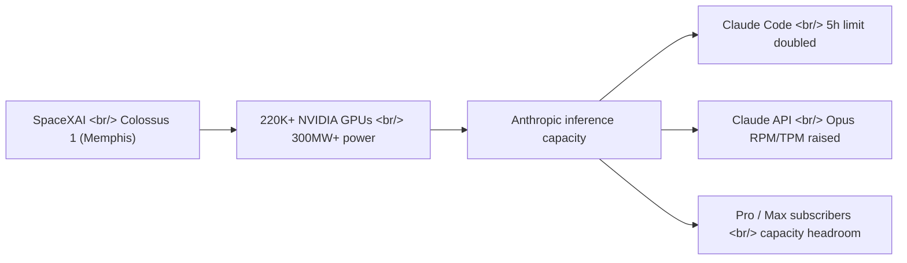
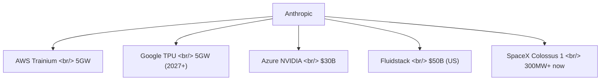
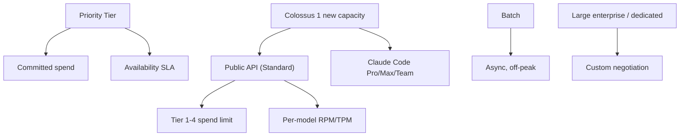

## Overview

On May 6, 2026, [Anthropic](https://www.anthropic.com/) packaged two announcements together: (1) higher usage limits across [Claude Code](https://claude.com/product/claude-code) and the [Claude API](https://claude.com/platform/api), and (2) a new compute partnership with [SpaceX](https://www.spacex.com/). The second causes the first. The headline reads "higher limits," but the real story is that **Anthropic has leased the entire [Colossus 1](https://en.wikipedia.org/wiki/Colossus_(supercomputer)) supercomputer — originally built by direct rival [xAI](https://x.ai/) — and is converting that capacity into raised user limits within a month.**

<!--more-->

## What Changed — Three Limit Bumps

The [announcement](https://www.anthropic.com/news/higher-limits-spacex) lists three changes, all **effective immediately**:

| Change | Detail |
|---|---|
| Claude Code 5-hour rate limit | **Doubled** for [Pro](https://claude.com/pricing), [Max](https://claude.com/pricing/max), [Team](https://claude.com/pricing/team), and seat-based [Enterprise](https://claude.com/pricing/enterprise) plans |
| Claude Code peak-hour throttle | **Removed** for Pro and Max accounts |
| Claude API rate limits | **Substantially raised for Opus models** — see the [API rate-limits docs](https://platform.claude.com/docs/en/api/rate-limits) |

Note that the API bump is scoped to [Opus](https://www.anthropic.com/claude/opus). Sonnet and Haiku are not called out. Opus is the most expensive line and the one used for frontier reasoning workloads — so **the freshly-arrived GPUs are being routed first to unlock the most expensive inference**, not to relax limits across the board.

## The New Compute — All of Colossus 1

The headline numbers:

- **300MW+** of new capacity
- **220,000+ NVIDIA GPUs** — mix of H100, H200, and next-gen GB200 accelerators
- **Online within the month**
- Location: [the former Electrolux factory in Memphis's Boxtown district](https://capacityglobal.com/news/anthropic-secures-full-capacity-of-spacex-data-centre/)

That cluster was originally [stood up in record time by xAI](https://en.wikipedia.org/wiki/Colossus_(supercomputer)) to train [Grok](https://x.ai/grok). The same-day [SpaceXAI counterpart announcement](https://x.ai/news/anthropic-compute-partnership) confirms the framing:

> "SpaceXAI has signed an agreement with Anthropic to provide access to Colossus 1... Anthropic plans to use this additional compute to directly improve capacity for Claude Pro and Claude Max subscribers."

In effect, [xAI is pivoting to Colossus 2](https://www.datacenterdynamics.com/en/news/anthropic-to-use-all-of-spacex-xais-colossus-1-data-center-compute/) and handing first-gen Colossus to a direct competitor. Elon Musk's [public comment](https://www.tomshardware.com/tech-industry/artificial-intelligence/musks-spacex-has-rented-out-access-to-its-supercomputers-220-000-nvidia-gpus-and-300-megawatts-of-ai-compute-power-to-rival-anthropic-musk-says-no-one-set-off-my-evil-detector-antrhropic-also-interested-in-orbital-data-centers): *"No one set off my evil detector."*

## Anthropic's Full Compute Portfolio

The SpaceX deal is the latest piece in a six-month run of megadeals.

| Partner | Scale | Timing | Source |
|---|---|---|---|
| Amazon ([Trainium](https://aws.amazon.com/ai/machine-learning/trainium/)) | up to **5GW**, ~1GW new by end of 2026 | In progress | [official](https://www.anthropic.com/news/anthropic-amazon-compute) |
| Google ([TPU](https://cloud.google.com/tpu)) + [Broadcom](https://www.broadcom.com/) | **5GW**, coming online 2027 | Future | [official](https://www.anthropic.com/news/google-broadcom-partnership-compute) |
| Microsoft + [NVIDIA](https://www.nvidia.com/) | **$30B** of Azure capacity | Strategic | [official](https://www.anthropic.com/news/microsoft-nvidia-anthropic-announce-strategic-partnerships) |
| [Fluidstack](https://www.fluidstack.io/) (US infra) | **$50B** Anthropic-funded | Multi-year | [official](https://www.anthropic.com/news/anthropic-invests-50-billion-in-american-ai-infrastructure) |
| SpaceX / xAI | **300MW+**, 220K GPUs | **Immediate (~1 month)** | [official](https://www.anthropic.com/news/higher-limits-spacex) |

The official post explicitly names three accelerator families — [AWS Trainium](https://aws.amazon.com/ai/machine-learning/trainium/), [Google TPU](https://cloud.google.com/tpu), and NVIDIA GPUs — for training and serving Claude. The implicit thesis is that **single-silicon lock-in is the biggest infrastructure risk**, and the SpaceX deal pads out the NVIDIA leg immediately.

## How Rate Limits Are Layered — Where the Bump Lands

It helps to remember Anthropic's API limit structure before reading the announcement. The [rate-limits docs](https://platform.claude.com/docs/en/api/rate-limits) split it into two:

1. **Spend limits** — monthly cap. Tier 1 ($100) → Tier 2 ($500) → Tier 3 ($1,000) → Tier 4 ($200,000) → Monthly Invoicing (no cap).
2. **Rate limits** — per-minute RPM / TPM, model-by-model.

On top, [Service Tiers](https://platform.claude.com/docs/en/api/service-tiers) layer a separate availability dimension:

- **Priority Tier** — committed spend buys SLA-grade availability and predictable pricing. Surfaced via headers like `anthropic-priority-input-tokens-limit`.
- **Standard** — default.
- **Batch** — async workloads that can run outside normal capacity.

What this announcement actually moved: **Standard Tier Opus RPM/TPM** and **Claude Code's 5-hour window**. Priority Tier itself is not called out as changed — Priority already had reserved capacity, so the freshly-landed GPUs appear to be allocated first to **lifting the Standard-tier ceiling that most subscribers actually hit**.

## Alongside — How Rivals Do This

Frontier LLM vendors using capacity announcements as marketing assets isn't new.

- [OpenAI × Microsoft](https://news.microsoft.com/source/2025/01/21/openai-microsoft-stargate-project/) — the [Stargate Project](https://openai.com/index/announcing-the-stargate-project/), joined by [Oracle](https://www.oracle.com/) and [SoftBank](https://www.softbank.jp/en/), pursuing tens of gigawatts.
- [OpenAI × AMD](https://openai.com/index/openai-and-amd-strategic-partnership/) — multi-year GPU supply with AMD share warrants.
- [OpenAI × Broadcom](https://openai.com/index/openai-and-broadcom-strategic-partnership/) — co-developing a custom AI accelerator.

The grammar is consistent across these: (a) gigawatt-scale numbers, (b) multi-year commitments, (c) explicit promises of improved end-user experience. Anthropic's announcement follows the same template with one twist — **renting a rival's existing frontier cluster wholesale instead of building net-new**.

## What This Is and Isn't

**It is:**
- Proof that a market exists for taking over a competitor's frontier supercomputer at month-scale notice. AI infrastructure is starting to trade like a vendor-neutral commodity.
- Speed news. 300MW typically takes 18-24 months to bring online from scratch; this lands in one.
- An explicit four-leg compute strategy: Trainium + TPU + NVIDIA + flexible leased capacity.

**It isn't:**
- A model upgrade. [Opus](https://www.anthropic.com/claude/opus), [Sonnet](https://www.anthropic.com/claude/sonnet), [Haiku](https://www.anthropic.com/claude/haiku) are untouched.
- A price change. [Pricing](https://claude.com/pricing) is the same.
- A new enterprise SKU. [Priority Tier](https://platform.claude.com/docs/en/api/service-tiers) terms aren't called out as changed.

## Orbital Compute — One More Line

The Anthropic post closes with a line about ["expressed interest in partnering with SpaceX to develop multiple gigawatts of orbital AI compute capacity."](https://www.anthropic.com/news/higher-limits-spacex) The [SpaceXAI side](https://x.ai/news/anthropic-compute-partnership) is more direct:

> "SpaceX is the only organization with the launch cadence, mass-to-orbit economics, and constellation operations experience to make orbital compute a near-term engineering program rather than a research concept."

Not a near-term deliverable. But it's the first time both sides have put orbital AI compute — sidestepping terrestrial power/cooling/siting limits via [Starlink](https://www.starlink.com/)-adjacent infrastructure — into a joint official document.

## Takeaways

One-line summary: **"To raise subscriber limits, Anthropic rented a rival's entire supercomputer."**

Three implications:

1. **AI capacity is starting to trade like a commodity.** A running, frontier-class cluster — GPUs, power, cooling, networking all already wired — can be taken over by a rival on month-scale terms. That's a market-maturity signal.
2. **Multi-silicon strategy is now table stakes.** Anthropic has four legs: Trainium, TPU, NVIDIA, and leased capacity. The redundancy reduces single-incident risk and provides routing flexibility — whichever leg comes online fastest gets translated directly into user-visible limit bumps.
3. **For end users, it's simple.** Pro / Max subscribers get more Claude Code uninterrupted: doubled 5-hour window, no peak-hours throttle, and bigger Opus API ceilings, all landing together.

Signals to watch next: (a) whether the Standard-tier RPM/TPM tables in the [docs](https://platform.claude.com/docs/en/api/rate-limits) actually update with new numbers, (b) whether [Priority Tier](https://platform.claude.com/docs/en/api/service-tiers) sees matching capacity bumps, (c) when "[orbital compute](https://x.ai/news/anthropic-compute-partnership)" turns from intent into a dated roadmap.

## References

**Primary announcements**
- [Anthropic: Higher usage limits for Claude and a compute deal with SpaceX](https://www.anthropic.com/news/higher-limits-spacex)
- [xAI/SpaceXAI: New Compute Partnership with Anthropic](https://x.ai/news/anthropic-compute-partnership)

**Anthropic compute megadeal series**
- [Anthropic × Amazon — up to 5GW](https://www.anthropic.com/news/anthropic-amazon-compute)
- [Anthropic × Google × Broadcom — 5GW](https://www.anthropic.com/news/google-broadcom-partnership-compute)
- [Anthropic × Microsoft × NVIDIA strategic partnerships](https://www.anthropic.com/news/microsoft-nvidia-anthropic-announce-strategic-partnerships)
- [Anthropic's $50B US AI infrastructure investment with Fluidstack](https://www.anthropic.com/news/anthropic-invests-50-billion-in-american-ai-infrastructure)
- [Covering data-center-driven electricity price increases](https://www.anthropic.com/news/covering-electricity-price-increases)

**Anthropic platform docs**
- [API Rate Limits](https://platform.claude.com/docs/en/api/rate-limits) · [Service Tiers (Priority/Standard/Batch)](https://platform.claude.com/docs/en/api/service-tiers)
- [Pricing](https://claude.com/pricing) · [Enterprise plan](https://claude.com/pricing/enterprise) · [Max plan](https://claude.com/pricing/max) · [Team plan](https://claude.com/pricing/team)
- [Claude Code](https://claude.com/product/claude-code) · [Claude Code Enterprise](https://claude.com/product/claude-code/enterprise)
- [Models: Opus](https://www.anthropic.com/claude/opus) · [Sonnet](https://www.anthropic.com/claude/sonnet) · [Haiku](https://www.anthropic.com/claude/haiku)

**Colossus 1 / Memphis background**
- [Tom's Hardware: SpaceX rents Colossus to rival Anthropic; Musk's "evil detector"](https://www.tomshardware.com/tech-industry/artificial-intelligence/musks-spacex-has-rented-out-access-to-its-supercomputers-220-000-nvidia-gpus-and-300-megawatts-of-ai-compute-power-to-rival-anthropic-musk-says-no-one-set-off-my-evil-detector-antrhropic-also-interested-in-orbital-data-centers)
- [DCD: Anthropic to use all of SpaceX-xAI's Colossus 1 capacity](https://www.datacenterdynamics.com/en/news/anthropic-to-use-all-of-spacex-xais-colossus-1-data-center-compute/)
- [Capacity: Anthropic secures full capacity of Memphis data centre](https://capacityglobal.com/news/anthropic-secures-full-capacity-of-spacex-data-centre/)
- [Wikipedia: Colossus (supercomputer)](https://en.wikipedia.org/wiki/Colossus_(supercomputer))

**Comparison — competitor megadeals**
- [OpenAI · Microsoft · Oracle · SoftBank — Stargate Project](https://openai.com/index/announcing-the-stargate-project/)
- [OpenAI × AMD strategic partnership](https://openai.com/index/openai-and-amd-strategic-partnership/)
- [OpenAI × Broadcom strategic partnership](https://openai.com/index/openai-and-broadcom-strategic-partnership/)
- [Microsoft press release: Stargate Project](https://news.microsoft.com/source/2025/01/21/openai-microsoft-stargate-project/)
