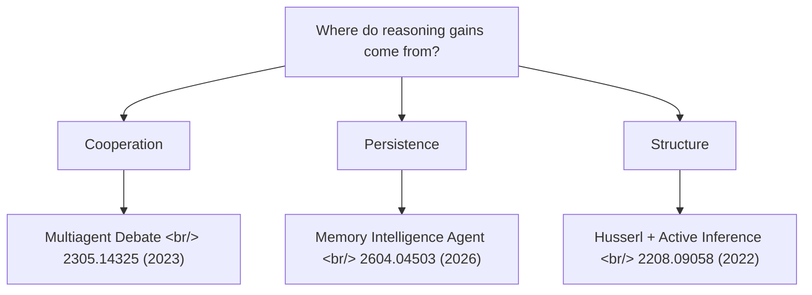
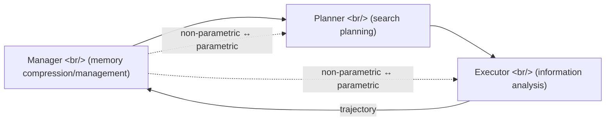

## Overview

Three [arxiv](https://arxiv.org/) papers landed within a few days of each other. Different eras, different topics, different methods — but read together they answer one question, **"where do further gains in AI agent reasoning come from?"**, from three angles: cooperation, persistence, and structure. Right at the moment when single-model reasoning gains are visibly plateauing, this is a useful tour of where the next round's keywords are coming from.

<!--more-->

| # | Paper | Year | One-line summary |
|---|---|---|---|
| 1 | [Multiagent Debate](https://arxiv.org/abs/2305.14325) | 2023 | Multiple LLM instances debating each other improve reasoning |
| 2 | [Memory Intelligence Agent (MIA)](https://arxiv.org/abs/2604.04503) | 2026 | Deep Research Agents need an evolving memory system |
| 3 | [Husserlian Phenomenology + Active Inference](https://arxiv.org/abs/2208.09058) | 2022 | The phenomenology of consciousness can be mapped to a computational model |

## 1. Multiagent Debate — 2305.14325

[Yilun Du](https://yilundu.github.io/), Shuang Li, [Antonio Torralba](https://groups.csail.mit.edu/vision/torralbalab/), [Joshua B. Tenenbaum](https://cocosci.mit.edu/josh), [Igor Mordatch](https://research.google/people/igor-mordatch/) — [MIT](https://www.mit.edu/) (2023-05). Accepted at [ICLR 2025](https://iclr.cc/Conferences/2025).

### The idea
Instead of asking one LLM to reason harder, **have several LLM instances propose answers and debate.** Across multiple rounds they converge on a shared answer. It is essentially [Marvin Minsky](https://en.wikipedia.org/wiki/Marvin_Minsky)'s [Society of Mind](https://en.wikipedia.org/wiki/Society_of_Mind) approach ported to LLMs.

### Contribution
- A multi-agent debate framework that improves mathematical and strategic reasoning
- Reduces hallucinations, improves factual validity
- Works on black-box LLMs as-is with the same prompt for every task — no fine-tuning required
- The first clean result that lifts reasoning by **inter-instance cooperation** rather than single-model scaling

### Why now
Although it is a May 2023 paper, the 2026 vantage point makes it more relevant. Single-model reasoning gains are visibly plateauing, and this dovetails with the **parallel tool call** push in [GPT-Realtime-2](https://openai.com/index/advancing-voice-intelligence-with-new-models-in-the-api). It is also the theoretical justification for why infrastructure tools like agent-skills are designed assuming **many agents running concurrently.**

## 2. Memory Intelligence Agent (MIA) — 2604.04503

Jingyang Qiao et al. (2026-04). A memory architecture paper aimed squarely at the [Deep Research Agent](https://openai.com/index/introducing-deep-research/) family.

### The idea
The weak link in Deep Research Agents — LLM reasoning combined with external tools — is memory. Conventional approaches (retrieving past trajectories) are inefficient, with storage and retrieval costs blowing up. MIA solves it with a **Manager-Planner-Executor** three-tier architecture, plus non-parametric memory and two parametric agents.

### Contribution
- Non-parametric memory storing **compressed search trajectories**
- **Alternating reinforcement learning** — Planner and Executor are reinforced in alternation, separating search-plan synthesis from information analysis
- **Test-time learning** — the Planner updates on-the-fly without pausing inference
- **Bidirectional conversion between parametric and non-parametric memory** for efficient memory evolution
- Strong results across eleven benchmarks

### Why now
This is the academic background for tools like [agentmemory](https://github.com/elder-plinius/agentmemory). The fact that agentmemory and this paper landed within days of each other reflects the industry consensus that **memory is the key differentiator for the next round of agents.** The Manager-Planner-Executor split looks like a strong candidate for a de facto standard pattern in future multi-agent frameworks. It should be read alongside the rise of standard tool interfaces like [MCP](https://modelcontextprotocol.io/).

## 3. Husserlian Phenomenology + Active Inference — 2208.09058

Mahault Albarracin, Riddhi J. Pitliya, [Maxwell J. D. Ramstead](https://maxwelljdramstead.com/), Jeffrey Yoshimi (2022-08). A mapping of [Karl Friston](https://www.fil.ion.ucl.ac.uk/~karl/)'s [active inference](https://en.wikipedia.org/wiki/Free_energy_principle) framework onto [Edmund Husserl](https://plato.stanford.edu/entries/husserl/)'s [phenomenology](https://plato.stanford.edu/entries/phenomenology/).

### The idea
**Phenomenology** is the rigorous descriptive study of conscious experience. The paper maps Husserl's descriptions of consciousness onto the mathematical building blocks of **active inference** — the neuroscience framework in which the brain predicts the world through a generative model.

### Contribution
- Connects Husserl's theory of time consciousness — retention/protention — to active inference
- A theoretical bridge between phenomenological description and computational neuroscience models
- Reinterprets the structure of consciousness as components of a **generative model**
- A push for **computational phenomenology** as an interdisciplinary field

### Why now
This is the most abstract of the three but possibly the most interesting. As AI agents acquire "memory" and "reasoning," **how an agent structures its experience** becomes a philosophical question again.

- MIA's evolving memory ≈ Husserl's retention/protention?
- Multiagent debate ≈ the self-reflective structure of consciousness?

The paper was shared as a direct PDF link (`/pdf/`), which suggests **somebody actually read the full text.** Probably one senior in the chat is making the bet that the next move for AI agents comes from cognitive science.

## Reading the three together

The three papers point in the same direction: **single-LLM limits → inter-instance cooperation + evolving memory + borrowed structure of consciousness.**

| Axis | Answer | Paper |
|---|---|---|
| Cooperation | Multi-instance debate | Multiagent Debate (2023) |
| Persistence | Compressed/evolving memory | MIA (2026) |
| Structure | Time consciousness → generative model | Husserl + Active Inference (2022) |

The chat's pick of the week accidentally forms a clean three-layer stack. Set alongside agentmemory + agent-skills (previous post), it shows that **research, tooling, and practice are converging in the same direction.**

## Insights

The three papers come from different years and different topics, but read together they point at the same consensus — the way past the single-LLM reasoning plateau is not one more size class of model, but **inter-instance cooperation, evolving memory, and explicit modeling of the structure of experience.** Multiagent Debate is the first clean answer to "how do we get instances to cooperate"; MIA answers "how do we accumulate that cooperation across time"; the Husserl + Active Inference mapping throws a longer-range coordinate for "what structure that accumulation should ultimately resemble." The fact that practical tools like [agentmemory](https://github.com/elder-plinius/agentmemory) and agent-skills surface alongside these three papers within days is itself a signal — **research, tooling, and practice are converging in the same direction.** The differentiator in the next round is much more likely to be cooperation topology, memory evolution policy, and experience-structure modeling than raw model size.

## References

**Papers**
- [Improving Factuality and Reasoning in Language Models through Multiagent Debate (2305.14325)](https://arxiv.org/abs/2305.14325) — Du, Li, Torralba, Tenenbaum, Mordatch ([MIT](https://www.mit.edu/), 2023)
- [Memory Intelligence Agent (2604.04503)](https://arxiv.org/abs/2604.04503) — Qiao et al. (2026)
- [Mapping Husserlian Phenomenology onto Active Inference (2208.09058)](https://arxiv.org/abs/2208.09058) — Albarracin, Pitliya, Ramstead, Yoshimi (2022)

**Related concepts**
- [Society of Mind](https://en.wikipedia.org/wiki/Society_of_Mind) — [Marvin Minsky](https://en.wikipedia.org/wiki/Marvin_Minsky)'s multi-agent theory of cognition
- [Deep Research Agent](https://openai.com/index/introducing-deep-research/) — OpenAI's tool-using agent system
- [Active Inference / Free Energy Principle](https://en.wikipedia.org/wiki/Free_energy_principle) — [Karl Friston](https://www.fil.ion.ucl.ac.uk/~karl/)
- [Husserlian phenomenology (SEP)](https://plato.stanford.edu/entries/husserl/) · [Phenomenology (SEP)](https://plato.stanford.edu/entries/phenomenology/)
- [Model Context Protocol (MCP)](https://modelcontextprotocol.io/) — emerging tool-interface standard
- [ICLR 2025](https://iclr.cc/Conferences/2025)

**Background reading**
- [arxiv.org](https://arxiv.org/) — preprint server
- [Yilun Du](https://yilundu.github.io/) · [Joshua Tenenbaum](https://cocosci.mit.edu/josh) · [Antonio Torralba](https://groups.csail.mit.edu/vision/torralbalab/) · [Igor Mordatch](https://research.google/people/igor-mordatch/)
- [Maxwell J. D. Ramstead](https://maxwelljdramstead.com/)
- [GPT-Realtime-2 (parallel tool calls)](https://openai.com/index/advancing-voice-intelligence-with-new-models-in-the-api)
