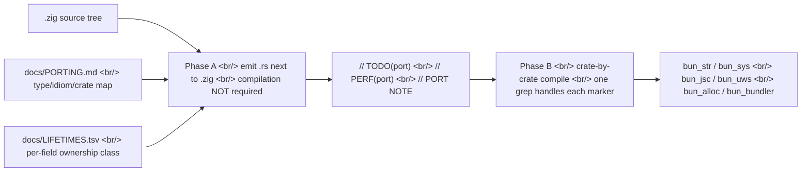

## Overview

The JavaScript runtime [Bun](https://bun.com) has a suspiciously named branch on its GitHub repo [oven-sh/bun](https://github.com/oven-sh/bun) called [`claude/phase-a-port`](https://github.com/oven-sh/bun/tree/claude/phase-a-port). Inside it lives [`docs/PORTING.md`](https://github.com/oven-sh/bun/blob/claude/phase-a-port/docs/PORTING.md), a 30KB+ guide that translates Bun's [Zig](https://ziglang.org/) codebase into [Rust](https://www.rust-lang.org/) one file at a time — a complete type map, idiom map, and crate map. The `claude/` prefix is the giveaway: this is almost certainly being driven by [Anthropic's Claude Code](https://www.anthropic.com/claude-code).

<!--more-->

## What Was Found

- [oven-sh/bun](https://github.com/oven-sh/bun) (89K+ stars, "Incredibly fast JavaScript runtime, bundler, test runner, and package manager – all in one") has a live [`claude/phase-a-port`](https://github.com/oven-sh/bun/tree/claude/phase-a-port) branch.
- It contains [`docs/PORTING.md`](https://github.com/oven-sh/bun/blob/claude/phase-a-port/docs/PORTING.md), a 1:1 Zig-to-Rust translation guide. Tens of thousands of lines, with complete type maps, idiom maps, and crate maps.
- Phase A's goal is precise: **"a draft `.rs` lands next to each `.zig`. Compilation is NOT required. Logic must be faithful."**
- Phase B is where everything is forced through the compiler, crate by crate.

## Why It Matters

Bun is the **largest infrastructure project ever built in [Zig](https://ziglang.org/)**: runtime, bundler, package manager all in one binary, with a single domain at [bun.com](https://bun.com). Zig still ships frequent 0.x breakage and is generally seen as not-yet-stable on ABI and language semantics. The biggest codebase on top of it deciding to port to Rust is itself an **industry signal**. Zig-to-Rust is not the usual direction.

And the branch name is the tell. No human team names a working branch `claude/phase-a-port`. That's the shape of "hand phase A to the [Claude Code](https://www.anthropic.com/claude-code) agent and watch."

## Inside the Guide

### Ground rules

- Each `.rs` lives in the same directory and has the same basename as its `.zig`.
- Cross-area types are referenced as `bun_<area>::Type` (Cargo.toml wireup happens in Phase B).
- **Forbidden**: tokio, rayon, hyper, async-trait, futures, `std::fs`/`net`/`process`. Bun has its own event loop and goes straight to syscalls.
- **Forbidden**: `async fn`. Everything is a callback plus state machine.
- `unsafe` is OK wherever Zig was unsafe. Every `unsafe` block needs `// SAFETY: <why>`.
- **If unsure, leave a `// TODO(port): <reason>`.** A flag beats a guess.
- Zig perf idioms (`appendAssumeCapacity`, arena bulk-free, comptime monomorphization) become plain Rust with a `// PERF(port): ...` comment, then Phase B greps and benches them.

### Crate map (excerpt)

| Zig namespace | Rust crate |
|---|---|
| `bun.String`, `bun.strings`, `ZigString` | `bun_str` |
| `bun.sys`, `bun.FD`, `Maybe(T)` | `bun_sys` |
| `bun.jsc`, `JSValue`, `JSGlobalObject` | `bun_jsc` |
| `bun.uws`, `us_socket_t`, `Loop` | `bun_uws_sys` / `bun_uws` |
| `bun.allocators`, `MimallocArena` | `bun_alloc` |
| `bun.shell` | `bun_shell` |
| `bun.bake` | `bun_bake` |
| `bun.install` | `bun_install` |
| `bun.bundle_v2`, `Transpiler` | `bun_bundler` |

`MimallocArena` is an arena allocator built on top of [mimalloc](https://github.com/microsoft/mimalloc); `bun.uws` is Bun's own event loop binding (uSockets). Critically, neither uses an async runtime like [tokio](https://tokio.rs/) — and the porting guide forbids one explicitly.

### Type map (excerpt)

| Zig | Rust |
|---|---|
| `[]const u8` (struct field) | **`Box<[u8]>` / `Vec<u8>` / `&'static [u8]` / arena raw ptr** — decide by reading `deinit` |
| `[:0]const u8` | `&ZStr` (length-carrying NUL-terminated) |
| `?T` | `Option<T>` |
| `anyerror!T` | `Result<T, bun_core::Error>` (always, in Phase A) |
| `comptime T: type` | `<T>` (generic + trait bound) |
| `comptime n: uN` | `<const N: uN>` |
| `inline for` over tuple | `const [T; N]` + `for` |
| `for (slice, 0..) \|x, i\|` | `for (i, x) in slice.iter().enumerate()` |
| `defer x.deinit()` | **delete** — handled implicitly by `impl Drop` |
| `errdefer alloc.free(x)` (just-built local) | **delete** — `?` drops it for you |
| `errdefer { side effects }` | [`scopeguard::guard(...)`](https://docs.rs/scopeguard/) and disarm on the success path |

### Notable micro-rules

- `bun_core::Error` is **`#[repr(transparent)] NonZeroU16`** — a heap-free Copy-able error newtype with a link-time-registered name table. `anyhow::Error` and `Box<dyn Error>` are banned because of heap allocation, lack of `Copy`, and broken `@errorName` snapshot compatibility.
- `bun.Wyhash11` is **kept distinct from `std.hash.Wyhash` (seed 0) for on-disk compatibility.** Lockfiles, npm manifest cache, and integrity all depend on it — the Rust port keeps the separate implementation.
- `defer pool.put(x)` becomes a Drop-guard pattern in Rust. **Manual defer is forbidden.**
- The `scopeguard::guard((), \|_\| ...)` "unit state" pattern is **forbidden** — it usually means a missing RAII type.
- `@errorName(e)` becomes an `IntoStaticStr` derive. **Never `Display` or `format!("{e:?}")`** — JS `error.code`, snapshot tests, and crash-handler traces depend on the exact string.
- `for (a, b) \|x, y\|` becomes `for (x, y) in a.iter().zip(b)` plus a **`debug_assert_eq!(a.len(), b.len())`**. Zig asserts; Rust's `zip` silently truncates.
- TLS code stays on [BoringSSL](https://boringssl.googlesource.com/boringssl/) via FFI — not rewritten as pure-Rust RustTLS.

## Phase A vs Phase B

- **Phase A** = one `.zig` → one `.rs`. Doesn't have to compile. Logic faithful, idiomatic Rust shape.
- **Phase B** = crate-by-crate compile pass. Sweep `// TODO(port)` and `// PERF(port)` markers in batch.

This split is the load-bearing piece. Try to do everything at once and the LLM's context collapses; carve it into one-zig-to-one-rs units and a single session can finish one. Compilation correctness is deferred entirely to Phase B.

## What This Means — agent-skills, In Production

The PORTING.md document itself is the interesting artifact.

1. **A guide written by humans for an LLM to follow.** Producing a 30KB+ map up front isn't "Claude, port this for me" — it's "**Claude, here's exactly what to translate to what**." It's the [agent-skills](https://www.anthropic.com/news/skills) idea applied in production.
2. **Type-by-type decisions are nailed down in advance.** Whether `[]const u8` (as a struct field) becomes `Box<[u8]>` or `&'static [u8]` is not left to the LLM's judgment — there's a meta-rule ("look at `deinit`") that forces the decision.
3. **A `docs/LIFETIMES.tsv` file** is referenced explicitly: per-field OWNED / SHARED / BORROW_PARAM / STATIC / JSC_BORROW / BACKREF / INTRUSIVE / FFI / ARENA / UNKNOWN classes pre-classified by hand. The LLM is told to copy that column verbatim. **The cross-file analysis is precomputed and handed to the model.**
4. **Three markers (`PORT NOTE`, `TODO(port)`, `PERF(port)`)** are the phase handoff. Whoever (or whichever future LLM session) picks up Phase B can `grep` once and have a queue of work.

## Insights

This is the first publicly visible attempt to migrate a major codebase between systems languages using LLM automation, and the interesting takeaway is that **the leverage is in the guide, not the model.** PORTING.md pre-decides type maps and idiom maps, LIFETIMES.tsv pre-decides ownership per field, and TODO/PERF/PORT NOTE markers pre-design the phase-to-phase handoff. The LLM is intentionally left no room to be creative — it just executes "this line becomes that line." Banning tokio, rayon, async-trait, and the rest of the canonical Rust async stack reflects the same instinct: Bun has its own event loop and FFI assets like [BoringSSL](https://boringssl.googlesource.com/boringssl/) that an LLM "Rust-ifying" would silently break. PORTING.md may end up the **textbook example** of an LLM-driven port. If massive codebase migrations become economically tractable as LLM spend, the deciding cost factor isn't going to be GPUs or model choice — it's going to be **how much guide you wrote before you pressed Run.**

## References

### Bun and the porting branch

- [Bun homepage](https://bun.com)
- [oven-sh/bun GitHub repo](https://github.com/oven-sh/bun)
- [`claude/phase-a-port` branch](https://github.com/oven-sh/bun/tree/claude/phase-a-port)
- [`docs/PORTING.md`](https://github.com/oven-sh/bun/blob/claude/phase-a-port/docs/PORTING.md)

### Languages and ecosystems

- [Zig language](https://ziglang.org/)
- [Rust language](https://www.rust-lang.org/)
- [Anthropic Claude Code](https://www.anthropic.com/claude-code)
- [Anthropic agent-skills announcement](https://www.anthropic.com/news/skills)

### Tooling / crates referenced

- [scopeguard crate](https://docs.rs/scopeguard/) — RAII guard standing in for `errdefer`
- [mimalloc](https://github.com/microsoft/mimalloc) — backing allocator for `MimallocArena`
- [BoringSSL](https://boringssl.googlesource.com/boringssl/) — TLS dependency kept on FFI
- [tokio](https://tokio.rs/) — async runtime explicitly forbidden in Phase A
