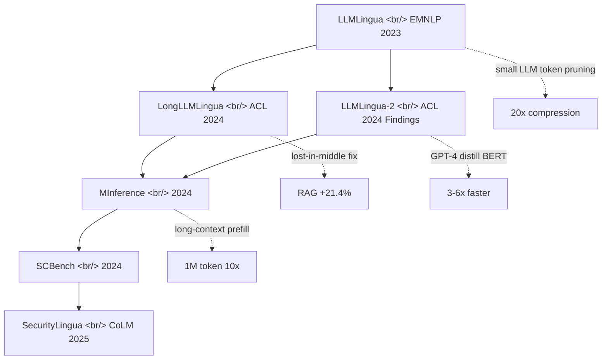

## Overview

Someone dropped [LLMLingua](https://github.com/microsoft/LLMLingua) in a chat, another member replied *"yes, very underrated."* The repo has 6,156 stars, MIT license, and six papers in the series stretching from EMNLP 2023 through CoLM 2025 — and yet production case studies are surprisingly thin on the ground. Compression up to 20x with minimal performance loss should be a no-brainer; why isn't the adoption faster? Unpack the word "underrated" from that chat and you find the **research-to-production gap** in plain sight.

<!--more-->



## Six Papers, One Table

| Paper | Year | Headline result |
|---|---|---|
| [**LLMLingua**](https://aclanthology.org/2023.emnlp-main.825) | EMNLP 2023 | Use a small LLM (GPT2-small, LLaMA-7B) to drop low-value tokens — **20x compression** with minimal quality loss |
| [**LongLLMLingua**](https://aclanthology.org/2024.acl-long.91) | ACL 2024 | Mitigates "lost in the middle." RAG accuracy **+21.4%** at 1/4 the tokens |
| [**LLMLingua-2**](https://aclanthology.org/2024.findings-acl.57) | ACL 2024 Findings | BERT-class encoder distilled from GPT-4 — **3-6x faster** and stronger out-of-domain |
| [**MInference**](https://arxiv.org/abs/2407.02490) | 2024 | Long-context inference acceleration. **10x prefill on 1M tokens** on A100 |
| **SCBench** | 2024 | A benchmark suite for KV-cache-centric long-context methods |
| **SecurityLingua** | CoLM 2025 | Compression-based jailbreak defense — SOTA guardrail performance using **100x fewer tokens** |

The full paper list, demos, and blog posts are aggregated on the project page at [llmlingua.com](https://llmlingua.com/).

## What You Actually Get

- **Cost savings** — shorter prompt and shorter generation in one move; the only overhead is one small-LLM call
- **Extended context** — sits on top of long-context models, mitigates "lost in the middle" so the same token budget carries more useful signal
- **No retraining** — the underlying LLM is untouched, only a compressor sits in front of it (true plug-in)
- **Knowledge preservation** — designed to keep ICL examples and reasoning chains intact
- **KV-Cache compression** — drops both inference memory and latency
- **Recoverable** — they show GPT-4 can recover the key information from a compressed prompt

## Example (LLMLingua 1)

```python
from llmlingua import PromptCompressor

llm_lingua = PromptCompressor()
result = llm_lingua.compress_prompt(
    prompt, instruction="", question="", target_token=200
)
# {
#   'compressed_prompt': '...',
#   'origin_tokens': 2365,
#   'compressed_tokens': 211,
#   'ratio': '11.2x',
#   'saving': ', Saving $0.1 in GPT-4.'
# }
```

Quantized backends are supported too: `TheBloke/Llama-2-7b-Chat-GPTQ` runs the compressor in **under 8GB of GPU memory**.

## Example (LongLLMLingua RAG mode)

```python
compressed = llm_lingua.compress_prompt(
    prompt_list,
    question=question,
    rate=0.55,
    condition_in_question="after_condition",
    reorder_context="sort",
    dynamic_context_compression_ratio=0.3,
    condition_compare=True,
    context_budget="+100",
)
```

Retrieved chunks are sorted under the question condition and the compression rate is varied dynamically by position — that combination is what drives the RAG accuracy gain.

## Integrations

- [LangChain retriever integration](https://python.langchain.com/docs/integrations/document_transformers/llmlingua) — drop `LLMLinguaCompressor` into a `ContextualCompressionRetriever` and you're done
- [LlamaIndex node postprocessor](https://docs.llamaindex.ai/en/stable/examples/node_postprocessor/LongLLMLingua/) — bolts onto the tail of any query engine pipeline
- [Microsoft Prompt flow integration](https://microsoft.github.io/promptflow/) — works as a standard node inside Azure environments

## Insights

The chat's one-word verdict — *"underrated"* — is exactly right. **Six papers stacked, integrations across LangChain, LlamaIndex, and Prompt flow, and a 3x to 10x cost cut the moment you wire it in — yet production case studies remain rare.** A few likely reasons. First, compressed prompts are hard to debug — humans struggle to trace "why was that token dropped?", which makes regression testing painful. Second, the compressor itself is another small-LLM call, so latency-tight realtime systems can't easily afford it. Third, the ROI has only become obvious now that GPT-5 and Claude 4.x have made per-token cost a real budget line — and that's exactly when ops teams haven't yet caught up to the awareness. Tellingly, the same chat surfaced OpenAI's Privacy Filter (reversible tokenization) right alongside this — compression, pseudonymization, recovery, and KV-cache management are all clearly bifurcating into a production tooling layer. **agentmemory + agent-skills + LLMLingua = the agent context-management stack** that's quietly assembling itself. Net read: when a high-performance tool stays underused, the bottleneck is usually the integration layer's maturity, not the tool.

## References

**Repo and demos**
- [microsoft/LLMLingua](https://github.com/microsoft/LLMLingua) — main GitHub repo (6,156 stars, MIT)
- [llmlingua.com](https://llmlingua.com/) — project hub (papers, demos, posts)
- [HuggingFace LLMLingua demo](https://huggingface.co/spaces/microsoft/LLMLingua)
- [HuggingFace LLMLingua-2 demo](https://huggingface.co/spaces/microsoft/LLMLingua-2)

**Papers**
- [LLMLingua (EMNLP 2023)](https://aclanthology.org/2023.emnlp-main.825)
- [LongLLMLingua (ACL 2024)](https://aclanthology.org/2024.acl-long.91)
- [LLMLingua-2 (ACL 2024 Findings)](https://aclanthology.org/2024.findings-acl.57)
- [MInference (arXiv 2407.02490)](https://arxiv.org/abs/2407.02490)

**Integrations**
- [LangChain LLMLinguaCompressor](https://python.langchain.com/docs/integrations/document_transformers/llmlingua)
- [LlamaIndex LongLLMLingua postprocessor](https://docs.llamaindex.ai/en/stable/examples/node_postprocessor/LongLLMLingua/)
- [Microsoft Prompt flow](https://microsoft.github.io/promptflow/)
