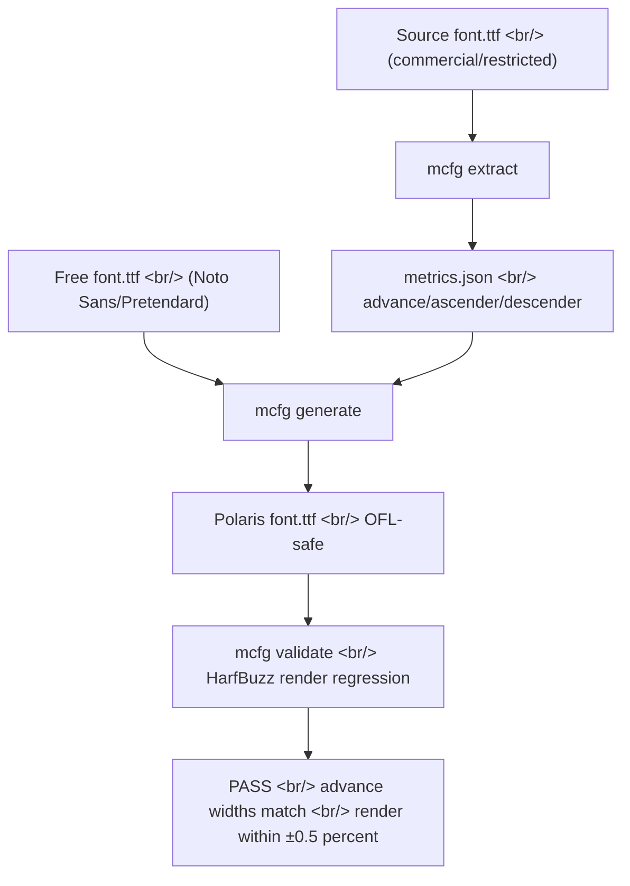

## Overview

[PolarisOffice/polaris_mcfg](https://github.com/PolarisOffice/polaris_mcfg) appeared on 2026-04-26 — a tool that looks like it came out of the Polaris Office product team. It extracts **only the layout metrics** from restricted fonts (think Hancom fonts, internal commercial fonts) and grafts them onto freely-licensed fonts like [Noto Sans](https://fonts.google.com/noto/specimen/Noto+Sans) and [Pretendard](https://github.com/orioncactus/pretendard) to produce a new font. The result: **original line breaks and page boundaries preserved, license now safe**. What makes the chatroom timing interesting is that the conversation immediately around this share was about **LLM evaluation rubrics** — two topics that look unrelated but both belong to production-grade engineering practice.

<!--more-->



## The Problem It Solves

Open a Hancom-authored .hwp or .docx in another environment and **line breaks and page splits drift**. The visible glyph shapes aren't the issue — the **numeric metrics are**: advance width, ascender, descender, line gap. polaris_mcfg solves this with one clean cut: never touch the outline, only graft the numbers from one font onto another's design.

## The Clean Separation — License-Safe Boundary

The data the tool handles is **numbers only**. Glyph outlines are never extracted, never copied. The visible design of the output font is 100% from the free font, and so is its license. The standard there is the [SIL Open Font License (OFL)](https://openfontlicense.org/) 1.1 — finalized in 2007 by Victor Gaultney and Nicolas Spalinger at SIL International, untouched for nearly 20 years, the de facto free-license standard for the font industry. Both Noto Sans and Pretendard ship under OFL.

## CLI

| Subcommand | Purpose |
|---|---|
| `mcfg extract <font.ttf>` | Metrics → JSON |
| `mcfg compare a b` | Diff two fonts (or two JSONs); text/json/html output |
| `mcfg generate --metrics … --design …` | Produce the synthesized font |
| `mcfg validate <font> --against …` | Verify the metrics actually match |

```bash
mcfg extract NotoSansKR-Bold.ttf -o bold.json

mcfg generate \
  --metrics bold.json \
  --design  NotoSansKR-Regular.ttf \
  --output  PolarisBoldMetrics-Regular.ttf \
  --apply   global,advance \
  --license-text "SIL Open Font License 1.1"

mcfg validate PolarisBoldMetrics-Regular.ttf \
  --against NotoSansKR-Bold.ttf \
  --render-default \
  --render-tolerance-pct 0.5
# → result: PASS (advance widths match, rendering within ±0.5%)
```

Validation runs through [HarfBuzz](https://harfbuzz.github.io/), the de facto OpenType shaping engine — the only way to confirm the metric graft really worked is to render real text and compare pixels.

## Milestones and License Responsibility

M1 (metric extractor + JSON schema) through M7 (packaging and docs) are all complete; 84 tests pass. Tool code is MIT; output fonts inherit the design font's license (OFL or similar). One important caveat: **whether the source font's EULA permits metric extraction is the user's responsibility** (Requirements.md §6). The tool is not an automated license-laundering machine — it's an honest separation tool, and the README is explicit about that.

## The LLM Eval Rubric Thread Next to It

What was being discussed in the same chatroom right before this link was an unexpectedly pointed take on LLM evaluation:

> "Vector similarity and RAGAS metrics aren't really suitable for grading. Free-form grading inevitably has to go through an LLM, and the standard practice is to write the evaluation rubric first and base everything on that."

This single line compresses the production wisdom of LLM-as-Judge into three points. (1) [Vector similarity and RAGAS](https://github.com/explodinggradients/ragas) score semantic match but don't constitute a grading standard. (2) Free-form grading must call an LLM — rule-based scoring won't reach. (3) Write the rubric first. "Tell me if this answer is good" doesn't work as a prompt; you need an **explicit grading scheme** before you'll get consistency.

This matches exactly where every modern LLM eval framework — [DeepEval](https://github.com/confident-ai/deepeval), [Evidently](https://github.com/evidentlyai/evidently), [OpenAI Evals](https://github.com/openai/evals) — is heading. **Rubric-driven judging is now the standard.**

## Insights

That a font metric extractor and an LLM evaluation rubric thread coexist in the same chatroom on the same day signals something about the room: **the people there are actually shipping product**. The two topics look unrelated but the underlying move is identical — both are about reducing intuition-dependent territory to explicit, verifiable rules. The font tool reduces "are these metrics compatible" to a HarfBuzz rendering regression. LLM-as-Judge reduces "is this answer good" to a rubric. Both topics demand an automated verification step before they're production-ready, and that verification step ends up defining the tool's identity. The fact that polaris_mcfg has a `validate` subcommand at all, and that LLM eval frameworks treat rubrics as first-class objects, are expressions of the same engineering instinct. In production "it just works" is not a finishing line — **explicit criteria + automated verification + regression tracking** is the new bar, and these two topics point to the same place from very different starting points.

## References

**Tool repo and demo**
- [PolarisOffice/polaris_mcfg](https://github.com/PolarisOffice/polaris_mcfg) — Metric-Compatible Font Generator (MIT, Python, 4 stars)
- [Demo / docs site](https://polarisoffice.github.io/polaris_mcfg/)

**Font ecosystem**
- [HarfBuzz](https://harfbuzz.github.io/) — OpenType shaping engine
- [SIL Open Font License](https://openfontlicense.org/) — de facto free-license standard (OFL 1.1, 2007)
- [SIL International](https://www.sil.org/) — OFL stewards
- [Noto Sans](https://fonts.google.com/noto/specimen/Noto+Sans) and [Pretendard](https://github.com/orioncactus/pretendard) — OFL-licensed Hangul fonts

**LLM evaluation methodology**
- [RAGAS](https://github.com/explodinggradients/ragas) — RAG evaluation framework
- [DeepEval](https://github.com/confident-ai/deepeval) — LLM-as-Judge + rubric-based eval
- [Evidently](https://github.com/evidentlyai/evidently) — ML/LLM monitoring and eval
- [OpenAI Evals](https://github.com/openai/evals) — OpenAI's official eval framework
