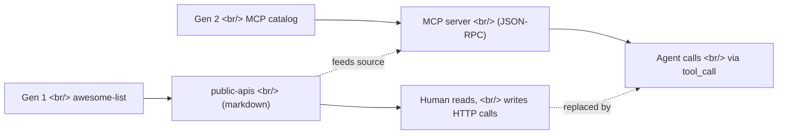

## Overview

[public-apis/public-apis](https://github.com/public-apis/public-apis) has been alive since 2016-03-20, sitting at **433,177 stars**, MIT-licensed, and maintained by [APILayer](https://apilayer.com/). It's still actively pushed — yesterday (2026-05-07) had a fresh commit. What's interesting is the context in which it resurfaced in chat: the previous message was a [tilnote](https://tilnote.io) MCP server update announcement. That timing exposes a quiet pattern — **the awesome-list movement is being rediscovered as the source inventory for the MCP catalog era.**

<!--more-->

## What it is

A category-organized markdown list of free public APIs. Animals, Anime, Authentication, Blockchain, Books, Business, Calendar, Cloud Storage, Cryptocurrency, Currency Exchange, Data Validation, Development, Dictionaries, Email, Entertainment, Environment, Events, Finance, Food, Games, Geocoding, Government, Health, Jobs, **Machine Learning**, Music, News — 30+ categories.

Each entry includes `Auth` (None / API key / OAuth), `HTTPS`, and `CORS` columns, so you can tell at a glance whether you can call it directly from a browser.

## Why now — the message right before

An adjacent thread mentioned:

> "Hey, [tilnote](https://tilnote.io) MCP just got an update. You can now create books and add pages in tilnote from Claude Code or Codex."

→ When you're building or hooking into MCP servers, the immediate question becomes: **"What do I wrap as a data source?"** The fastest way to answer that is still an awesome list like public-apis. [MCP](https://modelcontextprotocol.io/) describes itself as *"a USB-C port for AI applications — a standardized way to connect AI to external systems."* Public-apis is, in effect, a single page listing of "things you might want to plug into that USB-C port."

## Gen 1 to Gen 2

The [awesome lists movement](https://github.com/sindresorhus/awesome) (started 2014 by sindresorhus) created **a fast, category-organized index for humans to discover external resources.** After the 2025-2026 [MCP](https://modelcontextprotocol.io/) wave, the same kind of index has shifted role — now it's **a candidate catalog for agents to call as tools.**

| Dimension | Gen 1 awesome-list | Gen 2 MCP catalog |
|---|---|---|
| Format | Markdown links | JSON-RPC + manifest |
| Consumer | Humans (developers) | Agents (LLMs) |
| Invocation | Human writes code | Automatic tool_call |
| Auth | API keys, hand-managed | OAuth / token standards |
| Discovery | GitHub search | MCP registry |

→ **public-apis is not dead.** Its role has been redefined: it's now the inventory you check first when designing a new MCP server. API aggregators like APILayer regain value here — their already-normalized endpoints are easy to wrap as MCP servers.

## Gotcha when stuffing it into an LLM

A common pattern is shoving an awesome list straight into an LLM context. Public-apis as a whole is heavy on tokens — better to slice it by category and compress it like a [tool catalog manifest](https://modelcontextprotocol.io/docs/learn/architecture). Or, build per-category MCP servers and let the agent load only what it needs.

## Insights

There was a moment when people declared awesome lists dead, but the MCP era has actually doubled their value. In an agent world, the most expensive resource is not tokens — it's **the index of what exists.** Without that index, agents only know the tools they saw at training time. public-apis has stayed alive for ten years for a non-coincidental reason: it's cleanly cut along a single axis (free APIs), and it gets pushes weekly to keep the inventory fresh. The fact that APILayer maintains it matters too. **An API aggregator holding the awesome list is also an API aggregator holding the MCP server catalog**, and that becomes a direct on-ramp into the LLM tool marketplace next quarter. As more domain-specific MCP servers appear (tilnote being one example), **"which MCP do I install" becomes the new awesome list** — a slot already being targeted by repos like [github.com/modelcontextprotocol](https://github.com/modelcontextprotocol) and sindresorhus-style awesome-mcp follow-ups. Gen 1 isn't dying; the same pattern is reappearing one layer up.

## References

**Repo**
- [public-apis/public-apis](https://github.com/public-apis/public-apis) — 433,177 stars, MIT, started 2016-03-20, last push 2026-05-07
- [The original awesome lists hub (sindresorhus/awesome)](https://github.com/sindresorhus/awesome)

**Maintainer / sponsor**
- [APILayer](https://apilayer.com/) — runs public-apis; an API aggregator

**MCP ecosystem**
- [Model Context Protocol official site](https://modelcontextprotocol.io/) (Anthropic)
- [MCP architecture docs](https://modelcontextprotocol.io/docs/learn/architecture)
- [github.com/modelcontextprotocol](https://github.com/modelcontextprotocol) — official SDKs and reference servers
- [tilnote MCP](https://tilnote.io) — the adjacent message in chat; a domain-specific MCP example
