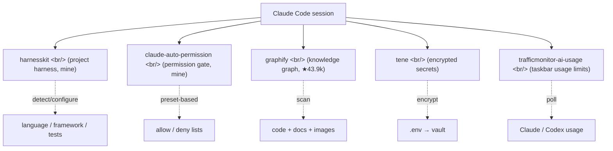

## Overview

Spent two weeks with the tools growing around Claude Code. Five — two are mine (harnesskit, claude-auto-permission), three are external (graphify, tene, trafficmonitor-ai-usage-plugin). Each touches a different layer — harness, permission, knowledge graph, secrets, monitoring.

<!--more-->



---

## harnesskit — auto-detect a project, apply guardrails

[ice-ice-bear/harnesskit](https://github.com/ice-ice-bear/harnesskit), Shell, ★2 (mine).

> Adaptive harness for vibe coders — detect, configure, observe, improve

Core idea, four-stage loop:

```
Detect → Configure → Observe → Improve
```

- **Detect** — auto-detects a repo's language/framework/test framework/linter/package manager. **Spends zero LLM tokens** (zero-token shell hooks, bash + jq).
- **Configure** — uses detection to pick a preset (beginner/intermediate/advanced) and apply guardrails.
- **Observe** — collects metrics via session hooks.
- **Improve** — an insights agent reads project patterns and proposes harness improvements.

```bash
/harnesskit:setup    # detect + pick preset
/harnesskit:init     # generate infra + toolkit
/harnesskit:status   # current state
/harnesskit:insights # generate improvement proposals
/harnesskit:apply    # review diffs and apply
```

Not auto-applied — "analyze → propose → user reviews diff → apply" is one cycle. AI proposes, human commits.

89 tests pass per the README, version 0.2.0. Self-retrospective: **the zero-token detect was the decisive call.** Detect via LLM means cost/latency/error pile up — bash + jq is enough for 80% of cases.

---

## claude-auto-permission — stop approving every git add

[ice-ice-bear/claude-auto-permission](https://github.com/ice-ice-bear/claude-auto-permission), JavaScript/Shell, ★1 (mine).

The problem is sharp:

> Claude Code asks permission for every tool use. You end up clicking "yes" hundreds of times for safe operations like reading files, running tests, and committing code.

Claude Code's built-in `settings.local.json` accumulates one-off approvals that don't transfer across repos or devices. The fix:

```
~/.claude/                         # Shared across all repos
  hooks/
    selective-auto-permission.mjs    # PreToolUse hook
    permission-learner.mjs           # Learns approval patterns
  skills/
    learn-permissions/SKILL.md       # /learn-permissions skill

your-repo/.claude/                 # Per-repo config
  auto-permission.json               # preset + custom rules
  settings.json                      # Registers the hook
```

Preset-based + per-repo overrides + dangerous commands always prompt. Concrete savings:
- `git add`, `git commit`, `git status`, `npm run build`, `pytest` — auto-pass
- `rm -rf`, `git push --force`, `DROP TABLE` — always prompt the user
- Pattern learning: the `/learn-permissions` skill reads transcripts and adds frequently-approved patterns to the allow list automatically.

The product wedge is **"safe automation"** — auto-approving everything is unsafe; prompting for everything kills productivity. Picking the right default in between is the work.

---

## graphify — code/docs/images as a knowledge graph

[safishamsi/graphify](https://github.com/safishamsi/graphify), Python, **★43,935** (external, flagship-tier).

> Type `/graphify` in your AI coding assistant and it maps your entire project — code, docs, PDFs, images, videos — into a knowledge graph you can query instead of grepping through files.

Tools that cross 40k stars usually do one thing very well — graphify is **"a graph instead of grep."** A single command:

```bash
/graphify .
```

drops three files:

```
graphify-out/
├── graph.html       # browser: click nodes, filter, search
├── GRAPH_REPORT.md  # key concepts, surprising connections, suggested questions
└── graph.json       # the full graph — query without re-reading files
```

The platform list is overwhelming — Claude Code, Codex, OpenCode, Cursor, Gemini CLI, GitHub Copilot CLI, VS Code Copilot Chat, Aider, OpenClaw, Factory Droid, Trae, Hermes, Kiro, Pi, Google Antigravity. Almost every major AI coding assistant gets a `/graphify` slash command.

The PyPI package is `graphifyy` (double-y). Other `graphify*` packages are not affiliated — naming-squatting protection.

The real value: **long-running codebase exploration that doesn't burn LLM context window.** On a big repo, "who calls this function?" via grep dumps raw output into the LLM context. The graph queries pre-indexed results instead. Both tokens and latency drop.

(A ★43k tool README has a Korean translation at `docs/translations/README.ko-KR.md`. Side projects like popcon need translations too — that's a real bar.)

---

## tene — your `.env` is not a secret (AI can read it)

[tomo-kay/tene](https://github.com/tomo-kay/tene), Go + TypeScript + Python multi-language, ★8 (external).

> **Your .env is not a secret. AI can read it.** Tene is a local-first, encrypted secret management CLI. It encrypts your secrets and injects them at runtime — so AI agents can use them without ever seeing the values.

The framing is what's interesting. Most secret managers (1Password CLI, doppler, vault) frame as "humans store secrets safely." Tene adds a new axis: **"AI agents use secrets without seeing the values."**

Mechanically:

1. tene encrypts `.env` values into a vault
2. At runtime tene injects them as env-vars into a child process
3. AI agents (Claude Code, Cursor, etc.) only see the vault file, never plaintext

Local-first, so it doesn't depend on cloud. The open-source CLI is MIT; cloud sync/teams/billing live as a Pro tier on [tene.sh](https://tene.sh).

Platform matrix: macOS (arm64/x64), Linux (arm64/x86_64), Windows (via WSL). Go 1.25+ at the core, with TypeScript/Python helpers. A genuinely polyglot repo.

Worth a look for popcon, which has piled up multi-API secrets — ToonOut + Gemini + R2 + RunPod.

---

## trafficmonitor-ai-usage-plugin — Claude usage in Windows taskbar

[bemaru/trafficmonitor-ai-usage-plugin](https://github.com/bemaru/trafficmonitor-ai-usage-plugin), C++/JavaScript/PowerShell, ★31 (external).

> Taskbar usage limits for Claude and Codex through TrafficMonitor on Windows.

Narrow and practical. [TrafficMonitor](https://github.com/zhongyang219/TrafficMonitor) is a popular Windows taskbar widget (system monitoring); this plugin adds Claude/Codex usage to that widget.

> I built this because Windows did not have a convenient widget for this kind of AI usage-limit status. Claude usage can already be checked from places like Claude Code statusline, Claude Desktop, or Claude's VS Code extension, but those surfaces depend on the current workflow. The Windows taskbar stays visible across editors, terminals, and browsers, so TrafficMonitor's taskbar plugin surface was a good fit.

That paragraph is a clean product-positioning example. **"Existing surfaces' limits → the spot we fill"** — the Claude Code statusline lives only inside Claude Code; Desktop lives only inside that app. The taskbar is always visible, so it works cross-context.

I'm a Mac user so I won't run this directly, but it's a good case study of where to claim a niche. macOS has the menubar — the same niche exists.

---

## Insights

Putting all five next to each other reveals how broad the Claude Code plugin landscape has gotten. By layer:

| Layer | Role | Tool |
|-------|------|---------|
| **Project harness** | Detect project + apply guardrails | harnesskit |
| **Permission gate** | Auto-approve safe tool uses | claude-auto-permission |
| **Knowledge layer** | Index code/docs into a queryable graph | graphify |
| **Secret layer** | Hide values from AI agents | tene |
| **Observability** | OS-level usage monitor | trafficmonitor |

The layers barely overlap. graphify and harnesskit both deal with "project context" but graphify gives users/AI an index, while harnesskit configures how AI behaves. tene and claude-auto-permission are both "safety guards" — but one redacts secrets, the other gates commands.

A pattern stands out as the ecosystem matures: **value is accruing around the AI coding tools, not inside them.** Claude Code itself doesn't try to do everything — small tools each take one axis. Unix philosophy.

Looking at my own tools next to the external ones sharpens their position. harnesskit and claude-auto-permission are both on the axis of **"adjust Claude Code's default behavior to the user/project."** That's a different axis from "add a new capability" (graphify).

Up next: install graphify on popcon and benchmark it against grep (latency, tokens), vault popcon's .env via tene, and figure out which detect patterns to add to harnesskit v0.3.
