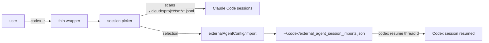
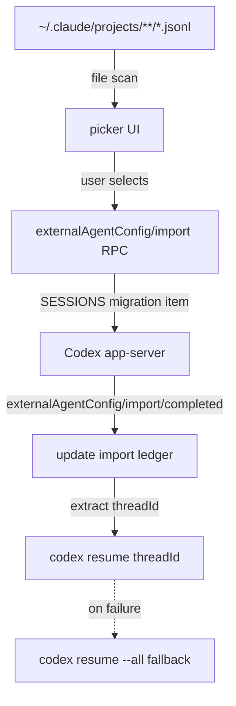

## Overview

[`thedalbee/codex-r`](https://github.com/thedalbee/codex-r) is a three-star, MIT-licensed micro tool created on 2026-05-01. In one line: it is a **Markdown-only skill that ports the `claude -r` workflow into [OpenAI Codex CLI](https://openai.com/codex/), so a single `codex -r` command opens a picker over your [Claude Code](https://www.anthropic.com/claude-code) sessions and imports the one you choose.** There is almost no code — the artifact is a single SKILL.md following the [agent-skills](https://github.com/anthropics/skills) pattern. The interesting question is not the star count; it is **why someone built this and what it signals.**

<!--more-->



## The Problem

Codex CLI 0.128.0 added `external agent session import`, but the trigger is awkward.

- The TUI prompt only appears when the `external_migration` feature flag is on and the session enters the trust onboarding flow.
- In projects that are already trusted, you may never see the prompt.
- A large `~/.claude/projects` folder makes home-wide detection slow.
- Existing shell aliases route `codex -r` straight to the real Codex binary, which exits with `unexpected argument '-r'`.

The feature exists, but **the path to use it is a scavenger hunt.** CODEX-R turns the hunt into a single picker behind a thin wrapper.

## What CODEX-R Does

The whole skill is one SKILL.md. Invoking `$codex-r` from a Codex session teaches Codex three things:

1. How to set up a `codex` thin wrapper
2. The Claude Code session picker behavior
3. The safety verification commands

```bash
codex -r                    # open picker, import on selection
codex -r daybreak           # show only ~/ws/daybreak sessions
codex -r --cwd ~/ws/kb      # sessions for a specific directory
codex -r --recursive        # include child directories
codex -r --all daybreak     # text-search all sessions
codex -r --list --limit 5   # list only, no import
codex -r --dry-run --limit 1
```

## Safety Contract

The author is explicit about **one rule: setup verification must never import.**

- `--list` and `--dry-run` never import, period.
- An import only happens after the user explicitly selects a session.
- The default shows only Claude sessions whose recorded cwd exactly matches the current directory.
- If Codex later ships an official `-r`, the wrapper steps aside.

CODEX-R does not copy Claude's settings, [MCP](https://modelcontextprotocol.io/) servers, plugins, or skills. **It only imports session JSONL files through Codex's own app-server migration API.**

## How It Works (Codex Internals)



- Feature flag — `external_migration`
- Claude session source — `~/.claude/projects/**/*.jsonl`
- Import RPC — `externalAgentConfig/import`
- Completion event — `externalAgentConfig/import/completed`
- Import ledger — `~/.codex/external_agent_session_imports.json`

A single session is imported as a SESSIONS migration item; the helper reads the threadId from the ledger and runs `codex resume <threadId>`.

## Install

```bash
git clone https://github.com/thedalbee/codex-r.git ~/ws/codex-r
ln -sfn ~/ws/codex-r ~/.codex/skills/codex-r
# in a fresh Codex session:
$codex-r
```

No installer script. One symlink and a skill invocation, and you are done.

## Why This Matters

- A clean example of **users wrapping an official feature in an ergonomic shell**. The 0.128.0 import RPC was already there; the surface was missing; a user wrote a 30-line thin wrapper to expose it.
- The Markdown-only-skill shape is the real story. It is a signal that Codex has adopted the [Anthropic agent-skills](https://github.com/anthropics/skills) pattern, and that compatibility lets a single person ship a working tool in a day.
- Three stars is small, but the pattern is big — **agent session portability is becoming load-bearing.** The same week that surfaced this also brought [agentmemory](https://github.com/AutonomousResearchGroup/agentmemory), another user-led standardization attempt for agent memory.
- The agent infrastructure layer is standardizing fast, and users are gluing it together before model vendors do.

## Insights

The meaning of this tool is not in the 30 lines of wrapper; it is in **the fact that the wrapper exists at all.** Within days of Codex shipping its import RPC, a user had built a picker on top of it and packaged the recipe as a SKILL.md. That timing tells you the agent tool market is no longer locked to a single vendor: Claude Code session JSONL is effectively a portable format, and Codex now exposes a stable RPC to import it. The same pattern is playing out for memory, skills, and MCP servers — and agent-skills as a standard means a single person can ship a compatibility layer in a day. Micro tools like this do not need to grow stars to be valuable; if the model vendor ships an official command, the wrapper steps aside, and that is fine. **The real asset here is the pattern, not the tool.** When users define ergonomics before the official feature does, the official feature ends up following them.

## References

**Repo**
- [thedalbee/codex-r](https://github.com/thedalbee/codex-r) — MIT, three stars, created 2026-05-01
- [README.md / SKILL.md](https://github.com/thedalbee/codex-r/blob/main/README.md)

**Related tools**
- [OpenAI Codex CLI](https://openai.com/codex/) — the external agent session import in 0.128.0 is the foundation this skill builds on
- [Claude Code](https://www.anthropic.com/claude-code) — source of the `~/.claude/projects/**/*.jsonl` files used for import
- [Anthropic agent-skills](https://github.com/anthropics/skills) — the Markdown-only-skill pattern this project follows
- [MCP (Model Context Protocol)](https://modelcontextprotocol.io/) — the broader agent standards layer

**Background**
- [agentmemory](https://github.com/AutonomousResearchGroup/agentmemory) — a same-period user-led memory standardization attempt (covered in a related post)
- [Claude Code documentation](https://docs.claude.com/en/docs/claude-code) — JSONL transcript structure used by the picker
