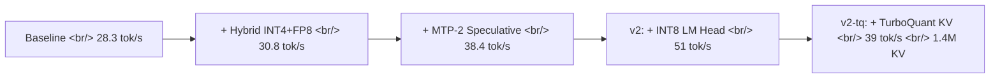

## Overview

[albond/DGX_Spark_Qwen3.5-122B-A10B-AR-INT4](https://github.com/albond/DGX_Spark_Qwen3.5-122B-A10B-AR-INT4) is a recipe that pushes [Qwen3.5-122B-A10B](https://huggingface.co/Qwen/Qwen3.5-122B-A10B) from 28.3 to 51 tok/s on a single [NVIDIA DGX Spark](https://www.nvidia.com/en-us/products/workstations/dgx-spark/), an 80 percent gain. It stacks five orthogonal techniques on top of vLLM 0.19: AutoRound INT4 quantization, an FP8 dense-layer hybrid, MTP-2 speculative decoding, an INT8 LM head, and optional TurboQuant KV cache compression — all while preserving 256K context. Apache 2.0, 171 stars on GitHub. The interesting question it answers in the affirmative: can a single workstation actually serve a 100B-class MoE model at production speed?

<!--more-->

## Results

| Build | tok/s | Gain | Image |
|---|---|---|---|
| Baseline (vLLM 0.19 + AutoRound INT4 + FlashInfer) | 28.3 | — | — |
| + Hybrid INT4+FP8 dense layers | 30.8 | +8.8% | step 1 |
| + MTP-2 speculative decoding | 38.4 | +35.7% | step 2 |
| **v2** (+ INT8 LM head v2) | **51** | **+80%** | `Dockerfile.v2` |
| v2-tq (+ TurboQuant KV cache) | 39 | +38% | `Dockerfile.v2-tq` |

The same stack pushes Qwen3.5-35B-A3B (the smaller sibling) to 112 tok/s.

### 256K context tradeoff

| Build | KV cache | 256K concurrent users |
|---|---|---|
| v2 (standard) | 355K tokens | 1 |
| v2-tq (TurboQuant) | **1.4M tokens** | **5** |

## The model in one paragraph

[Qwen3.5-122B-A10B](https://huggingface.co/Qwen/Qwen3.5-122B-A10B) is a hybrid MoE that activates 10B of its 122B parameters per token: 256 experts with 8 routed plus 1 shared, 48 layers alternating Gated DeltaNet and Gated Attention at a 12:1 ratio, native 262K context (extensible to 1M with YaRN), Apache 2.0. The starting point for this recipe is [Intel/Qwen3.5-122B-A10B-int4-AutoRound](https://huggingface.co/Intel/Qwen3.5-122B-A10B-int4-AutoRound), produced with [Intel AutoRound](https://github.com/intel/auto-round) at group size 128 with `shared_expert` left out of quantization.

## The five techniques

### 1. Hybrid INT4 + FP8 dense layers (+9%)

Replace the BF16 shared-expert weights inside the AutoRound INT4 model with FP8 weights from the official Qwen checkpoint. Net effect: experts stay INT4, dense layers run FP8. Memory and compute drop without touching accuracy.

### 2. MTP-2 speculative decoding (+36%)

[Multi-Token Prediction](https://arxiv.org/abs/2404.19737) generates 2 tokens per step with roughly 80 percent acceptance, the single largest jump in the chain. Notably there is no separate draft model — the main model itself runs multi-head prediction, which keeps the deployment simple.

### 3. INT8 LM head v2 (Triton kernel)

Quantizes the final vocabulary projection to INT8 via a custom Triton kernel. This is the biggest jump in the v2 build (38.4 to 51 tok/s). LM heads are usually exempt from quantization, but on models with very large vocabularies the cost is high enough that revisiting the assumption pays off.

### 4. TurboQuant KV cache (optional)

[TurboQuant](https://github.com/microsoft/turbo-quant) compresses the KV cache 4x. Absolute throughput drops slightly versus v2, but concurrent 256K-context users go from 1 to 5 — a meaningful tradeoff for long-context multi-tenant workloads.

## Environment

- vLLM 0.19.1, CUDA 13.0, Docker-based
- Inference stack: [vLLM 0.19](https://github.com/vllm-project/vllm) + [FlashInfer](https://github.com/flashinfer-ai/flashinfer)
- Model: `Intel/Qwen3.5-122B-A10B-int4-AutoRound`
- One-shot `./install.sh` runs steps 0 through 4, idempotent

## Insights

51 tok/s on a 100B-class model from a single workstation lands close to the 60 tok/s zone that feels native in a chat UI, which is the real news here. For a 171-star repo the engineering is unusually tight — bench tables, step-wise Dockerfiles, install.sh, vLLM/CUDA version notes — and you can run it as written. The deeper lesson is that the five techniques are orthogonal: hybrid quant attacks memory and accuracy, MTP attacks decoding parallelism, INT8 LM head attacks compute, and TurboQuant attacks KV memory. The 80 percent number is not one big trick but a sequence of bottleneck migrations. The v2 versus v2-tq split also shows that throughput and concurrency are different axes — pick the build that matches your workload, not the highest single-stream number. Expect this hybrid-quant plus speculative plus custom-kernel stack to land as a default in vLLM and SGLang within a quarter or two, at which point "100B in one box" stops being a demo.

## References

### Repo and model cards

- [albond/DGX_Spark_Qwen3.5-122B-A10B-AR-INT4](https://github.com/albond/DGX_Spark_Qwen3.5-122B-A10B-AR-INT4) — 171 stars, Apache 2.0
- [Qwen/Qwen3.5-122B-A10B](https://huggingface.co/Qwen/Qwen3.5-122B-A10B) — 122B/10B hybrid MoE, 262K context
- [Intel/Qwen3.5-122B-A10B-int4-AutoRound](https://huggingface.co/Intel/Qwen3.5-122B-A10B-int4-AutoRound) — INT4 group128
- [NVIDIA DGX Spark](https://www.nvidia.com/en-us/products/workstations/dgx-spark/)

### Inference frameworks

- [vLLM](https://github.com/vllm-project/vllm)
- [FlashInfer](https://github.com/flashinfer-ai/flashinfer)

### Optimization techniques

- [Intel AutoRound (arXiv:2309.05516)](https://github.com/intel/auto-round)
- [Multi-Token Prediction (arXiv:2404.19737)](https://arxiv.org/abs/2404.19737)
- [TurboQuant](https://github.com/microsoft/turbo-quant)
