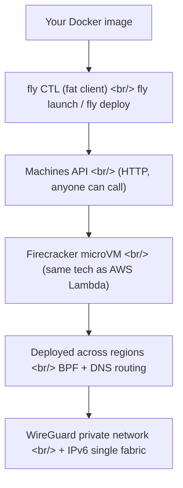

## Overview

I watched two short videos from the official Fly.io channel — [What is Fly.io, anyway?](https://www.youtube.com/watch?v=O6KpRcJzTxs) and [Fly Launch — How Fly.io uses Machines as a building block for everything](https://www.youtube.com/watch?v=VOZO7CfwPII). I'd heard "Machines are the building block" repeated many times while running popcon on Fly, and these videos finally pin down what that phrase means concretely.

<!--more-->

In short: Fly.io converts Docker images into Firecracker microVMs (the same isolation tech as AWS Lambda), runs them across regions worldwide, and stitches them into a single private IPv6 network. The API that creates these machines is exposed to ordinary users — Fly's CLI is a fat client that calls the same API any user can.

---

## Firecracker microVM — same isolation tech as AWS Lambda

The line in the videos that made me re-listen.

> Fly is a service that takes Docker images or OCI-compatible images and converts them to real virtual machines — microVMs — and runs them on **Firecracker, which is the same technology that runs AWS Lambda.**

Two implications at once.

1. **Real VMs, not containers.** Not `cgroups` isolation but KVM-based microVMs. Strong security boundary, no shared kernel with other tenants.
2. **Lambda-class boot speed.** Firecracker microVMs boot in well under a second. Container-class lightness with VM-class isolation.

Fly's reasons for adopting it are obvious. To accept arbitrary user Docker images and run them across regions, you cannot relax isolation. One container escape and you're peering at another tenant on the same host. Firecracker exists for this threat model.

A side benefit: the same image moves between EC2, Lambda, and a Fly Machine with effectively the same isolation model. Memory footprint and boot time scale proportionally.

---

## A single private network across regions — WireGuard + IPv6

The second claim:

> All of your virtual machines around the world, no matter what region they are in, are in the same private network thanks to a WireGuard private network and IPv6.

The point: **you don't have to shard your app logic by region.** The usual multi-region setup involves per-region endpoints and explicit cross-region replication. Fly puts every machine onto the same IPv6 `/64` over WireGuard, so cross-region calls are just internal IPv6 calls.

In [popcon dev #11](/posts/2026-05-07-popcon-dev11/) I decided to keep one warm fly frontend machine. This model made it cheap to do — there's a frontend machine in NRT and the GPU worker lives on RunPod. Fly's network connects everything fly-side cleanly, no extra routing.

Routing is BPF + DNS. With an Anycast IP, user requests automatically route to the nearest machine in the nearest region. From the user's side, one IP. From Fly's side, the closest machine wins.

---

## Why fly CTL is a fat client

The core message of video #2.

> fly CTL is a fat client — it's not a thin client wrapping around API calls to the server of fly.io. It is actually a fat client where it does a lot of the work to use fly's API.

What that means in practice:

- `fly launch` auto-detects/generates a Dockerfile, allocates an IP, issues an SSL certificate, generates `fly.toml`, etc. — **multiple API calls orchestrated client-side.**
- You could do all of that yourself by calling the Machines API directly — `fly launch` is a convenience wrapper.
- Deploy strategies (blue/green, rolling, canary) are orchestrated by the client too — it sequences health checks and machine replacements.

Practical takeaway: **if the CLI doesn't do something, the Machines API will.** When I wrote popcon's `sync-pod-id` script (sync RunPod IDs into fly secrets), this model was already in play — fly CTL doesn't ship that, so I called the API directly.

`fly machine status <id> --json` shows per-machine metadata. Fly-CTL-created machines carry deploy version and version-label metadata, so you can tell whether a given machine was created by fly CTL or by direct API calls.

---

## fly.toml and Nomad relics

A detail mentioned in passing:

> Machines platform — which is not to be confused with the older platform called Nomad that used to run on HashiCorp Nomad. That was the scheduler used. Now we have our own thing going on, we call that the machines platform.

Fly's earlier architecture used HashiCorp Nomad as scheduler. From v2 it switched to its own Machines platform. Sections like `[experimental]` you sometimes see in `fly.toml` are likely compatibility relics from the Nomad era.

This change reads well in retrospect. Nomad is a general-purpose scheduler — it can't natively express the specifics of microVM workloads (fast cold start, image push, region affinity). The custom Machines platform makes all of those first-class.

---

## Insights

"Machines are the building block" sounds like marketing copy, but after the videos it parses two ways concretely:

1. **`fly launch` is just another Machines API client.** Every abstraction Fly exposes sits on the same API, and you can call that same API directly to build new abstractions. Want a custom deploy orchestrator? It's writable.
2. **Strong isolation is what makes multi-tenant pricing possible.** Because hosts run microVMs rather than containers, untrusted user images run safely on shared hardware.

popcon uses a Fly + RunPod hybrid. Fly handles the reliable stateful side (API, frontend, DB, R2 client). RunPod handles GPU-heavy workers. The fact that traffic between the two clusters flows over Fly's IPv6 private network is a real operational win.

Next up to dig into: how Anycast actually works (how BPF picks routes), examples of teams calling the Machines API directly to build custom deployers, and Fly's region pricing.
