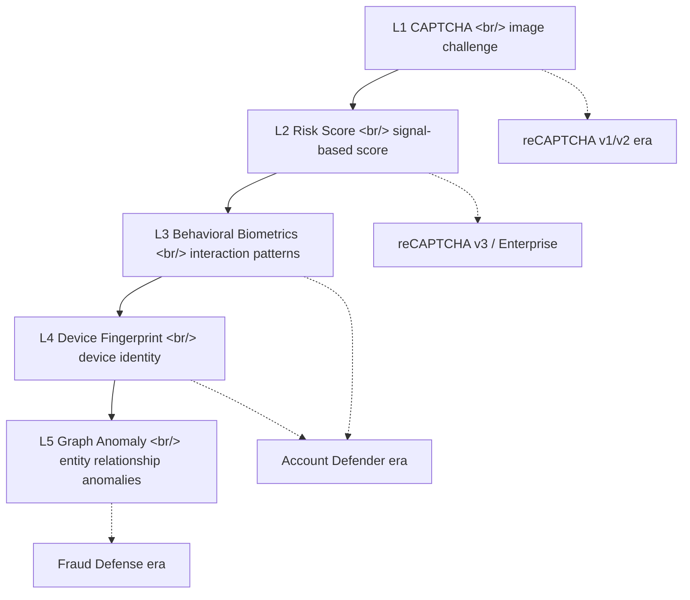
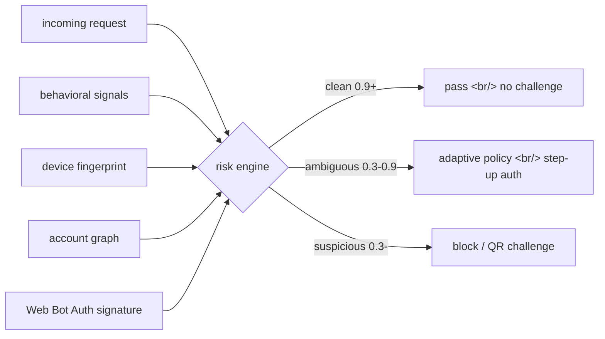
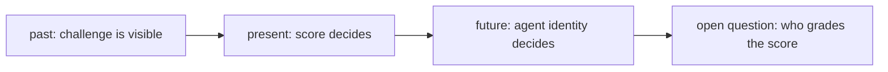

## Overview

On 2026-04-23 at [Google Cloud Next '26](https://cloud.withgoogle.com/next), Google unveiled [Google Cloud Fraud Defense](https://cloud.google.com/blog/products/identity-security/introducing-google-cloud-fraud-defense-the-next-evolution-of-recaptcha/), positioned as "the next evolution of [reCAPTCHA](https://cloud.google.com/security/products/recaptcha)." The core shift fits in one sentence — **the question moved from "is this a human?" to "does this session match learned attack patterns?"**

<!--more-->

## 1. The End Point of 18 Years of reCAPTCHA

[reCAPTCHA](https://en.wikipedia.org/wiki/ReCAPTCHA) began at [Carnegie Mellon University](https://www.cmu.edu/) in 2007. [Google acquired it in 2009](https://googleblog.blogspot.com/2009/09/teaching-computers-to-read-google.html). A project that started as a byproduct of book digitization is now the front-line infrastructure of the bot economy, 18 years later.

| Era | Version | Core mechanism | What broke it |
|---|---|---|---|
| 2007–2017 | v1 | Distorted text OCR | OCR crossed 99% accuracy |
| 2014–today | v2 | "I'm not a robot" + image grid | Image recognition + machine vision |
| 2018–today | [v3](https://developers.google.com/recaptcha/docs/v3) | Background risk score (0.0–1.0) | Whitebox evasion |
| 2020–today | [reCAPTCHA Enterprise](https://docs.cloud.google.com/recaptcha/docs/compare-tiers) | Cloud integration + Account Defender | Bot cluster automation |
| 2026– | **Fraud Defense** | Agentic policy + trust graph | AI agents impersonating humans |

The [v1 deprecation notice on 2017-10-18](https://developers.google.com/recaptcha/docs/changelog) and the 2018-04-01 shutdown were not coincidental with v3's launch on 2018-10-29. That was the start of the transition **from challenge-based to score-based**.

The shift to [reCAPTCHA Enterprise](https://cloud.google.com/security/products/recaptcha) added [Account Defender](https://cloud.google.com/blog/products/identity-security/use-account-defender-in-recaptcha-enterprise-to-protect-accounts) and [Password Leak Detection](https://docs.cloud.google.com/recaptcha/docs/passwords-leaked-detection). The latter hashes passwords against Google's **4-billion-credential breach database**. That alone already moved the product past pure bot blocking into credential stuffing defense.

## 2. What Fraud Defense Actually Is

Pulling together the [announcement post](https://cloud.google.com/blog/products/identity-security/introducing-google-cloud-fraud-defense-the-next-evolution-of-recaptcha/) and the [product page](https://cloud.google.com/security/products/fraud-defense), three axes emerge.

### Axis 1 — Agentic Activity Measurement

Agent identity measurement via standards like [Web Bot Auth](https://developers.cloudflare.com/bots/reference/bot-verification/web-bot-auth/) and [SPIFFE](https://spiffe.io/). Web Bot Auth is a young standard, with the [IETF working group chartered in early 2026](https://www.ietf.org/archive/id/draft-meunier-webbotauth-registry-01.html). AI agents attach a **private-key signature** to every HTTP request; sites verify it against a public-key directory. [Cloudflare](https://blog.cloudflare.com/web-bot-auth/) and [DataDome](https://datadome.co/changelog/web-bot-auth-verifying-user-identity-ensuring-agent-trust/) adopt the same standard. [Visa TAP](https://corporate.visa.com/en/products/visa-trusted-agent-protocol.html) and [Mastercard Agent Pay](https://www.mastercard.com/news/press/2025/april/mastercard-unveils-agent-pay-pioneering-agentic-payments-technology/) ride on top of it.

### Axis 2 — Agentic Policy Engine

A policy engine that gates allow/block decisions per stage based on risk score, automation type, and agent identity. It is an extension of [reCAPTCHA Enterprise Actions](https://docs.cloud.google.com/recaptcha/docs/actions-website) — login, signup, payment, and checkout are no longer evaluated independently but as a single lifecycle.

### Axis 3 — AI-Resistant Challenge

A new **QR-code challenge** scanned with your phone, designed to break the economics of automation. The same idea, however, drew [intense backlash](https://www.theregister.com/2023/07/25/google_web_environment_integrity/) when proposed as [Web Environment Integrity](https://en.wikipedia.org/wiki/Web_Environment_Integrity), and [Private Captcha's critique](https://privatecaptcha.com/blog/google-cloud-fraud-defence-wei/) argues that "Fraud Defense is WEI repackaged." [EFF](https://www.eff.org/deeplinks/2023/08/your-computer-should-say-what-you-tell-it-say-1) called WEI "the DRM-ification of the web."

## 3. Friction Layer vs Risk Engine Layer

The cleanest framing is:

> **reCAPTCHA was the friction layer. Fraud Defense is the risk engine layer.**

The friction layer's job was **putting a challenge in front of the user**. The risk engine layer's job is **scoring a session against learned attack patterns**. When the score is clean, the user never sees a challenge. Google cites the [2025 Shopify Retail Report](https://www.shopify.com/retail/the-future-of-retail) projection that AI shopping assistants will lift average order value by **25%** — that is the business gravity creating pressure to remove UX friction entirely.

Google's headline number is **a 51% average reduction in account takeover (ATO)**. That is not a challenge-pass rate — it is the **outcome metric** that only makes sense once you cross from the friction layer to the risk engine layer.

## 4. Competitive Landscape — Turnstile / WAF Bot Control / Akamai / Arkose

Fraud Defense did not appear in a vacuum. The bot/fraud defense market is already layered.

| Vendor | Product | Positioning |
|---|---|---|
| Cloudflare | [Turnstile](https://www.cloudflare.com/products/turnstile/) + [Bot Management](https://www.cloudflare.com/application-services/products/bot-management/) | Edge CDN-integrated invisible challenge |
| AWS | [WAF Bot Control](https://aws.amazon.com/waf/features/bot-control/) | Rule-based, native to AWS |
| Akamai | [Bot Manager](https://www.akamai.com/products/bot-manager) | Enterprise ML, with [Shape Security](https://www.f5.com/products/security/shape-ai-fraud-engine) lineage |
| F5 | [Distributed Cloud Bot Defense](https://www.f5.com/cloud/products/bot-defense) | Shape-based, strong in financial services |
| Imperva | [Advanced Bot Protection](https://www.imperva.com/products/bot-management/) | WAF-integrated |
| Arkose Labs | [Arkose Bot Manager](https://www.arkoselabs.com/arkose-bot-manager/) | Challenge-based, strong in gaming/social |
| Sardine | [Sardine](https://www.sardine.ai/) | Behavioral biometrics-first |
| BioCatch | [BioCatch](https://www.biocatch.com/) | Mouse/typing patterns |
| DataDome | [DataDome](https://datadome.co/) | API-first, early Web Bot Auth adopter |

Google's differentiator is the **scale of the data footprint**. Per the announcement, the fraud intelligence graph covers 50% of the [Fortune 100](https://fortune.com/ranking/fortune500/) and over **14 million domains globally**. If friction itself is disappearing, **signal richness becomes the decisive moat** — more signals make the score sharper, a sharper score lets you ship with less friction.

## 5. The Regulatory Backdrop — PSD2 SCA, FTC Bot Rulemaking

Context builders should not forget: products like this are **shaped by regulation**.

- [PSD2 SCA](https://en.wikipedia.org/wiki/Strong_customer_authentication) entered force in the EU on 2019-09-14, mandating multi-factor authentication on electronic payments. Per the [Stripe SCA guide](https://stripe.com/guides/strong-customer-authentication), at least two of knowledge / possession / inherence are required. But SCA also includes a **TRA (Transaction Risk Analysis) exemption** — if the risk score is low enough, SCA can be skipped. The accuracy of your risk engine maps directly to checkout conversion.
- The [FTC's bot rulemaking](https://www.ftc.gov/policy/advocacy-research/tech-at-ftc/2023/06/keeping-fake-reviews-out-shopping-results) has ramped enforcement on fake reviews and fake accounts, and the [FCC's AI robocall ruling](https://www.fcc.gov/document/fcc-makes-ai-generated-voices-robocalls-illegal) closed off voice channels.
- Under [GDPR](https://gdpr.eu/) and similar laws, behavioral biometric data is close to sensitive data — the legal status of signals Fraud Defense collects and shares remains gray.

## 6. AI-on-AI Defense — Same Weapons, Different Targets

The most honest framing: **both attackers and defenders have access to the same LLMs.** [Anthropic's 2026 threat intelligence report](https://www.anthropic.com/news/threat-intelligence-report-2026) documents the industrialization of LLM-assisted credential stuffing and phishing this year. [OpenAI's Trusted Access for Cyber](https://openai.com/index/scaling-trusted-access-for-cyber-defense/) loosens safety policy only for verified defenders — an asymmetric policy. Fraud Defense's agentic policy engine creates the same asymmetry on the bot traffic side — **good agents authenticate and pass; bad agents get filtered by score.**

The unresolved question is who defines "good agent." Tier-1 vendors like [OpenAI](https://openai.com/), [Anthropic](https://www.anthropic.com/), and [Perplexity](https://www.perplexity.ai/) can plug into Web Bot Auth easily. What about a small builder running their own model? An agent hosted on [Hugging Face Spaces](https://huggingface.co/spaces)? Until the standard stabilizes, the score decides — and the score is graded by **a model Google trained**.

## 7. What App Builders Actually Need to Do

Existing [reCAPTCHA Enterprise](https://docs.cloud.google.com/recaptcha/docs/compare-tiers) customers have no migration, no pricing change, and their site keys still work. That said, there is real work to do.

1. **Pass a stable `hashedAccountId`.** Without it, [Account Defender assessments](https://docs.cloud.google.com/recaptcha/docs/samples/recaptcha-enterprise-account-defender-assessment) cannot build the per-account activity model.
2. **Wire Actions across the full lifecycle.** Login and signup are table stakes — **add them to payment and checkout too**. Fraud Defense's accuracy compounds with lifecycle correlation.
3. **Design a false-positive remediation path.** Do not hard-block on a single low score. Layer in step-up auth with [WebAuthn](https://webauthn.io/) / [passkeys](https://passkeys.dev/) / OTP. Push the same policy to the edge by integrating [Cloud Armor](https://cloud.google.com/armor) with [reCAPTCHA Enterprise for WAF](https://codelabs.developers.google.com/codelabs/cloud-armor-recaptcha-bot-management).
4. **Observe agent traffic separately.** "User comes in through an agent" is about to become normal traffic. Use the agentic activity dashboard to track the human/bot/agent split.
5. **Audit where data flows.** Fraud Defense contributes to a global graph. For sensitive domains (healthcare, finance), check [data residency](https://cloud.google.com/security-and-identity/data-residency) options and document which signals leak into the graph.

## 8. Tying It Together

For 18 years reCAPTCHA's job was to ask "is this user human." Fraud Defense's job is to ask "is this session risky." The **shift from friction layer to risk engine layer** improves the UX, but it inversely **increases dependence on Google's risk score**. When the score is wrong, the false-positive remediation path is the builder's problem to design. Trust in the agentic web does not come for free.

## Insights

The most interesting signal is the direction in which **the challenge UI is disappearing**. Google is moving toward invisible verification, much like [Cloudflare Turnstile](https://www.cloudflare.com/products/turnstile/) — and at the same time **laid the AI-resistant QR challenge as a backstop**. No friction when the score is clean; phone comes out only when it is suspicious. That is, in practice, [a workaround that achieves what WEI could not](https://privatecaptcha.com/blog/google-cloud-fraud-defence-wei/) — without forcing browser attestation, it pulls **the phone as a trusted device** into the challenge surface and produces the same effect. The fastest-moving area next quarter is **SCA exemption rates at checkout**. The moment payment PSPs start accepting the Fraud Defense score as a basis for TRA exemption, the conversion-rate uplift becomes a decisive moat. Practical takeaway for builders: **wire Actions across the lifecycle, pass `hashedAccountId`, and pre-design a false-positive remediation path with WebAuthn step-up**. Score accuracy is now the revenue curve.

## References

**Google Cloud — Official**
- [Introducing Google Cloud Fraud Defense (Cloud Blog)](https://cloud.google.com/blog/products/identity-security/introducing-google-cloud-fraud-defense-the-next-evolution-of-recaptcha/)
- [Fraud Defense product page](https://cloud.google.com/security/products/fraud-defense)
- [reCAPTCHA product page](https://cloud.google.com/security/products/recaptcha)
- [Account Defender docs](https://docs.cloud.google.com/recaptcha/docs/account-defender)
- [reCAPTCHA Enterprise + Cloud Armor codelab](https://codelabs.developers.google.com/codelabs/cloud-armor-recaptcha-bot-management)
- [Next '26 Security recap](https://cloud.google.com/blog/products/identity-security/next26-redefining-security-for-the-ai-era-with-google-cloud-and-wiz)

**Standards / Protocols**
- [Web Bot Auth (Cloudflare docs)](https://developers.cloudflare.com/bots/reference/bot-verification/web-bot-auth/)
- [Web Bot Auth IETF draft](https://www.ietf.org/archive/id/draft-meunier-webbotauth-registry-01.html)
- [SPIFFE](https://spiffe.io/) · [WebAuthn](https://webauthn.io/) · [Passkeys](https://passkeys.dev/)
- [Web Environment Integrity (Wikipedia)](https://en.wikipedia.org/wiki/Web_Environment_Integrity)

**Competitive / Comparisons**
- [Cloudflare Turnstile](https://www.cloudflare.com/products/turnstile/) · [AWS WAF Bot Control](https://aws.amazon.com/waf/features/bot-control/) · [Akamai Bot Manager](https://www.akamai.com/products/bot-manager)
- [Arkose Bot Manager](https://www.arkoselabs.com/arkose-bot-manager/) · [DataDome](https://datadome.co/) · [BioCatch](https://www.biocatch.com/) · [Sardine](https://www.sardine.ai/)
- [Private Captcha — Fraud Defense WEI critique](https://privatecaptcha.com/blog/google-cloud-fraud-defence-wei/)

**Regulatory / Context**
- [PSD2 Strong Customer Authentication](https://en.wikipedia.org/wiki/Strong_customer_authentication) · [Stripe SCA guide](https://stripe.com/guides/strong-customer-authentication)
- [EFF — WEI critique](https://www.eff.org/deeplinks/2023/08/your-computer-should-say-what-you-tell-it-say-1)
- [Visa Trusted Agent Protocol](https://corporate.visa.com/en/products/visa-trusted-agent-protocol.html) · [Mastercard Agent Pay](https://www.mastercard.com/news/press/2025/april/mastercard-unveils-agent-pay-pioneering-agentic-payments-technology/)
