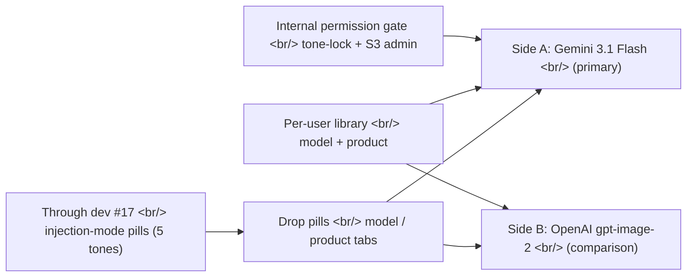
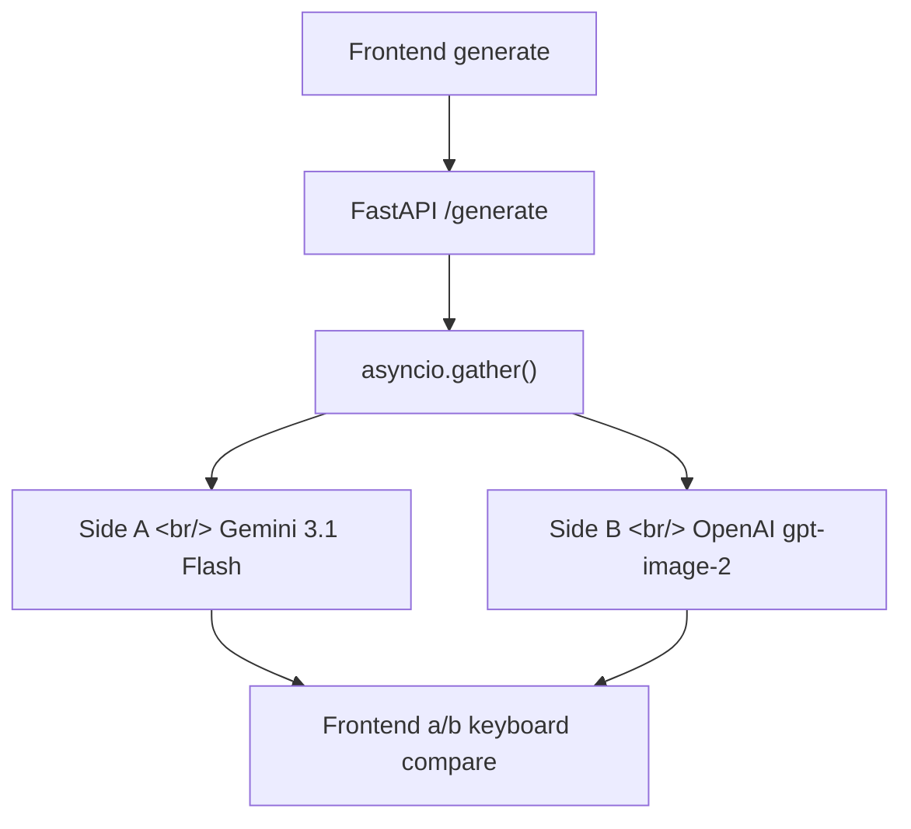
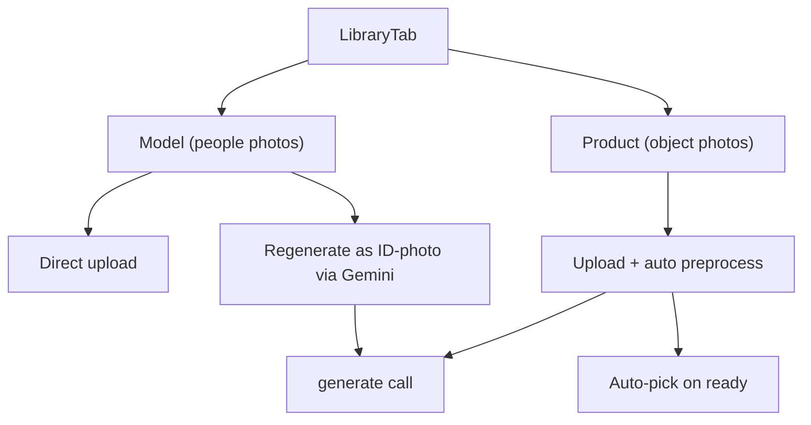
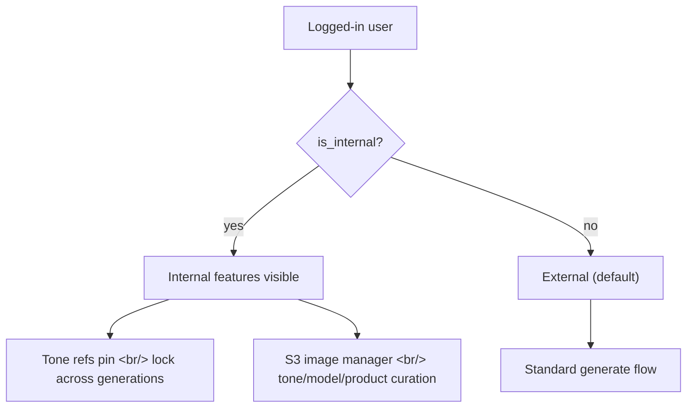

## Overview

Since [#17 — tone pool swaps, model injection prompt v2](/posts/2026-04-22-hybrid-search-dev17/), 73 commits have landed. The biggest shift is **dropping the injection-mode abstraction itself** — what used to be a five-tone pill row collapsed into two tabs: model and product. At the same time, we started routing the comparison side B through OpenAI's gpt-image-2.

<!--more-->

73 commits, five threads.

---

## OpenAI gpt-image-2 lands as side B

Until now hybrid was a single-backend (Gemini) generator. dev #18 starts routing the comparison side B through OpenAI `gpt-image-2`.

Key commits:

- **Wire AsyncOpenAI client and OpenAI image-gen config** (`052d42f`) — env vars, timeouts, retries in backend config.
- **Shared image IO helper + OpenAI image service** (`1fb9b43`) — adapter that normalizes Gemini and OpenAI responses into a common shape.
- **Refactor 5-tone fields into side A/B semantics** (`d91067e`, `ec38fa8`) — `tone3`, `tone5` → `side_a`, `side_b`. The label stops describing tone variants and starts describing comparison sides.
- **Shield gather from cancellation, drop unsupported quality param** (`8759a78`) — `asyncio.gather` cancels sibling tasks if any one raises. To keep both sides alive, shield with `return_exceptions=True` and handle separately.

Two corner cases:
- **Aspect ratio mapping** — gpt-image-2 only supports `1024x1024`, `1024x1792`, `1792x1024` (`97f7204`). Map arbitrary UI ratios to the nearest supported size.
- **Surface side-B failures** (`7d31f62`) — even on the "comparison side," failures must be visible. Quietly missing data confuses evaluators.

---

## Drop injection modes; introduce a model/product library

Through dev #17 there was a "tone injection mode" abstraction. Five tones × user-uploaded models × options spread out across the UI, and learning cost was high. dev #18 swaps it out — **model tab and product tab, two tabs**.

Sequence:

1. **Per-user asset library** (`b933191`) — uploads stick to the user account; reusable across tones.
2. **Replace injection-mode pills with model/product tabs** (`1450767`) — UI simplifies. The "which mode" decision is gone.
3. **Regenerate uploaded models as ID-photos** (`db64b05`) — clean up uploaded portraits via Gemini for a consistent model slot.
4. **Role-aware prompt directives** (`ffb8ccf`) — when model/product references go into the prompt, their roles are explicit: "this person as the model," "this object as the product."
5. **Product preprocess + auto-pick on ready** (`69db8c2`) — upload → background preprocess → auto-activate. One fewer click for the user.
6. **Surface processing state + toast** (`f3ff587`) — processing assets show a distinct state. No silent waits.

There was a back-and-forth in the middle. **Auto model injection turned off, then back on**:
- `bdf0aae` — drop auto model injection, direct upload only (also fixes label wrap)
- `394f91f` — restore auto model injection, also accept generated-image drops

Direct upload only meant users had to drop in models one at a time, which created friction. Auto-injection won as default; direct upload stayed as an option.

---

## Tone pool curation: 0428 → 0429 → 0504

Eighty percent of generation quality lives in the tone reference pool. Too varied → results scatter; too narrow → results all look alike.

This cycle's curation work:

- **Swap model_image_ref to 0428 model selection pool** (`c1e5d39`) — the 0428 set has more consistent lighting; promoted to main model pool.
- **Two-category tones + person-aware model slot** (`cb3a260`) — split tones into two categories (natural/film, studio/clean), and only enable the model slot when the tone implies a person.
- **Scope auto-pick to curated 0429 subfolders** (`27d335d`) — when auto-picking a tone, only the 0429 curated set is in play. Cuts noise.
- **Rewrite slug-named tone refs in generation_logs** (`76a1a64`) — when the S3 corpus path naming changed, old logs needed remapping.
- **Reseed a(natural,film) from 0429 to 0504** (`c43214e`, the latest commit) — refresh the most-used tone category to the newest set.

A `scripts/` directory now records the S3 corpus swap utilities (`f169dd4`) so the next curation cycle can reuse them.

A one-line `nginx` fix (`9f252ff`) had outsized impact. Backend timeouts and the nginx `/api/` timeout were misaligned, so when OpenAI was slow, nginx returned 502 first and triggered backend retries. Aligned both, plus disabled upstream retries.

---

## Internal vs external: permission tiers

This cycle introduced a real **internal user** concept (team only). Demo days and external beta meant some features should not be visible to the world.

Three PRs split the work:
- **PR #16 — internal vs external user tiers + UI gating** (`f33e9d0`) — `is_internal` column on the user, internal-only components short-circuit to `<></>` for everyone else.
- **PR #17 — internal-only tone-lock** (`199a405`) — pin the same tone references across generations for clean A/B evaluation.
- **PR #18 — internal-only S3 image manager** (`8096425`) — manage tone/model/product corpus from the web UI instead of the S3 console.

The `feat/admin-s3-manager` branch needed two main merges (`9d5fa1e`, `a35bf53`). Other tracks landed mid-development and conflicts piled up — lesson: rebase the admin branch right after each major merge to main.

---

## Camera/lens picker polish

Camera/lens selection UX got a one-cycle pass.

| Commit | What |
|------|------|
| `2439c98` | Show thumbnails in angle picker dropdown (preview before selection) |
| `4f615a7` | Zoom button on hover for reference image |
| `5be9daa` | Rename to "Camera & Lens", random default lens, model creator |
| `b4aeed3` | Show None option explicitly + add None to LensPicker |
| `228ff9f` | LensPicker auto-closes after selection |
| `024253e` | Angle/lens picker still clickable when default is None |
| `bb13dd3` | Bottom bar polish — General + Edit on right + stronger active state |
| `020c509` | Multi-line breathing room for generation prompt |
| `8208a11` | Library tab + prompt area zoom + transparent overlay |
| `349d142` | Re-roll filters in preview modal, drop dead labels |
| Keyboard | A/B compare via arrow + 'a','b' keys (`fad542e`) |

The keyboard compare ended up the most loved tweak. Toggling between two results with 'a'/'b' rather than mousing back and forth doubled comparison velocity.

---

## Insights

Going from #17 to #18, **reducing abstraction was the move forward.** "Tone injection mode" was a 5-axis abstraction that imposed our code model on the user. The actual mental model is binary: "include a person, or include an object." Two tabs match that, and learning cost dropped accordingly.

Routing OpenAI alongside Gemini follows the same shape. Guessing which model is better from a single response is much worse than seeing both side-by-side and toggling with the keyboard. Details like `asyncio.gather` shielding matter, but if you nail down what happens when one side dies, the pattern is reusable.

The permission gate was a high-leverage tiny change. One `is_internal` column + conditional UI rendering, and the internal-only S3 admin and tone-lock can sit in the main codebase without exposing them. Avoiding a separate admin app saved a lot.

Next in dev #19: results from the gpt-image-2 quality A/B, a "group" concept in the model library (multiple people in one shot), and the conditions under which internal tone-lock could open up to external users.
