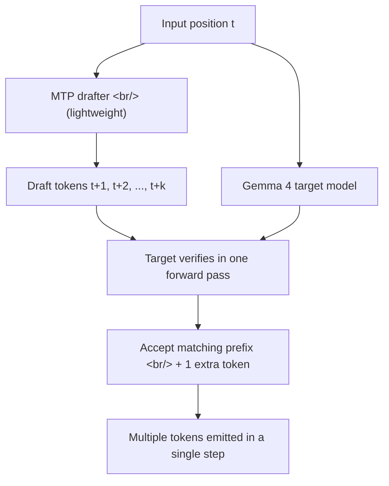

## Overview

Google's on-device LLM runtime [LiteRT-LM](https://ai.google.dev/edge/litert-lm) shipped [v0.11.0](https://github.com/google-ai-edge/LiteRT-LM/releases/tag/v0.11.0). Two headline items: **Single Position Multi-token Prediction (MTP)** for Gemma 4 — more than 2x faster decode on mobile GPUs — and **native Windows support** (CPU and GPU). Workstation-class results from the same week (DGX Spark + Qwen3.5 with MTP-2 hitting +36%) suggest MTP is hardening into **the common decode-acceleration technique** spanning mobile up through workstation.

Update 2026-05-11: A community Unity wrapper has surfaced — covered in a new section below.

<!--more-->



## 1. Gemma 4 Multi-token Prediction Support

The opening line of the [release notes](https://github.com/google-ai-edge/LiteRT-LM/releases/tag/v0.11.0): **">2x faster decode on mobile GPUs with zero quality degradation."** The mechanism is laid out in the [Google blog post on MTP for Gemma 4](https://blog.google/innovation-and-ai/technology/developers-tools/multi-token-prediction-gemma-4/) and the [official docs](https://ai.google.dev/edge/litert-lm/models/gemma-4).

The trick is a flavor of **speculative decoding**:

- At a single position, a lightweight **drafter** predicts multiple future tokens at once
- The full **target** model (e.g., Gemma 4 26B / 31B) verifies the entire draft sequence in one forward pass
- If the target agrees, it accepts the whole prefix and emits one additional token of its own

Standard LLM inference is **memory-bandwidth bound** — most cycles are spent shuffling parameters around. MTP bends that bottleneck by extracting more tokens per memory pass.

**Speedups by platform:**

| Platform | Backend | Speedup |
|---|---|---|
| Mobile GPU (Samsung S26 Ultra, iPhone 17 Pro) | GPU | up to 2.2x decode |
| Mobile CPU | CPU | up to 1.5x decode |
| Apple Silicon (M4 MacBook Pro) | CPU + SME | substantial (~2.2x at batch 4–8) |
| NVIDIA RTX PRO 6000 (26B) | GPU | ~50% latency reduction |
| NVIDIA RTX 4090 / Linux ARM | GPU | consistent acceleration |

**Important caveat** — universally recommended on GPU; recommended on CPU for the E4B model. **For E2B on CPU, freeform generation may run slightly slower** — but rewrite, summarization, and coding tasks (which have long input prefixes) still come out ahead.

Supported models start with [`Gemma-4-E2B`](https://ai.google.dev/edge/litert-lm/models/gemma-4) (2.58 GB) and `Gemma-4-E4B` (3.65 GB); 26B A4B and 31B are coming soon.

## 2. Native Windows Support

The [LiteRT-LM CLI](https://ai.google.dev/edge/litert-lm/cli) now runs natively on Windows with **both CPU and GPU backends**. Previously Linux, macOS, and Android were the focus, so Windows developers had to go through WSL.

```bash
litert-lm run --from-huggingface-repo=litert-community/gemma-4-E2B-it-litert-lm
```

The unstated intent is loud — **bring workstation and laptop developers in directly.** The friction of needing an Android device just to try things is gone.

## 3. The LiteRT Stack — TF Lite's Successor

Step back and the placement makes sense:

- **TensorFlow Lite** (former name) → [LiteRT](https://ai.google.dev/edge/litert) (Light Runtime, 2024 rebrand)
- **LiteRT-LM** = the LLM-specialized variant of LiteRT
- Model family: [Gemma](https://ai.google.dev/gemma) — Google's open-weight LLMs
- Target: **on-device inference** — mobile, edge, embedded, desktop

Apache 2.0. CPU + GPU + (on Apple Silicon) SME backends. The [`litert-community`](https://huggingface.co/litert-community) repo on Hugging Face plugs in directly.

## 4. MTP Is Becoming the Standard

The interesting part: MTP isn't a one-company, one-model trick.

- A few days ago, the [albond DGX Spark + Qwen3.5 post](#) reported **MTP-2** giving +36% decode on workstation-class GPUs.
- Gemma 4 + LiteRT-LM gets **2.2x on mobile GPUs** from the same idea.
- Both report **zero quality degradation** — because the target model still does final verification.

MTP's emerging position is **the de facto standard for inference-time acceleration.** The way attention became standard, expect MTP-style speculation to land in nearly every production decoder over the next year, in some form.

## 5. Cloud and Edge Advancing in Parallel

Same day, OpenAI shipped [three Realtime voice models](https://openai.com/index/advancing-voice-intelligence-with-new-models-in-the-api) and [MRC supercomputer networking](https://openai.com/index/mrc-supercomputer-networking); same day, Google shipped LiteRT-LM v0.11.0. One side: a single company anchoring a five-vendor consortium to **set supercomputer networking standards.** The other: making LLMs **production-ready inside something that fits in your hand.** What's load-bearing is that both are production-ready — LLMs are no longer "cloud or edge" but **both improving simultaneously.**

## 6. Unity ports

Days after the runtime cut, a community Unity integration sample dropped: [Leuconoe/LiteRT-LM-Unity](https://github.com/Leuconoe/LiteRT-LM-Unity). Built on Unity `6000.4.6f1`, it wires LiteRT-LM into the engine two ways: a **Windows Editor** path that drives `litert_lm_main.windows_x86_64.exe` through a stable PowerShell wrapper, and an **Android** path through a custom `litertlm-unity-bridge.aar` built with Bazel for OpenCL GPU inference. Critically, the patch is pinned to LiteRT-LM commit `c8718952` — the [v0.11.0 tag](https://github.com/google-ai-edge/LiteRT-LM/releases/tag/v0.11.0) — so the MTP acceleration that just shipped flows straight into the Unity build; the Gemma 4 rows in the device table are explicitly built with speculative decoding turned on. On a Qualcomm SM8250 device with 7.52 GiB RAM, `gemma-4-E2B-it.litertlm` passes on GPU at 396 tok/s prefill and 9.98 tok/s decode, with chat turns at 1.561s then 0.582s; `Qwen2.5-0.5B-Instruct-q8.litertlm` hits 26.55 tok/s decode on CPU. The C# layer uses IMGUI with IME-aware input, so Korean and other non-ASCII prompts work out of the box.

Why does an on-device LLM running inside a game engine matter? Routing NPC dialogue through cloud inference — [Mistral's NPC dialogue guide](https://docs.mistral.ai/guides/use_cases/npc/), [NVIDIA ACE](https://developer.nvidia.com/ace) — means latency, per-call cost, and no offline play. Streaming tokens directly on-device flips that: function calls can fire in-engine commands (display, volume, date queries) without a round trip, which is exactly the 20-prompt Unity command benchmark [Leuconoe/LiteRT-LM-Unity](https://github.com/Leuconoe/LiteRT-LM-Unity) is measuring. A 2x mobile-GPU decode speedup is not an abstract number — it lands as **an NPC that answers half a beat sooner**.

For coordinates, prior Unity-meets-LLM efforts mostly wrapped GGUF runtimes: [llama.cpp](https://github.com/ggml-org/llama.cpp) via bindings like [llama.cpp-Unity](https://github.com/eublefar/llama.cpp-Unity) or [LLMUnity](https://github.com/undreamai/LLMUnity), or [MLC LLM](https://github.com/mlc-ai/mlc-llm) through its TVM backend. Those approaches fit a general-purpose LLM runtime onto the engine — which means vendor-side wins like mobile GPU acceleration, MTP, and Gemma 4 land with a lag. [Leuconoe/LiteRT-LM-Unity](https://github.com/Leuconoe/LiteRT-LM-Unity) flips the direction: **pull Google's first-party runtime straight into Unity**. License is unspecified and stargazer count is still zero — early days — but the patch is exactly aligned with v0.11.0, which means it's likely to track future LiteRT-LM releases tightly.

## Insights

LiteRT-LM v0.11.0 looks like a small minor release but carries two signals together. First, **MTP reaching mobile GPUs** means speculative-decoding-family techniques are no longer a data-center luxury — they now run within the battery and thermal budget of a phone. Second, **native Windows support** is not just an OS port; it repositions LiteRT-LM from a mobile demo library to **a developer's first screen.** Qwen3.5's MTP-2 and Gemma 4's MTP landing in the same week is not coincidence — it signals that **decode-speed wins are about to matter as much as model-size wins** through late 2026. While the cloud side moves with GPT-Realtime-2 + MRC, the edge side keeps pace with Gemma 4 + LiteRT-LM, and this is the first quarter where both fronts go production-ready at the same time. And the Unity wrapper appearing pinned to v0.11.0 this week is another signal — **secondary application surfaces** like game engines, XR, and robotics are starting to follow runtime releases within days, not quarters. For developers wanting to try it immediately, the entry path is one line on Windows: `litert-lm run --from-huggingface-repo=litert-community/gemma-4-E2B-it-litert-lm`.

## References

**Release**
- [google-ai-edge/LiteRT-LM v0.11.0 release page](https://github.com/google-ai-edge/LiteRT-LM/releases/tag/v0.11.0)
- [google-ai-edge/LiteRT-LM repository](https://github.com/google-ai-edge/LiteRT-LM)

**Source repos**
- [Leuconoe/LiteRT-LM-Unity — community Unity integration (pinned to v0.11.0)](https://github.com/Leuconoe/LiteRT-LM-Unity)
- [undreamai/LLMUnity — llama.cpp-based Unity bindings](https://github.com/undreamai/LLMUnity)
- [mlc-ai/mlc-llm — TVM-backed multi-backend LLM runtime](https://github.com/mlc-ai/mlc-llm)
- [ggml-org/llama.cpp — general-purpose local LLM runtime for comparison](https://github.com/ggml-org/llama.cpp)

**Model and runtime docs**
- [LiteRT homepage (ai.google.dev/edge/litert)](https://ai.google.dev/edge/litert)
- [LiteRT-LM official docs](https://ai.google.dev/edge/litert-lm)
- [Gemma 4 with LiteRT-LM](https://ai.google.dev/edge/litert-lm/models/gemma-4)
- [LiteRT-LM CLI docs](https://ai.google.dev/edge/litert-lm/cli)
- [Gemma model family](https://ai.google.dev/gemma)
- [TensorFlow Lite (LiteRT predecessor)](https://www.tensorflow.org/lite)
- [Hugging Face — litert-community](https://huggingface.co/litert-community)

**MTP technique references**
- [Google: Multi-token Prediction for Gemma 4](https://blog.google/innovation-and-ai/technology/developers-tools/multi-token-prediction-gemma-4/)
- [Speculative decoding background paper (arXiv)](https://arxiv.org/abs/2211.17192)
- Workstation comparison from the same family of techniques: DGX Spark + Qwen3.5 with MTP-2 hitting +36% decode (previous post)

**Game engine x LLM background**
- [Mistral — NPC dialogue guide](https://docs.mistral.ai/guides/use_cases/npc/)
- [NVIDIA ACE — cloud-side NPC AI](https://developer.nvidia.com/ace)
