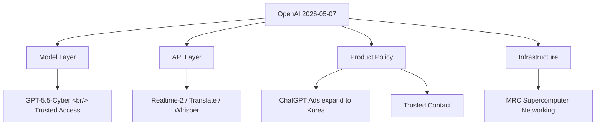
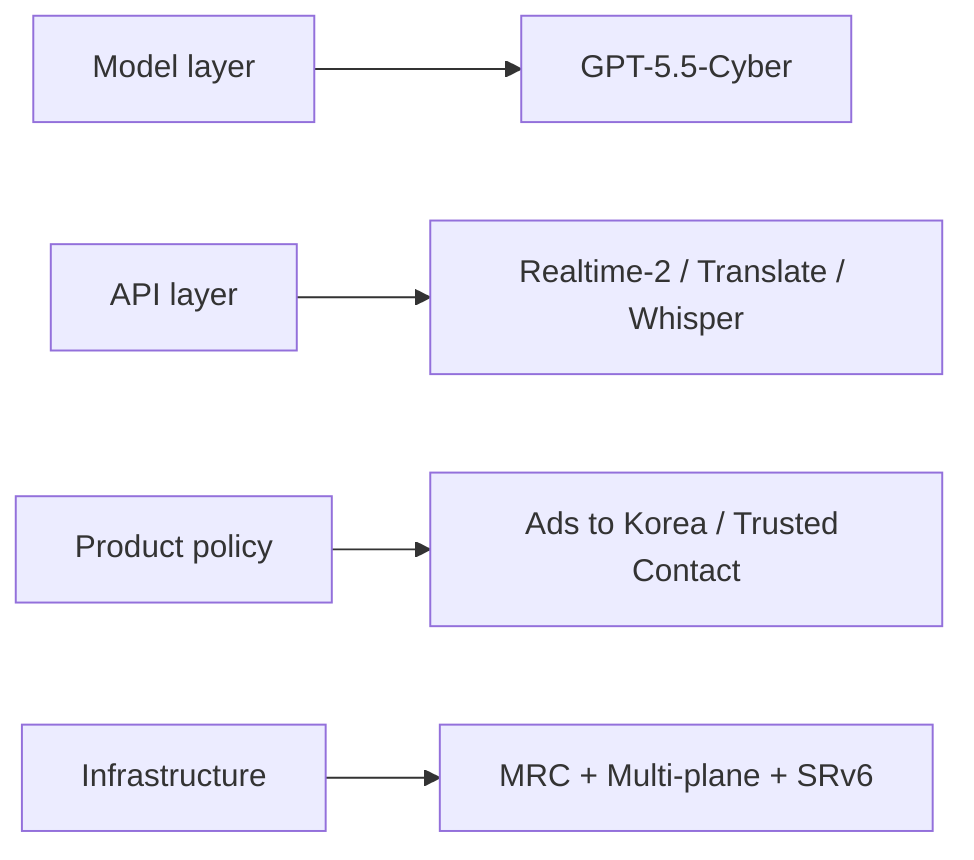

## Overview

OpenAI shipped five official announcements on the same day. Read together, they form a coordinated push across four layers — model, API, product policy, infrastructure. Read alone, each one is just another announcement; read as a set, they reveal **where OpenAI is actually putting its weight.**

<!--more-->

## 1. GPT-5.5 + GPT-5.5-Cyber — Trusted Access for Cyber

[Source](https://openai.com/index/gpt-5-5-with-trusted-access-for-cyber)

On top of the GPT-5.5 release two weeks ago, **GPT-5.5-Cyber** ships in limited preview to defenders responsible for critical infrastructure.

Trusted Access for Cyber (TAC) is an identity- and trust-based framework. Verified defenders get reduced classifier refusals to unlock vulnerability triage, malware analysis, binary reverse engineering, detection engineering, and patch validation.

**Three access tiers:**
- **GPT-5.5 (default)** — standard safeguards
- **GPT-5.5 with TAC** — relaxed safeguards for verified defensive work
- **GPT-5.5-Cyber** — most permissive, for authorized red teaming and pentesting

Starting 2026-06-01, TAC users must enable phishing-resistant Advanced Account Security. Organizations can attest at the SSO layer instead.

> This is OpenAI's answer to "what if AI is used for offensive security?" — instead of blanket refusal, **policy is split by verified-identity whitelisting**.

## 2. ChatGPT Ads — Expanding to Korea

[Source](https://openai.com/index/testing-ads-in-chatgpt)

The ad pilot that started in the US on 2026-02-09 expands in May to **the UK, Mexico, Brazil, Japan, and South Korea.**

| Item | Detail |
|---|---|
| In scope | Logged-in adults on Free / Go tiers |
| Not in scope | Plus / Pro / Business / Enterprise / Education |
| Effect on answers | None; ads are visually labeled |
| Advertiser access | No conversation, memory, or personal data — aggregate stats only |
| Opt-out | Free tier can opt out by accepting fewer daily free messages |
| Excluded contexts | Suspected under-18 accounts, sensitive topics (health, mental health, politics) |

**Korea is now in scope.** This is the first major pivot of the AI free-tier business model toward ad funding.

## 3. Trusted Contact in ChatGPT

[Source](https://openai.com/index/introducing-trusted-contact-in-chatgpt)

If self-harm or a serious safety concern is detected, an opt-in feature notifies a single trusted adult the user has nominated in advance. **18+ globally, 19+ in South Korea.**

**Flow:**
1. Automated monitoring → user is told their Trusted Contact may be notified
2. A trained human review team reviews within an hour
3. Notification sent via email, SMS, or in-app
4. Notification content is intentionally limited — no chat content or transcripts included

It extends the existing parent-notification feature (for minor accounts) up to adult users. AI moves from being a passive responder to **a bridge into real-world human safety nets.**

## 4. Three Realtime Voice Models — GPT-Realtime-2 / Translate / Whisper

[Source](https://openai.com/index/advancing-voice-intelligence-with-new-models-in-the-api)

The most directly developer-facing announcement. Three models drop together.

### GPT-Realtime-2
- **Context expanded from 32K to 128K** (a 4x bump for long agentic workflows)
- Preambles (short filler phrases like "let me check that"), parallel tool calls + tool transparency, stronger recovery behavior
- Five reasoning levels (minimal / low / medium / high / xhigh, default = low)
- Big Bench Audio +15.2%, Audio MultiChallenge +13.8% over previous generation

### GPT-Realtime-Translate
- 70+ input languages, 13 output languages — real-time translation plus transcription
- BolnaAI case study: −12.5% WER on Hindi, Tamil, Telugu

### GPT-Realtime-Whisper
- Low-latency streaming STT — for live captions in meetings, broadcasts, classrooms

### Pricing (Realtime API)
| Model | Price |
|---|---|
| GPT-Realtime-2 | $32 / 1M audio input, $64 / 1M audio output, cached input $0.40 / 1M |
| GPT-Realtime-Translate | $0.034 / min |
| GPT-Realtime-Whisper | $0.017 / min |

Voice agent builders now have faster, smarter models available immediately. **The 128K context plus parallel tool calls are the load-bearing pieces** — without them, long voice agent flows snap.

## 5. MRC — OpenAI's Supercomputer Networking

[Source](https://openai.com/index/mrc-supercomputer-networking)

The deepest engineering write-up of the day. **MRC (Multipath Reliable Connection)** is a new protocol embedded in 800Gb/s network interfaces, extending RoCE with SRv6 source routing.

**Three core ideas:**

1. **Multi-plane topology** — Each 800Gb/s interface is split into 8 × 100Gb/s planes. A 64-port 800G switch becomes 512-port 100G. **131K GPUs can be wired with only two switch tiers** (where conventional fabrics need three or four).

2. **Packet spraying** — A transfer is sprayed across hundreds of paths instead of one. Packets can arrive out of order; each carries the final memory address in its header so the destination reorders.

3. **SRv6 source routing** — BGP-style dynamic routing is dropped. Senders encode the path into the IPv6 address; switches just check their own ID and forward. Static routing tables only.

**Result:** Even with link flaps multiple times per minute, synchronous training shows no measurable impact. Rebooting four tier-1 switches no longer requires coordinating with the training team. AMD, Broadcom, Intel, Microsoft, and NVIDIA collaborated; the spec is contributed to OCP. Already deployed on NVIDIA GB200 Stargate (OCI Abilene, Texas) and Microsoft Fairwater.

**This is the new infrastructure standard for an era where the bottleneck has shifted from GPU to network.** Frontier model training is now a five-company consortium output, not a single company's work.

## The Pattern, Stacked

If you had to summarize "what did OpenAI do today?" in one line: **"Released a security model, expanded ads into Korea, opened a self-harm safety net, dropped three voice models, and standardized supercomputer networking."**

## Insights

The fact that all five landed at the same time is itself the message. OpenAI is now **a full-stack company moving on four layers simultaneously** — not just a model lab, but a company that pushes its standards into model, API, policy, and infrastructure all at once. Korea took two direct hits this day: the ad pilot and Trusted Contact (with its 19+ rule). For developers, the three Realtime voice models are an immediate make-money play. MRC's contribution to OCP signals OpenAI is now setting infrastructure standards rather than just consuming them — anchoring a chip + switch + protocol consortium around its workload. **Voice agent builders are the market segment most likely to move fastest next quarter.** GPT-5.5-Cyber is the first split in the policy tree by domain; expect similar trusted-access patterns next in legal and medical verticals.
