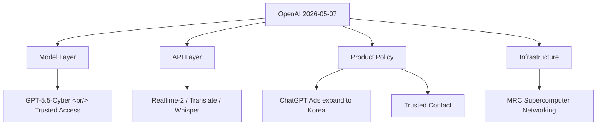
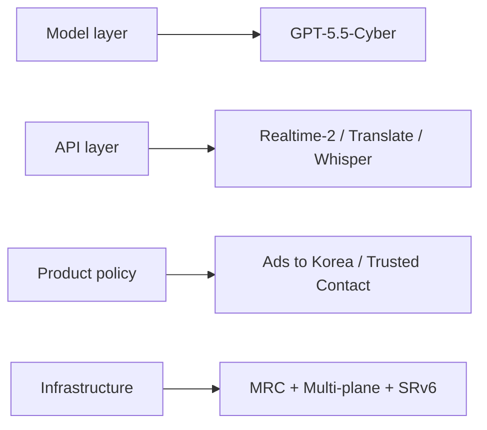

## Overview

OpenAI shipped five official announcements on the same day. Read together, they form a coordinated push across four layers — model, API, product policy, infrastructure. Read alone, each one is just another announcement; read as a set, they reveal **where OpenAI is actually putting its weight.**

<!--more-->

## 1. GPT-5.5 + GPT-5.5-Cyber — Trusted Access for Cyber

On top of the already-released [GPT-5.5](https://openai.com/index/gpt-5-5-instant/), OpenAI is shipping [GPT-5.5-Cyber](https://openai.com/index/gpt-5-5-with-trusted-access-for-cyber) in limited preview to defenders responsible for critical infrastructure.

[Trusted Access for Cyber (TAC)](https://openai.com/index/scaling-trusted-access-for-cyber-defense/) is an identity- and trust-based framework. Verified defenders get reduced classifier refusals to unlock vulnerability triage, malware analysis, binary reverse engineering, detection engineering, and patch validation.

**Three access tiers:**
- **GPT-5.5 (default)** — standard safeguards
- **GPT-5.5 with TAC** — relaxed safeguards for verified defensive work
- **GPT-5.5-Cyber** — most permissive, for authorized red teaming and pentesting

Starting 2026-06-01, TAC users must enable [phishing-resistant Advanced Account Security](https://openai.com/index/advanced-account-security/). Organizations can attest at the SSO layer instead.

> This is OpenAI's answer to "what if AI is used for offensive security?" — instead of blanket refusal, **policy is split by verified-identity whitelisting.**

## 2. ChatGPT Ads — Expanding to Korea

The [ChatGPT ads pilot](https://openai.com/index/testing-ads-in-chatgpt) that started in the US on 2026-02-09 expands in May to **the UK, Mexico, Brazil, Japan, and South Korea.** Advertiser sign-up at [openai.com/advertisers](https://openai.com/advertisers/); operating principles are documented [separately](https://openai.com/index/our-approach-to-advertising-and-expanding-access/).

| Item | Detail |
|---|---|
| In scope | Logged-in adults on Free / Go tiers |
| Not in scope | Plus / Pro / Business / Enterprise / Education |
| Effect on answers | None; ads are visually labeled |
| Advertiser access | No conversation, memory, or personal data — aggregate stats only |
| Opt-out | Free tier can opt out by accepting fewer daily free messages |
| Excluded contexts | Suspected under-18 accounts, sensitive topics (health, mental health, politics) |

**Korea is now in scope.** This is the first major pivot of the AI free-tier business model toward ad funding. New ad buying models are being [previewed separately](https://openai.com/index/new-ways-to-buy-chatgpt-ads/).

## 3. Trusted Contact in ChatGPT

[Trusted Contact](https://openai.com/index/introducing-trusted-contact-in-chatgpt) — if self-harm or a serious safety concern is detected, an opt-in feature notifies a single trusted adult the user has nominated in advance. **18+ globally, 19+ in South Korea.** Operating guide at the [help center](https://help.openai.com/en/articles/20001105-trusted-contacts-in-chatgpt).

**Flow:**
1. Automated monitoring → user is told their Trusted Contact may be notified
2. A trained human review team reviews within an hour
3. Notification sent via email, SMS, or in-app
4. Notification content is intentionally limited — no chat content or transcripts included

It extends the existing [parent-notification feature](https://chatgpt.com/parent-resources/) (for minor accounts) up to adult users. Designed in collaboration with the [American Psychological Association](https://www.apa.org/), [170+ mental health experts](https://openai.com/index/strengthening-chatgpt-responses-in-sensitive-conversations/), and the [OpenAI Global Physicians Network](https://openai.com/index/openai-for-healthcare/).

AI moves from being a passive responder to **a bridge into real-world human safety nets.** [Localized crisis hotlines](https://openai.com/index/helping-people-when-they-need-it-most/) remain in place as a separate layer.

## 4. Three Realtime Voice Models — GPT-Realtime-2 / Translate / Whisper

[The most directly developer-facing announcement](https://openai.com/index/advancing-voice-intelligence-with-new-models-in-the-api). Three models drop together via the [Realtime API](https://platform.openai.com/audio/realtime).

### GPT-Realtime-2
- **Context expanded from 32K to 128K** (a 4x bump for long agentic workflows)
- Preambles (short filler phrases like "let me check that"), parallel tool calls + tool transparency, stronger recovery behavior
- Five reasoning levels (minimal / low / medium / high / xhigh, default = low)
- [Big Bench Audio](https://artificialanalysis.ai/methodology/speech-to-speech-benchmarking) +15.2%, [Audio MultiChallenge](https://labs.scale.com/leaderboard/audiomc-audio) +13.8% over previous generation
- Adoption cases: [Zillow](https://www.zillow.com/) real-estate voice assistant, [Priceline](https://www.priceline.com/) trip manager

### GPT-Realtime-Translate
- 70+ input languages, 13 output languages — real-time translation plus transcription
- [BolnaAI](https://www.bolna.ai/) case study: −12.5% WER on Hindi, Tamil, Telugu
- [Deutsche Telekom](https://www.telekom.com/) testing for multilingual voice support

### GPT-Realtime-Whisper
- Low-latency streaming STT — for live captions in meetings, broadcasts, classrooms

### Pricing (Realtime API)
| Model | Price |
|---|---|
| GPT-Realtime-2 | $32 / 1M audio input, $64 / 1M audio output, cached input $0.40 / 1M |
| GPT-Realtime-Translate | $0.034 / min |
| GPT-Realtime-Whisper | $0.017 / min |

Additional safeguards via the [OpenAI Agents SDK guardrails](https://openai.github.io/openai-agents-js/guides/guardrails/), with [EU data residency](https://platform.openai.com/docs/guides/your-data#data-residency-controls) supported. Build paths include dropping a single prompt into [Codex](https://openai.com/codex/).

Voice agent builders now have faster, smarter models available immediately. **The 128K context plus parallel tool calls are the load-bearing pieces** — without them, long voice agent flows snap.

## 5. MRC — OpenAI's Supercomputer Networking

The deepest engineering write-up of the day. **[MRC (Multipath Reliable Connection)](https://openai.com/index/mrc-supercomputer-networking)** is a new protocol embedded in 800Gb/s network interfaces, extending RoCE with SRv6 source routing. Full spec is published as a [co-authored paper PDF](https://cdn.openai.com/pdf/resilient-ai-supercomputer-networking-using-mrc-and-srv6.pdf).

**Three core ideas:**

1. **Multi-plane topology** — Each 800Gb/s interface is split into 8 × 100Gb/s planes. A 64-port 800G switch becomes 512-port 100G. **131K GPUs can be wired with only two switch tiers** (where conventional fabrics need three or four).

2. **Packet spraying** — A transfer is sprayed across hundreds of paths instead of one. Packets can arrive out of order; each carries the final memory address in its header so the destination reorders.

3. **SRv6 source routing** — BGP-style dynamic routing is dropped. Senders encode the path into the IPv6 address; switches just check their own ID and forward. Static routing tables only.

**Result:** Even with link flaps multiple times per minute, synchronous training shows no measurable impact. Rebooting four tier-1 switches no longer requires coordinating with the training team.

This work is a **five-company consortium**: [AMD](https://www.amd.com/en/blogs/2026/amd-advances-ai-networking-at-scale-with-mrc.html) · [Broadcom](https://www.broadcom.com/blog/enabling-ai-networking-scale-with-multi-path-reliable-connections-mrc-) · [Microsoft](https://aka.ms/BuildingResilientNetworksForAISupercomputers) · [NVIDIA](https://blogs.nvidia.com/blog/spectrum-x-ethernet-mrc/) · Intel. The spec is contributed to the [Open Compute Project](https://www.opencompute.org/) for the community. Already deployed on the NVIDIA GB200 cluster of [Stargate (OCI Abilene, Texas)](https://openai.com/index/building-the-compute-infrastructure-for-the-intelligence-age/) and Microsoft Fairwater. The protocol builds on standards from the [Ultra Ethernet Consortium](https://ultraethernet.org/) and [IBTA](https://www.infinibandta.org/).

**This is the new infrastructure standard for an era where the bottleneck has shifted from GPU to network.** Frontier model training is now a five-company consortium output, not a single company's work.

## The Pattern, Stacked

If you had to summarize "what did OpenAI do today?" in one line: **"Released a security model, expanded ads into Korea, opened a self-harm safety net, dropped three voice models, and standardized supercomputer networking."**

## Insights

The fact that all five landed at the same time is itself the message. OpenAI is now **a full-stack company moving on four layers simultaneously** — not just a model lab, but a company that pushes its standards into model, API, policy, and infrastructure all at once. Korea took two direct hits this day: the ad pilot and Trusted Contact (with its 19+ rule). For developers, the three Realtime voice models are an immediate make-money play. MRC's contribution to OCP signals OpenAI is now setting infrastructure standards rather than just consuming them — anchoring a chip + switch + protocol consortium around its workload. **Voice agent builders are the market segment most likely to move fastest next quarter.** GPT-5.5-Cyber is the first split in the policy tree by domain; expect similar trusted-access patterns next in legal and medical verticals.

## References

**OpenAI announcements (the five)**
- [GPT-5.5 + Trusted Access for Cyber](https://openai.com/index/gpt-5-5-with-trusted-access-for-cyber)
- [Testing ads in ChatGPT](https://openai.com/index/testing-ads-in-chatgpt)
- [Introducing Trusted Contact in ChatGPT](https://openai.com/index/introducing-trusted-contact-in-chatgpt)
- [Advancing voice intelligence with new models in the API](https://openai.com/index/advancing-voice-intelligence-with-new-models-in-the-api)
- [MRC supercomputer networking](https://openai.com/index/mrc-supercomputer-networking)

**MRC partner blogs / paper**
- Paper PDF: [Resilient AI Supercomputer Networking using MRC and SRv6](https://cdn.openai.com/pdf/resilient-ai-supercomputer-networking-using-mrc-and-srv6.pdf)
- [AMD: AI networking at scale with MRC](https://www.amd.com/en/blogs/2026/amd-advances-ai-networking-at-scale-with-mrc.html)
- [Broadcom: Enabling AI networking scale with MRC](https://www.broadcom.com/blog/enabling-ai-networking-scale-with-multi-path-reliable-connections-mrc-)
- [Microsoft: Building Resilient Networks for AI Supercomputers](https://aka.ms/BuildingResilientNetworksForAISupercomputers)
- [NVIDIA: Spectrum-X Ethernet + MRC](https://blogs.nvidia.com/blog/spectrum-x-ethernet-mrc/)
- [Open Compute Project](https://www.opencompute.org/) · [UEC](https://ultraethernet.org/) · [IBTA](https://www.infinibandta.org/)

**Voice model benchmarks**
- [Big Bench Audio (Artificial Analysis)](https://artificialanalysis.ai/methodology/speech-to-speech-benchmarking)
- [Audio MultiChallenge (Scale Labs)](https://labs.scale.com/leaderboard/audiomc-audio)

**Related OpenAI pages**
- [Realtime API Playground](https://platform.openai.com/audio/realtime) · [Codex](https://openai.com/codex/) · [Agents SDK guardrails](https://openai.github.io/openai-agents-js/guides/guardrails/)
- [Stargate / Compute Infrastructure](https://openai.com/index/building-the-compute-infrastructure-for-the-intelligence-age/)
- [Advanced Account Security](https://openai.com/index/advanced-account-security/) · [Advertising principles](https://openai.com/index/our-approach-to-advertising-and-expanding-access/)
