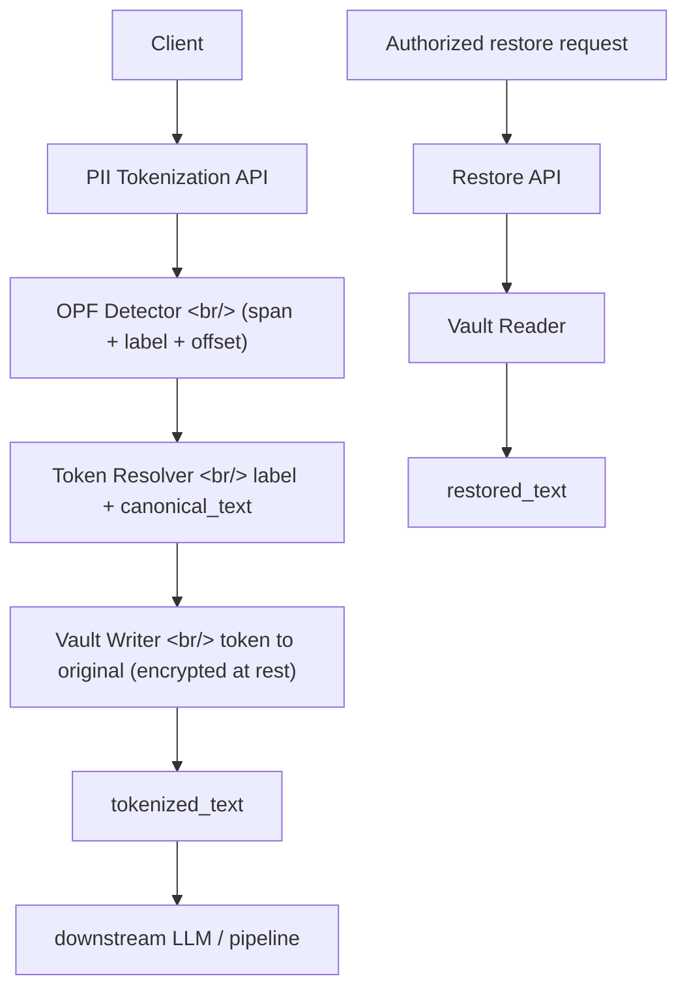

## Overview

OpenAI Privacy Filter (OPF) detects PII spans in text and replaces them with typed placeholders like `<PRIVATE_PERSON>`. The default behavior is **irreversible redaction** — if the same person appears five times, all five get collapsed into the same generic placeholder, and every relationship between mentions is destroyed.

[deformatic/OPENAI-Privacy-Filter-Reversible-Tokenization](https://github.com/deformatic/OPENAI-Privacy-Filter-Reversible-Tokenization) bolts an opt-in **reversible tokenization vault** layer on top. Masking is preserved, but the same entity gets the same indexed token (`<PRIVATE_PERSON_1>`), and the original values are stored in a separate vault that only authorized callers can read. **One day old at the time of sharing.** Apache 2.0, Python, 20 stars.

<!--more-->



## Default OPF vs Reversible Layer

Default OPF:

```text
Alice emailed Bob.
->
<PRIVATE_PERSON> emailed <PRIVATE_PERSON>.
```

→ "Are these two people the same or different?" is no longer recoverable.

Reversible layer:

```text
Alice emailed Bob. Alice's phone is 555-1111.
->
<PRIVATE_PERSON_1> emailed <PRIVATE_PERSON_2>. <PRIVATE_PERSON_1>'s phone is <PRIVATE_PHONE_1>.
```

Plus a separate vault:

```json
{
  "schema_version": "opf.reversible.v1",
  "vault_id": "7c1d...",
  "entries": {
    "<PRIVATE_PERSON_1>": {
      "label": "private_person",
      "text": "Alice",
      "canonical_text": "Alice",
      "index": 1
    }
  }
}
```

## The Key Distinction

> *"This is **not anonymization**. It is **recoverable pseudonymization**. The tokenized text is useful only if the vault is protected like source PII."* — README

[Pseudonymization and anonymization are explicitly distinguished in the GDPR](https://gdpr-info.eu/art-4-gdpr/). Anonymized data is no longer personal data and falls outside GDPR; **pseudonymized data is still personal data** ([GDPR Recital 26](https://gdpr-info.eu/recitals/no-26/)). So while keeping the vault separate gives compliance leverage at service boundaries, the vault itself must be protected at the same security tier as the source PII.

## The Problem It Solves

Plain redaction strips sensitive values but **also destroys the relationships downstream still needs**:

1. A reviewer needs to see that the same person appears multiple times.
2. A downstream LLM task needs consistent placeholders for names, emails, phones, account numbers, secrets.
3. A data pipeline needs to restore originals after enrichment, approval, or internal processing.
4. A service boundary may allow tokenized text out of an enclave while requiring the vault to stay inside.

## Design Principles

- **Backward compatible** — existing `redact()` behavior unchanged
- **Explicit opt-in** — reversible only via `OPF.tokenize()` or `opf --recoverable`
- **Model agnostic** — no changes to checkpoint, decoder, Viterbi, training, or eval paths
- **Stable per value** — same `label + canonical_text` → same token within a vault
- **Batch friendly** — one vault can be reused across many inputs
- **Auditable** — token mappings serialized in a clear schema (`opf.reversible.v1`)
- **Security aware** — README and schema both state plaintext vaults are development-grade only

## Token Assignment Rules

Within a single vault:

- Same label + same canonical text → same token
- Same label + different canonical text → next index
- Different label + same text → different token family
- Source text collision → skip to next available index
- Overlapping spans → raise `ValueError`

## Why It Matters

- Pseudonymization is the most practical of the "masking vs anonymization vs pseudonymization" trichotomy, but open-source implementations were essentially nonexistent. This is one answer.
- A separated vault enables a **compliance argument**: "tokenized text sent to an LLM provider is not a PII transmission" — provided the vault is protected.
- It maps cleanly onto the patterns LLM pipelines are increasingly hitting as they enter enterprise.

## References

### Repo
- [deformatic/OPENAI-Privacy-Filter-Reversible-Tokenization](https://github.com/deformatic/OPENAI-Privacy-Filter-Reversible-Tokenization) — Apache 2.0, Python, 20 stars at time of writing
- Upstream [OpenAI Privacy Filter (OPF)](https://github.com/openai/openai-privacy-filter) — span detection + masking

### Privacy concepts
- [GDPR Article 4 — Definitions](https://gdpr-info.eu/art-4-gdpr/) (pseudonymization / anonymization)
- [GDPR Recital 26 — Not applicable to anonymous data](https://gdpr-info.eu/recitals/no-26/)
- [Apache License 2.0](https://www.apache.org/licenses/LICENSE-2.0)

### Related infra
- [OpenAI Platform — Privacy & Data Use](https://platform.openai.com/docs/guides/your-data)
- [OpenAI Agents SDK — Guardrails](https://openai.github.io/openai-agents-js/guides/guardrails/)

## Insights

Pseudonymization is the spot where most LLM pipelines stall once they enter compliance territory. Full redaction kills downstream quality; sending raw text crosses the boundary. This layer aims directly at the gap: tokenized text can leave the enclave, the vault stays inside. The design itself is small and clean — model path untouched, opt-in only, existing `redact()` preserved verbatim. But as the README hammers home, **the vault must be protected at the same security tier as the source PII**, and a plaintext vault is development-grade only — never production. Twenty stars in a day suggests this pattern was already running as in-house tooling at multiple teams; what was missing was a public reference implementation. Because the upstream OPF model path is left untouched, this is a clean PR-able extension rather than a fork — there's a real chance of upstream merge, which would be the right ending for a feature that should arguably ship inside OPF itself.
