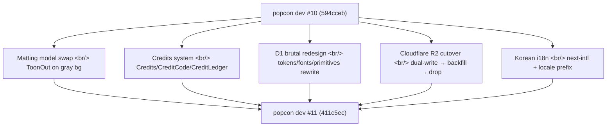
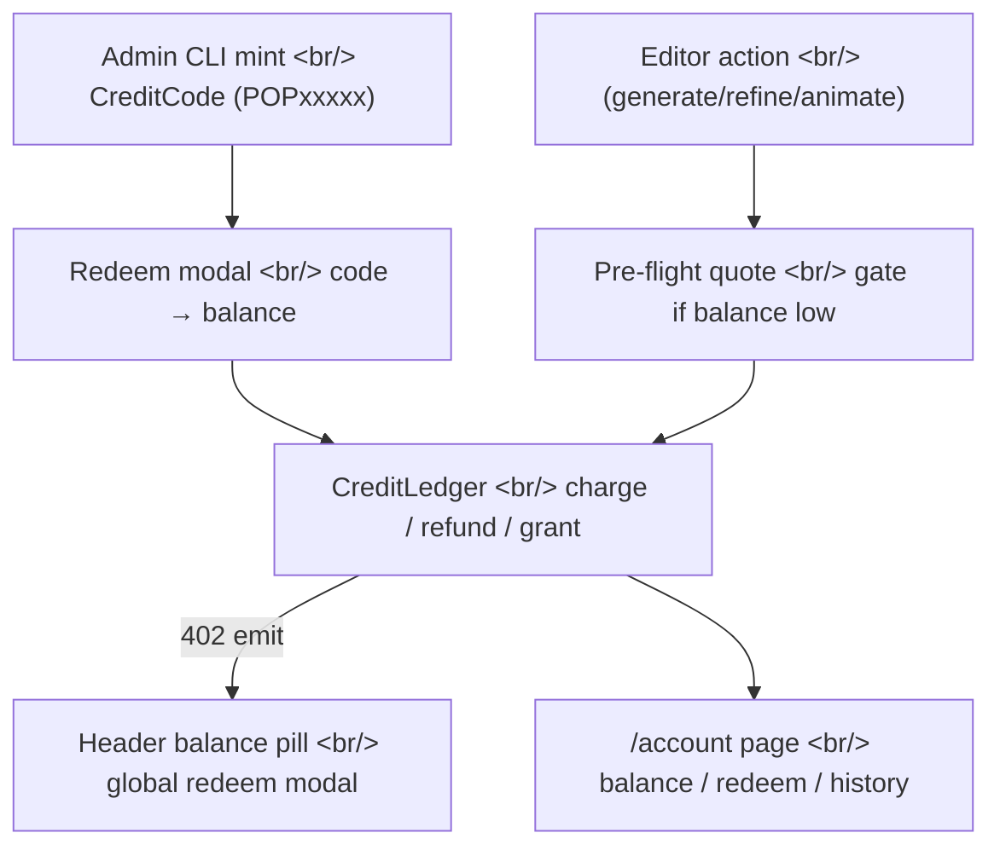
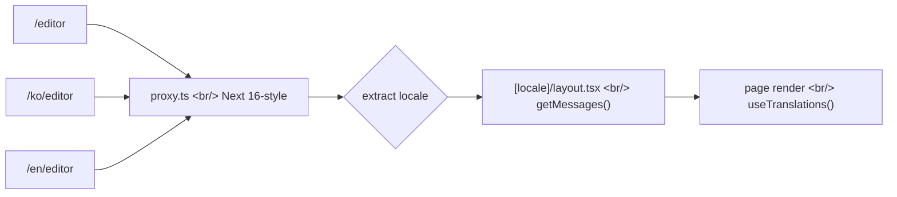

## Overview

Since [#10 — beta signups, balloon indicator, countdown](/posts/2026-04-22-popcon-dev10/), fifteen days have rolled in too much for a single dev log. Matting model swap, payments (credits), Cloudflare R2 cutover, brutal redesign, and Korean i18n — 156 commits across five effectively independent milestones.

<!--more-->



This post covers all five at once, but the same question echoes through every track — **"how do we hop onto a new rail without stopping the existing system."**

---

## Matting model: BiRefNet → ToonOut

popcon separates the character from its background and composites that mask into 12 emoji actions. The previous matting model was trained on photographs and broke down on anime hair and translucent regions.

[ToonOut](https://github.com/MatteoKartoon/BiRefNet) is [BiRefNet](https://github.com/zhengpeng7/birefnet) fine-tuned on 1,228 hand-annotated anime images. Pixel accuracy jumps from 95.3% to 99.5% on the test set.

```python
# gpu_worker — composite onto gray before feeding ToonOut
# (ToonOut training-time gray = #808080)
def _swap_bg_to_gray(rgba: np.ndarray) -> np.ndarray:
    """Soft white-key compositor: alpha-blend onto #808080."""
    alpha = rgba[..., 3:4] / 255.0
    rgb = rgba[..., :3]
    gray = np.full_like(rgb, 128)
    return (rgb * alpha + gray * (1 - alpha)).astype(np.uint8)
```

Two pre/post details that mattered:

1. **Single source of truth for bg color** — made `bg_color` authoritative on the backend and standardized to `#808080` (commit `430f985`). The frontend and worker had been drifting on slightly different grays.
2. **Pylette per-character gray pick** — uses the Rec.709 luminance rule to pick a gray that matches the character's average brightness (commit `94544df`). The library I wrote about [in the Pylette post](/posts/2026-04-22-pylette/) finally has a real consumer.

While refactoring, a dynamic indirection turned out to be cargo-cult and got removed; the mask-fill threshold finally got a name (`081ddd6`).

---

## Credits system: a full payment loop in five days

Beta is wrapping, and we needed a credits system from scratch — SQLAlchemy ORM through to a frontend 402 handler — before flipping to paid.



Three core decisions:

- **Ledger pattern** — `CreditLedger` is append-only; `Credits.balance` is a cached column. Every charge/refund runs in a strict transaction (`e28b100`).
- **Global 402 event** — when the backend throws HTTP 402 for insufficient balance, the frontend `useCredits()` hook auto-refreshes and surfaces a global redeem modal (`d25739e`, `1a32900`).
- **Stage-failure refund** — if emoji generation fails partway, that stage's credits auto-refund (`6d7cc7f`). No manual support tickets.

A small mishap in the middle: I tried sending Gemini's `image_size` as `"0.5K"` to match the pricing tier — Gemini rejects that with INVALID_ARGUMENT (`b1ac23f` revert → `55eda01` corrects to `"512"`). The pricing-table notation and the API input notation aren't the same value space. I assumed they were.

Commit `360115e` is the funny one. During a refactor, the `POP` brand prefix got auto-changed to `P0P` (zero instead of letter O). Reverted. AI was being a little too eager about "consistency."

---

## D1 brutal redesign: tokens up

popcon was running a generic Tailwind look. To match the flyer/branding, the whole UI got a brutal overhaul — chunky black borders, hard shadows, a 5-tone palette, bold sans-serifs.

New font stack:
- **Archivo Black** — English headlines
- **Black Han Sans** — Korean headlines
- **Jua** — Korean body
- **JetBrains Mono** — code/numerics
- **Pretendard** — Korean fallback

```css
/* tokens.css — 5-tone brutal palette */
:root {
  --paper: #fafaf7;     /* page bg */
  --ink: #1a1a1a;       /* body text + borders */
  --violet: #7c3aed;    /* brand (P logo, actions) */
  --yellow: #fbbf24;    /* active emphasis (ZIP button etc) */
  --pink: #ec4899;      /* erase / warning */
  --mint: #10b981;      /* success */
}
```

Primitives got rewritten — `Card`, `Chip` (5 tones × 2 sizes), `StatusDot`, `Input`, `Textarea`, `Button` (5 variants × 3 sizes), `StepIndicator`. All in brutal style (`769df10` ~ `0e013a8`).

Pages were swapped one at a time — landing → editor panels → archive → account → auth modal → header. Each commit is one page or panel, so reviews stayed readable.

The trickiest part was **scrim handling**. The old design used a white veil; brutal demanded an ink scrim (semi-transparent black). But on the SAM2 / matte refine modal the ink scrim was so heavy you couldn't see the reference image — so scrim became per-modal (`99b1908`, `4096ba7`).

A WCAG AA pass caught one issue too: white text on the pink Erase active state was sub-AA, swapped to ink (`4827ed4`).

---

## Cloudflare R2 cutover: phased in four steps

popcon was writing emoji zips/APNGs/videos to the local disk of a fly.io machine. As we scale to multiple machines, assets fragment across disks and download routing breaks. Time to move to R2 (Cloudflare's S3-compatible object store).

To do this without downtime, I split it into four phases:

| Phase | Content | PR |
|--------|------|-----|
| **A** | R2 client wrapper + `blob_key` DB columns | #5 |
| **B** | Worker dual-writes — local disk **and** R2 | #6 |
| **C** | Backfill script + frontend passes through absolute R2 URLs | #7 |
| **D** | Drop legacy file routes; `/download_job` 302 redirect; scratch GC | #8 |

I waited between each phase to confirm traffic looked clean. The dual-write phase costs more (writing to both backends) but bought rollback safety — if anything broke, I could just turn off the R2 path and disk was still truth.

Two follow-ups:
- **Rehydrate URLs from R2 keys** (`b43e802`) — instead of storing absolute R2 URLs, derive them from `blob_key` every time. Endpoint changes don't require migrations.
- **Restore legacy asset routes** (`1e08937`) — for users with in-flight jobs from before the cutover. Caught a bonus bug along the way: R2 URLs were being mistakenly mirrored into filesystem-path columns (`83d62c4`).

---

## Korean i18n: next-intl + locale-prefixed routes



Korean was added with next-intl + locale-prefixed routes. Two key decisions:

1. **Move pages under a `[locale]` segment** — `app/page.tsx` → `app/[locale]/page.tsx`. The layout splits into a root layout and a locale layout (`fe1eaa3`).
2. **Use Next 16's `proxy.ts` for locale routing** — instead of middleware (`4f322e2`). Static routing means caching works.

Translations are split by namespace — `home`, `editor`, `archive`, `account`, `redeem`, `actions`, `picker`, etc. Each page/panel has its own commit, which makes greps clean.

One bug surfaced in the language switcher: switching language dropped search params, killing in-progress editor jobs. Replaced both `Link` and `router` with locale-aware wrappers that preserve search params (`d644b1b`, PR #12).

Also caught: in-app browsers (KakaoTalk, Instagram) block Google sign-in. Added an escape-to-external-browser guard (`29cd743`).

---

## Ops: SKIP_RUNPOD guard and sync-pod-id

Deploys are fly.io (API + frontend) + RunPod (GPU worker) + a GitHub Actions cron scheduler. The scheduler shuts down the RunPod pod overnight to save money. But manually-spawned dev pods were getting killed by the same scheduler.

Fix: `SKIP_RUNPOD` env-var guard (`e3fa9fa`). When set, the scheduler leaves pods alone. An escape hatch for manual ops.

Also added `sync-pod-id` (`783238b`) — auto-syncs a new RunPod ID into fly secrets. Used to be a manual fly secrets update that I'd forget.

One more line that mattered: `fly(frontend)` warm-machine config (`edf3d18`, PR #9). Keep one frontend machine warm at 512 MB. Cold start dropped from 1.5s → 200ms.

---

## Insights

Looking back over the 156 commits, the surprising thing is how **parallel** these tracks ran. Matting/R2 were backend/worker. Brutal redesign was frontend. Credits and i18n were full-stack. Five tracks ran simultaneously and merge conflicts stayed minor — module boundaries were sharp enough to keep them apart.

The R2 phased cutover pattern is the one I'd reuse first. The dual-write phase costs a little — writing to both backends — but it buys a clean rollback. If phase B had broken anything, we could've just disabled the R2 path and disk would still be truth.

The credit ledger pattern is also a keeper. Cache `Credits.balance` on the row, but keep `CreditLedger` append-only. If anyone questions a balance, you re-derive from the ledger. This is exactly Stripe's model.

For redesigns, rebuilding the tokens and primitives **before** touching pages was decisive. Touch pages first and you end up with old components that don't pick up the new tokens, lingering forever.

Coming up in dev #12: payment gateway integration (KG Inicis / PortOne), ToonOut matting quality A/B against the previous model, and the i18n micro-gaps left over (error toasts, admin CLI strings).
