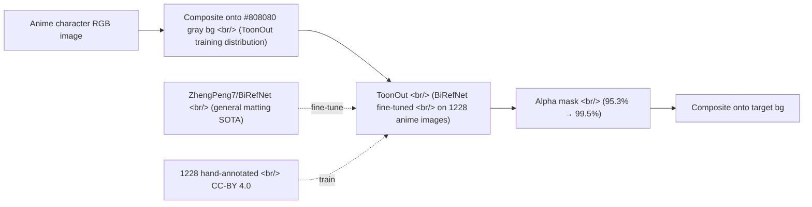

## Overview

In [popcon dev #11](/posts/2026-05-07-popcon-dev11/) I swapped the matting model to ToonOut. Reading the two GitHub repos side-by-side makes the story clear — [ZhengPeng7/BiRefNet](https://github.com/zhengpeng7/birefnet) (CAAI AIR'24, ★3,397, near-SOTA general matting) and [MatteoKartoon/BiRefNet](https://github.com/MatteoKartoon/BiRefNet) (anime-only fine-tune, ★94, arXiv:2509.06839). A clean example of the base-model + domain-fine-tune pattern.

<!--more-->



---

## BiRefNet — Bilateral Reference, dichotomous image segmentation

The original BiRefNet is a 2024 paper in CAAI Artificial Intelligence Research. "Dichotomous image segmentation" is the task of cleanly splitting foreground (salient) from background. What sets it apart from generic matting:

- **High-resolution training** — 1024×1024 input + denser supervision than typical matting setups.
- **Bilateral reference** — the decoder consults the input image twice in the forward pass. First a coarse segmentation, then fine-grained refinement. Strong on thin structures like hair.
- **Salient object + camouflaged object + DIS unified** — the model handles three tasks together, which boosts generalization.

The repo's News timeline shows ongoing maintenance:

| Date | Change |
|------|------|
| 2025-02-12 | `BiRefNet_HR-matting` — trained at 2048×2048, dedicated high-res matting |
| 2025-03-31 | `BiRefNet_dynamic` — dynamic resolution training from 256×256 to 2304×2304. **Robust at any resolution** |
| 2025-05-15 | Fine-tuning tutorial video on YouTube/Bilibili |
| 2025-06-30 | `refine_foreground` accelerated 8x — ~80ms on a 5090 |
| 2025-09-23 | Swin transformer attention swapped for PyTorch SDPA, less memory + future flash_attn compatibility |

`BiRefNet_dynamic` is the one to watch. Trained on a dynamic resolution range (256→2304), so inference is robust at arbitrary resolutions. Previously you had to resize inputs to the training resolution; the dynamic model removes that step.

GPU sponsorship is also explicit — Freepik provided GPUs for high-resolution training. A pattern: academic models maturing into production-grade releases.

---

## ToonOut — fine-tuning on 1,228 hand-annotated images

ToonOut is a fork of BiRefNet. The headline number from the README:

> ...we collected and annotated a custom dataset of **1,228 high-quality anime images**... The resulting model, **ToonOut**, shows marked improvements in background removal accuracy for anime-style images, achieving an increase in Pixel Accuracy from **95.3% to 99.5%** on our test set.

1,228 is a small fine-tuning set. And yet it earned a 4.2-point pixel-accuracy gain. **Which means the base BiRefNet was already strong; only the domain gap needed closing.** When you fine-tune a model that already works well on generic matting onto an anime distribution, you're not learning the entire distribution again — you're exposing it to edge-case patterns (hair, transparency, anime shading), and 1,228 images was enough.

### Dataset structure

```
toonout_dataset/
├── train/
│   ├── train_generations_20250318_emotion/
│   │   ├── im/    # raw RGB
│   │   ├── gt/    # ground-truth alpha mask
│   │   └── an/    # combined RGBA
```

The `im/gt/an` triple is the standard matting dataset shape. The dataset license is CC-BY 4.0 and the model weights are MIT, so production use has minimal constraints.

### Fork-specific changes

What ToonOut adjusted from upstream BiRefNet:

- **bfloat16 to dodge NaN gradients** — the original fp16 training apparently had instability issues. `train_finetuning.sh` standardizes to `bfloat16`.
- **Evaluation script fix** — a corrected `evaluations.py` replaces the original `eval_existingOnes.py`.
- **Five fundamental scripts** — the split/train/test/eval/visualize pipeline tidied into bash entrypoints.
- **Utility scripts** — baseline prediction, alpha-mask extraction, and a **Photoroom API integration**.

That last one is interesting. Photoroom is the strong commercial player in BG-removal. Bringing it in as a baseline means the ToonOut paper evaluated on three axes — academic SOTA + commercial API + ours. An academic paper with a production-grade evaluation perspective.

The GPU disclaimer is also honest — training was done on 2× RTX 4090s with 24GB. That's roughly a week of cloud compute. This level of fine-tuning is in reach of an individual.

---

## Integrating ToonOut into popcon

One more thing I learned during the swap: **ToonOut assumes a #808080 gray background in its training distribution.** Pass it RGBA on white or any other background and the matting result wobbles.

```python
# gpu_worker — always composite onto #808080 before ToonOut
def _swap_bg_to_gray(rgba: np.ndarray) -> np.ndarray:
    """Soft white-key compositor: alpha-blend onto #808080."""
    alpha = rgba[..., 3:4] / 255.0
    rgb = rgba[..., :3]
    gray = np.full_like(rgb, 128)
    return (rgb * alpha + gray * (1 - alpha)).astype(np.uint8)
```

This is a small case of "training distribution alignment." Normalizing inputs to match what the model trained on changes inference accuracy noticeably. The README doesn't state this explicitly, but the training scripts and the RGBA images in the `an/` folder strongly suggest the training data was already pre-composited on gray.

---

## Insights

ToonOut is a clean example of how to do domain fine-tuning. Three patterns:

1. **Base-model selection is half the work.** Because BiRefNet was already near-SOTA on general matting, 1,228 anime images was enough. With a weaker base, ten thousand wouldn't have been.
2. **Separate licensing for dataset and weights.** Dataset is CC-BY, weights are MIT. Others can use the weights in production unrestricted, and the dataset is open to both academic and commercial work.
3. **Input distribution alignment at inference.** A small step that normalizes inputs to the training distribution (here: composite onto gray) materially affects accuracy.

BiRefNet's News timeline is itself a study aid. You can watch a model evolve from academic release into production grade — dynamic resolution, attention backend swap, 8x foreground-refine acceleration — and a year of maintenance patterns reveals itself line by line.

Up next: the evaluation methodology in the ToonOut paper (arXiv:2509.06839), implementation details of BiRefNet_dynamic's dynamic-resolution training, and the matting-quality A/B metric in popcon (previous model vs ToonOut).
