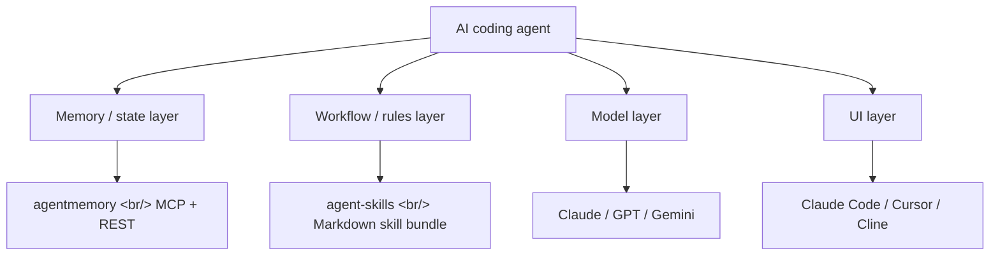
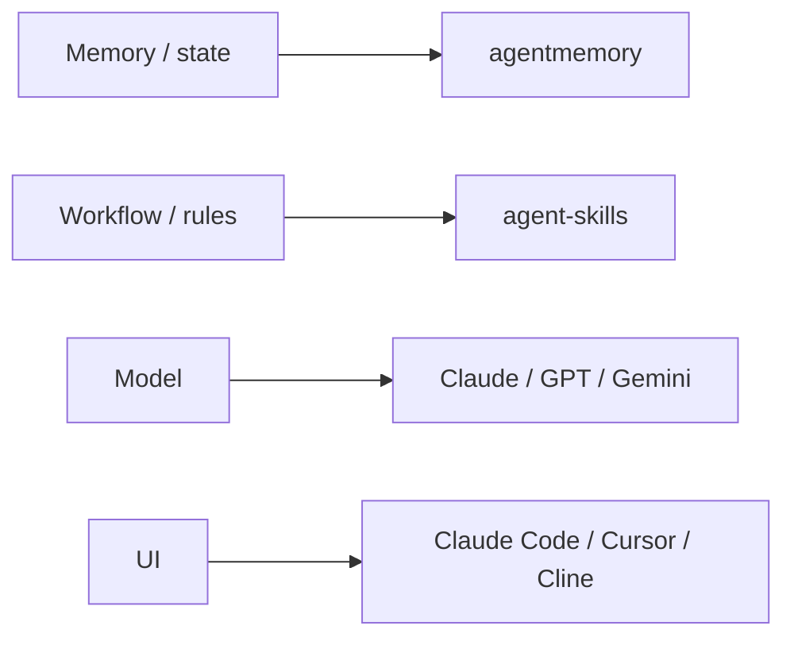

## Overview

Two GitHub links, dropped 30 seconds apart at the same minute. Both target ergonomic gaps in AI coding agents, but **they target different gaps.** [rohitg00/agentmemory](https://github.com/rohitg00/agentmemory) tackles cross-session memory infrastructure; [addyosmani/agent-skills](https://github.com/addyosmani/agent-skills) tackles senior-engineer workflow enforcement. Read together, they sketch out an emerging OS layer for the agent era.

Update 2026-05-10: Four new skills repos surfaced shortly after this post and reinforce the argument — covered in a new section below.

<!--more-->



## 1. agentmemory — Persistent Memory Shared Across Every Agent via MCP

[rohitg00/agentmemory](https://github.com/rohitg00/agentmemory) brands itself as *"#1 Persistent memory for AI coding agents based on real-world benchmarks."* Created 2026-02-25, ~2,400 stars, Apache 2.0. Project home: [agent-memory.dev](https://agent-memory.dev).

### The problem it solves

- Re-explaining the architecture to the agent every session
- Rediscovering the same bug
- Re-teaching the same preferences (library choices, code style)
- Built-in memory like `CLAUDE.md` or `.cursorrules` is **capped at 200 lines and goes stale fast**

### How it works

The agent silently captures what it does → compresses → stores as searchable memory → injects only the relevant context at the start of the next session. The key trick: stand up a single [MCP](https://modelcontextprotocol.io/) server and 16+ agents share the same memory.

Supported clients:

- [Claude Code](https://www.anthropic.com/claude-code) · [Cursor](https://cursor.com/) · [Gemini CLI](https://github.com/google-gemini/gemini-cli) · [Codex CLI](https://openai.com/codex/)
- [Cline](https://cline.bot/) · [Goose](https://block.github.io/goose/) · [Windsurf](https://windsurf.com/) · [Roo Code](https://roocode.com/) · [OpenCode](https://opencode.ai/)
- Any agent without MCP can connect via REST (104 endpoints)

Embeddings run locally with [`all-MiniLM-L6-v2`](https://huggingface.co/sentence-transformers/all-MiniLM-L6-v2) — no API keys, free.

### Benchmark — LongMemEval-S

Numbers on [LongMemEval](https://arxiv.org/abs/2410.10813) (ICLR 2025, 500 questions):

| Metric | agentmemory | BM25 fallback |
|---|---|---|
| R@5 | 95.2% | 86.2% |
| R@10 | 98.6% | — |
| MRR | 88.2% | — |

Hybrid embedding retrieval beats keyword-only BM25 by **9 percentage points on R@5.**

### Token cost

| Approach | Annual tokens | Annual cost |
|---|---|---|
| Full context paste | 19.5M+ | Exceeds context window |
| LLM-summarized | ~650K | ~$500 |
| **agentmemory** | **~170K** | **~$10** |
| agentmemory + local embeddings | ~170K | **$0** |

### Quick start

```bash
npx @agentmemory/agentmemory
```

### What it really argues

The bet underneath agentmemory is one sentence — **"memory belongs in the infrastructure layer, not the agent."** Instead of every agent writing its own memory, one MCP server fans out to all of them. Whatever Claude Code learns flows into the next Cursor session intact. The project started about 50 days earlier as a viral GitHub gist (1,050 stars) and is essentially that design doc rendered into code: [Karpathy's LLM Wiki pattern](https://github.com/karpathy) plus confidence scoring, lifecycle, knowledge graph, and hybrid search.

## 2. agent-skills — Senior-Engineer Workflow as a Skill Bundle

[addyosmani/agent-skills](https://github.com/addyosmani/agent-skills) calls itself *"Production-grade engineering skills for AI coding agents."* Created 2026-02-15, ~33,500 stars, MIT. At the same point in time it has 14× the stars of agentmemory — currently the strongest candidate for an agent-workflow standard.

### The problem it solves

"The agent writes code, but it doesn't write code like a senior would."

- Skips the spec
- Skips the tests
- Doesn't think about security
- Drops a giant PR all at once

### A six-stage lifecycle

```
DEFINE → PLAN → BUILD → VERIFY → REVIEW → SHIP
/spec   /plan   /build   /test    /review  /ship
```

Each slash command corresponds to one lifecycle stage and auto-activates the right skills.

### The 20 skills, by stage

- **Define**: idea-refine, spec-driven-development
- **Plan**: planning-and-task-breakdown
- **Build**: incremental-implementation, test-driven-development, context-engineering, source-driven-development, frontend-ui-engineering, api-and-interface-design
- **Verify**: browser-testing-with-devtools, debugging-and-error-recovery
- **Review**: code-review-and-quality, code-simplification, security-and-hardening, performance-optimization
- **Ship**: git-workflow-and-versioning, ci-cd-and-automation, deprecation-and-migration, documentation-and-adrs, shipping-and-launch

### Where it runs

- [Claude Code](https://www.anthropic.com/claude-code) (recommended, marketplace-installed): `/plugin marketplace add addyosmani/agent-skills`
- [Cursor](https://cursor.com/): copy SKILL.md into `.cursor/rules/`
- [Gemini CLI](https://github.com/google-gemini/gemini-cli) · [Windsurf](https://windsurf.com/) · [OpenCode](https://opencode.ai/) · [GitHub Copilot](https://github.com/features/copilot) · [Kiro IDE](https://kiro.dev/) · [Codex](https://openai.com/codex/) — **anything that reads Markdown works**

### Agent personas

- `code-reviewer` — Senior staff engineer lens, "would a staff engineer approve this?"
- `test-engineer` — QA discipline, the Prove-It pattern
- `security-auditor` — [OWASP](https://owasp.org/), threat modeling

### What it really argues

agent-skills' bet is **"the difference between agents isn't model weight — it's how strictly the workflow is enforced."** TDD here isn't "you can do TDD" — it's "no Red-Green-Refactor, no code." Code review isn't a vibe; it's five-axis review, 100-line size limits, explicit Nit/Optional/FYI severity labels. By expressing all of this in Markdown, it stays **agent-agnostic** — the same skill bundle works in Claude, Cursor, and Gemini. 33K stars is the market saying this is the closest thing to a workflow standard right now.

## 3. Side by side

| Dimension | agentmemory | agent-skills |
|---|---|---|
| Author | rohitg00 | addyosmani |
| Form | TypeScript library + MCP server | Markdown skill bundle |
| License | Apache 2.0 | MIT |
| Stars (2026-05) | ~2,400 | ~33,500 |
| Created | 2026-02-25 | 2026-02-15 |
| Domain | Memory / state infrastructure | Engineering workflow |
| Decoupling mechanism | MCP standard | Markdown standard |

## 4. The Combined Picture — An OS Layer for Agents



Three or four years ago "which IDE do you use?" was the deciding question. Now it's becoming **"what's your memory and skills setup?"** Both projects deliberately decouple from any one model — [MCP](https://modelcontextprotocol.io/) for one, plain Markdown for the other — designed so that **models can be swapped, but the memory and skills accumulate.**

## 5. The Skills Ecosystem Is Crystallizing — Four More Repos in the Same Direction

Two days after the original post, four more repositories that surfaced shortly after make the same point from different angles. First, [hesreallyhim/awesome-claude-code](https://github.com/hesreallyhim/awesome-claude-code) (~43K stars, created 2025-04, an [awesome-list](https://github.com/sindresorhus/awesome)) curates skills, hooks, slash-commands, agent orchestrators, and plugins in one place — the fact that "Claude Code ecosystem" now stands on its own as an awesome-list category is itself a maturity signal. Second, well-known TypeScript educator Matt Pocock has open-sourced his actual `.claude/` directory as [mattpocock/skills](https://github.com/mattpocock/skills) (~69K stars, "Skills for Real Engineers, straight from my .claude directory"); he explicitly rejects heavy process frameworks like GSD, BMAD, and Spec-Kit because they "take away your control," and instead picks small composable skills — `/grill-me`, `/tdd`, `/diagnose` — that exactly match the "Markdown standard" bet this post described.

Third, [SuperClaude-Org/SuperClaude_Framework](https://github.com/SuperClaude-Org/SuperClaude_Framework) (~22.7K stars, MIT, [project site](https://superclaude.netlify.app/)) bundles 30 slash commands, 20 specialized agents, 7 behavioral modes, and 8 [MCP](https://modelcontextprotocol.io/) servers to "transform Claude Code into a structured development platform" — essentially a more opinionated extension of addyosmani's six-stage lifecycle. Fourth, [forrestchang/andrej-karpathy-skills](https://github.com/forrestchang/andrej-karpathy-skills) (~123K stars) distills [Andrej Karpathy's tweet](https://x.com/karpathy/status/2015883857489522876) on LLM coding pitfalls into a single `CLAUDE.md` with four principles (Think Before Coding, Simplicity First, Surgical Changes, Goal-Driven Execution) — a direct descendant of the "Karpathy LLM Wiki pattern" cited in the original post. **An awesome-list that stands on its own as a category, an individual senior open-sourcing his skills directory verbatim, a heavy framework wrapping 30 slash commands, and a 100K-star repo condensing one coding luminary's principles into a single file — that all four arrive within three days is direct evidence that the argument this blog made on 2026-05-08 — workflow belongs in the infrastructure layer — is calcifying into consensus.** It is no longer one 33K-star agent-skills, but five repositories stacked on the same bet, converging at the same time.

## Insights

The headline of this digest isn't either tool individually — it's that two links shared 30 seconds apart fill exactly two distinct slots in the agent OS layer. agentmemory pulls **state** down into the infrastructure; agent-skills pulls **process** down into the infrastructure. The fact that both decouple from models in similar ways — one MCP server, one Markdown bundle — is the same bet from two angles: models are interchangeable but memory and skills must compound. The 33K vs 2.4K stars gap probably isn't about timing; it's a signal that the workflow-standard candidate is consolidating faster than the memory-infrastructure candidate. **Two open questions for next quarter** — does memory standardize on MCP, and do skill bundles like agent-skills become a new SaaS category inside IDE marketplaces? The decision point has already started shifting from IDE choice to memory and skill setup.

## References

**Core repos**

- [rohitg00/agentmemory](https://github.com/rohitg00/agentmemory) · home: [agent-memory.dev](https://agent-memory.dev)
- [addyosmani/agent-skills](https://github.com/addyosmani/agent-skills)

**Skills collections (2026-05-10 update)**

- [hesreallyhim/awesome-claude-code](https://github.com/hesreallyhim/awesome-claude-code) — awesome-list for Claude Code resources (~43K stars)
- [mattpocock/skills](https://github.com/mattpocock/skills) — Matt Pocock's `.claude/` directory, "Skills for Real Engineers" (~69K stars)
- [SuperClaude-Org/SuperClaude_Framework](https://github.com/SuperClaude-Org/SuperClaude_Framework) — 30 commands + 20 agents + 8 MCP servers (~22.7K stars)
- [forrestchang/andrej-karpathy-skills](https://github.com/forrestchang/andrej-karpathy-skills) — Karpathy's four principles in one `CLAUDE.md` (~123K stars)

**Related agents and clients**

- [Claude Code](https://www.anthropic.com/claude-code) · [Cursor](https://cursor.com/) · [Cline](https://cline.bot/) · [Windsurf](https://windsurf.com/)
- [Gemini CLI](https://github.com/google-gemini/gemini-cli) · [Codex](https://openai.com/codex/) · [OpenCode](https://opencode.ai/) · [Goose](https://block.github.io/goose/) · [Roo Code](https://roocode.com/)
- [GitHub Copilot](https://github.com/features/copilot) · [Kiro IDE](https://kiro.dev/)

**Protocols and standards**

- [Model Context Protocol (MCP)](https://modelcontextprotocol.io/)
- [OWASP](https://owasp.org/) — basis for the security-auditor persona

**Benchmarks and embeddings**

- Paper: [LongMemEval (arXiv:2410.10813, ICLR 2025)](https://arxiv.org/abs/2410.10813)
- [`sentence-transformers/all-MiniLM-L6-v2`](https://huggingface.co/sentence-transformers/all-MiniLM-L6-v2) — local embedding model used by agentmemory
