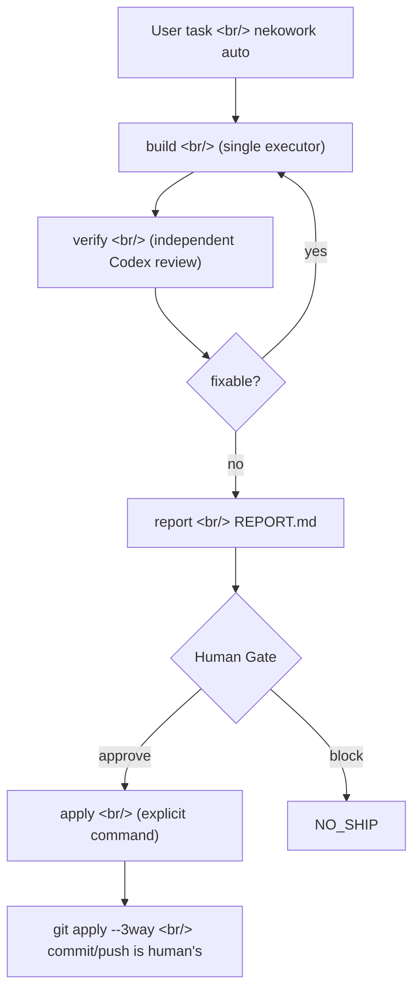

## Overview

[Ps-Neko/NEKOWORK](https://github.com/Ps-Neko/NEKOWORK) is a solo-developer [npm package](https://www.npmjs.com/package/@ps-neko/nekowork) first pushed on 2026-04-29 and bumped to `0.1.0-alpha.8` on 2026-05-08. The name is cute; the positioning is serious — **"Verified Autopilot for AI code changes."** It sits as a one-layer runtime on top of [Claude Code](https://www.anthropic.com/claude-code), [Codex CLI](https://github.com/openai/codex), [Cursor](https://cursor.com), [Gemini CLI](https://github.com/google-gemini/gemini-cli), and [OpenCode](https://opencode.ai), forcing every AI-authored change to **produce evidence, pass independent verification, and earn explicit human approval** before it can touch a repo. The unusual move: it doesn't compete on agent-catalog size. It competes on the verification loop itself.

<!--more-->



## 1. What NEKOWORK refuses first

The first screen of the [README](https://github.com/Ps-Neko/NEKOWORK#readme) is the product pitch:

```text
No auto-commit. No auto-push. No surprise deploy.
```

While [Cursor's Composer auto mode](https://docs.cursor.com/composer/overview), [Aider's auto-commit default](https://aider.chat/docs/usage/commands.html), and full-auto agents like [Devin](https://devin.ai) all brag about "the human never touches a button and a PR appears," NEKOWORK rejects exactly that posture. `apply` is **always a separate command**, and the `auto` command **explicitly refuses the `--apply` flag**.

What it produces instead is evidence: `work-summary.json`, `verify-summary.json`, `ship-summary.json`, `gate-summary.json`, and the human-facing first screen, `REPORT.md`.

## 2. One manifest, five surfaces

[`agent.yaml`](https://github.com/Ps-Neko/NEKOWORK/blob/main/agent.yaml) is the source of truth. Agents, skills, hooks, profiles, modules, and MCP pins all live there, and builder scripts project them into five harness directories:

| Target | Output dir | Builder |
|---|---|---|
| Claude Code | `.claude/` | `scripts/build-claude.js` |
| Codex CLI | `.codex/config.toml` | `scripts/build-codex.js` |
| Cursor | `.cursor/` | `scripts/build-cursor.js` |
| Gemini CLI | `.gemini/` | `scripts/build-gemini.js` |
| OpenCode | `.opencode/` | `scripts/build-opencode.js` |

The pattern follows the `gitagent/0.1.0` spec declared at the top of `agent.yaml`. Similar ideas appear in [continue.dev's hub](https://hub.continue.dev) and [Anthropic's Skills](https://docs.anthropic.com/en/docs/build-with-claude/skills), but NEKOWORK takes a stronger position: **the per-harness catalog is a build artifact**. If a specific harness dies, the manifest survives.

[SOUL.md](https://github.com/Ps-Neko/NEKOWORK/blob/main/SOUL.md) puts it in one line — "Even if Claude Code disappears, the same catalog must run on Codex, Cursor, Gemini, OpenCode, or an internal LLM."

## 3. The core invariant — one executor, one verifier

[ARCHITECTURE.md](https://github.com/Ps-Neko/NEKOWORK/blob/main/docs/ARCHITECTURE.md#product-invariants) nails it down:

- Multi-worker phases are **read-only by default**
- Only **one executor** may mutate project files in a work cycle
- Codex review is the **default independent verification path**
- Sensitive changes require a [Codex challenge](https://github.com/Ps-Neko/NEKOWORK/blob/main/agents) or Human Gate
- Profiles may add capabilities but cannot weaken safety gates

The `team` command lets multiple workers think in parallel, but the output is a **read-only handoff**. The actual mutation happens in `work`, where a single executor owns writes. This is why NEKOWORK refuses to become "yet another 100-agent pack" — the promise isn't catalog size, it's **mutation singularity**.

The idea borrows from system-design patterns like [git's single-writer index](https://git-scm.com/docs/index-format) and [single-leader replication in databases](https://martin.kleppmann.com/2017/03/27/designing-data-intensive-applications.html), but applied to the AI agent layer. Once you've watched a [multi-agent framework](https://github.com/microsoft/autogen) hit conflicts where two agents touch the same file, this decision makes sense.

## 4. CLI surface — deliberately small

The [public commands](https://github.com/Ps-Neko/NEKOWORK/blob/main/docs/ARCHITECTURE.md#public-flow) you see in `nekowork --help`:

```text
check   — local readiness check
ask     — clarify goal/scope/risk without provider calls
plan    — create a planning handoff
team    — read-only multi-worker handoffs
work    — single-executor implementation + isolated diff
verify  — Codex-only verification
gate    — Human Gate approve/block
ship    — ship/no-ship readiness
report  — write REPORT.md (no project mutation)
apply   — apply a verified SHIP_READY diff explicitly
run     — work -> verify -> ship bundle
build   — one-command builder wrapper (fast/safe/team/tdd/release)
auto    — bounded autonomy before the apply boundary
```

Compare this to the command surface of [Aider](https://aider.chat) or [Claude Code](https://www.anthropic.com/claude-code). Aider is closer to interactive chat; Claude Code is slash commands plus skills. NEKOWORK makes **each pipeline stage an explicit CLI command**. `work` doesn't run `verify`, `verify` doesn't run `ship`, and `ship` will never `apply`. This is the Unix philosophy — **each command does one job** — applied to AI agent workflows.

## 5. Risk classifier and mode safety

`manifests/build-modes.json` lists the safety ordering of the five modes (`fast`, `safe`, `team`, `tdd`, `release`), and `build` auto-classifies the task to pick the right one. Crucially, it **refuses explicit downgrades** — the README example:

```bash
build "change OAuth token validation" --mode fast
# Blocked: auto routing recommends `safe`
```

You can override with `--force-mode`, but that becomes a signed declaration ("I am deliberately accepting this downgrade") and is recorded as evidence. The pattern echoes [npm semver strict mode](https://docs.npmjs.com/cli/v10/configuring-npm/package-json#engines) and [Kubernetes admission controllers](https://kubernetes.io/docs/reference/access-authn-authz/admission-controllers/) — safe by default, override is explicit, override is auditable.

## 6. Provider auth — long-lived API keys blocked by default

A telling detail. NEKOWORK defaults to [delegated CLI auth](https://github.com/Ps-Neko/NEKOWORK/blob/main/docs/AUTH-MIGRATION.md). It uses local CLI sessions (`claude auth status`, `codex login`, `gemini`) and **blocks long-lived env vars** like `ANTHROPIC_API_KEY`, `OPENAI_API_KEY`, `GEMINI_API_KEY` before provider calls.

```text
Risk: provider-auth / long-lived-secret
Codex verdict: request_changes
Human Gate: required
```

Explicit opt-in is required via `HARNESS_AUTH_ALLOW_ENV_OVERRIDE=1`. This aligns with [Anthropic's recommended security pattern](https://docs.anthropic.com/en/api/getting-started#authentication) and the trend documented in [GitGuardian's State of Secrets Sprawl](https://www.gitguardian.com/state-of-secrets-sprawl-report-2024). A solo developer making this the default from day one is rare.

## 7. The depth of a solo project — assessment

NEKOWORK has zero stars and zero forks. And yet, for a one-person side project, the repo structure is **abnormally deep**:

- `293 tests / 0 moderate+ npm audit issues` — full CI on an alpha
- `docs/` has 35+ files — ARCHITECTURE, SAFETY-GUARANTEES, TRUST-MODEL, WHY-NOT-AUTOPILOT, and more
- [CODE_OF_CONDUCT.md](https://www.contributor-covenant.org), [SECURITY.md](https://github.com/Ps-Neko/NEKOWORK/blob/main/SECURITY.md), [CONTRIBUTING.md](https://github.com/Ps-Neko/NEKOWORK/blob/main/CONTRIBUTING.md) — full OSS hygiene
- `.mcp.json`, `bridge/mcp-server.js` — an [MCP gateway](https://modelcontextprotocol.io) baked in
- `8 case-study flows / 5 starter packs` — real external-run evidence is being collected

The competitive position becomes sharper next to peers:

- [Cline](https://github.com/cline/cline) — a million+ installs, interactive agent inside the IDE
- [Aider](https://aider.chat) — 30k stars, git-native AI pair programming
- [Devin](https://devin.ai) — closed-source full-auto agent
- [continue.dev](https://www.continue.dev) — IDE extension plus hub catalog
- [Block's Goose](https://github.com/block/goose) — local agent framework

All of them compete on "how fast/well does the AI write." NEKOWORK competes on **"how do we verify and stop what the AI wrote."** As market positioning, it's closer to [Chef InSpec](https://www.chef.io/products/chef-inspec) or [Open Policy Agent](https://www.openpolicyagent.org) — a compliance layer for AI agent runtimes.

## 8. What a good solo side project looks like

NEKOWORK has zero stars and almost no external validation. To be honest, there's a real chance this disappears within six months. But the reason this repo is worth a look anyway is **how a single developer encoded their own invariants directly into the code**:

- **Refused to chase catalog size** — the README front-loads "this is not a 100-agent pack."
- **Made the Human Gate unbypassable** — `auto` rejecting `--apply` is a code-level decision, not a doc-level recommendation.
- **One manifest, five harnesses** — built for a future where any one vendor tool dies.
- **Long-lived API keys blocked by default** — secret hygiene as the default from day one for a solo dev.

This is a small version of [Linus's "talk is cheap, show me the code"](https://lkml.org/lkml/2000/8/25/132). Many people write about AI agent safety; far fewer **bake their workflow invariants into CLI behavior**.

## Insights

Whether NEKOWORK survives in the market is open. The [`@ps-neko/nekowork@alpha`](https://www.npmjs.com/package/@ps-neko/nekowork) package could be active in six months, or it could join the long tail of archived solo-dev repos. What's clear is the takeaway: **the next round of competition in AI coding tools may not be "how fast does it write," but "how does it stop and how does it prove."** While [Cursor Composer](https://docs.cursor.com/composer/overview), [Anthropic Claude Code](https://www.anthropic.com/claude-code), [GitHub Copilot Workspace](https://github.com/features/copilot), and [Devin](https://devin.ai) widen automation surface area, NEKOWORK bets the opposite direction — on evidence, Human Gate, and explicit apply. That bet has a high chance of becoming standard in enterprise, finance, and healthcare domains, because the audit requirements of [SOC 2](https://www.aicpa-cima.com/topic/audit-assurance/audit-and-assurance-greater-than-soc-2), [ISO 27001](https://www.iso.org/standard/27001), and the [EU AI Act](https://artificialintelligenceact.eu) will eventually flow down into AI agent workflows. The fact that a single developer staked out this position first is interesting in itself. The quickest experiment: run `npx -y @ps-neko/nekowork@alpha check` against one of your own repos and see what surfaces.

## References

**Repository**
- [Ps-Neko/NEKOWORK on GitHub](https://github.com/Ps-Neko/NEKOWORK)
- [NEKOWORK English README](https://github.com/Ps-Neko/NEKOWORK/blob/main/README.md)
- [@ps-neko/nekowork on npm](https://www.npmjs.com/package/@ps-neko/nekowork)
- [agent.yaml manifest](https://github.com/Ps-Neko/NEKOWORK/blob/main/agent.yaml)

**Core docs**
- [ARCHITECTURE.md](https://github.com/Ps-Neko/NEKOWORK/blob/main/docs/ARCHITECTURE.md)
- [WHY-NEKOWORK.md](https://github.com/Ps-Neko/NEKOWORK/blob/main/docs/WHY-NEKOWORK.md)
- [SAFETY-GUARANTEES.md](https://github.com/Ps-Neko/NEKOWORK/blob/main/docs/SAFETY-GUARANTEES.md)
- [TRUST-MODEL.md](https://github.com/Ps-Neko/NEKOWORK/blob/main/docs/TRUST-MODEL.md)
- [WHY-NOT-AUTOPILOT.md](https://github.com/Ps-Neko/NEKOWORK/blob/main/docs/WHY-NOT-AUTOPILOT.md)

**Comparable AI coding tools**
- [Aider](https://aider.chat)
- [Cline](https://github.com/cline/cline)
- [Cursor](https://cursor.com)
- [Devin](https://devin.ai)
- [continue.dev](https://www.continue.dev)
- [Block Goose](https://github.com/block/goose)

**Related ecosystem**
- [Anthropic Claude Code](https://www.anthropic.com/claude-code)
- [OpenAI Codex CLI](https://github.com/openai/codex)
- [Google Gemini CLI](https://github.com/google-gemini/gemini-cli)
- [OpenCode](https://opencode.ai)
- [Model Context Protocol](https://modelcontextprotocol.io)
