## Overview

On 2026-05-07, [vercel/next.js](https://github.com/vercel/next.js) shipped [v16.2.6](https://github.com/vercel/next.js/releases/tag/v16.2.6), a single release that **closes 13 security advisories at once** — 7 High, 4 Moderate, 2 Low. The most accurate one-line read came from the chat room itself: *"Looking at the patch notes, you'll be in trouble if you don't upgrade — extremely critical."* What stands out is not the count but the shape: **three Middleware/Proxy bypasses across different surfaces**, one [WebSocket SSRF](https://github.com/vercel/next.js/security/advisories/GHSA-c4j6-fc7j-m34r), and **three cache-poisoning advisories** — these aren't isolated bugs, they're a common pattern.

```mermaid
graph TD
    Release["Next.js v16.2.6 &lt;br/&gt; 2026-05-07"] --> Bypass["Middleware/Proxy &lt;br/&gt; Bypass × 3"]
    Release --> SSRF["SSRF × 1"]
    Release --> Cache["Cache poisoning × 3"]
    Release --> XSS["XSS × 2"]
    Release --> DoS["DoS × 3"]
    Release --> Other["follow-up × 1"]

    Bypass --> B1["GHSA-267c-6grr-h53f &lt;br/&gt; segment-prefetch"]
    Bypass --> B2["GHSA-492v-c6pp-mqqv &lt;br/&gt; dynamic route param"]
    Bypass --> B3["GHSA-36qx-fr4f-26g5 &lt;br/&gt; Pages Router i18n"]

    SSRF --> S1["GHSA-c4j6-fc7j-m34r &lt;br/&gt; WebSocket upgrade"]

    Cache --> C1["GHSA-wfc6-r584-vfw7 &lt;br/&gt; RSC response"]
    Cache --> C2["GHSA-vfv6-92ff-j949 &lt;br/&gt; RSC cache-busting"]
    Cache --> C3["GHSA-3g8h-86w9-wvmq &lt;br/&gt; redirect"]

    XSS --> X1["GHSA-ffhc-5mcf-pf4q &lt;br/&gt; CSP nonce"]
    XSS --> X2["GHSA-gx5p-jg67-6x7h &lt;br/&gt; beforeInteractive"]

    DoS --> D1["GHSA-8h8q-6873-q5fj &lt;br/&gt; Server Components"]
    DoS --> D2["GHSA-mg66-mrh9-m8jx &lt;br/&gt; Cache Components"]
    DoS --> D3["GHSA-h64f-5h5j-jqjh &lt;br/&gt; Image API"]

    Other --> O1["GHSA-26hh-7cqf-hhc6 &lt;br/&gt; incomplete fix"]
```

<!--more-->



## 1. Middleware/Proxy Bypass × 3 — The Most Dangerous Cluster

[Middleware/Proxy](https://nextjs.org/docs/app/building-your-application/routing/middleware) is the layer where authentication, authorization, and redirects run before a route is reached. **If you can bypass that layer, your auth is meaningless.** v16.2.6 closes bypasses found in three different surfaces at once.

- [GHSA-267c-6grr-h53f](https://github.com/vercel/next.js/security/advisories/GHSA-267c-6grr-h53f) — middleware bypass via **App Router segment-prefetch routes** (High)
- [GHSA-26hh-7cqf-hhc6](https://github.com/vercel/next.js/security/advisories/GHSA-26hh-7cqf-hhc6) — **incomplete-fix follow-up** to the above (High)
- [GHSA-492v-c6pp-mqqv](https://github.com/vercel/next.js/security/advisories/GHSA-492v-c6pp-mqqv) — middleware bypass via **dynamic route parameter injection** (High)
- [GHSA-36qx-fr4f-26g5](https://github.com/vercel/next.js/security/advisories/GHSA-36qx-fr4f-26g5) — middleware bypass via **[Pages Router i18n routing](https://nextjs.org/docs/pages/building-your-application/routing/internationalization)** (High)

The fact that the same class of bug appeared on three different surfaces (App Router segments, dynamic routes, Pages Router i18n) is itself the message. **This is not a single bug — it's a class of bugs where Middleware path matching and the actual router disagree on what a path means.** The fact that the team also bundled the incomplete-fix follow-up (`26hh-7cqf-hhc6`) into the same release deserves credit — it minimizes the window in which a known-incomplete patch is exposed.

## 2. SSRF — WebSocket Upgrades

- [GHSA-c4j6-fc7j-m34r](https://github.com/vercel/next.js/security/advisories/GHSA-c4j6-fc7j-m34r) — [Server-Side Request Forgery](https://owasp.org/www-community/attacks/Server_Side_Request_Forgery) via **WebSocket upgrade handling** (High)

A WebSocket upgrade path could be coerced into making outbound requests, meaning an attacker could **scan the internal network, hit cloud metadata endpoints, or call protected internal APIs** through the server. Apps with realtime/streaming features are squarely in the blast radius.

## 3. Cache Poisoning × 3

- [GHSA-wfc6-r584-vfw7](https://github.com/vercel/next.js/security/advisories/GHSA-wfc6-r584-vfw7) — cache poisoning of **RSC responses** (Moderate)
- [GHSA-vfv6-92ff-j949](https://github.com/vercel/next.js/security/advisories/GHSA-vfv6-92ff-j949) — poisoning via **RSC cache-busting collisions** (Low)
- [GHSA-3g8h-86w9-wvmq](https://github.com/vercel/next.js/security/advisories/GHSA-3g8h-86w9-wvmq) — **Middleware/Proxy redirects** can be cache-poisoned (Low)

[React Server Components](https://nextjs.org/docs/app/building-your-application/rendering/server-components) responses are commonly cached at the CDN/Edge layer. Once those caches are poisoned, **arbitrary users get the malicious response served to them.** Two of these are directly attacker-triggerable. The Moderate/Low labels can underplay the real impact depending on your edge cache topology.

## 4. XSS × 2

- [GHSA-ffhc-5mcf-pf4q](https://github.com/vercel/next.js/security/advisories/GHSA-ffhc-5mcf-pf4q) — XSS via App Router **CSP nonce** handling (Moderate)
- [GHSA-gx5p-jg67-6x7h](https://github.com/vercel/next.js/security/advisories/GHSA-gx5p-jg67-6x7h) — XSS when untrusted input reaches the **[`beforeInteractive` script strategy](https://nextjs.org/docs/app/api-reference/components/script#beforeinteractive)** (Moderate)

CSP nonces are the last line of defense against XSS, and the bug being inside that mechanism is what makes it nasty. `beforeInteractive` runs the earliest and most privileged scripts on the page — there isn't a good way to recover from untrusted input at that stage.

## 5. DoS × 3

- [GHSA-8h8q-6873-q5fj](https://github.com/vercel/next.js/security/advisories/GHSA-8h8q-6873-q5fj) — **Server Components** DoS (High)
- [GHSA-mg66-mrh9-m8jx](https://github.com/vercel/next.js/security/advisories/GHSA-mg66-mrh9-m8jx) — **[Cache Components](https://nextjs.org/docs/app/building-your-application/caching)** connection-exhaustion DoS (High)
- [GHSA-h64f-5h5j-jqjh](https://github.com/vercel/next.js/security/advisories/GHSA-h64f-5h5j-jqjh) — **[Image Optimization API](https://nextjs.org/docs/app/api-reference/components/image#image-optimization-api)** DoS (Moderate)

All three are remotely triggerable at low cost, which is why they earned High/Moderate. Cache Components exhausts connections; the Image API burns transform budget.

## What to Do Right Now

```bash
npm install next@16.2.6
yarn add next@16.2.6
pnpm add next@16.2.6
bun add next@16.2.6
```

**Apps using App Router + Middleware for auth should upgrade immediately.** Combine the three bypass advisories and you can reach a state where authentication is effectively bypassed. While you roll out the fix, consider blocking suspicious segment-prefetch patterns and unusual query parameters at the WAF/CDN layer as a temporary buffer.

## Insights

Triage priority is unambiguous — **3 bypasses + 1 SSRF + 3 cache-poisoning advisories landing in one release is itself the loudest signal in this batch.** The fact that middleware bypass appeared on three different surfaces says it isn't one bug; it's a class of defect where **the App Router's matching logic and the router's actual resolution disagree about what a path is.** Even adjusting for Next.js 16 being a relatively new major, 13 advisories in one release is unusual. Bundling the incomplete-fix follow-up into the same release is a good example of responsible disclosure — it shrinks the window when an unfinished patch is in the wild. The chat room's instinct — *"extremely critical"* — is right: this should be the **highest-priority upgrade in your queue.** Zooming out, the release is a hint that **the App Router routing model itself deserves more fuzzing and audit.** As long as middleware matching and the router are independent, the same class of bug is likely to surface again.

## References

**Release**
- [vercel/next.js](https://github.com/vercel/next.js) · [v16.2.6 release notes](https://github.com/vercel/next.js/releases/tag/v16.2.6) (published 2026-05-07)

**High severity advisories**
- [GHSA-8h8q-6873-q5fj](https://github.com/vercel/next.js/security/advisories/GHSA-8h8q-6873-q5fj) — Server Components DoS
- [GHSA-267c-6grr-h53f](https://github.com/vercel/next.js/security/advisories/GHSA-267c-6grr-h53f) — App Router segment-prefetch bypass
- [GHSA-26hh-7cqf-hhc6](https://github.com/vercel/next.js/security/advisories/GHSA-26hh-7cqf-hhc6) — incomplete-fix follow-up
- [GHSA-mg66-mrh9-m8jx](https://github.com/vercel/next.js/security/advisories/GHSA-mg66-mrh9-m8jx) — Cache Components DoS
- [GHSA-492v-c6pp-mqqv](https://github.com/vercel/next.js/security/advisories/GHSA-492v-c6pp-mqqv) — dynamic-route bypass
- [GHSA-c4j6-fc7j-m34r](https://github.com/vercel/next.js/security/advisories/GHSA-c4j6-fc7j-m34r) — WebSocket SSRF
- [GHSA-36qx-fr4f-26g5](https://github.com/vercel/next.js/security/advisories/GHSA-36qx-fr4f-26g5) — Pages Router i18n bypass

**Moderate / Low advisories**
- [GHSA-ffhc-5mcf-pf4q](https://github.com/vercel/next.js/security/advisories/GHSA-ffhc-5mcf-pf4q) — App Router CSP-nonce XSS (Moderate)
- [GHSA-gx5p-jg67-6x7h](https://github.com/vercel/next.js/security/advisories/GHSA-gx5p-jg67-6x7h) — beforeInteractive XSS (Moderate)
- [GHSA-h64f-5h5j-jqjh](https://github.com/vercel/next.js/security/advisories/GHSA-h64f-5h5j-jqjh) — Image Optimization DoS (Moderate)
- [GHSA-wfc6-r584-vfw7](https://github.com/vercel/next.js/security/advisories/GHSA-wfc6-r584-vfw7) — RSC cache poisoning (Moderate)
- [GHSA-vfv6-92ff-j949](https://github.com/vercel/next.js/security/advisories/GHSA-vfv6-92ff-j949) — RSC cache-busting collision (Low)
- [GHSA-3g8h-86w9-wvmq](https://github.com/vercel/next.js/security/advisories/GHSA-3g8h-86w9-wvmq) — Middleware redirect cache poisoning (Low)

**Next.js docs**
- [App Router](https://nextjs.org/docs/app) · [Middleware/Proxy](https://nextjs.org/docs/app/building-your-application/routing/middleware) · [Cache Components](https://nextjs.org/docs/app/building-your-application/caching)
- [Server Components](https://nextjs.org/docs/app/building-your-application/rendering/server-components) · [Image Optimization API](https://nextjs.org/docs/app/api-reference/components/image#image-optimization-api)
- [Pages Router i18n](https://nextjs.org/docs/pages/building-your-application/routing/internationalization) · [`beforeInteractive` script strategy](https://nextjs.org/docs/app/api-reference/components/script#beforeinteractive)
