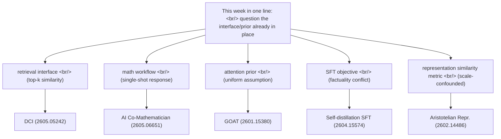
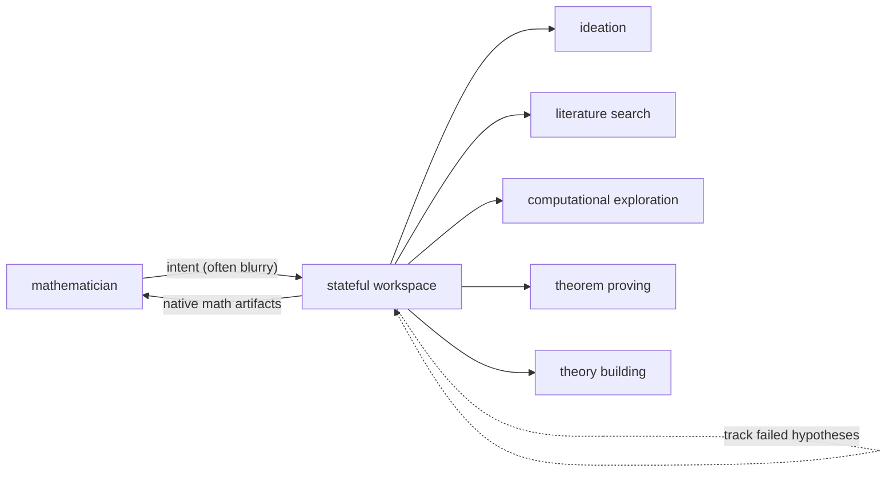
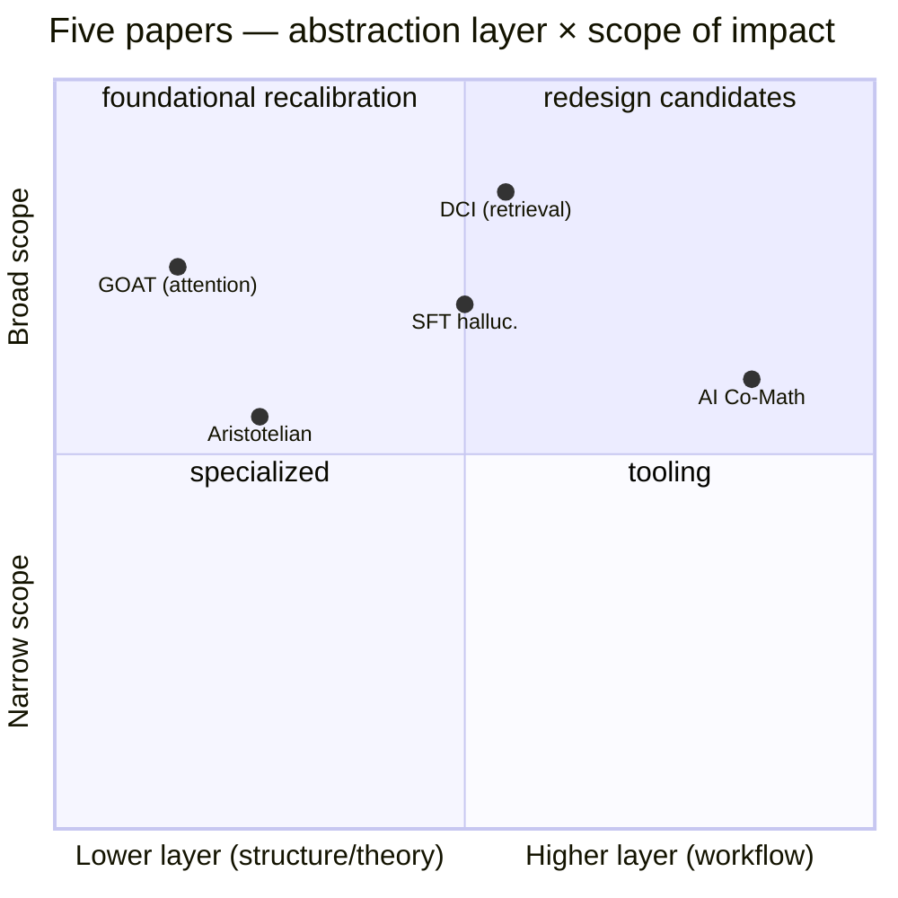

## Overview

Five [arxiv](https://arxiv.org/) papers that caught the eye over the past few days. The fields are scattered — [information retrieval](https://en.wikipedia.org/wiki/Information_retrieval), an agentic workbench for mathematicians, [attention](https://en.wikipedia.org/wiki/Attention_(machine_learning)) architecture, [SFT](https://en.wikipedia.org/wiki/Fine-tuning_(deep_learning))-induced [hallucinations](https://en.wikipedia.org/wiki/Hallucination_(artificial_intelligence)), and [representation learning](https://en.wikipedia.org/wiki/Feature_learning) theory — but read together one question keeps surfacing: **"Are the interfaces and priors we accept without thought actually blocking the model's real capability?"** [The previous digest](/en/p/2026-05-06-arxiv-papers-pick-multiagent-debate-mia-husserl/) traced reasoning gains along three axes (cooperation, persistence, structure). This week drops one layer below — **systematically questioning the abstractions already in place**.

<!--more-->

| # | Paper | Field | One-line summary |
|---|---|---|---|
| 1 | [Direct Corpus Interaction (2605.05242)](https://arxiv.org/abs/2605.05242) | cs.IR | An agent searching raw corpus with `grep` and shell tools beats strong retrievers — no embedding index needed |
| 2 | [AI Co-Mathematician (2605.06651)](https://arxiv.org/abs/2605.06651) | cs.AI | Async, stateful workbench for mathematicians; 48% on [FrontierMath Tier 4](https://epoch.ai/frontiermath) |
| 3 | [GOAT — You Need Better Attention Priors (2601.15380)](https://arxiv.org/abs/2601.15380) | cs.LG | Generalize attention via [Entropic Optimal Transport](https://optimaltransport.github.io/) with a learnable prior |
| 4 | [Why Fine-Tuning Encourages Hallucinations (2604.15574)](https://arxiv.org/abs/2604.15574) | cs.CL | [Self-distillation](https://en.wikipedia.org/wiki/Knowledge_distillation) reduces [SFT](https://en.wikipedia.org/wiki/Fine-tuning_(deep_learning))-induced hallucinations |
| 5 | [Aristotelian Representation Hypothesis (2602.14486)](https://arxiv.org/abs/2602.14486) | cs.LG | The [Platonic Representation](https://phillipi.github.io/prh/) convergence is mostly a metric artifact; real convergence is local |

## 1. Direct Corpus Interaction — 2605.05242

[Zhuofeng Li](https://arxiv.org/a/li_z_1), Haoxiang Zhang, [Pan Lu](https://lupantech.github.io/), [Shangbin Feng](https://bunsenfeng.github.io/), [Ming Zhong](https://maszhongming.github.io/), [Yejin Choi](https://homes.cs.washington.edu/~yejin/), [James Zou](https://www.james-zou.com/), [Jiawei Han](https://hanj.cs.illinois.edu/), [Wenhu Chen](https://wenhuchen.github.io/), [Jimmy Lin](https://cs.uwaterloo.ca/~jimmylin/), et al. (2026-05-03, [cs.IR](https://arxiv.org/list/cs.IR/new)).

### Core
Modern [retrieval](https://en.wikipedia.org/wiki/Information_retrieval) systems, lexical or semantic, **compress a corpus through a fixed similarity interface**. A single top-k step happens before any reasoning. As agents get stronger this compression becomes the bottleneck — exact lexical constraints, sparse-clue conjunctions, local context checks, and multi-step hypothesis refinement are hard to express as retriever calls. Evidence filtered out early cannot be recovered by stronger downstream reasoning.

The proposal is **Direct Corpus Interaction (DCI)** — no embedding model, no [vector index](https://en.wikipedia.org/wiki/Vector_database), no retrieval API. The agent searches the raw corpus directly with general-purpose terminal tools: [grep](https://en.wikipedia.org/wiki/Grep), file reads, shell commands, lightweight scripts.

### Contributions
- No offline indexing; adapts naturally to evolving local corpora
- Substantially outperforms sparse, dense, and reranking baselines on multiple [BRIGHT](https://brightbenchmark.github.io/) and [BEIR](https://github.com/beir-cellar/beir) datasets
- Strong accuracy on [BrowseComp-Plus](https://browsecomp.github.io/) and multi-hop QA without any conventional semantic retriever
- The takeaway: as agents grow stronger, retrieval quality depends not only on reasoning but on **the resolution of the interface through which the model touches the corpus**

### Why it matters now
This is not "RAG, but better." It questions a [decade-old default](https://en.wikipedia.org/wiki/Dense_passage_retrieval): retrieval = top-k similarity. The way [Claude Code](https://www.anthropic.com/claude-code) explores codebases with `grep` and `find` turns out to be a generalizable interface, not a coding-specific shortcut. The abstraction layer the search-index industry has assumed for a decade may become just one option among several.

## 2. AI Co-Mathematician — 2605.06651

[Daniel Zheng](https://arxiv.org/a/zheng_d_3), [Ingrid von Glehn](https://research.google/people/ingrid-von-glehn/), Yori Zwols, Lars Buesing, [Daniel M. Roy](http://danroy.org/), [Martin Wattenberg](https://www.bewitched.com/), [Fernanda Viégas](https://www.fernandaviegas.com/), [Alex Davies](https://research.google/people/alex-davies/), [Pushmeet Kohli](https://research.google/people/PushmeetKohli/), et al. ([Google DeepMind](https://deepmind.google/), 2026-05-07, [cs.AI](https://arxiv.org/list/cs.AI/new)).

### Core
A workbench where mathematicians **interactively leverage [AI agents](https://en.wikipedia.org/wiki/Intelligent_agent) for open-ended research**. The key design choice is not single-shot Q&A but an **asynchronous, stateful workspace**.

### Contributions
- Manages uncertainty, refines user intent, tracks failed hypotheses, outputs native mathematical artifacts — bundled into one system
- In early tests, helped researchers **solve open problems**, identify new research directions, and uncover overlooked [literature](https://en.wikipedia.org/wiki/Literature_review) references
- **48% on [FrontierMath](https://epoch.ai/frontiermath) Tier 4** — a new high among all evaluated AI systems

### Why it matters now
This is a different bet than [AlphaProof](https://deepmind.google/discover/blog/ai-solves-imo-problems-at-silver-medal-level/)-style autonomous theorem proving. **It does not aim to replace the mathematician; it interfaces the mathematician's actual workflow — blurry intent, exploration, dead ends, retries — directly into the agent loop.** What [Claude Skills](https://www.anthropic.com/news/skills)-style async workflow infrastructure attempts in general domains, this validates first in math, a domain where success is verifiable. A likely reference design for the next generation of "agentic workbenches."

## 3. GOAT — You Need Better Attention Priors — 2601.15380

[Elon Litman](https://arxiv.org/a/litman_e_1), [Gabe Guo](https://gabe-guo.github.io/) (2026-01-21, [cs.LG](https://arxiv.org/list/cs.LG/new)).

### Core
Viewed through [Entropic Optimal Transport](https://optimaltransport.github.io/), standard [softmax attention](https://en.wikipedia.org/wiki/Softmax_function) is **a transport problem regularized by an implicit uniform prior**. The authors propose **GOAT (Generalized Optimal transport Attention with Trainable priors)** — replace that naive assumption with a learnable, continuous prior.

### Contributions
- **Fully compatible** with optimized kernels like [FlashAttention](https://github.com/Dao-AILab/flash-attention)
- An EOT-based explanation of [attention sinks](https://arxiv.org/abs/2309.17453), plus a materialized solution that avoids the representational trade-offs of standard attention
- Absorbs spatial information into the core attention computation, learning an **extrapolatable prior** — combines the flexibility of learned [positional embeddings](https://en.wikipedia.org/wiki/Transformer_(deep_learning_architecture)#Positional_encoding) with the length generalization of fixed encodings

### Why it matters now
Since [the 2017 Transformer](https://arxiv.org/abs/1706.03762), attention's uniform prior has gone almost entirely unchallenged. GOAT shows that phenomena practitioners patched around in production — attention sinks being the cleanest example — were actually prior-design issues. As [non-attention architectures](https://en.wikipedia.org/wiki/Mamba_(deep_learning_architecture)) like [Mamba](https://arxiv.org/abs/2312.00752) and [RWKV](https://arxiv.org/abs/2305.13048) arrive, this paper asks the reverse question: how far can we generalize attention itself?

## 4. Why Fine-Tuning Encourages Hallucinations — 2604.15574

[Guy Kaplan](https://arxiv.org/a/kaplan_g_1), [Zorik Gekhman](https://zorikg.github.io/), Zhen Zhu, Lotem Rozner, Yuval Reif, [Swabha Swayamdipta](https://swabhs.com/), [Derek Hoiem](https://dhoiem.cs.illinois.edu/), [Roy Schwartz](https://schwartz-lab-huji.github.io/) (2026-04-16, [cs.CL](https://arxiv.org/list/cs.CL/new)).

### Core
A major source of [LLM](https://en.wikipedia.org/wiki/Large_language_model) [hallucinations](https://en.wikipedia.org/wiki/Hallucination_(artificial_intelligence)) is **exposure to new factual information during [supervised fine-tuning](https://en.wikipedia.org/wiki/Fine-tuning_(deep_learning))(SFT)** — hallucinations rise relative to pre-training knowledge. The authors reframe this as a [continual-learning](https://en.wikipedia.org/wiki/Continual_learning) problem (knowledge degradation during training) and bring the tools of that field to bear.

### Contributions
- A **self-distillation-based SFT method** that regularizes output-distribution drift — effective factual learning while minimizing hallucinations w.r.t. existing knowledge
- When new knowledge acquisition is unnecessary: **freezing parameter groups** to suppress factual plasticity preserves task performance while reducing hallucinations
- Investigates the mechanism through three hypotheses: capacity limits, [behavior cloning](https://en.wikipedia.org/wiki/Imitation_learning#Behavioral_cloning), and localized interference
- Main driver: **interference among overlapping semantic representations** — and self-distillation succeeds precisely by mitigating that interference

### Why it matters now
"SFT causes hallucinations" was already observed in [Gekhman et al. 2024](https://arxiv.org/abs/2405.05904). This paper pushes further by **pinning the mechanism on representational interference and offering self-distillation as the fix**. The implication for the [alignment](https://en.wikipedia.org/wiki/AI_alignment) stack is large: SFT — the step before [RLHF](https://en.wikipedia.org/wiki/Reinforcement_learning_from_human_feedback) — is itself a safety/factuality liability. The era of running instruction tuning without thinking about its side effects is ending.

## 5. Aristotelian Representation Hypothesis — 2602.14486

[Fabian Gröger](https://fabian-groeger.com/), Shuo Wen, [Maria Brbić](https://people.epfl.ch/maria.brbic) ([EPFL](https://www.epfl.ch/), 2026-02-16, [cs.LG](https://arxiv.org/list/cs.LG/new)).

### Core
The [Platonic Representation Hypothesis](https://phillipi.github.io/prh/) (Huh, Cheung, Wang, [Isola](http://web.mit.edu/phillipi/), 2024) claims **neural network representations are converging to a common statistical model of reality**. This paper challenges the measurement instrument used to support that claim.

### Contributions
- Existing representational similarity metrics are **confounded by network scale** — increasing depth or width systematically inflates similarity scores
- A **permutation-based null-calibration framework** transforms any such metric into a calibrated score with statistical guarantees
- After calibration: convergence reported by global [spectral measures](https://en.wikipedia.org/wiki/Spectral_theory) **largely disappears**; however, **local neighborhood similarity** (but not local distances) retains significant agreement across modalities
- Proposes the **Aristotelian Representation Hypothesis**: representations converge to **shared local neighborhood relationships** — not absolute distances (Platonic forms) but relational neighborhoods (Aristotelian categories)

### Why it matters now
This is a meta-paper. **It attacks the measurement, not the result.** The Platonic hypothesis has been cited as theoretical justification for [multimodal alignment](https://en.wikipedia.org/wiki/Multimodal_learning) work since 2024. If this calibration framework becomes the standard, the "representation convergence" claims of the past two years all need re-examination. And what survives — local neighborhood convergence — gives a cleaner explanation for why [contrastive learning](https://en.wikipedia.org/wiki/Self-supervised_learning#Contrastive_self-supervised_learning) and similar [embedding](https://en.wikipedia.org/wiki/Word_embedding) methods work so well.

## Reading the cluster

Five papers, one direction: **interrogate the abstraction layer already in place.**

| Layer questioned | Assumed default | Proposed upgrade | Paper |
|---|---|---|---|
| Retrieval interface | top-k similarity is enough | agent searches raw corpus directly | DCI |
| Math workflow | single-shot Q&A | async, stateful workbench | AI Co-Mathematician |
| Attention prior | uniform distribution | learnable prior + EOT | GOAT |
| SFT objective | new knowledge = good | self-distillation against interference | Why FT Hallucinates |
| Representation similarity metric | spectral measures are fine | scale-robust calibration | Aristotelian |

[The previous digest](/en/p/2026-05-06-arxiv-papers-pick-multiagent-debate-mia-husserl/) traced reasoning gains through cooperation, persistence, and structure. This week goes one layer below — **are the interfaces and priors that support that reasoning even laid down correctly?** The two installments do not conflict; they look like consecutive stages of the same shift: scale-driven gains have plateaued, and the next round's differentiation comes from **agent cooperation topology (last week) plus abstraction-layer recalibration (this week)**.

## Insights

What binds these five together is a single posture — **question the default once more**. DCI questions "retrieval = top-k." AI Co-Mathematician questions "response = single-shot text." GOAT questions "attention prior = uniform." The SFT hallucination paper questions the assumption that SFT delivers [knowledge injection](https://en.wikipedia.org/wiki/Knowledge_injection) for free. The Aristotelian paper questions whether representational similarity metrics are even trustworthy. Each of these five defaults is something the field has stacked layers on top of without seriously re-examining.

Now that the scale-as-capability-driver round — roughly [2020 through 2024](https://en.wikipedia.org/wiki/GPT-4) — has tapered off, the next axis of differentiation is not parameter count but **the resolution of the interface where the model meets the world**. DCI's raw-corpus interface, AI Co-Mathematician's stateful workspace, GOAT's learned prior, self-distillation SFT, and neighborhood-based representation calibration are all the same meta-principle applied to different layers: **an abstraction layer is not a free simplification, it is where information loss happens. To reduce the loss, redesign the layer.**

If [last week's picks](/en/p/2026-05-06-arxiv-papers-pick-multiagent-debate-mia-husserl/) looked at the upper half of agent cognition — how they cooperate, persist, and structure experience — this week looks at the lower half — whether the retrieval, representations, and priors underneath are correctly laid down. Both halves converging at the same time is itself the signal: the next round is not about model size, it is about **recalibrating the entire stack**.

## References

**Papers (this week)**
- [Beyond Semantic Similarity: Rethinking Retrieval for Agentic Search via Direct Corpus Interaction (2605.05242)](https://arxiv.org/abs/2605.05242) — Li, Zhang, Lu, Feng, Choi, Zou, Han, Chen, Lin, et al. (2026-05-03, [cs.IR](https://arxiv.org/list/cs.IR/new))
- [AI Co-Mathematician: Accelerating Mathematicians with Agentic AI (2605.06651)](https://arxiv.org/abs/2605.06651) — Zheng, von Glehn, Buesing, Roy, Wattenberg, Viégas, Davies, Kohli, et al. ([Google DeepMind](https://deepmind.google/), 2026-05-07, [cs.AI](https://arxiv.org/list/cs.AI/new))
- [You Need Better Attention Priors — GOAT (2601.15380)](https://arxiv.org/abs/2601.15380) — Litman, Guo (2026-01-21, [cs.LG](https://arxiv.org/list/cs.LG/new))
- [Why Fine-Tuning Encourages Hallucinations and How to Fix It (2604.15574)](https://arxiv.org/abs/2604.15574) — Kaplan, Gekhman, Zhu, Rozner, Reif, Swayamdipta, Hoiem, Schwartz (2026-04-16, [cs.CL](https://arxiv.org/list/cs.CL/new))
- [Revisiting the Platonic Representation Hypothesis: An Aristotelian View (2602.14486)](https://arxiv.org/abs/2602.14486) — Gröger, Wen, Brbić ([EPFL](https://www.epfl.ch/), 2026-02-16, [cs.LG](https://arxiv.org/list/cs.LG/new))

**Background**
- [The Platonic Representation Hypothesis](https://phillipi.github.io/prh/) — Huh, Cheung, Wang, [Isola](http://web.mit.edu/phillipi/) (2024) — the prior work paper 5 confronts
- [Attention Is All You Need](https://arxiv.org/abs/1706.03762) — Vaswani et al. (2017) — the baseline GOAT generalizes
- [FlashAttention](https://github.com/Dao-AILab/flash-attention) — [Tri Dao](https://tridao.me/) — the kernel GOAT preserves compatibility with
- [Does Fine-Tuning LLMs on New Knowledge Encourage Hallucinations? (2405.05904)](https://arxiv.org/abs/2405.05904) — Gekhman et al. (2024) — direct precursor to paper 4
- [Entropic Optimal Transport](https://optimaltransport.github.io/) — the mathematical frame behind GOAT
- [BRIGHT benchmark](https://brightbenchmark.github.io/) · [BEIR](https://github.com/beir-cellar/beir) · [BrowseComp](https://browsecomp.github.io/) · [FrontierMath](https://epoch.ai/frontiermath)
- [Continual Learning survey](https://arxiv.org/abs/2302.00487) — the toolkit the SFT-hallucination paper borrows from
- [Attention Sink (Streaming LLM)](https://arxiv.org/abs/2309.17453) — Xiao et al. (2023)
- [Society of Mind](https://en.wikipedia.org/wiki/Society_of_Mind) · [Active Inference](https://en.wikipedia.org/wiki/Free_energy_principle) — frames carried over from last week

**Related blog posts**
- [Weekly arxiv digest — multi-agent debate, MIA, Husserlian phenomenology](/en/p/2026-05-06-arxiv-papers-pick-multiagent-debate-mia-husserl/) — previous installment in this series
- [arxiv.org](https://arxiv.org/) — preprint server
