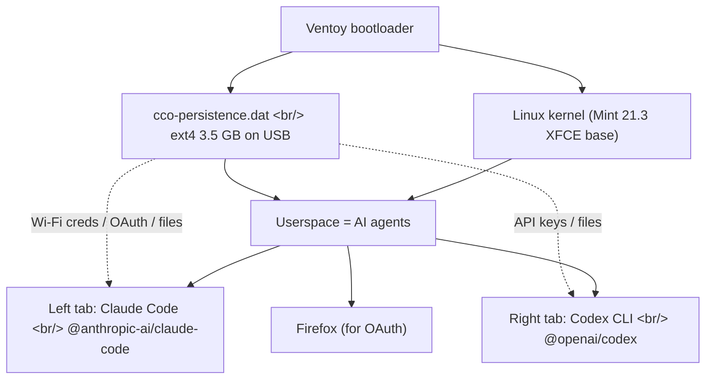
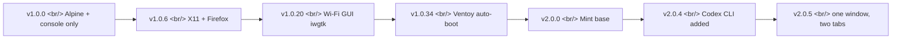
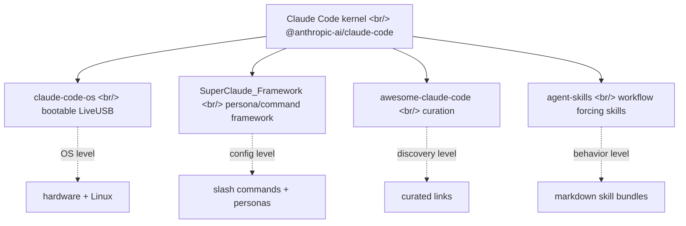

## Overview

[`Hostingglobal-Tech/claude-code-os`](https://github.com/Hostingglobal-Tech/claude-code-os) is a MIT licensed project created on 2026-05-01, sitting at about 85 stars: a **bootable LiveUSB distro** that launches [Claude Code](https://www.anthropic.com/claude-code) and [OpenAI Codex CLI](https://openai.com/codex/) side by side in under a minute. The phrase *"Claude Code OS"* in the repo name is not a metaphor — the project literally builds a [Linux Mint 21.3 XFCE](https://linuxmint.com/) live image where the AI agents are wired into the init sequence as **userspace itself.** The first thing you see after boot is not a desktop, it is two AI prompts.

<!--more-->



## Why it exists — the install ritual in front of AI

The author's framing on the README is blunt.

> Talking to AI takes too many steps — install OS, drivers, browser, Node, npm, login. AI is the interface; why bolt an OS install ritual in front of it? So we made the OS itself AI.

Where [agentmemory](https://github.com/rohitg00/agentmemory) and [agent-skills](https://github.com/anthropics/skills) borrow the *operating system* metaphor to talk about agent context layers, claude-code-os drops the metaphor and **literally wires the agent into the OS boot sequence**: lightdm autologin → xfce4-terminal autostart → Claude Code + Codex CLI launched as the user's first programs.

## What is inside (v2.0.5)

The [v2.0.5 release](https://github.com/Hostingglobal-Tech/claude-code-os/releases/tag/v2.0.5) bundles:

| Component | What | Notes |
|---|---|---|
| Base | [Linux Mint 21.3 XFCE](https://linuxmint.com/) (Ubuntu 22.04 LTS jammy) | Conservative LTS |
| Left tab | [`@anthropic-ai/claude-code`](https://www.npmjs.com/package/@anthropic-ai/claude-code) | npm global |
| Right tab | [`@openai/codex`](https://www.npmjs.com/package/@openai/codex) | npm global |
| Runtime | Node.js 20 LTS | NodeSource repo |
| Browser | Firefox | OAuth login only |
| Korean IME | [ibus](https://github.com/ibus/ibus) + ibus-hangul | `Shift+Space` toggle |
| Fonts | Noto Sans CJK KR + [D2Coding](https://github.com/naver/d2codingfont) | Korean readability |
| Locale | ko_KR.UTF-8 + Asia/Seoul | Korean-first |
| Autologin | lightdm `autologin-user=cco` | NOPASSWD sudo |
| Persistence | [Ventoy](https://www.ventoy.net/) `casper-rw` (3.5 GB) | Every state lives on the USB |

The ISO weighs about 3.4 GB. GitHub release size limits forced a two-part split (`aicode-os-v2.0.5.iso.part1` 1.99 GB + `part2` 1.65 GB), reassembled with a single `cat`.

```bash
cat aicode-os-v2.0.5.iso.part1 aicode-os-v2.0.5.iso.part2 > aicode-os-v2.0.5.iso
```

## Boot sequence — Claude Code as init

The whole build is one [`build-mint.sh`](https://github.com/Hostingglobal-Tech/claude-code-os/blob/main/build-mint.sh) (~18 KB). Inside a chroot it:

1. apt-installs ibus, ibus-hangul, fonts-noto-cjk, language-pack-ko, xfce4-terminal
2. Generates ko_KR.UTF-8 locale and sets Asia/Seoul timezone
3. Installs Node.js 20 LTS + `npm install -g @anthropic-ai/claude-code @openai/codex`
4. Pulls [Naver D2Coding](https://github.com/naver/d2codingfont) from its GitHub release (not in Ubuntu repos)
5. Creates the `cco` user with NOPASSWD sudo
6. Configures lightdm `autologin-user=cco`
7. Drops `aicode-startup-claude` and `aicode-startup-codex` into `/usr/local/bin`
8. Registers an XFCE autostart entry that runs `xfce4-terminal --maximize --tab` — one window, two tabs

The Claude launcher runs `claude --dangerously-skip-permissions`. That flag is the real meaning of "the OS is AI": the agent operates with **root privileges and full network**, not as an ordinary user. There is no sandbox.

## Persistence — every state lives on the USB

The other half of the design is [Ventoy's persistence plugin](https://www.ventoy.net/en/plugin_persistence.html). A 3.5 GB ext4 image file `cco-persistence.dat` next to the ISO keeps the following inside the USB stick:

- Wi-Fi SSIDs + passwords
- Claude OAuth tokens
- OpenAI API keys (or ChatGPT session cookies)
- Working files, cloned repos, npm cache
- ibus config and keyboard customizations

The **host PC disk is never touched.** Pull the USB out and the host has zero trace. Plug the same USB into a different machine and the entire environment follows: cafe laptop, meeting room PC, hotel desktop, all equivalent.

`ventoy.json` wiring is small.

```json
{
  "control": [
    { "VTOY_DEFAULT_MENU_MODE": "0" },
    { "VTOY_MENU_TIMEOUT": "3" },
    { "VTOY_DEFAULT_IMAGE": "/aicode-os-v2.0.5.iso" }
  ],
  "persistence": [
    {
      "image": "/aicode-os-v2.0.5.iso",
      "backend": "/cco-persistence.dat",
      "autosel": 1
    }
  ]
}
```

## Security model — host safe, USB risky

The README's security section is unusually well-decomposed.

| Area | Safe / Risky | Why |
|---|---|---|
| Host PC disk | Safe | LiveUSB writes only inside the USB |
| Workspace on USB | Risky | AI runs as root, executes what it is told |
| Outbound network | Risky | Full network, anything can leave |
| Lost USB | Risky | OAuth tokens / API keys live in `dat` in plaintext; no remote wipe |

`claude --dangerously-skip-permissions` is intentional. The implicit deal is *"the USB is isolated from the host, so giving the AI root inside it is an acceptable trade."* That contract breaks at two points: physical loss of the USB, and outbound network exfiltration. The README points users at the [Anthropic console](https://claude.ai/) and the [OpenAI console](https://platform.openai.com/) to revoke tokens if the USB is lost.

## Version history — Alpine to Mint

[CHANGELOG.en.md](https://github.com/Hostingglobal-Tech/claude-code-os/blob/main/CHANGELOG.en.md) tells a short but informative story.



- **v1.0.0** (2026-05-01) — Alpine Linux 3.20, console only, root autologin, just claude-code
- **v1.0.6** — added X11 + fluxbox + Firefox, becoming a desktop
- **v1.0.20** — Wi-Fi GUI via iwgtk + iwd, RTL8821CE compatibility
- **v1.0.34** (2026-05-05) — Ventoy auto-boot, chrony for time sync (fixes 1970-epoch SSL cert failures)
- **v2.0.0–v2.0.4** — base swapped from Alpine to [Linux Mint 21.3](https://linuxmint.com/edition.php?id=305), Codex CLI added, renamed to AICODE-OS
- **v2.0.5** (2026-05-09) — two separate windows collapsed into one window with two tabs (works on 1366×768 screens)

The Alpine-to-Mint swap is interesting. The project started with *"smallest possible base"* and walked itself into the standard Linux distro pain: as X11, IME, and Wi-Fi driver dependencies stacked up, the maintainer pivoted to a *"battle-tested Ubuntu derivative."* The classic minimalism-versus-hardware-compatibility curve.

## Where it sits in the Claude Code "distro" landscape

Looking at claude-code-os, a cluster of adjacent projects starts to make sense. They all treat [Claude Code](https://www.anthropic.com/claude-code) as a *kernel* and layer their own opinion on top.



- [**SuperClaude-Org/SuperClaude_Framework**](https://github.com/SuperClaude-Org/SuperClaude_Framework) (~22.7K stars) — *"a configuration framework that enhances Claude Code with specialized commands, cognitive personas, and development methodologies."* Sits on top of an existing Claude Code install; conceptually the *"X-windows"* layered over the same kernel.
- [**hesreallyhim/awesome-claude-code**](https://github.com/hesreallyhim/awesome-claude-code) — the Awesome-list curation: an index of what exists.
- [**anthropics/skills**](https://github.com/anthropics/skills) — Anthropic's own agent-skills bundles. Spawned ports like [`thedalbee/codex-r`](https://github.com/thedalbee/codex-r) that bring the same pattern into the Codex world.
- [**rohitg00/agentmemory**](https://github.com/rohitg00/agentmemory) — persistent memory shared by 16+ agents over [MCP](https://modelcontextprotocol.io/).

What separates claude-code-os from the rest is **abstraction level**. SuperClaude is a different shell environment on the same OS. claude-code-os swaps the OS itself. As the early Linux distro wars fragmented Debian, Red Hat, and Arch across the same kernel with different package managers and desktops, *Claude Code distros* are differentiating along similar lines — OS-level, framework-level, skill-level.

## Who it is for

The intended persona is clear.

| Scenario | Fit | Why |
|---|---|---|
| Demos — show AI on anyone's laptop | High | Plug in, 1 minute, host stays clean |
| Casual coding on a light laptop | Medium | 3.5 GB persistence cap |
| Onboarding non-engineers to AI | High | Zero OS install friction |
| Daily-driver dev environment | Low | Personal dotfiles / SSH keys / git config need separate sync |
| Security-sensitive work | Low | Root AI + plaintext tokens on USB |

> Best fit: classroom demos, conference booths, onboarding non-technical users. Poor fit: replacing a dotfile-heavy personal workstation.

## Interesting design details

- **One window, two tabs (v2.0.5)** — earlier versions opened two separate xfce4-terminal windows with fixed `--geometry` coordinates. The Codex window was clipped off-screen on 1366×768 displays (e.g. Samsung NT900X3A). v2.0.5 switches to `xfce4-terminal --maximize --tab`, safe on any resolution.
- **Graceful exit** — when claude or codex exits, the parent shell stays alive via `exec bash`. Type `claude` again to relaunch in place.
- **Stale autostart cleanup** — `aicode-startup-dual` rms leftover `~/.config/autostart/*.desktop` files from older v2.0.x revisions, so an upgraded persistence USB does not break.
- **Why chrony** — added in v1.0.34 to fix the 1970-epoch problem. A LiveUSB cannot trust the host RTC, and OAuth / SSL handshakes fail on certificates that look "not yet valid" when the clock is wrong.
- **D2Coding via wget from Naver's release** — the font is not in Ubuntu repos, so the build pins a specific tag (`VER1.3.2-20180524`).

## Limits and open questions

- **Persistence dat does not auto-grow** — fixed at the size you created it (default 3.5 GB). Hitting the cap means making a larger dat and swapping it in.
- **FAT32 USBs are unsuitable** — single-file 4 GB cap blocks larger dat files. exFAT recommended ([Ventoy 1.0.96+](https://github.com/ventoy/Ventoy/releases) defaults to it).
- **Reaching host data needs manual mounts** — the *"zero trace"* property is also a wall between the USB world and any code already on the host.
- **Root AI + full network = user diligence** — the README explicitly tells you not to run unknown commands. The security model has a human-in-the-loop assumption baked in.

## Conclusion — taking the "OS is AI" tagline seriously

[claude-code-os](https://github.com/Hostingglobal-Tech/claude-code-os) is not another configuration framework layered on top of Claude Code. It is a **LiveCD distro that wires the agent into init.** If [SuperClaude](https://github.com/SuperClaude-Org/SuperClaude_Framework) is *"a different shell on the same OS,"* this is *"a different OS entirely."* The branching matches how early Linux distros fragmented from a shared kernel — Debian, Red Hat, Arch each layered their opinion on top — and *Claude Code distros* now stack opinions at OS, framework, and skill levels above the same npm package.

The interesting next problem is the trade-off between **sandboxed isolation and host integration.** *"Host safe + AI root"* is perfect for demo and onboarding, but a daily driver needs your dotfiles, SSH keys, and git config to follow you. For a bootable USB to graduate into *"my whole dev environment,"* it needs that bridge.

## References

### claude-code-os itself

- [Hostingglobal-Tech/claude-code-os](https://github.com/Hostingglobal-Tech/claude-code-os) — the repo
- [v2.0.5 release](https://github.com/Hostingglobal-Tech/claude-code-os/releases/tag/v2.0.5) — two-part ISO + persistence dat
- [CHANGELOG.en.md](https://github.com/Hostingglobal-Tech/claude-code-os/blob/main/CHANGELOG.en.md) — Alpine → Mint history
- [build-mint.sh](https://github.com/Hostingglobal-Tech/claude-code-os/blob/main/build-mint.sh) — the build

### Dependencies

- [Ventoy](https://www.ventoy.net/) — multi-ISO bootable USB
- [Ventoy persistence plugin](https://www.ventoy.net/en/plugin_persistence.html) — `casper-rw` backend
- [Linux Mint 21.3 XFCE](https://linuxmint.com/edition.php?id=305) — base OS
- [`@anthropic-ai/claude-code`](https://www.npmjs.com/package/@anthropic-ai/claude-code) · [`@openai/codex`](https://www.npmjs.com/package/@openai/codex) — the two agents
- [Naver D2Coding font](https://github.com/naver/d2codingfont)

### Adjacent Claude Code ecosystem

- [SuperClaude-Org/SuperClaude_Framework](https://github.com/SuperClaude-Org/SuperClaude_Framework) — persona / slash command framework
- [anthropics/skills](https://github.com/anthropics/skills) — agent-skills from Anthropic
- [rohitg00/agentmemory](https://github.com/rohitg00/agentmemory) — MCP-based persistent memory
- [thedalbee/codex-r](https://github.com/thedalbee/codex-r) — import Claude Code sessions into Codex
- [Model Context Protocol](https://modelcontextprotocol.io/)
