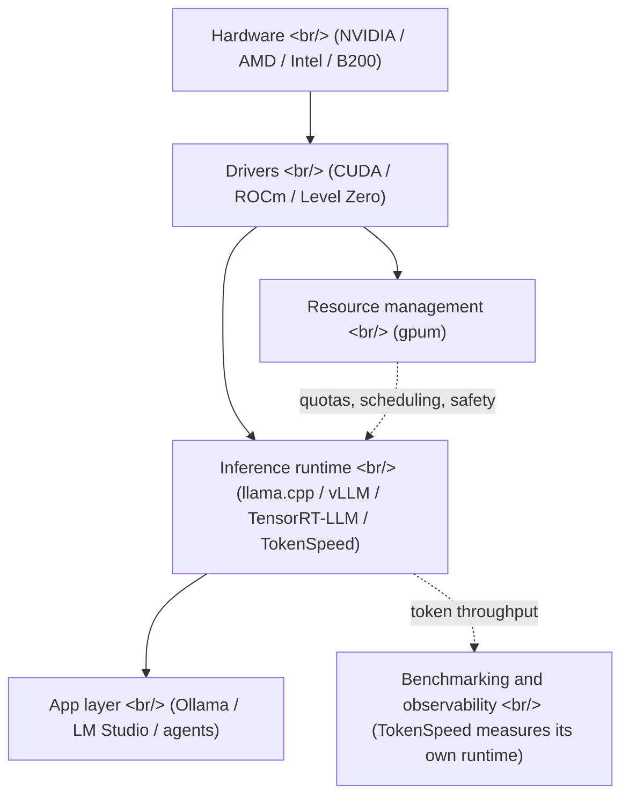

## Overview

Operational tooling for inference has long split into two worlds. Cloud LLM stacks have a mature observability layer — [Langsmith](https://www.langchain.com/langsmith), [OpenLLMetry](https://github.com/traceloop/openllmetry), [Helicone](https://www.helicone.ai/), [Langfuse](https://langfuse.com) — that handles traces, costs, and request shaping above the model API. Local and on-prem inference — the world of [Ollama](https://ollama.com), [llama.cpp](https://github.com/ggml-org/llama.cpp), [LM Studio](https://lmstudio.ai), [vLLM](https://github.com/vllm-project/vllm), and [TensorRT-LLM](https://github.com/NVIDIA/TensorRT-LLM) — still leans on `nvidia-smi` and shell scripts. On 2026-05-09 two tools landed on the same day, each targeting a different layer of that stack: [drewdrew0414/AIGPUManager's `gpum` v1.1.0](https://github.com/drewdrew0414/AIGPUManager/releases/tag/v1.1.0) for GPU **allocation, quotas, and safety**, and [lightseekorg/tokenspeed](https://github.com/lightseekorg/tokenspeed) for the **token throughput** of the inference engine itself. Both come from individuals or small new orgs rather than vendors. That is the same shape the cloud LLM observability category had in 2023: the first generation of tooling arrives, and it doesn't arrive from incumbents.

<!--more-->



## 1. gpum v1.1.0 — A resource manager for shared GPU boxes

[gpum](https://github.com/drewdrew0414/AIGPUManager) is a Java 21 CLI. It is not aimed at the single-user `nvidia-smi` workflow. It targets the situation where **several people share the same GPU server** and need a coordination layer. Earlier versions covered inventory ("which GPU is where") and basic allocation. [v1.1.0](https://github.com/drewdrew0414/AIGPUManager/releases/tag/v1.1.0) is the release where the operations layer fills in.

### 1.1 Compute policy and an approval workflow

The most distinctive addition in v1.1.0 is an **approval workflow** for high-risk hardware operations.

```bash
gpum gpu reset --id node1:0 --soft --apply
gpum rbac approval list --status pending
gpum rbac approval approve --id <approval-id> --reason "maintenance window"
gpum gpu reset --id node1:0 --soft --apply --approval-id <approval-id>
```

Power-limit changes, ECC toggling, GPU reset — none of these execute immediately. They produce an approval record. On top of that, real hardware writes only happen when `GPUM_ENABLE_HARDWARE_WRITE=1` is set in the calling shell, and dry-run is the default everywhere else. The positioning is clear: this is for environments where dragging in [Slurm](https://slurm.schedmd.com/) or the [Kubernetes Device Plugin](https://kubernetes.io/docs/concepts/extend-kubernetes/compute-storage-net/device-plugins/) is too heavy, but raw SSH is too thin — **a one-CLI middle ground** for one or two shared GPU boxes.

### 1.2 Multi-vendor inventory

`gpum` reads [NVIDIA NVML](https://developer.nvidia.com/management-library-nvml), AMD ROCm-SMI, and [Intel Level Zero](https://spec.oneapi.io/level-zero/latest/index.html) in the same scan. NVML is accessed through JNA; the Level Zero loader is discovered separately. When a library is not installed, the row is marked `unavailable` rather than failing silently. This is not a mobile or embedded tool — the design assumes **heterogeneous GPUs in a workstation or small cluster**.

### 1.3 Topology-aware scheduling

```bash
gpum alloc estimate --model llama3-70b --params-b 70 --precision fp16 --context 8192 --batch 4
gpum schedule reserve create --gpus 4 --start 2026-05-10T22:00:00 --end 2026-05-11T06:00:00
gpum schedule gang --nodes 2 --gpus-per-node 8
```

It recognizes [NVLink](https://www.nvidia.com/en-us/data-center/nvlink/), AMD XGMI, and Intel Xe Link and adjusts packed/spread placement hints. Distributed training that must start with all nodes (**gang scheduling**), short idle windows filled with **backfill**, and **fair-share** weighting by historical GPU-hours — these are textbook cluster-manager features packed into a single CLI.

### 1.4 Safety guardrails

`v1.1.0` keeps emphasizing prevention at the operations layer.

| Guard | Behavior |
|---|---|
| Max GPU / request | Reject requests that exceed policy permanently |
| Max lease hours | Expired leases become reclamation candidates |
| Thermal threshold | Preflight detection of thermal-critical GPUs |
| Power cap | Preflight detection of saturated GPUs |
| Stale heartbeat | Cleanup of dead workers |
| Min free VRAM | Reject jobs that would breach memory limit |

Incidents wrap this with **GPU quarantine** and node drain actions. It reads like a single-host distillation of the [SRE playbook](https://sre.google/sre-book/table-of-contents/).

### 1.5 AI tooling integration

The most immediately useful command group is `gpum integration ai`. It turns an allocation lease into launch commands for [torchrun](https://docs.pytorch.org/docs/stable/elastic/run.html), [accelerate](https://huggingface.co/docs/accelerate/index), [DeepSpeed](https://github.com/deepspeedai/DeepSpeed), or [vLLM](https://github.com/vllm-project/vllm).

```bash
gpum integration ai launch --allocation-id alloc-001 --tool torchrun --arg train.py
gpum integration ai launch --allocation-id alloc-001 --tool vllm --from-file vllm-serve.yaml
```

It auto-injects `CUDA_VISIBLE_DEVICES`, `MASTER_ADDR`, `GPUM_RDZV_ENDPOINT`, and vendor-specific equivalents (`ROCR_VISIBLE_DEVICES` for AMD, `ZE_AFFINITY_MASK` for Intel). The whole flow — **allocation lease → injected env → launch command** — is one motion.

## 2. TokenSpeed — Aiming straight at engine throughput

[TokenSpeed](https://github.com/lightseekorg/tokenspeed), released the same day, sits on a different layer. Where `gpum` manages and observes GPU resources, TokenSpeed *is* the inference engine. The README states the ambition flatly: **TensorRT-LLM-level performance with vLLM-level usability**. The [announcement blog](https://lightseek.org/blog/lightseek-tokenspeed.html) shows Pareto curves on [NVIDIA B200](https://www.nvidia.com/en-us/data-center/b200/) running [Kimi K2.5](https://moonshotai.com), claiming to push past the [TensorRT-LLM](https://github.com/NVIDIA/TensorRT-LLM) front.

### 2.1 Four design pieces

From the README's component breakdown:

| Layer | Role |
|---|---|
| Modeling | local-SPMD with a static compiler that auto-generates collectives from module-boundary annotations |
| Scheduler | C++ control plane / Python execution plane, request lifecycle modeled as a finite-state machine |
| Kernels | Pluggable, layered, with one of the fastest [MLA (Multi-head Latent Attention)](https://arxiv.org/abs/2405.04434) implementations on Blackwell |
| Entrypoint | SMG-integrated AsyncLLM, designed to keep CPU-side request handling cheap |

MLA was popularized by [DeepSeek-V2](https://arxiv.org/abs/2405.04434) and compresses the KV cache into a latent representation, which collapses memory bandwidth pressure during decode. TokenSpeed claims to re-implement it for the [Blackwell architecture](https://www.nvidia.com/en-us/data-center/technologies/blackwell-architecture/). The detail that KV cache ownership is enforced at compile time through the type system is the interesting one — it moves a class of bugs that vLLM solves at runtime via [PagedAttention](https://arxiv.org/abs/2309.06180) into the type checker.

### 2.2 Targeting agentic workloads

The README keeps returning to one phrase: **agentic workloads**. Unlike a chat workload (long single responses), agent workloads look like **thousands of short responses with tool calls between them**. In that pattern, CPU-side request handling cost and KV cache reuse/reallocation dominate throughput. The emphasis on the FSM, the type system, and AsyncLLM is the direct response to that pattern.

### 2.3 Status and limits

The repo is explicit that this is a preview.

- Reproducible today: B200 with Kimi K2.5 and TokenSpeed MLA
- In progress: [Qwen 3.6](https://qwenlm.github.io), DeepSeek V4, MiniMax M2.7 model coverage
- In progress: prefill-decode separation (PD), EPLB, KV store, Mamba cache, VLM, metrics
- In progress: Hopper and MI350 optimization

So today it is **a runtime design demonstration, not a production deployment target**. That said, picking up 900+ stars in the first days is a signal that the "faster than vLLM, easier than TensorRT-LLM" slot in the inference engine category has been waiting to be filled.

## 3. Where the two tools meet

Mapping them onto the inference stack:


`gpum` abstracts **hardware and drivers and hands them safely to the inference engine**. TokenSpeed is **the inference engine itself**. They do not overlap. In practice you would imagine `gpum integration ai launch --tool vllm` producing the launch command, and whatever engine sits inside the launcher (vLLM, TokenSpeed, TensorRT-LLM) is a downstream choice.

## 4. Comparison with cloud LLM observability

In the cloud LLM stack, [Langsmith](https://docs.smith.langchain.com), [OpenLLMetry](https://github.com/traceloop/openllmetry), [Helicone](https://www.helicone.ai), and [Langfuse](https://langfuse.com) cover two axes:

| Axis | Cloud LLM | Local / on-prem inference |
|---|---|---|
| Tracing / logs | Langsmith, Langfuse | (gap — gpum's audit log fills a slice) |
| Tokens / cost | Helicone, OpenLLMetry | (gap — gpum cost reports, TokenSpeed throughput) |
| Model gateway | [OpenRouter](https://openrouter.ai), [Portkey](https://portkey.ai) | [LiteLLM](https://github.com/BerriAI/litellm) (hybrid) |
| Resource allocation | (managed) | gpum |
| Engine throughput | (managed) | TokenSpeed, [vLLM](https://github.com/vllm-project/vllm), [SGLang](https://github.com/sgl-project/sglang) |

Cloud-side observability is already past its first generation (2023–2024) and into a consolidation phase. Local inference is **at the start of generation one** — built by individuals or new orgs, exactly the shape of the early Langsmith and Helicone era. `gpum` being a one-maintainer project and TokenSpeed coming from a brand-new `lightseekorg` underline that timing.

## 5. Practical scenarios

The two tools land in clearly different setups.

- **A team sharing 1–2 GPU servers**: `gpum` fits cleanly. Start with `gpum scan --refresh` for inventory, then `gpum submit` to run batch jobs in containers, then `gpum gpu health --score --quarantine-threshold` to take dying GPUs out of rotation before they cascade. Too small for [Slurm](https://slurm.schedmd.com/) or [Run:ai](https://www.run.ai/), too big for raw SSH.
- **Evaluating the inference engine itself**: TokenSpeed is still preview, but the B200 + Kimi K2.5 reproduction is meaningful as a forward-looking comparison. If you expect to be making engine choices for production over the next 12 months, having a hands-on reference point for the "post-vLLM" design space is worth setting up early.

## Insights

Two tools shipping the same day at different layers of the same stack is a market signal: **local and on-prem inference has hit the point where it needs first-generation operational tooling**. Cloud LLM stacks passed this milestone in 2023 when [Langsmith](https://www.langchain.com/langsmith) externalized LangChain's operational burden. Local inference is hitting it in 2026 with `gpum` filling the resource-management gap from the bottom and TokenSpeed reframing engine design from the top. Both carry the typical first-generation limits — `gpum` is a single-maintainer Java project, TokenSpeed is preview-only and B200-bound — but first-generation tooling in a category is what defines the shape of the category. The cloud observability arc says most of the first wave survives and a small subset becomes standard. The same pattern is starting at the local inference layer this week.

## References

**Release and repo**

- [drewdrew0414/AIGPUManager v1.1.0 release](https://github.com/drewdrew0414/AIGPUManager/releases/tag/v1.1.0)
- [drewdrew0414/AIGPUManager repository](https://github.com/drewdrew0414/AIGPUManager)
- [lightseekorg/tokenspeed repository](https://github.com/lightseekorg/tokenspeed)
- [TokenSpeed announcement blog](https://lightseek.org/blog/lightseek-tokenspeed.html)

**Local inference runtimes**

- [llama.cpp](https://github.com/ggml-org/llama.cpp)
- [Ollama](https://ollama.com)
- [LM Studio](https://lmstudio.ai)
- [vLLM](https://github.com/vllm-project/vllm)
- [SGLang](https://github.com/sgl-project/sglang)
- [NVIDIA TensorRT-LLM](https://github.com/NVIDIA/TensorRT-LLM)

**Techniques and standards**

- [MLA — Multi-head Latent Attention (DeepSeek-V2 paper)](https://arxiv.org/abs/2405.04434)
- [PagedAttention — vLLM paper](https://arxiv.org/abs/2309.06180)
- [NVIDIA NVML](https://developer.nvidia.com/management-library-nvml)
- [Intel Level Zero](https://spec.oneapi.io/level-zero/latest/index.html)
- [NVIDIA Blackwell architecture](https://www.nvidia.com/en-us/data-center/technologies/blackwell-architecture/)

**Cloud LLM observability — for comparison**

- [Langsmith](https://www.langchain.com/langsmith)
- [Langfuse](https://langfuse.com)
- [OpenLLMetry](https://github.com/traceloop/openllmetry)
- [Helicone](https://www.helicone.ai/)
- [LiteLLM](https://github.com/BerriAI/litellm)
