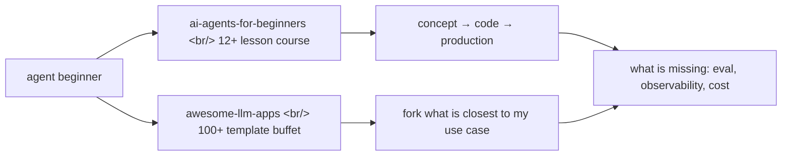

## Overview

Two learning resources surfaced alongside each other this week and form a striking contrast. One is Microsoft's [ai-agents-for-beginners](https://github.com/microsoft/ai-agents-for-beginners) — a structured 12+ lesson curriculum. The other is Shubham Saboo's [awesome-llm-apps](https://github.com/Shubhamsaboo/awesome-llm-apps) — a catalog of 100+ ready-to-run templates. Both are massive (61k and 109k stars respectively), and they answer the same question — "how do I learn to build AI agents?" — in opposite ways.

<!--more-->

## Two repos, two identities

### Microsoft AI Agents for Beginners — the course

[microsoft/ai-agents-for-beginners](https://github.com/microsoft/ai-agents-for-beginners) is an official Microsoft learning course that has crossed 61k stars. MIT-licensed, Jupyter-Notebook-based, started in November 2024, and built around [Microsoft Agent Framework](https://aka.ms/ai-agents-beginners/agent-framework) plus [Azure AI Foundry Agent Service V2](https://aka.ms/ai-agents-beginners/ai-agent-service). The lesson tree:

- 01 [Intro to AI Agents and Agent Use Cases](https://github.com/microsoft/ai-agents-for-beginners/blob/main/01-intro-to-ai-agents/README.md)
- 02 [Exploring Agentic Frameworks](https://github.com/microsoft/ai-agents-for-beginners/blob/main/02-explore-agentic-frameworks/README.md)
- 03 [Agentic Design Patterns](https://github.com/microsoft/ai-agents-for-beginners/blob/main/03-agentic-design-patterns/README.md) — UX principles for Space/Time/Core
- 04 [Tool Use Design Pattern](https://github.com/microsoft/ai-agents-for-beginners/blob/main/04-tool-use/README.md)
- 05 [Agentic RAG](https://github.com/microsoft/ai-agents-for-beginners/blob/main/05-agentic-rag/README.md)
- 06 [Building Trustworthy AI Agents](https://github.com/microsoft/ai-agents-for-beginners/blob/main/06-building-trustworthy-agents/README.md)
- 07 [Planning Design Pattern](https://github.com/microsoft/ai-agents-for-beginners/blob/main/07-planning-design/README.md)
- 08 [Multi-Agent Design Pattern](https://github.com/microsoft/ai-agents-for-beginners/blob/main/08-multi-agent/README.md)
- 09 [Metacognition Design Pattern](https://github.com/microsoft/ai-agents-for-beginners/blob/main/09-metacognition/README.md)
- 10 [AI Agents in Production](https://github.com/microsoft/ai-agents-for-beginners/blob/main/10-ai-agents-production/README.md) — observability + evaluation
- 11 [Agentic Protocols (MCP, A2A, NLWeb)](https://github.com/microsoft/ai-agents-for-beginners/blob/main/11-agentic-protocols/README.md)
- 12 [Context Engineering for AI Agents](https://github.com/microsoft/ai-agents-for-beginners/blob/main/12-context-engineering/README.md)
- 13 [Managing Agentic Memory](https://github.com/microsoft/ai-agents-for-beginners/blob/main/13-agent-memory/README.md)
- 14 to 18 cover Microsoft Agent Framework deep-dive, [Browser-Use](https://docs.browser-use.com/examples/templates/playwright-integration)-style Computer Use Agents, and Securing AI Agents

Each lesson ships as text + short video + Jupyter notebook code samples. The course is also auto-translated into 50+ languages through [co-op-translator](https://github.com/Azure/co-op-translator) — for example a [Korean translation](https://github.com/microsoft/ai-agents-for-beginners/blob/main/translations/ko/README.md). If translation bloat bothers you, the README suggests a `git sparse-checkout` recipe to skip translation directories.

### Awesome LLM Apps — the catalog

On the other side, [Shubhamsaboo/awesome-llm-apps](https://github.com/Shubhamsaboo/awesome-llm-apps) is a 109k-star template repository. Apache-2.0 licensed, and the README opens with "100+ AI Agent & RAG apps you can actually run — clone, customize, ship." The author is explicit that this is "hand-built, not curated" — every template is original work, tested end-to-end. It is organized into 13 categories:

- [Starter AI Agents](https://github.com/Shubhamsaboo/awesome-llm-apps/tree/main/starter_ai_agents) — single-file agents with one API key
- [Advanced AI Agents](https://github.com/Shubhamsaboo/awesome-llm-apps/tree/main/advanced_ai_agents) — memory, tools, multi-step reasoning
- [Multi-agent Teams](https://github.com/Shubhamsaboo/awesome-llm-apps/tree/main/advanced_ai_agents/multi_agent_apps/agent_teams) — [CrewAI](https://github.com/joaomdmoura/crewAI)-based services agency, etc.
- [Voice AI Agents](https://github.com/Shubhamsaboo/awesome-llm-apps/tree/main/voice_ai_agents) — real-time speech interfaces
- [MCP AI Agents](https://github.com/Shubhamsaboo/awesome-llm-apps/tree/main/mcp_ai_agents) — [Model Context Protocol](https://modelcontextprotocol.io/) integrations
- [RAG Tutorials](https://github.com/Shubhamsaboo/awesome-llm-apps/tree/main/rag_tutorials) — 21+ variants including Agentic RAG, Corrective RAG, Vision RAG
- [Awesome Agent Skills](https://github.com/Shubhamsaboo/awesome-llm-apps/tree/main/awesome_agent_skills) — 19 reusable skill files for Claude Code / ADK
- LLM Fine-tuning ([Gemma 3](https://github.com/Shubhamsaboo/awesome-llm-apps/tree/main/advanced_llm_apps/llm_finetuning_tutorials/gemma3_finetuning), [Llama 3.2](https://github.com/Shubhamsaboo/awesome-llm-apps/tree/main/advanced_llm_apps/llm_finetuning_tutorials/llama3.2_finetuning))
- [Google ADK Crash Course](https://github.com/Shubhamsaboo/awesome-llm-apps/tree/main/ai_agent_framework_crash_course/google_adk_crash_course) and [OpenAI Agents SDK Crash Course](https://github.com/Shubhamsaboo/awesome-llm-apps/tree/main/ai_agent_framework_crash_course/openai_sdk_crash_course)

Each template has its own README, a `requirements.txt`, and usually a one-liner like `streamlit run`. The promise on the tin is "your first agent running in 30 seconds."

## Same topic, different depth — Lesson 03 vs. catalog 03

Looking at the same subject — "agent design principles" — from both sides shows how the two formats differ.

| Dimension | MS 03-agentic-design-patterns | Awesome LLM Apps Starter |
|---|---|---|
| Starting point | [UX principles](https://github.com/microsoft/ai-agents-for-beginners/blob/main/03-agentic-design-patterns/README.md) like "Connecting not collapsing" and "Embrace uncertainty" | Runnable code such as [AI Travel Agent](https://github.com/Shubhamsaboo/awesome-llm-apps/tree/main/starter_ai_agents/ai_travel_agent) |
| Length | Thousands of words, diagrams, a Travel Agent case study | Short README + run command |
| Method | Principles → guidelines (Transparency/Control/Consistency) → application | Working code → poke at it, learn by feel |
| Next action | Proceed to lesson 04 (Tool Use) | Branch into one of 30 sibling templates |

The first teaches "why design it this way." The second says "someone already designed it this way — fork and tweak." Both are correct answers to different starting positions.

## Who fits which

### The course fits

- **Beginners who need fundamentals** — UX principles, design patterns, multi-agent, memory, and context engineering are covered systematically
- **Azure shops** — [Azure AI Foundry](https://learn.microsoft.com/en-us/azure/ai-foundry/what-is-azure-ai-foundry) plus Microsoft Agent Framework maps cleanly onto the lessons
- **Non-English learners who want a translation** — [Korean](https://github.com/microsoft/ai-agents-for-beginners/blob/main/translations/ko/README.md), [Japanese](https://github.com/microsoft/ai-agents-for-beginners/blob/main/translations/ja/README.md), [Simplified Chinese](https://github.com/microsoft/ai-agents-for-beginners/blob/main/translations/zh-CN/README.md), and 50+ more
- **Anyone needing a deck for a CIO** — clean chapter structure like "[MCP](https://modelcontextprotocol.io/) / [A2A](https://google.github.io/A2A/) / NLWeb compared" doubles as briefing material

### The catalog fits

- **Engineers who already do LLM calls** and want to compare patterns — for example, 21 RAG variants side by side to pick the one closest to their case
- **People with a clear use case** — domains like insurance, investment, research, or voice get direct starters: [Insurance Claim Live Agent](https://github.com/Shubhamsaboo/awesome-llm-apps/tree/main/voice_ai_agents/insurance_claim_live_agent_team), [AI VC Due Diligence](https://github.com/Shubhamsaboo/awesome-llm-apps/tree/main/advanced_ai_agents/multi_agent_apps/agent_teams/ai_vc_due_diligence_agent_team)
- **Side-project hunters** — [AI 3D Pygame Agent](https://github.com/Shubhamsaboo/awesome-llm-apps/tree/main/advanced_ai_agents/autonomous_game_playing_agent_apps/ai_3dpygame_r1) or [AI Meme Generator](https://github.com/Shubhamsaboo/awesome-llm-apps/tree/main/starter_ai_agents/ai_meme_generator_agent_browseruse) are easy entry points
- **People learning a specific stack** — MCP, [CrewAI](https://github.com/joaomdmoura/crewAI), or [ADK](https://google.github.io/adk-docs/)-specific examples to study

Roughly: the course is for "I want a path," the catalog is for "I want a buffet." The best use is to combine them. Read MS lesson [05 Agentic RAG](https://github.com/microsoft/ai-agents-for-beginners/blob/main/05-agentic-rag/README.md), then clone [Agentic RAG with Reasoning](https://github.com/Shubhamsaboo/awesome-llm-apps/tree/main/rag_tutorials/agentic_rag_with_reasoning) from the catalog and run it — theory and working code lock in together.

## What beginner content systematically misses

Looking across both repos — and at the rest of the "agent 101" market — there are areas where beginner content is consistently underweight.

**1. Evaluation gets one lesson, not a course.** MS does cover trace/span, offline/online eval, [RAGAS](https://docs.ragas.io/), and [LLM Guard](https://llm-guard.com/) in [Lesson 10](https://github.com/microsoft/ai-agents-for-beginners/blob/main/10-ai-agents-production/README.md), but that is one chapter near the end. awesome-llm-apps has the [RAG Failure Diagnostics Clinic](https://github.com/Shubhamsaboo/awesome-llm-apps/tree/main/rag_tutorials/rag_failure_diagnostics_clinic), which is interesting, but eval is not a top-level category. In practice teams spend far more time figuring out why an agent regressed than building it.

**2. Observability is treated as an "in production" feature.** [OpenTelemetry](https://opentelemetry.io/), [Langfuse](https://langfuse.com/), and [Microsoft Foundry](https://learn.microsoft.com/en-us/azure/ai-foundry/what-is-azure-ai-foundry) appear, but framed as production-grade tooling. The reality is that the first time you wire up a multi-step agent, you need traces on. Debugging a multi-agent system without traces is like debugging multi-threaded code without print statements.

**3. Cost simulation is absent.** awesome-llm-apps does include [Toonify Token Optimization](https://github.com/Shubhamsaboo/awesome-llm-apps/tree/main/advanced_llm_apps/llm_optimization_tools/toonify_token_optimization) and [Headroom Context Optimization](https://github.com/Shubhamsaboo/awesome-llm-apps/tree/main/advanced_llm_apps/llm_optimization_tools/headroom_context_optimization), but a beginner has no sense that one multi-agent run can burn 5x to 50x more tokens than they expect. Lesson 01 in any agent course should hand the learner a calculator: "if you demo this 100 times this week, here is the bill."

**4. There is no canonical failure-mode catalog.** "Here is something that works" gets shown; "here is how it breaks" rarely does. Prompt injection, runaway tool loops, memory leaks, agents trusting their own RAG output blindly — these patterns show up every week in production. The community surfaced this around the same time with a one-liner that lands: building agents is easy, memorizing how they break is the actual job.

## Insights

Agent learning content has graduated in the last year from "framework comparison" to "real curriculum." That MS ships 12+ lessons covering design patterns and protocols is itself a market-maturity signal. At the same time, awesome-llm-apps showing 100+ templates that cover [ADK](https://google.github.io/adk-docs/), [OpenAI Agents SDK](https://platform.openai.com/docs/guides/agents), CrewAI, and MCP and still all run with one `streamlit run` line says the cost of building a working agent has dropped to a floor. Used together — concepts from the course, first running code from the catalog — they form a clean learning loop. But both, and effectively the entire market, are still thin on evaluation, observability, cost, and failure modes. That gap is the content opportunity of the next year. When "AI Agents Eval for Beginners" or "Agent Observability for Beginners" exists at the same quality bar, the field will have matured one more step.

## References

### The Microsoft course

- [microsoft/ai-agents-for-beginners](https://github.com/microsoft/ai-agents-for-beginners) — the repo
- [Microsoft Agent Framework](https://aka.ms/ai-agents-beginners/agent-framework)
- [Azure AI Foundry Agent Service V2](https://aka.ms/ai-agents-beginners/ai-agent-service)
- [Lesson 10 - Production observability & evaluation](https://github.com/microsoft/ai-agents-for-beginners/blob/main/10-ai-agents-production/README.md)

### Awesome LLM Apps

- [Shubhamsaboo/awesome-llm-apps](https://github.com/Shubhamsaboo/awesome-llm-apps) — the repo
- [Unwind AI](https://www.theunwindai.com) — the author's tutorial site
- [Google ADK Crash Course](https://github.com/Shubhamsaboo/awesome-llm-apps/tree/main/ai_agent_framework_crash_course/google_adk_crash_course)
- [OpenAI Agents SDK Crash Course](https://github.com/Shubhamsaboo/awesome-llm-apps/tree/main/ai_agent_framework_crash_course/openai_sdk_crash_course)

### Evaluation and observability tools

- [OpenTelemetry](https://opentelemetry.io/)
- [Langfuse](https://langfuse.com/)
- [RAGAS](https://docs.ragas.io/)
- [LLM Guard](https://llm-guard.com/)

### Protocols and frameworks referenced

- [Model Context Protocol](https://modelcontextprotocol.io/)
- [Google A2A](https://google.github.io/A2A/)
- [CrewAI](https://github.com/joaomdmoura/crewAI)
- [Browser-Use](https://docs.browser-use.com/examples/templates/playwright-integration)
