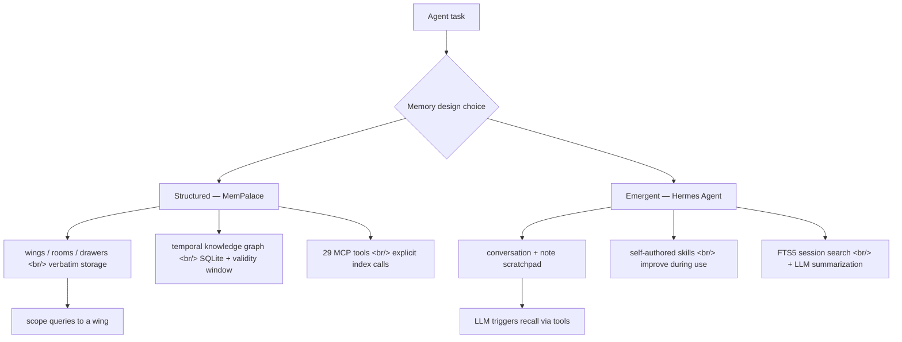
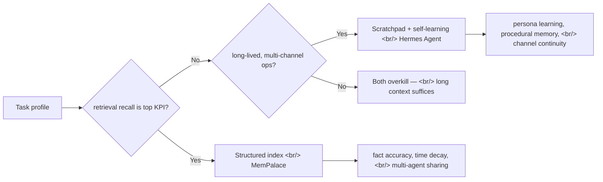

## Overview

Two repos surfaced alongside each other on 2026-05-10 — [MemPalace/mempalace](https://github.com/MemPalace/mempalace) and [NousResearch/hermes-agent](https://github.com/NousResearch/hermes-agent) — and they put two opposite primitives for agent memory in head-to-head contact. One is a **structured index** (wings/rooms/drawers plus a temporal knowledge graph), the other is an **emergent scratchpad + self-improving skills + FTS5 recall**. If [the previous OS-layer post](https://ice-ice-bear.github.io/posts/2026-05-08-agent-os-layer-memory-skills/) traced how the memory and workflow slots are forming, this post pulls on the **memory slot itself and finds it splitting in two design philosophies**.

<!--more-->



## 1. MemPalace — push structured indexing to its limit

[MemPalace/mempalace](https://github.com/MemPalace/mempalace) bills itself as *"the best-benchmarked open-source AI memory system."* Created 2026-04-05, MIT, [51,879 stars at the 2026-05-11 push](https://github.com/MemPalace/mempalace/commits/main). Its bet collapses to one sentence — **store the original text without summarizing, and let pre-existing structure narrow the semantic search.**

### The palace structure

- **wings** — one per person or project; queries scope into a wing.
- **rooms** — topic groups inside a wing.
- **drawers** — the smallest unit, **the verbatim text itself.** No summarizing, no extraction, no paraphrase.
- **knowledge graph** — local [SQLite](https://www.sqlite.org/) with entities, relationships, and validity windows. When a fact stops being true, the layer marks it explicitly instead of leaving the LLM to figure it out.
- **agent diaries** — every specialist agent gets its own wing and journal, discoverable at runtime via [`mempalace_list_agents`](https://mempalaceofficial.com/concepts/agents.html) so the system prompt stays small.

### Benchmarks

[LongMemEval](https://arxiv.org/abs/2410.10813), 500 questions:

| Mode | R@5 | LLM required |
|---|---|---|
| Raw semantic search (no heuristics, no LLM) | **96.6%** | None |
| Hybrid v4, 450q held-out | **98.4%** | None |
| Hybrid v4 + LLM rerank, 500q | ≥99% | Any capable model |

Plus [LoCoMo](https://arxiv.org/abs/2402.17753) R@10 88.9% (hybrid v5, 1,986 questions), ConvoMem 92.9% recall across 250 items, [MemBench](https://aclanthology.org/2025.acl-long.0/) (ACL 2025) R@5 80.3% across 8,500 items. Compared with [agentmemory](https://github.com/rohitg00/agentmemory)'s 95.2% on the same LongMemEval cut, MemPalace's raw mode is +1.4pp ahead — **the clearest signal that the marginal value of pre-baked structure shows up as retrieval recall.**

### Setup

```bash
uv tool install mempalace
mempalace init ~/projects/myapp

# Mine
mempalace mine ~/projects/myapp                   # project files
mempalace mine ~/.claude/projects/ --mode convos  # Claude Code sessions

# Search / load
mempalace search "why did we switch to GraphQL"
mempalace wake-up
```

No API key, no cloud call, ChromaDB as the default, with a pluggable interface at [`mempalace/backends/base.py`](https://github.com/MemPalace/mempalace/blob/main/mempalace/backends/base.py). 29 [MCP](https://modelcontextprotocol.io/) tools cover palace reads/writes, graph operations, cross-wing navigation, drawer management, and agent diaries.

### What it argues

MemPalace bets that **memory quality is index quality.** Compression and summarization lose information, so it keeps drawers verbatim and lets wing/room scope shrink what the LLM has to wade through. The [knowledge graph](https://mempalaceofficial.com/concepts/knowledge-graph.html)'s validity windows are the more interesting move — they push **fact decay over time** out of LLM reasoning and into the index layer.

## 2. Hermes Agent — push the emergent scratchpad to its limit

[NousResearch/hermes-agent](https://github.com/NousResearch/hermes-agent) bills itself as *"the agent that grows with you."* MIT, built by [Nous Research](https://nousresearch.com), [created 2025-07-22](https://github.com/NousResearch/hermes-agent), 142,575 stars by 2026-05-11 — the larger crowd in this comparison set. Its bet is the opposite — **memory is not a separate index, it is an emergent product of the agent operating itself.**

### Four streams that make up its memory

1. **agent-curated memory + periodic nudges** — the agent decides what is worth keeping; nudges enforce persistence.
2. **self-authored skills** — after a complex task, the agent can register a skill to the [Skills Hub](https://agentskills.io). Skills self-improve in use. Compatible with the [agentskills.io](https://agentskills.io) open standard.
3. **FTS5 session search + LLM summarization** — past conversations are searched via [SQLite FTS5](https://www.sqlite.org/fts5.html); the LLM summarizes hits for cross-session recall.
4. **user modeling** — [plastic-labs/honcho](https://github.com/plastic-labs/honcho) dialectic user modeling builds a deepening picture of who you are across sessions.

### Where it runs

[Telegram](https://telegram.org/) · [Discord](https://discord.com/) · [Slack](https://slack.com/) · [WhatsApp](https://www.whatsapp.com/) · [Signal](https://signal.org/) · Email · CLI, all from one gateway process. Seven terminal backends — local, [Docker](https://www.docker.com/), SSH, [Singularity](https://sylabs.io/singularity/), [Modal](https://modal.com/), [Daytona](https://www.daytona.io/), [Vercel Sandbox](https://vercel.com/docs/vercel-sandbox) — with Modal and Daytona offering hibernation between sessions so idle cost is nearly zero. Not tied to a laptop.

### Model freedom

A single `hermes model` swaps between [Nous Portal](https://portal.nousresearch.com), [OpenRouter](https://openrouter.ai), [NVIDIA NIM](https://build.nvidia.com), [Xiaomi MiMo](https://platform.xiaomimimo.com), [z.ai/GLM](https://z.ai), [Kimi/Moonshot](https://platform.moonshot.ai), [MiniMax](https://www.minimax.io), [Hugging Face](https://huggingface.co), OpenAI, or any custom endpoint. Because memory is an emergent operational byproduct rather than a model artifact, it follows the agent across model swaps.

### What it argues

Hermes bets that **memory has to be invoked — by the LLM itself.** Retrieval correctness is not the index's job; the LLM decides mid-turn what slice of the past it needs, calls the [FTS5 search](https://www.sqlite.org/fts5.html) tool, builds a summary, and threads it into its own context. Skills are not written once but **rewritten while being used** — living procedural memory.

## 3. Head-to-head

| Field | MemPalace | Hermes Agent |
|---|---|---|
| Maker | [MemPalace](https://github.com/MemPalace) | [Nous Research](https://nousresearch.com) |
| License | MIT | MIT |
| Created | 2026-04-05 | 2025-07-22 |
| Stars (5/11) | 51,879 | 142,575 |
| Memory model | structured index + KG | scratchpad + emergent skills + FTS |
| Storage | verbatim drawers | conversations, notes, skills; summarize on demand |
| Time handling | graph validity windows | LLM reconstructs by summarizing |
| Retrieval owner | the index (96.6% raw R@5) | the LLM via tools |
| Model coupling | model-agnostic (raw = 0 LLM calls) | model-agnostic (10+ providers) |
| Interface | 29 MCP tools + CLI | TUI + 6 messaging gateways |
| Atomic unit | `mempalace search` | a `hermes` session |

## 4. Which scales for which task



- **When fact recall is the KPI** — customer history, codebase decision logs, the "when and why did we switch X" class of questions — **MemPalace is the better fit.** 96.6% raw R@5 is a number nobody else has matched without an LLM in the loop.
- **When the agent has to live across days and modalities** — start on Telegram, continue on Slack, run a cron job at 3am that ships a report — **Hermes wins.** You trade away some retrieval precision for operational continuity.
- **Single-session, single-task workloads** — both are overkill. Today's Claude and GPT context windows (hundreds of thousands to a million tokens) already absorb most of this. That is the load-bearing point — **at one human, one session, neither is needed.** The price tag only shows up at *agent-team scale.*

### Where the design split pays off at team scale

- N specialists must share the same fact pool → MemPalace's wings + cross-wing navigation is the direct answer.
- N channels must hold the same persona → Hermes' [Honcho](https://github.com/plastic-labs/honcho) dialectic modeling is the direct answer.
- N days of evolving procedure → Hermes' self-improving skills are the direct answer.
- N years of fact decay → MemPalace's temporal knowledge graph is the direct answer.

A one-line summary the community surfaced — **MemPalace is "accuracy infrastructure," Hermes is "operations infrastructure."** They share a word ("memory") but their responsibilities barely overlap.

## Insights

The thing worth taking from this digest is that two projects sitting at 51K and 142K stars at the same moment have defined "memory" in opposite directions. MemPalace sees **memory as a searchable factual index** and has spent its design budget on retrieval accuracy (96.6% raw R@5) plus a temporal graph with validity windows. Hermes sees **memory as an operational flow the LLM invokes** and has spent the same budget on scratchpads, self-improving skills, and continuity across messaging channels. Both deliberately decouple from the model — same direction as [the prior OS-layer reading](https://ice-ice-bear.github.io/posts/2026-05-08-agent-os-layer-memory-skills/) — but they draw the boundary between "what counts as the index" and "what counts as the agent" in opposite places. With current context windows nearly swallowing a single-user session whole, neither tool feels urgent today. The moment agents start operating as *teams*, the two designs convert directly into different cost, accuracy, and operational stability tradeoffs. The interesting question for the next quarter is whether the index camp absorbs emergent scratchpads into the index, or whether the scratchpad camp pulls explicit graphs in as just another tool. Convergence in one direction looks more likely than a stable equilibrium.

## References

**Core repos**

- [MemPalace/mempalace](https://github.com/MemPalace/mempalace) · official site [mempalaceofficial.com](https://mempalaceofficial.com) · [palace concepts](https://mempalaceofficial.com/concepts/the-palace.html) · [knowledge graph](https://mempalaceofficial.com/concepts/knowledge-graph.html) · [MCP tool reference](https://mempalaceofficial.com/reference/mcp-tools.html)
- [NousResearch/hermes-agent](https://github.com/NousResearch/hermes-agent) · docs at [hermes-agent.nousresearch.com/docs](https://hermes-agent.nousresearch.com/docs/) · [memory guide](https://hermes-agent.nousresearch.com/docs/user-guide/features/memory) · [skills system](https://hermes-agent.nousresearch.com/docs/user-guide/features/skills)

**Adjacent memory tools / comparison set**

- [rohitg00/agentmemory](https://github.com/rohitg00/agentmemory) — the immediately preceding design in the same LongMemEval comparison set
- [plastic-labs/honcho](https://github.com/plastic-labs/honcho) — the dialectic user modeling Hermes embeds
- [agentskills.io](https://agentskills.io) — the open skill standard Hermes and OpenClaw share

**Protocols and runtimes**

- [Model Context Protocol (MCP)](https://modelcontextprotocol.io/)
- [SQLite FTS5](https://www.sqlite.org/fts5.html) — Hermes' session-search backend
- [ChromaDB](https://www.trychroma.com/) — MemPalace's default vector backend
- Runtimes: [Modal](https://modal.com/) · [Daytona](https://www.daytona.io/) · [Vercel Sandbox](https://vercel.com/docs/vercel-sandbox)

**Benchmarks and papers**

- [LongMemEval (arXiv:2410.10813, ICLR 2025)](https://arxiv.org/abs/2410.10813)
- [LoCoMo (arXiv:2402.17753)](https://arxiv.org/abs/2402.17753)
- [MemBench (ACL 2025)](https://aclanthology.org/2025.acl-long.0/)
